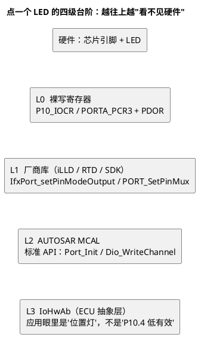

# 01-寄存器到IoHwAb分层

> 一句话定位：从"直接写寄存器"到"应用眼里只有传感器/执行器"，四级台阶每级解决什么痛苦、代码长什么样——看懂这张台阶图，就知道自己写的每一行该落在哪一级。
> 等级：L1→L2 ｜ 前置：[01-MCAL分层位置](../MCAL总览/01-MCAL分层位置.md)

## 原理

### 1. 四级台阶：每级治一种痛

驱动不是一步到位抽象出来的，是踩着痛点一级级垒上去的。从下往上看，**每上一级都治上一级的某种痛，同时付出新的代价**：



| 台阶 | 你写什么 | 治了上一级的什么痛 | 本级代价 |
|---|---|---|---|
| L0 裸寄存器 | 位定义、读改写、时序顺序 | —（起点） | 换芯片全重写；位写错没人管 |
| L1 厂商库 | 调 IfxPort/PORT_xxx | 不用背位定义，例程起步快 | 绑定一家芯片，API 各不相同 |
| L2 MCAL | 配置+标准 API | 换芯片换包不换上层代码 | 要懂配置工具/分层；多一层调用 |
| L3 IoHwAb | 设备语义接口 | 应用不再知道通道号/有效电平/换算公式 | 必须项目自研维护 |

### 2. 每级"为什么存在"（配置项/接口的动机视角）

- **L1 存在**：厂商最懂自家硬件（时钟依赖、安全解锁序列、ECC 处理），由它封装寄存器细节最不容易错——这是"工具箱"的价值。
- **L2 存在**：车厂要的是"任何供应商的软件都能装到任何芯片上"，所以需要 SWS 冻结的统一接口与配置语义——这是"门面"的价值（详见 [02-MCAL-vs-iLLD-vs-RTD](../MCAL总览/02-MCAL-vs-iLLD-vs-RTD.md)）。
- **L3 存在**：MCAL 只认识"通道"，不认识"这是雨量传感器的加热电阻"。把"通道号+电气细节+换算+滤波"收进 IoHwAb，SWC 才能只谈业务——**应用眼中的硬件是传感器/执行器，不是引脚**。

### 3. IoHwAb 的角色与边界

IoHwAb 位于 EAL，向下调 MCAL，向上被 RTE 端口包装。职责清单：

| IoHwAb 该做 | IoHwAb 不该做 |
|---|---|
| 通道映射（LED0→P10.4）的收口 | 业务逻辑（闪烁节奏、故障判定——归 SWC） |
| 有效电平翻译（低有效→逻辑"开"） | 直接写寄存器/调厂商库（除非包成 CDD） |
| 换算与滤波（ADC 原始值→物理量） | 长耗时阻塞计算（实时性归 SWC/调度） |
| 多通道一致性快照（同时读一组输入） | 跨 ECU 通讯逻辑（归 Com 栈） |

## 配置详解：同一件事四级的接口形态

| 层 | 接口形态 | 提供方 | 移植（TC377↔S32K）时改哪 |
|---|---|---|---|
| L0 | 寄存器名+位操作表达式 | 芯片手册 | 全部重写 |
| L1 | 厂商函数调用 | iLLD / RTD / SDK | 全部重写（API 名都不同） |
| L2 | 标准 API+生成宏 | MCAL 驱动包 | 换 MCAL 包、重做配置；应用代码不动 |
| L3 | 设备语义函数 | **项目自研** | 只改通道映射/换算参数（几行宏或查表） |

关键直觉：**L3 是唯一"厂商不卖"的层**——因为只有项目自己知道板上接了什么。它通常长得像 CDD（或一组小型 BSW 模块），但接口按"设备"而不是按"芯片外设"设计。

## 双平台对照

| 维度 | TC377 | S32K |
|---|---|---|
| L0 寄存器样貌 | `P10_IOCR`（复用+方向）、`P10_OMR`（原子置/清/翻）、`P10_IN` | `PORTA_PCR3`（复用+上下拉+驱动）、`PDOR/PSOR/PCOR/PTOR` |
| L1 厂商库 API | `IfxPort_setPinModeOutput()` 等 iLLD | K1 SDK：`PORT_SetPinMux()`/`GPIO_PinWrite()`；K3 RTD：`Siul2_Port_Ip_*` |
| L2 MCAL API | `Port_Init`/`Dio_WriteChannel`（与 SWS 一致） | 同左（一字不差） |
| L3 IoHwAb | 平台无关（项目自研，两平台同一套接口） | 同左 |
| 换平台工作量感觉 | L0/L1 全换；L2 换包重配；L3 只改映射 | 同左 |

## 代码示例

同一个"开位置灯"在四级的写法（体会抽象逐级抬高）：

```c
/* L0：裸写寄存器（TC377 示意）——应用代码里绝不该出现 */
MODULE_P10.IOCR0 = (MODULE_P10.IOCR0 & ~(0x1Fu << 8)) | (0x10u << 8);
MODULE_P10.OMR   = (1UL << 4) << 16;              /* 置位输出，低有效 LED 熄灭 */

/* L1：厂商库——只许出现在 CDD/原型代码里 */
IfxPort_setPinModeOutput(&MODULE_P10, 4, IfxPort_OutputMode_pushPull,
                         IfxPort_OutputIdx_general);

/* L2：MCAL——IoHwAb 内部看到的硬件世界 */
(void)Dio_WriteChannel(DioConf_DioChannel_LED0, STD_HIGH);   /* 电平，非"开/关" */

/* L3：IoHwAb——SWC 眼中的世界（有效电平/别名被翻译掉了） */
void IoHwAb_PositionLamp_Set(IoHwAb_LampStateType state)
{
    Dio_LevelType level = (IOHWAB_LAMP_ON == state) ? IOHWAB_LED0_ACTIVE_LEVEL : \
                                                      (Dio_LevelType)!IOHWAB_LED0_ACTIVE_LEVEL;
    (void)Dio_WriteChannel(DioConf_DioChannel_LED0, level);  /* 最后一跳落在 L2 */
}
```

## 易错点与陷阱

1. **SWC 直接 include Dio.h 调 MCAL**：现象是应用里散落通道号与电平翻译，换板/换有效电平全工程翻；对策是 SWC 只见 RTE 端口，MCAL 调用收口在 IoHwAb。
2. **IoHwAb 里写业务逻辑（闪烁节奏、故障判定）**：职责越界，业务改动被迫动驱动层；对策是 IoHwAb 只做"翻译"，语义判断归 SWC。
3. **嫌分层慢就整体退回 L0/L1**：拿特殊情况否定整体；对策是先测量（多数 Io 操作瓶颈不在调用层数），真热点再局部优化并文档化。
4. **CDD 之外的地方偷偷调厂商库**：owner 不明、配置被冲；对策是 L1 调用只许出现在 CDD 的 .c 文件里，评审按 include 列表抓。
5. **把芯片特殊技巧（某寄存器的旁门用法）设计进 IoHwAb 接口**：平台差异漏泄到应用（见 [02-抽象与移植性](02-抽象与移植性.md)）；对策是特殊技巧封装在 IoHwAb 内部并用标准语义对外。

## 面试高频题

**Q1：IoHwAb 与 MCAL 的区别？**
答：MCAL 是芯片级标准化驱动，管"通道/PWM 周期/采样组"这类外设语义，厂商交付；IoHwAb 是板级设备抽象，管"位置灯/雨量传感器"这类设备语义，把通道映射、有效电平、换算滤波收进去，项目自研。一个抽象芯片，一个抽象设备。

**Q2：为什么 SWC 不允许直接调 Dio_WriteChannel？**
答：分层约束：SWC 只经 RTE 交互，直接调用会绕过分层与端口映射；且"低有效、换算、滤波"这类翻译逻辑没有安放之处，移植性和可维护性都会崩坏。

**Q3：四级台阶里哪级是必须自研的？为什么？**
答：IoHwAb。L0~L2 都有现成提供方（手册/厂商库/MCAL 包），但"板上接了什么设备、什么有效电平、什么换算"只有项目自己知道，厂商无法预置。

**Q4：从裸机转 AUTOSAR，最大的代码观转变是什么？**
答：从"我控制寄存器"变成"我配置+调用标准接口"：寄存器细节沉到厂商实现，资源分配进 ARXML 配置，应用只保留设备语义与业务。

## 延伸

- [02-抽象与移植性](02-抽象与移植性.md)：分层不是魔法——漏泄点与移植改动量的量化；
- [01-MCAL分层位置](../MCAL总览/01-MCAL分层位置.md)：本台阶图在 AUTOSAR 全分层里的位置；
- [02-MCAL-vs-iLLD-vs-RTD](../MCAL总览/02-MCAL-vs-iLLD-vs-RTD.md)：L1 与 L2 关系的展开；
- [CDD设计方法论](../../2-L2进阶/CDD设计方法论/README.md)：L3/L1 交界处的工程规范；
- [IoHwAb设计](../../../07-AUTOSAR架构/2-L2进阶/IO栈/01-IoHwAb设计.md)（07区）：IoHwAb 到 RTE 的上半段。

---

维护约定：笔记命名 `序号-主题.md`；真实截图放 `_images/`；流程/时序/状态/架构图用 PlantUML 内嵌正文，规范见 [图表规范与模板](../../../00-总览/图表规范与模板.md)。
