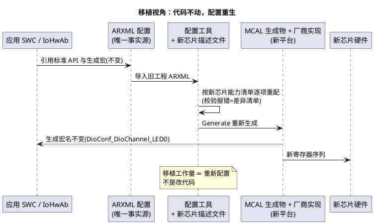

# 02-抽象与移植性

> 一句话定位：接口标准化挡不住时序、中断、原子性这些从缝里"漏"上来的平台差异——搞清漏泄点在哪、一次真实移植要改多少，才算真正理解"MCAL 可移植"的边界。
> 等级：L2 ｜ 前置：[01-寄存器到IoHwAb分层](01-寄存器到IoHwAb分层.md)

## 原理

### 1. 抽象漏泄：所有非平凡抽象都会漏

"抽象漏泄（leaky abstraction）"：上层接口看起来一模一样，下层行为差异仍会从缝里漏上来咬人。MCAL 的漏泄点集中在四处——**接口相同≠行为等价**：

| 漏泄点 | 现象（同名 API、不同后果） | 从哪层漏上来 |
|---|---|---|
| 时序粒度 | Gpt/Pwm 想要的周期/占空比档位，两平台硬件分频粒度不同，只能取到"近似值" | 定时器资源模型（GTM vs FTM/eMIOS） |
| 中断行为 | 同一个 Adc 回调，两平台进 ISR 的时延、优先级抢占规则不同 | 中断体系（SRC/多核路由 vs NVIC） |
| 原子性 | `Dio_FlipChannel` 处处原子？取决于平台有没有原子置/清/翻寄存器 | IO 硬件设计（OMR vs PSOR/PCOR/PTOR） |
| 复位/默认态 | 复位后引脚默认方向/上下拉、低功耗后哪些配置会丢，平台各异 | 芯片复位逻辑 |

应对套路只有一条：**读 SWS 里标"implementation specific / vendor specific"的条目 + 自建资源约束表**，把"标准没承诺的部分"显式记下来，而不是当作"到处都一样"。

### 2. 一次真实移植的改动量对比

把一个"LED 闪烁 + 按键 + 1ms 节拍"的工程从 TC377 搬到 S32K1，逐层盘点（数量级示意，项目规模不同会有出入）：

| 层 | 改动 | 量级感受 |
|---|---|---|
| 应用 SWC | 不动 | 0 行 |
| RTE | 按新系统描述重新生成 | 0 行手写 |
| IoHwAb | 通道映射宏、换算参数改几个 | ~10 行 |
| BSW 服务栈（Os/EcuM/Com…） | 换包重配 ARXML，重新生成 | 配置工作量，无代码 |
| MCAL | 整包替换 + 从头重做配置 | 配置工作量（大头） |
| 与硬件强耦合的 CDD | 厂商库调用重写 | 视 CDD 数量 |

结论两条：**① 移植的成本几乎全在"重新配置"而不是"修改代码"；② 自研代码里唯一要动的是通道映射级的小改**——这就是分层买回来的东西。反过来，若移植时发现要动 SWC，说明抽象已经漏了（或当初就没守规矩）。

### 3. "配置在 ARXML、代码是生成物"的移植观

- 移植≠拷代码：**是把"我想要什么"（ARXML 配置）在新芯片的能力清单上重新表达一遍**；
- 配置可 diff：两版 ARXML 的差异就是评审材料，改了什么一目了然；
- 版本库管理 ARXML 而不是生成物：生成物随时可再生，ARXML 才是唯一事实源（详见 [03-配置与生成流程](../MCAL总览/03-配置与生成流程.md)）。



## 配置详解：漏泄点速查

把上表落到"换平台时要检查什么"：

| 检查项 | TC377 侧 | S32K 侧 | 移植动作 |
|---|---|---|---|
| 定时器档位 | GTM CMU 固定时钟档、TOM/ATOM | FTM 时钟源+预分频、eMIOS(K3) | 重算周期/占空比可达性，别假设同精度 |
| 中断模型 | SRC 逐源可编程优先级、可路由到核 | NVIC 优先级组、向量表固定映射 | ISR 类别（Cat1/2）与 OS 约定重对齐 |
| GPIO 原子性 | `Pn_OMR` 一条写完成置/清 | `PSOR/PCOR/PTOR` 专用原子寄存器 | 单通道置/清/翻均可原子；整组读改写仍需临界区 |
| 位带可用性 | 无位带 | K1(Cortex-M4)有位带、K3(M7)无 | 别把位带别名地址写进共享代码 |
| 低功耗后引脚态 | 部分引脚配置在唤醒后需恢复 | 低功耗模式下的引脚保持策略不同 | 复核 Port_RefreshPortDirections 使用点 |

## 双平台对照

| 维度 | TC377 | S32K |
|---|---|---|
| 中断路由 | SRC 模块逐源配置、可跨核路由 | NVIC 单核映射（K3 多核各有 NVIC） |
| 定时器资源 | GTM 大一统（TOM/ATOM/TIM） | K1：FTM/LPIT；K3：eMIOS/SysTick |
| GPIO 原子操作 | `P10_OMR`（置位/清零两个位段） | `PDOR` + `PSOR/PCOR/PTOR` |
| Flash/掉电存储 | PFlash/DFlash + Fee | FTFC + 仿真 EEPROM(K1)/C55(K3) |
| MCAL 包 | 英飞凌 AURIX MCAL | NXP MCAL（K1 基于 SDK、K3 基于 RTD） |
| SWS 承诺面 | 同一份 SWS，实现相关项两包各自解释 | 同左 |

## 代码示例

把平台差异钉死在 IoHwAb 的映射区（应用与差异隔离的唯一防线）：

```c
/* IoHwAb 内部：通道映射与平台差异集中在此（示意） */
#include "Dio.h"

/* 生成宏由各平台 MCAL 配置产出，应用代码永远只见逻辑名 */
#define IOHWAB_LED0_CH       DioConf_DioChannel_LED0
#if (IOHWAB_LED0_ACTIVE_LOW == STD_ON)
#define IOHWAB_LED0_ON_LVL   STD_LOW    /* 低有效：电平翻译只发生在这里 */
#else
#define IOHWAB_LED0_ON_LVL   STD_HIGH
#endif

void IoHwAb_Led0_Toggle(void)
{
    /* Dio_FlipChannel 两平台均映射到原子翻转寄存器（OMR / PTOR），
       单通道翻转无需临界区；若改成整组读改写（WritePort）则必须加锁 */
    (void)Dio_FlipChannel(IOHWAB_LED0_CH);
}
```

## 易错点与陷阱

1. **按一个平台的中断时延写死软件延时/超时**：现象是换平台后偶发丢帧或乱序；对策是时序约束放配置参数、留裕量，别用"跑出来的魔法数字"。
2. **假设 Gpt/Pwm 处处同分辨率**：现象是周期漂移或占空比台阶对不上；对策是移植时重算可达档位表，误差超限要改方案（如换时基）。
3. **并发位操作裸奔**：现象是偶发丢位/丢翻转（尤其整组读改写）；对策是单脚用原子 API，整组操作加临界区（详见 01 区 [寄存器编程](../../../01-编程语言/2-L2进阶/寄存器编程/README.md)）。
4. **把移植当"拷代码"**：现象是编译过、引脚全无声（配置没重生）；对策是接受"ARXML 重做"，把旧配置当参考清单逐项迁移。
5. **不知不觉用了厂商扩展 API**：现象是换包编译失败；对策是移植前扫一遍 include 与调用清单，非标接口提前包进 IoHwAb/CDD。
6. **低功耗流程照搬**：现象是唤醒后引脚态/时钟异常；对策是按新芯片手册复核唤醒后的寄存器保持情况与恢复顺序。

## 面试高频题

**Q1：什么是抽象漏泄？在 MCAL 里举个例。**
答：上层接口相同但下层行为差异仍影响上层。例：`Dio_FlipChannel` 接口相同，但其原子性取决于平台是否有原子翻转寄存器（TC377 OMR/S32K PTOR 有，某些平台没有）——假设"处处原子"的代码会在无原子寄存器的平台上偶发丢翻转。

**Q2：把 BSW 从 TC377 移到 S32K，工作量在哪层？**
答：MCAL 整包替换+配置重做是绝对大头；服务层基本是换包重配；应用与 IoHwAb 接口不动，仅通道映射小改。成本集中在"重新配置"而非"修改代码"——这正是分层的回报。

**Q3："MCAL 可移植"的准确含义是什么？**
答：源码级接口可替换：API 与配置语义被 SWS 冻结，上层代码无需修改即可在新芯片的 MCAL 包上编译；但不承诺零配置、零行为差异——时序粒度、中断行为、默认态仍需按新芯片重新配置与验证。

**Q4：如何减小抽象漏泄的影响？**
答：三条：读 SWS 中 implementation specific 条目建立"平台差异清单"；差异相关的决策（通道映射/时序参数）集中到 IoHwAb/配置参数而非散在应用；关键路径用测量而非假设验证。

## 延伸

- [01-寄存器到IoHwAb分层](01-寄存器到IoHwAb分层.md)：分层的正向叙述，本篇是它的"反面清单"；
- [03-配置与生成流程](../MCAL总览/03-配置与生成流程.md)：ARXML 唯一事实源的机制；
- [01-Port配置](../Port与Dio/01-Port配置.md)：方向刷新 API——漏泄的具体案例；
- [寄存器编程](../../../01-编程语言/2-L2进阶/寄存器编程/README.md)（01区）：原子性与读写时序的底层原理；
- [总线与DMA](../../../02-芯片与体系结构/2-L2进阶/体系结构通用/04-总线与DMA.md)（02区）：性能差异漏泄的硬件背景。

---

维护约定：笔记命名 `序号-主题.md`；真实截图放 `_images/`；流程/时序/状态/架构图用 PlantUML 内嵌正文，规范见 [图表规范与模板](../../../00-总览/图表规范与模板.md)。
