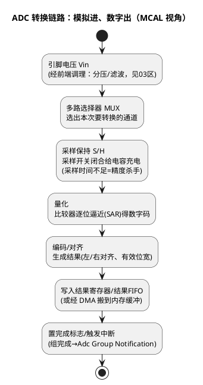

# 01-原理与转换链路

> 一句话定位：MCAL Adc 的核心抽象是"组（Group）"——把若干通道+触发方式+结果缓冲打包成一次转换任务；理解"采样→量化→编码"链路和"软件/硬件触发"，再看双平台篇（EVADC/BCTU）就不迷路。
> 等级：L2 ｜ 前置：[03区-采样与量化](../../../03-硬件基础/2-L2进阶/模拟电路/ADC采样原理/01-采样与量化.md)

## 原理

### 转换链路一图：从引脚电压到内存里的整数

物理原理（采样保持、量化台阶、参考电压）已在 03 区展开：[01-采样与量化](../../../03-硬件基础/2-L2进阶/模拟电路/ADC采样原理/01-采样与量化.md)、[02-参考电压与精度](../../../03-硬件基础/2-L2进阶/模拟电路/ADC采样原理/02-参考电压与精度.md)、[03-采样时间与源阻抗](../../../03-硬件基础/2-L2进阶/模拟电路/ADC采样原理/03-采样时间与源阻抗.md)。本篇从 MCAL 视角看这条链路：



MCAL API 对应的直觉：`Adc_StartGroupConversion` 推的是整条链路转起来；结果从 `Adc_ReadGroup`/结果缓冲取；"转完了叫我"靠组通知（见 [04-MCAL配置要点](04-MCAL配置要点.md)）。

### 组（Group）：MCAL Adc 的头号抽象

**AdcGroup = 一批通道 + 一个触发源 + 一种转换方式 + 一块结果缓冲**。为什么按组而不是按通道组织？

- 采样需求天然成组：三相电流要"同时"采、电池包电压电流要同一时刻对齐——组就是"采样任务"的最小单位；
- 触发是组级的：一个事件（PWM 边沿/定时器/软件）启动整组，而不是逐通道喊话；
- 通知也是组级的：组内全部转完才回调，软件拿到的是"一次快照"。

**队列（Queue）是组的硬件侧亲戚**：双平台底层（TC377 EVADC 的请求源/队列、S32K 的命令队列/触发列表）把"组内先采谁、后采谁"排成硬件队列，CPU 不参与逐通道调度——组是标准概念，队列是平台实现（详见 [02-TC377-EVADC](02-TC377-EVADC.md)、[03-S32K-ADC-BCTU](03-S32K-ADC-BCTU.md)）。

### 触发源：谁来喊"开始"

| 触发方式 | 标准配置 | 直觉 | 典型用途 |
|---|---|---|---|
| 软件触发 | ADC_TRIGG_SRC_SW | 代码调用 StartGroupConversion 才转 | 慢变量轮询（温度、电源电压） |
| 硬件触发 | ADC_TRIGG_SRC_HW | 外部事件（PWM 边沿/定时器/引脚）直接踢 ADC | 与电流环同步采样、转速同步 |

硬件触发是车规 ADC 的灵魂：**采样时刻与被测对象对齐**这件事，软件中断永远慢半拍且带抖动，硬件触发链（定时器/PWM→ADC，甚至→DMA）才能做到微秒级确定性。这就是为什么"定时器链"配置项存在——把 [Gpt/Pwm](../Gpt与Icu/01-Gpt定时器.md) 的输出事件接到 ADC 触发输入上。

### 同步转换 vs 顺序转换

| 方式 | 含义 | 用途 | 硬件要求 |
|---|---|---|---|
| 顺序转换 | 组内通道一个接一个转 | 一般慢变量；总时间=各通道之和 | 一个转换器即可 |
| 同步转换 | 多个转换器**同一时刻采样** | 三相电流、需要相位对齐的量 | 多 ADC 单元/多组（TC377 多组同步、S32K 多 ADC 并行） |

判断口诀：**量之间要做减法/比值（三相求和、功率=V×I）→必须同步；各自独立消费→顺序即可**。

## 双平台硬件单元对照

| 通用概念 | TC377（AURIX TC3xx） | S32K |
|---|---|---|
| ADC 单元 | EVADC（增强型 VADC），多组结构，详见 [02-TC377-EVADC](02-TC377-EVADC.md) | ADC0/1/2（S32K3），详见 [03-S32K-ADC-BCTU](03-S32K-ADC-BCTU.md) |
| 转换器位宽 | 12bit（可配 10/8/...） | 12bit（可配更低） |
| 硬件队列 | EVADC 请求源（队列/门控/扫描） | 命令队列/S32K3 BCTU 触发列表 |
| 硬件触发源 | GTM（TOM/ATOM）输出、外部引脚 | eMIOS/FTM、LPIT、BCTU、外部引脚 |
| 结果搬运 | 结果寄存器/FIFO、可 DMA | 结果寄存器/FIFO、DMA |
| 采样时间配置 | 每通道可配采样相位时长 | 命令里带采样时长（PDB/BCTU 链上） |

## MCAL 配置要点

| 配置项 | 含义 | 典型值 | 易错点 |
|---|---|---|---|
| AdcGroupDefinition | 组内通道列表（顺序即转换顺序） | 按消费需求排 | 顺序错→结果数组下标对不上通道 |
| AdcGroupConversionMode | 单次/连续 | 轮询组=单次；流式=连续 | 连续组没配流式缓冲，数据被覆盖 |
| AdcGroupTriggSrc | 软件/硬件触发 | 同步电流环=HW | HW 组误调 StartGroupConversion（部分实现报错或无效） |
| AdcChannelResolution | 转换位宽 | 12bit | 换算时按 10bit 算了满量程，电压全偏 |
| AdcGroupStreamBufferSize | 流式采样缓冲深度 | 每周期组数×保留窗口 | 缓冲太小，读取前被环形覆盖 |
| AdcGroupNotification | 组完成回调 | 读结果/置标志 | 通知没 Enable，或回调里做重活 |
| Adc_StartGroupConversion（API） | 软件启动/重启组转换 | SW 组用 | 组还在 BUSY 时重启=策略问题（见 04 篇） |
| Adc_ReadGroup（API） | 整组读结果到应用缓冲 | 通知后/轮询时 | 缓冲未 Setup 就读（契约见 04 篇） |

## 代码示例

```c
/* 软件触发组的典型消费路径（硬件触发组去掉 Start、等通知即可） */
#define ADC_MAX  4095u   /* 12bit 满量程 */
#define VREF_MV  5000u   /* 参考电压 5V（以硬件为准） */

Adc_ValueGroupType results[2];   /* 与组内通道数一致 */

void App_AdcStart(void)
{
    Adc_Init(&Adc_Config);
    Adc_SetupResultBuffer(AdcConf_AdcGroup_Slow, results);  /* 先挂钩结果缓冲 */
    Adc_StartGroupConversion(AdcConf_AdcGroup_Slow);        /* 软件触发：现在转 */
}

/* 组完成回调（配置生成入口，需运行时 Enable） */
void AdcGroup_GroupSlow(void)
{
    uint16 mv = (uint16)(((uint32)results[0] * VREF_MV) / ADC_MAX);  /* 原始值→电压 */
    TempFilter_Update(mv);       /* 换算与滤波放应用层，不在驱动里做 */
}

void App_AdcEnable(void)
{
    Adc_EnableGroupNotification(AdcConf_AdcGroup_Slow);     /* 通知开关独立于启动 */
}
```

## 易错点与陷阱

1. **结果数组下标错位**——现象：通道 2 的"温度"读出来是通道 1 的波形。原因：组定义顺序与消费顺序不一致，或中途在配置里加删通道没同步代码。对策：通道枚举与数组下标同一处定义，通道调整走评审。
2. **电压换算两步走捷径出错**——现象：读数整体偏一截。原因：满量程位数（10/12bit）或参考电压取错。对策：换算宏集中定义（raw→比例→电压），评审盯这两处常量。
3. **同步需求配了顺序组**——现象：三相电流合不为零、随转速抖动。原因：组内顺序转换，各相采样时刻错开。对策：需要时刻对齐的量配同步转换（平台能力见 02/03 篇）。
4. **硬件触发链断在中间**——现象：HW 组从不进通知。原因：触发源（定时器/PWM 输出）没配、没启动，或触发信号没路由到该组。对策：沿"触发源→路由→组→通知"逐环节确认，先用软件触发验证组本身正常。
5. **通知里干重活**——现象：采样周期抖、偶发丢组。原因：组通知在中断里做滤波/换算/通信。对策：通知只搬数据/置标志，处理回任务层（流式采样见 04 篇）。

## 面试高频题

1. **Adc 为什么要按"组"而不是按通道配置？**
   答：采样任务天然成组：同触发、同完成、同缓冲；组对应"一次快照"，触发与通知都是组级。
2. **软件触发和硬件触发各自适用什么场景？**
   答：软件=慢变轮询；硬件=与事件时刻严格对齐（电流环、同步采样），消除软件延迟与抖动。
3. **同步转换和顺序转换怎么选？**
   答：量之间要做运算（对齐要求）→同步；独立消费→顺序，省硬件资源。
4. **原始值怎么换成电压？**
   答：两步：raw÷满量程得比例，比例×参考电压；前提是位数与 Vref 与硬件一致。

## 延伸

- 物理层地基：[01-采样与量化](../../../03-硬件基础/2-L2进阶/模拟电路/ADC采样原理/01-采样与量化.md)、[02-参考电压与精度](../../../03-硬件基础/2-L2进阶/模拟电路/ADC采样原理/02-参考电压与精度.md)、[03-采样时间与源阻抗](../../../03-硬件基础/2-L2进阶/模拟电路/ADC采样原理/03-采样时间与源阻抗.md)；
- 双平台实现：[02-TC377-EVADC](02-TC377-EVADC.md)、[03-S32K-ADC-BCTU](03-S32K-ADC-BCTU.md)；
- 本目录收尾：[04-MCAL配置要点](04-MCAL配置要点.md)——缓冲契约与流式采样；
- 触发源亲戚：[Gpt/01-Gpt定时器](../Gpt与Icu/01-Gpt定时器.md)、[Pwm/04-MCAL配置要点](../Pwm/04-MCAL配置要点.md)。
