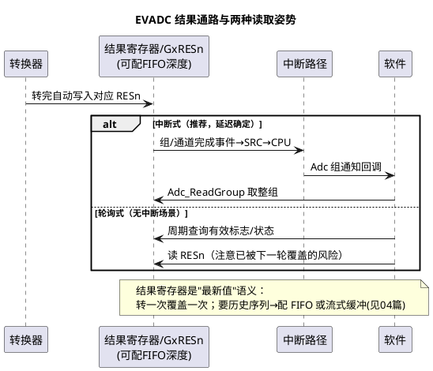

# 02-TC377-EVADC

> 一句话定位：EVADC 用"组（Group）+ 请求源（队列/门控/扫描）+ 结果寄存器"三件套把 [01-原理与转换链路](01-原理与转换链路.md) 里的"组"落到硬件——门控（Gate）玩同步、队列玩排序、结果寄存器决定你怎么取数。
> 等级：L2 ｜ 前置：[01-原理与转换链路](01-原理与转换链路.md)

## 原理

### 组与请求源：请求的排队方式决定行为

EVADC（Enhanced VADC）把 ADC 组织成若干**组（Group）**：主组（primary，自带转换器）+ 次组（secondary，只有采样前端，借用主组转换器；具体组数/通道数以 DS 为准）。每个组有几个**请求源（Request Source）**，区别在"请求怎么排队"：

| 请求源类型 | 行为直觉 | 对应场景 |
|---|---|---|
| 队列源（Queue） | 请求排队依次执行，软件可入队；可挂外部触发踢一次 | 通用轮转采样、事件触发一批 |
| 扫描源（Scan） | 固定通道集合按序自动扫描，周期性/软件启动 | 慢变量巡检 |
| 门控源（Gate） | 由"门"信号控制——门开着才转换 | **多组同步采样**（主组当门主，从组跟随） |

直觉记忆：**队列是"排队点单"，扫描是"定时巡桌"，门控是"包场同步开吃"**。MCAL Adc 的 AdcGroup 配置最后就落到这三类之一（驱动替你选，但报错信息/排查时你需要认识它们）。

### 门控（Gate）与级联：同步采样的实现

三相电流要同一时刻采样：让主组（含转换器）收到请求后，通过**请求源门控**把从组（或对端组）一起放行——多个组的前端**同拍采样**，再各自借转换器转完。这就是"同步转换"在 TC377 上的硬件形态。级联/主从关系在配置里体现为组间同步参数（具体命名以驱动版本为准）。

### 结果寄存器与读取时机



**读取时机的本质**：结果寄存器只保存"最新一次"，软件慢了就被覆盖。所以要拿稳数据的两条路：① 中断尽快取走（Adc 组通知）；② 流式采样/FIFO 让硬件替你攒历史（[04-MCAL配置要点](04-MCAL配置要点.md)）。轮询只适合慢变量。

### 转换时钟与采样时长

EVADC 每通道可配**采样相位时长**（analog 时钟周期数）与转换时钟分频——这正是 [03区-采样时间与源阻抗](../../../03-硬件基础/2-L2进阶/模拟电路/ADC采样原理/03-采样时间与源阻抗.md) 里"源阻抗大→采样电容充不满→读数偏低"的对策旋钮：高阻抗通道加长采样时间，代价是整组转换时间变长。

## 双平台硬件单元对照

| 通用概念 | TC377 EVADC（本篇） | S32K（对照，见 [03-S32K-ADC-BCTU](03-S32K-ADC-BCTU.md)） |
|---|---|---|
| 组织方式 | 主组+次组（secondary 共享主组转换器） | 独立 ADC0/1/2 单元（S32K3），各自有命令队列 |
| 请求排队 | 队列/扫描/门控三类请求源 | 命令队列、BCTU 触发列表 |
| 同步采样 | 门控源联动多组同拍采样 | 多 ADC 单元同触发并行（BCTU 分发） |
| 硬件触发 | GTM TOM/ATOM、外部引脚、跨组信号 | eMIOS/FTM/LPIT、BCTU、外部引脚 |
| 结果存储 | 每通道结果寄存器（可 FIFO 化） | 结果寄存器/FIFO，可 DMA 搬运 |
| 转换精度配置 | 8/10/12bit + 每通道采样时长 | 8/10/12/...bit + 命令级采样时长 |

## MCAL 配置要点

| 配置项 | 含义 | 典型值 | 易错点 |
|---|---|---|---|
| AdcGroup→EVADC 组映射 | MCAL 组落到哪个硬件组 | 按同步需求分 | 同步组没映射到能联动的组对，同步失效 |
| 同步/主从参数 | 门控主从关系 | 三相电流=主从同步 | 主从方向配反，触发不联动 |
| 通道采样时长 | 每通道采样相位 | 高阻抗通道加长 | 全部用默认最短，高阻抗通道读数偏低 |
| 转换时钟分频 | 模拟时钟速度 | 按 DS 上限内取 | 时钟超规，偶发错码（低温暴露） |
| 结果访问模式 | 中断读取/FIFO/流式 | 电流环=通知或 DMA | 轮询高频组，读到覆盖后的新值还以为是这次 |
| HW 触发源选择 | GTM 通道/引脚 | PWM 同步采样 | 触发源与 [Pwm](../Pwm/03-TC377-GTM.md) 通道规划冲突 |
| 中断节点/优先级 | 组完成中断的 SRC 配置 | 高于普通任务 | 多核下中断路由错核（见 [02-IR路由与多核分配](../../../02-芯片与体系结构/2-L2进阶/TC377平台/中断系统/02-IR路由与多核分配.md)） |

## 代码示例

```c
/* TC377 上硬件触发同步组的标准用法（细节由配置承担，API 与平台无关） */
Adc_ValueGroupType phaseCurrent[3];   /* 三相电流组结果缓冲 */

void App_AdcHwGroupInit(void)
{
    /* 组已在配置中绑到 EVADC 门控同步组 + GTM PWM 触发源 */
    Adc_SetupResultBuffer(AdcConf_AdcGroup_PhaseCur, phaseCurrent);
    Adc_EnableGroupNotification(AdcConf_AdcGroup_PhaseCur);
    /* 硬件触发组：不需要（通常也不允许）软件 Start；
       触发链：PWM 边沿 → GTM 输出 → EVADC 请求源门控 → 三组同拍采样 */
}

/* 组完成通知：把三相结果一起搬走（此刻三者同一时刻采样，可安全求和） */
void AdcGroup_PhaseCurDone(void)
{
    Foc_UpdateCurrents(phaseCurrent[0], phaseCurrent[1], phaseCurrent[2]);
}
```

## 易错点与陷阱

1. **同步组"不同步"**——现象：三相合成电流不为零、随转速波动。原因：组间主从/门控没配对，或其中一相落在独立组里各转各的。对策：同步需求在配置里显式建组关系，验收用"同时注入同相三路信号，合值应≈单路×3"。
2. **高阻抗通道读数偏低**——现象：某路传感器信号系统性偏小。原因：采样时长不足，采样电容没充满（[源阻抗原理](../../../03-硬件基础/2-L2进阶/模拟电路/ADC采样原理/03-采样时间与源阻抗.md)）。对策：该通道加长采样相位；硬件侧优先降阻抗（运放跟随，[03区-跟随器](../../../03-硬件基础/2-L2进阶/模拟电路/运放电路/02-跟随器与放大.md)）。
3. **结果被覆盖还没察觉**——现象：偶发"跳变到新值"。原因：轮询读取慢于转换节拍，读到的是下一次的结果。对策：高频组改通知/DMA/流式；读数带序号或时间戳校验连续性。
4. **HW 触发组被软件 Start**——现象：报开发错误或行为异常。原因：硬件触发组的启动权在触发链，软件 Start 与之冲突（具体语义以 SWS/驱动为准）。对策：触发方式在需求期定死，调用侧封装成"只对 SW 组开放 Start"。
5. **GTM 通道被 ADC 触发和 Pwm 同时抢**——现象：加采样触发后某 PWM 抖动。原因：触发源通道与 PWM 输出通道规划冲突（同一 GTM 资源池）。对策：GTM 通道总规划表把"输出用/触发用/捕获用"分列管理。
6. **低温下错码率升高**——现象：温度箱试验偶发离群值。原因：转换时钟配在极限、低温模拟特性变差。对策：按 DS 最坏条件降额配置；开启结果限制/滤波校验。

## 面试高频题

1. **EVADC 三类请求源的差别？**
   答：队列（排队、可外部触发踢队）、扫描（固定集自动巡）、门控（主从联动同步）；分别对应通用采样、巡检、同步采样。
2. **TC377 上怎么做多通道同步采样？**
   答：主组做门主、从组挂门控，触发到时多组前端同拍采样、再顺序借用转换器转换；MCAL 侧体现为组同步配置。
3. **结果寄存器与 FIFO 的区别，什么时候必须 FIFO/流式？**
   答：结果寄存器=最新值语义；要历史序列或读取节奏跟不上转换节奏时用 FIFO/流式缓冲。
4. **采样时间怎么影响精度？**
   答：采样电容充电需要时间，源阻抗越大需要越长；不足则读数偏低且不稳，对策是加采样相位或前端降阻。

## 延伸

- 本目录：[01-原理与转换链路](01-原理与转换链路.md)、[03-S32K-ADC-BCTU](03-S32K-ADC-BCTU.md)、[04-MCAL配置要点](04-MCAL配置要点.md)；
- 触发链上游：[Pwm/03-TC377-GTM](../Pwm/03-TC377-GTM.md)、[01-GTM架构概览](../../../02-芯片与体系结构/2-L2进阶/TC377平台/GTM/01-GTM架构概览.md)；
- 中断落点：[01-SRC模块](../../../02-芯片与体系结构/2-L2进阶/TC377平台/中断系统/01-SRC模块.md)、[02-IR路由与多核分配](../../../02-芯片与体系结构/2-L2进阶/TC377平台/中断系统/02-IR路由与多核分配.md)；
- 硬件层地基：[03-采样时间与源阻抗](../../../03-硬件基础/2-L2进阶/模拟电路/ADC采样原理/03-采样时间与源阻抗.md)、[02-跟随器与放大](../../../03-硬件基础/2-L2进阶/模拟电路/运放电路/02-跟随器与放大.md)。
