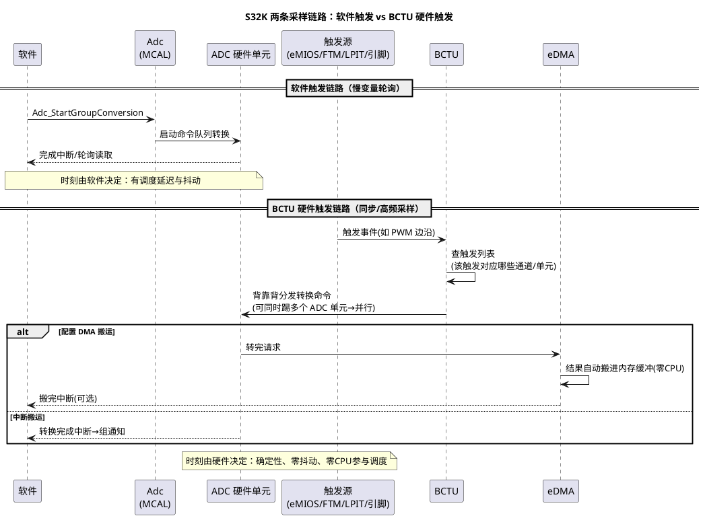

# 03-S32K-ADC-BCTU

> 一句话定位：S32K 上"定时器踢一脚、ADC 自动转一组、结果 DMA 落内存"的硬件触发链由 BCTU（S32K3）编排——它取代了 S32K1 时代的 PDB，把 [01-原理与转换链路](01-原理与转换链路.md) 的"硬件触发组"做成不占 CPU 的流水线。
> 等级：L2 ｜ 前置：[01-原理与转换链路](01-原理与转换链路.md)

## 原理

### 触发链演进：PDB 已弃，BCTU 上位

| 代际 | 编排者 | 链路直觉 | 现状 |
|---|---|---|---|
| S32K1 | PDB（Programmable Delay Block） | 定时器→PDB（可编程延迟）→预触发→ADC 逐通道开始转换 | 老平台仍在用；新设计不建议 |
| S32K3 | **BCTU**（Back-to-back Conversion Trigger Unit） | 触发输入→BCTU 查触发列表→一次性分发命令给 ADC0/1/2（背靠背转换） | 主流路线 |

为什么要有专门编排器：ADC 自身只会"被触发转一批"，但**谁在什么时刻、按什么序列、触发哪几个单元**是个调度问题——PDB/BCTU 就是干这个的"采样调度员"。BCTU 的强项：**一个触发进来，按预存列表把多通道（可跨多个 ADC 单元）自动转完，全程零 CPU**。

### 软件触发 vs BCTU 硬件触发：两条链路图



**背靠背（Back-to-Back）的含义**：同一触发引发的整串转换在硬件里一气呵成，通道间不回软件、不重排队——这既是速度（省去逐次触发开销），更是时刻确定性（整组时间戳可预测）。

### 转换完成中断 vs DMA 搬运

| 取数方式 | 机制 | 适用 |
|---|---|---|
| 转换完成中断 | 每组/每通道转完进中断，CPU 读寄存器搬数据 | 中低频、需要立刻处理 |
| DMA 搬运 | 转完直接由 eDMA 搬到内存（流式缓冲），可选搬完中断 | 高频、大组、CPU 不想被打扰（如电流环 20kHz） |

DMA 路线天然衔接 MCAL 的流式采样语义（[04-MCAL配置要点](04-MCAL配置要点.md)）：硬件往环形缓冲里写，软件按窗口读。

## 双平台硬件单元对照

| 通用概念 | S32K（本篇） | TC377（对照，见 [02-TC377-EVADC](02-TC377-EVADC.md)） |
|---|---|---|
| 采样编排器 | BCTU（S32K3）/ PDB（S32K1，弃用趋势） | EVADC 请求源（队列/扫描/门控）内建 |
| 触发源 | eMIOS/FTM/LPIT/外部引脚 | GTM TOM/ATOM/外部引脚 |
| 并行转换 | 多 ADC 单元被 BCTU 同触发分发 | 多组门控同拍采样 |
| 结果搬运 | 结果寄存器/FIFO + eDMA | 结果寄存器/FIFO + DMA |
| 零 CPU 链路 | 触发→BCTU→ADC→DMA 全硬件 | 触发→请求源→转换→(DMA) 全硬件 |

## MCAL 配置要点

| 配置项 | 含义 | 典型值 | 易错点 |
|---|---|---|---|
| AdcGroupTriggSrc | SW / HW | 同步采样=HW | HW 组误调软件 Start（同 TC377 篇坑） |
| HW 触发源选择 | 定时器/PWM 输出事件 | PWM 边沿同步电流环 | 触发源通道与 PWM 输出规划冲突（[02-S32K-eMIOS-FTM](../Pwm/02-S32K-eMIOS-FTM.md)） |
| BCTU 触发列表（工具内） | 触发→通道序列映射 | 一个触发=一组快照 | 列表与 AdcGroup 通道顺序不一致，结果错位 |
| 转换命令参数 | 采样时长/参考/中断使能 | 高阻抗加长 | 命令级采样时长没按通道差异化 |
| DMA 使能与缓冲 | 结果搬运路径 | 高频组开 DMA | DMA 通道冲突/优先级低被饿死 |
| Adc_EnableGroupNotification（API） | 组通知开关 | DMA 完成或组完成 | 以为 DMA 就不用通知——读数时机仍需事件 |
| Adc_GetStreamLastPointer（API） | 流式缓冲读位置 | DMA 路线 | 读窗口与写指针追赶，读到未完成数据 |

## 代码示例

```c
/* BCTU 硬件触发 + DMA 流式：应用侧反而更简单——只管按节拍消费缓冲 */
void App_AdcHwInit(void)
{
    /* 配置已声明：HW 触发组挂 PWM 边沿，BCTU 列表含 4 通道，DMA 搬运进流式缓冲 */
    Adc_SetupResultBuffer(AdcConf_AdcGroup_Motor, MotorStreamBuf);  /* 环形缓冲深度见配置 */
    Adc_EnableGroupNotification(AdcConf_AdcGroup_Motor);
    /* 不调 Start：硬件触发链自主运行（触发源启动即在采样） */
}

/* 组通知（或 DMA 完成通知）里只推进消费指针，不做计算 */
void AdcGroup_MotorDone(void)
{
    Motor_SampleTick++;      /* 通知应用层：又攒好一批，处理放任务里 */
}

/* 10kHz 任务：消费最新窗口 */
void Task_MotorSample(void)
{
    if (Motor_SampleTick != Motor_ConsumedTick)
    {
        Motor_ConsumedTick = Motor_SampleTick;
        const Adc_ValueGroupType *win = MotorStreamBuf_GetLatest(); /* 取最新窗口指针 */
        Foc_Update(win[0], win[1], win[2], win[3]);                 /* 一次快照=4通道同触发 */
    }
}
```

## 易错点与陷阱

1. **HW 组静默**——现象：怎么都不进通知。原因：触发源（eMIOS/FTM 输出）没跑起来，或触发没路由进 BCTU/该组；PCC 时钟没开（见 [Mcu/01-时钟初始化](../Mcu模块/01-时钟初始化.md)）。对策：先软件触发验证组配置，再接硬件触发链，最后用示波器/计数器确认触发事件真在发生。
2. **BCTU 列表与 MCAL 组通道错位**——现象：结果张冠李戴。原因：触发列表序列与 AdcGroupDefinition 顺序不一致。对策：两处顺序同源生成（引用同一通道表），改通道必同步改。
3. **DMA 优先级/仲裁吃亏**——现象：高频采样偶发丢样。原因：eDMA 通道优先级低或与别的重负载冲突，搬运跟不上转换。对策：提高该 DMA 通道优先级；核对缓冲溢出计数；必要时独占通道。
4. **读窗口追着写指针跑**——现象：数据偶发"来自未来"或撕裂（一半新一半旧）。原因：流式缓冲读取时机与 DMA 写入无同步。对策：以通知/GetStreamLastPointer 定位完整窗口，读前判满标志。
5. **S32K1 老代码照搬 S32K3**——现象：编译报无 BCTU。原因：PDB 与 BCTU 是两代机制，寄存器/驱动层完全不同。对策：MCAL 层 API 不变（这是分层的意义），底层配置按平台走各自路径。
6. **以为 DMA 就高枕无忧**——现象：缓冲溢出无人知晓。原因：DMA 只搬运不校验，溢出覆盖静默发生。对策：缓冲深度按"最坏消费延迟×采样率"设计，溢出计数纳入诊断。

## 面试高频题

1. **BCTU 解决什么问题？与 PDB 的关系？**
   答：把"触发→多通道/多单元转换序列"编排成硬件流水线，零 CPU、背靠背确定性；BCTU 是 S32K3 上 PDB 的继任者。
2. **软件触发和硬件触发链路的本质差别？**
   答：时刻决定权：软件（调度延迟+抖动）vs 硬件（确定性）；高频与对齐采样必须硬件链。
3. **什么时候选 DMA 搬结果？**
   答：高频/大组/CPU 不想被逐次中断打扰；配合流式环形缓冲与完成事件消费。
4. **怎么保证一次读到的是"同一快照"？**
   答：同触发的整批转换（BCTU 列表/EVADC 门控组）+按窗口读缓冲，别逐通道独立采再拼。

## 延伸

- 本目录：[01-原理与转换链路](01-原理与转换链路.md)、[02-TC377-EVADC](02-TC377-EVADC.md)、[04-MCAL配置要点](04-MCAL配置要点.md)；
- 触发源上游：[02-S32K-eMIOS-FTM](../Pwm/02-S32K-eMIOS-FTM.md)、[01-SCG与PCC](../../../02-芯片与体系结构/1-L1基础/S32K平台/时钟系统/01-SCG与PCC.md)；
- DMA 背景与进阶：[04-总线与DMA](../../../02-芯片与体系结构/2-L2进阶/体系结构通用/04-总线与DMA.md)、[DMA专题](../../3-L3高级/DMA专题/README.md)；
- 硬件层：[02-抗混叠设计](../../../03-硬件基础/2-L2进阶/模拟电路/滤波器基础/02-抗混叠设计.md)——触发链保证的是"时刻对"，混叠还得前端滤波兜底。
