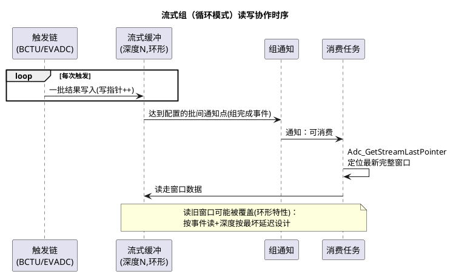

# 04-MCAL配置要点

> 一句话定位：把 Adc 集成里最容易踩雷的四个契约收进一篇——结果缓冲的使用契约（SetupResultBuffer）、组通知的开关语义（EnableGroupNotification）、流式采样与循环缓冲、以及"原始值→电压"的两步换算纪律。
> 等级：L2 ｜ 前置：[02-TC377-EVADC](02-TC377-EVADC.md)、[03-S32K-ADC-BCTU](03-S32K-ADC-BCTU.md)

## 原理

### Adc_SetupResultBuffer：一块有契约的内存

`Adc_SetupResultBuffer(Group, BufferPtr)` 把**应用提供**的缓冲挂到组上，之后 `Adc_ReadGroup` 的结果就写进它。三条契约必须背下来：

1. **生命周期**：缓冲必须从 Setup 起一直有效——用全局/静态数组，**绝不能传栈上数组的地址**（函数返回即悬空，结果写飞栈）；
2. **尺寸与对齐**：深度=组内通道数（普通组）或流式深度×通道数（流式组），类型用 `Adc_ValueGroupType`；
3. **并发**：驱动可能在通知/中断上下文里写这块内存，应用读它要避开写入瞬间（按事件读，见流式一节）。

为什么标准把缓冲交给应用而不是驱动内部分配：结果数据的**消费节奏和内存归属**只有应用知道（放哪个分区、复不复用、给谁共享），MCAL 只定契约。

### 组完成通知：Enable 是独立开关

`Adc_EnableGroupNotification(Group)`/`Disable` 是运行期开关：**配置里写了回调≠运行时会进**——通知默认未使能，忘了 Enable 就是永远的静默（与 [Gpt](../Gpt与Icu/01-Gpt定时器.md)、[Pwm](../Pwm/04-MCAL配置要点.md) 同款坑）。通知语义是**整组转换完成**才回调一次，回调里拿到的是"一次完整快照"。

### 流式采样（Streaming）与循环缓冲

普通组：一次触发一批结果，读完等下一批。流式组：连续触发下**结果按序列滚动写入深度为 N 的缓冲**，模式两种：

| 模式 | 行为 | 适用 |
|---|---|---|
| 线性（Linear） | 写满 N 个后停下（组完成通知），需重启 | 定长捕获（一段波形/一次事件前后窗） |
| 循环（Circular） | 写满回卷覆盖，始终保留最近 N 个 | 持续监控，消费最新窗口 |

读取用 `Adc_GetStreamLastPointer` 定位"最新写到哪"，据此取**完整窗口**。循环模式下丢旧保新是特性不是 bug——但要按"最坏消费延迟×采样率≤N"设计深度，否则读两口的功夫最新也被人覆盖。



### 电压换算：两步走，别一步跳

```text
第一步：比例 = raw ÷ 满量程      （12bit → 4095，10bit → 1023，与配置一致）
第二步：电压 = 比例 × Vref       （Vref 以硬件设计为准，别默认 5V）
扩展：物理量 = f(电压)           （按传感器调理电路换算：分压比/增益/偏置）
```

两个常量（位数、Vref）是历史事故高发点：改了分辨率配置忘了改换算宏、板子换参考电压没同步——集中成一个换算模块，别让除法散落各处。

## 双平台硬件单元对照

| 通用概念 | TC377 EVADC（见 [02](02-TC377-EVADC.md)） | S32K ADC/BCTU（见 [03](03-S32K-ADC-BCTU.md)） |
|---|---|---|
| 结果缓冲后端 | 组结果寄存器/FIFO 驱动侧映射 | 结果寄存器/FIFO，DMA 直写内存 |
| 流式实现 | FIFO/结果序列进缓冲 | BCTU+DMA 环形缓冲天然流式 |
| 组完成事件 | 请求源/组中断节点 | 命令队列/BCTU 完成中断或 DMA 完成 |
| 高频路线 | 通知或 DMA | DMA 为主，通知只做节拍 |

## MCAL 配置要点

| 配置项 | 含义 | 典型值 | 易错点 |
|---|---|---|---|
| AdcGroupStreamBufferSize | 流式缓冲深度 | 最坏延迟×采样率+裕量 | 深度拍脑袋，环形覆盖最新数据 |
| 流式模式（Linear/Circular） | 写满停/回卷覆盖 | 监控=Circular | 定长捕获误用 Circular，事件被新数据冲走 |
| Adc_SetupResultBuffer（API） | 挂应用缓冲 | 静态数组 | 栈数组地址传进去；尺寸不含流式深度 |
| Adc_EnableGroupNotification（API） | 开组通知 | 初始化后显式调用 | 只配回调不 Enable，静默无结果 |
| Adc_ReadGroup（API） | 读整组进应用缓冲 | 通知后/轮询 | 缓冲未 Setup；读写并发不加防护 |
| Adc_GetStreamLastPointer（API） | 流式读位置 | 每次消费前调 | 指针语义（最新位置）没理解，窗口算错 |
| AdcGroupReplacement | 组 BUSY 时新请求策略 | 按需求（中止/拒绝） | 重触发场景没定义，行为随机 |
| 换算常量集中管理 | 位数/Vref/分压比 | 单一换算模块 | 常量散落，改配置后多处不同步 |

## 代码示例

```c
/* 流式组（循环模式）标准消费骨架 */
#define CH_NUM        4u
#define STREAM_DEPTH  16u                              /* 保留最近 16 批 */
static Adc_ValueGroupType StreamBuf[STREAM_DEPTH * CH_NUM];
static volatile uint8 NewBatch = 0;

void App_AdcStreamInit(void)
{
    /* 尺寸契约：流式深度 × 通道数；生命周期契约：静态存储 */
    Adc_SetupResultBuffer(AdcConf_AdcGroup_Stream, StreamBuf);
    Adc_EnableGroupNotification(AdcConf_AdcGroup_Stream);
}

void AdcGroup_StreamDone(void)     /* 组完成：一批写好 */
{
    NewBatch = 1u;
}

void Task_AdcConsume(void)
{
    if (NewBatch != 0u)
    {
        Adc_StreamNumSampleType last;
        NewBatch = 0u;
        (void)Adc_GetStreamLastPointer(AdcConf_AdcGroup_Stream, &last);  /* 定位最新批 */
        /* 两步换算：比例 → 电压（常量集中于 Adc_Calc 模块） */
        uint32 mv = Adc_Calc_RawToMillivolt(StreamBuf[(last * CH_NUM) + 0u]);
        TempMonitor_Update(mv);
    }
}
```

## 易错点与陷阱

1. **栈缓冲挂给驱动**——现象：偶发栈损坏/结果错乱。原因：`Adc_SetupResultBuffer` 传了局部数组地址，函数返回后驱动仍写入。对策：一律静态/全局缓冲；评审扫"Setup 参数是否取址局部变量"。
2. **通知静默**——现象：组配置全对，就是不进回调。原因：没调 `Adc_EnableGroupNotification`。对策：初始化 checklist 里"Enable 通知"独立一行（Gpt/Pwm/Adc 通病）。
3. **循环缓冲读旧数据被覆盖**——现象：消费偶发撕裂/跳变。原因：读窗口期间写指针追上（深度不足或消费太慢）。对策：深度按最坏延迟核算；读前用 LastPointer 取最新完整窗，别读固定下标。
4. **Linear 组忘了重启**——现象：定长捕获只有第一次有数据。原因：线性模式写满即停，需按 SWS 语义重启。对策：捕获完成回调里安排下次启动。
5. **换算常量漂移**——现象：批量车电压读数整体偏。原因：Vref 实值与宏不一致（硬件改版/器件容差），或分辨率改配置没改宏。对策：换算集中在单模块；产线用标准电压源标定校验。
6. **BUSY 时重触发行为没定义**——现象：高频触发下偶发丢批或结果交错。原因：AdcGroupReplacement 策略与实际触发率不匹配。对策：按"触发率上限 vs 组转换时长"核算，选中止/拒绝策略并实测。

## 面试高频题

1. **Adc_SetupResultBuffer 的契约有哪几条？**
   答：生命周期（静态有效）、尺寸（含流式深度）、并发（事件同步读写）；缓冲归应用、驱动只写。
2. **流式采样 Linear 和 Circular 怎么选？**
   答：定长捕获/事件窗=Linear（写满停）；持续监控取最新=Circular（覆盖旧数据是特性）。
3. **为什么组通知默认不使能？**
   答：通知是运行期资源决策（中断负载、消费方就绪时机），配置只声明"有这个回调"，Enable 权留给集成者。
4. **raw 值怎么变物理量？**
   答：raw÷满量程→比例，比例×Vref→电压，再按调理电路（分压/增益）换物理量；两个常量必须与配置/硬件同源。

## 延伸

- 本目录他篇：[01-原理与转换链路](01-原理与转换链路.md)、[02-TC377-EVADC](02-TC377-EVADC.md)、[03-S32K-ADC-BCTU](03-S32K-ADC-BCTU.md)；
- 通知同款坑：[Gpt/01-Gpt定时器](../Gpt与Icu/01-Gpt定时器.md)、[Pwm/04-MCAL配置要点](../Pwm/04-MCAL配置要点.md)；
- 硬件精度地基：[02-参考电压与精度](../../../03-硬件基础/2-L2进阶/模拟电路/ADC采样原理/02-参考电压与精度.md)、[02-抗混叠设计](../../../03-硬件基础/2-L2进阶/模拟电路/滤波器基础/02-抗混叠设计.md)；
- 数据去向：上层信号处理与滤波属于应用层话题，可延伸至本区 [Spi](../Spi/README.md)（外部 ADC 场景）与 DMA 专题。
