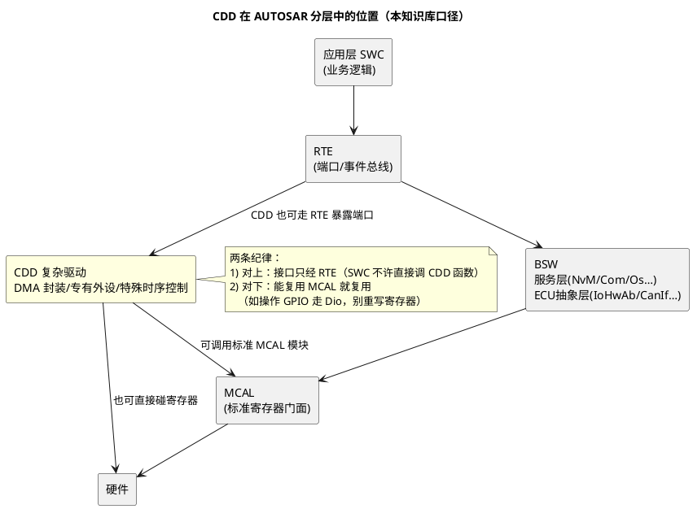

# 01-CDD定位与边界

> 一句话定位：CDD（Complex Device Driver）是 AUTOSAR 分层里那块"计划外的自留地"——标准模块管不了的特殊硬件塞进这里，但自留地也要有围墙：接口走 RTE、边界写进文档、别把标准模块的活抢过来。
> 等级：L2 ｜ 前置：[MCAL第一课-从点灯到分层驱动](../../00-入门导读/01-MCAL第一课-从点灯到分层驱动.md)

## 机制详解

### CDD 在分层图中的位置：贴着 MCAL/BSW 的特殊层

AUTOSAR 分层从上到下：SWC → RTE → BSW（服务层/ECU 抽象层/MCAL）。CDD 的特殊之处：**它横跨 MCAL 与 BSW 之间那一带**——向下可以直接摸寄存器（像 MCAL），向上可以给 SWC 提供服务（像 BSW/SWC 一样通过 RTE 暴露端口）。标准里叫它 Complex Driver，工程里更常见的名字是"那个芯片厂商 MCAL 包没覆盖的东西"。



### 什么该做 CDD，什么该进标准模块：一张判断表

写代码之前先过这张表——**判断标准只有一句话：标准模块已有此能力就走标准；芯片特有的、标准没覆盖的，才进 CDD**。

| 待实现能力 | 判断 | 归宿 | 例子 |
|---|---|---|---|
| 标准 MCAL 已覆盖的外设 | 走标准 | MCAL 配置 | GPIO/ADC/PWM/SPI/CAN 收发 |
| 标准栈已有服务 | 走标准 | BSW 配置 | 掉电存储走 NvM/Fee，别自己写 Flash 管家 |
| 芯片特有的高性能外设 | 标准未覆盖 | **CDD** | TC377 的 DMA/GTM 深度用法、S32K 的 eDMA 接入 |
| 特殊时序/确定性控制 | OS 调度满足不了 | **CDD** | 微秒级点火时序、死区互补输出配合 |
| 外挂专用芯片的驱动 | 标准未覆盖 | **CDD** | 特定 SPI 传感器协议栈、专用 HSM 交互 |
| 纯业务逻辑 | 与硬件无关 | SWC | 车灯状态机、报警仲裁 |
| 标准模块加一点点私有需求 | 先看参数 | MCAL 配置/Callout | 先翻配置参数与 Callout 钩子，再谈 CDD |

最后两行是反向纪律：**别把 SWC 的活拉进 CDD，也别因为"顺手"绕过标准模块**——每多一行 CDD 代码，就多一份要自己背移植性、测试、安全论证的债。

### CDD 与 SWC 的接口：RTE port

CDD 对应用只通过 RTE 端口说话，形态上像一个特殊"SWC"：

- **C-S/R-P 端口**：SWC 调 `Rte_Call_CddXxx_<op>` 发命令（如启动一次 DMA 搬运）、`Rte_Read/Rte_Write` 走数据端口；
- **事件/回调**：CDD 完成事件经 RTE 事件或回调端口通知 SWC（如 `Rte_IrvWrite` / Runnable 触发）；
- **禁止直达**：SWC 里出现 `Cdd_XxxStart()` 裸调用即违规——评审一眼打回；
- 例外通路：CDD 也可以被 BSW 模块调用（BSW 直接函数调用，不经 RTE），此时它算 BSW 的一部分，归属 BSW Scheduler 管理（03 篇展开）。

### 命名与文件组织约定（工程模板级）

以 `Cdd_` 前缀为核心的一套约定，让 CDD 在几千个文件的工程里一眼可辨：

| 对象 | 约定 | 示例 |
|---|---|---|
| 模块名 | `Cdd_` + 大驼峰功能名 | Cdd_DmaSrv、Cdd_Ignition |
| 文件 | 模块名 + 类型 | Cdd_DmaSrv.c / Cdd_DmaSrv.h / Cdd_DmaSrv_Cfg.h |
| 对外 API | 模块名 + 大驼峰动词 | Cdd_DmaSrv_StartTransfer() |
| 中断函数 | ISR(Cdd_<模块>_<事件>Handler) | ISR(Cdd_DmaCh0Handler) |
| 内部函数 | 小驼峰 + 前缀 | dmaSrv_SetTrigger() |
| 配置参数 | CDD 前缀宏集中一个头文件 | CDD_DMASRV_CH_COUNT |
| 目录 | 专目录、双平台实现分离 | Cdd/<模块>/<平台>/ |
| MemMap 段 | 全部走 Cdd_ 段定义 | CDD_DMASRV_VAR / CDD_DMASRV_CODE |

文件组织直觉：**一个 CDD 一个目录、配置与逻辑分离（_Cfg.h 可被生成工具接管）、双平台实现用子目录切分**——这套结构直接决定 04 篇模板长什么样。

## 配置要点（本文档口径的"规范正文"）

- **立项先写边界文档**：一页纸说明该 CDD 管什么、不管什么、依赖哪些 MCAL 模块、暴露哪些 RTE 端口——评审从这份文档开始；
- **依赖清单显式化**：列出用到的 MCAL 模块（Dio/Adc/Spi…）与内存/中断资源，避免运行时才发现冲突；
- **接口最小化**：RTE 端口只暴露业务语义（启动搬运/查询状态/注册回调），寄存器概念一个都不外漏；
- **禁用名单**：明确本 CDD 不得触碰的资源（如不许直接写 Flash、不许动 OS 资源）写进文档；
- **平台切换点**：双平台差异全部收在平台子目录与 _Cfg.h，上层代码零感知。

## 代码示例

```c
/* CDD 对外接口：SWC 风格的端口声明 + 实现（骨架） */

/* ---- Cdd_DmaSrv.h：对外只见语义，不见寄存器 ---- */
#include "Rte_Type.h"

typedef enum { CDD_DMASRV_OK = 0, CDD_DMASRV_BUSY, CDD_DMASRV_PARAM } Cdd_DmaSrv_RetType;
typedef void (*Cdd_DmaSrv_NotifyCb)(uint8 ch, Std_ReturnType result);

Std_ReturnType Cdd_DmaSrv_Init(void);
Std_ReturnType Cdd_DmaSrv_StartTransfer(uint8 ch, const uint8 *src, uint8 *dst, uint16 len);
Std_ReturnType Cdd_DmaSrv_GetStatus(uint8 ch);
void           Cdd_DmaSrv_RegisterNotify(uint8 ch, Cdd_DmaSrv_NotifyCb cb);

/* ---- SWC 侧调用（经 RTE，绝不裸调 CDD） ---- */
/* 在 SWC 里： */
Std_ReturnType ret;
ret = Rte_Call_CddDmaSrv_StartTransfer(CDD_CH_UART0_RX, srcBuf, dstBuf, 128u);

/* ---- RTE 侧端口声明（ARXML/生成物概念示意） ---- */
/* PPort CddDmaSrv_P: operations { StartTransfer, GetStatus },
   dataElements { TransferStatus }, modeSwitch...                 */
```

## 易错点与陷阱

1. **现象**：SWC 里直接 `Cdd_XxxStart()` 编译能过、评审被打回。**原因**：绕过 RTE 破坏分层，换平台/换端口全要动应用。**对策**：接口一律走 RTE port；工具链上开"SWC 禁 include CDD 头文件"的静态检查。
2. **现象**：CDD 里又写了一套 GPIO 读写。**原因**：没查标准模块已有能力，重复造轮子还绕过配置。**对策**：立项过判断表；能用 Dio/Port 的必须用。
3. **现象**：CDD 命名五花八门（DmaDrv/MyDma/dma_lib）。**原因**：没定命名约定。**对策**：全工程统一 `Cdd_` 前缀模板（04 篇清单有硬性条目）。
4. **现象**：换平台时 CDD 大改连坐上层。**原因**：平台差异没收进 _Cfg.h/平台子目录，散落在逻辑里。**对策**：差异集中隔离，逻辑只依赖抽象配置。
5. **现象**：两个 CDD 悄悄用了同一 DMA 通道。**原因**：资源没集中登记。**对策**：中断/通道/GPIO 资源全工程一张表（04 篇评审组三）。
6. **现象**：CDD 越长越大，把状态机、CRC、协议解析全吸进来。**原因**：边界漂移——纯软件逻辑也往 CDD 塞。**对策**：边界文档管总，纯逻辑拆去 SWC。

## 面试高频题

1. **CDD 是什么？为什么 AUTOSAR 要留这个口子？**
   答：标准分层覆盖不了的芯片特有能力（DMA/GTM/特殊时序）要有合法落点；CDD 横跨 MCAL/BSW 之间，对上走 RTE、对下可用 MCAL 或寄存器。
2. **怎么判断一个需求该做 CDD 还是配标准模块？**
   答：标准模块已覆盖就走配置；芯片特有/标准未覆盖才 CDD；纯业务逻辑归 SWC；先翻 Callout 和参数再动手。
3. **CDD 和 MCAL 的区别？**
   答：MCAL 是标准化接口的寄存器门面（SWS 规范约束）；CDD 是项目自定义驱动，接口自己定义但必须走 RTE 暴露，规范约束少、工程约束（命名/文档/评审）补位。
4. **SWC 能直接调用 CDD 函数吗？为什么？**
   答：不能；必须经 RTE port，否则破坏应用与硬件解耦，换平台/复用/替换全翻车。

## 延伸

- [02-中断挂接规范](02-中断挂接规范.md)：CDD 的 ISR 怎么合法挂进 OS；
- [03-与BSW-OS集成](03-与BSW-OS集成.md)：CDD 作为 BSW 模块或 SWC 的两种集成形态；
- [04-模板与评审清单](04-模板与评审清单.md)：本篇约定的落地模板与 15+ 条评审项；
- [MCAL第一课-从点灯到分层驱动](../../00-入门导读/01-MCAL第一课-从点灯到分层驱动.md)：分层与"谁碰寄存器"的总背景；
- [RTE](../../../07-AUTOSAR架构/3-L3高级/RTE/README.md)：RTE port 与生成机制的全貌；
- [方法论与ARXML](../../../07-AUTOSAR架构/2-L2进阶/方法论与ARXML/README.md)：CDD 端口如何进系统描述。