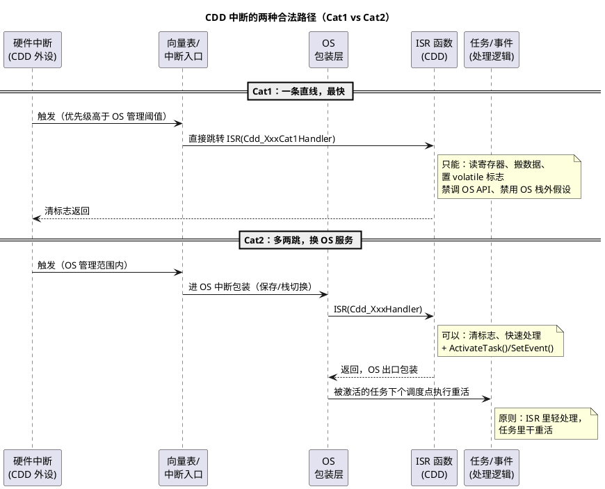

# 02-中断挂接规范

> 一句话定位：CDD 的中断不是"写个函数就行"——挂 Cat1 还是 Cat2、叫什么名、里面能干什么、优先级多少，四件事都有 OS 合同管着，本篇给的就是这份合同。
> 等级：L2 ｜ 前置：[01-CDD定位与边界](01-CDD定位与边界.md)

## 机制详解

### 三种挂接方式：Cat1 / Cat2 / 裸挂

AUTOSAR OS（OSEK 血统）把中断分成两类，加上"不经过 OS"的裸挂，一共三条路：

| 挂接方式 | 过不过 OS | 上下文 | 能用 OS 服务吗 | 典型用途 | 代价 |
|---|---|---|---|---|---|
| **Cat1（一类中断）** | 不进 OS 调度，OS 只让路 | 纯中断上下文，栈用中断栈 | 否（禁调任何 OS API） | 极端实时：微秒级时序、高速数据接驳 | 不能触发任务/事件，只能置变量/操作硬件 |
| **Cat2（二类中断）** | 进 OS 管理，带包装层 | OS 中断上下文，独立栈 | 是（ActivateTask/SetEvent 等） | 大多数 CDD 完成/错误中断 | 进出开销比 Cat1 大一点 |
| **裸挂（不经 OS）** | 完全绕开 | 自管栈与现场 | 否 | 极特殊（OS 未启动阶段、HSM 交互） | 要自己保现场；与 OS 中断体系冲突风险自负 |

工程默认答案：**Cat2，除非时序预算逼你用 Cat1**；裸挂要在评审里单独论证。



一句话记：**Cat1 是"翻墙进来的快枪手"（只能自己动手），Cat2 是"走正门的访客"（可以捎话给任务）**。

### 中断函数命名：ISR() 宏

OS 生成器（如 EB tresos OS）用 `ISR(Cdd_XxxHandler)` 宏声明中断函数，生成器据此把它绑进向量表并套上对应类别的包装代码：

```c
ISR(Cdd_DmaCh0Handler)          /* Cat2：生成器认领，自动包装 */
{
    /* ... */
}

ISR(Cdd_IgnTimerHandler)        /* Cat1：声明为 category 1，裸入口 */
{
    /* ... */
}
```

规则三条：①函数名必须在 OS 配置（OIL/ARXML）里登记，名字与 ISR() 里完全一致；②一个中断源一个 handler，禁止复用；③裸函数名（非 ISR 宏声明）的中断挂接 = 裸挂，评审黄牌。

### 中断里能做什么、不能做什么（Cat2 语境）

- **能**：读/清硬件标志、快速搬数据（拷到缓冲）、置 volatile 标志、调 ActivateTask/SetEvent、调用允许的中断级 API（如 SchM 的 Exit/Enter 区配合）；
- **不能**：等资源（自旋等待别的核/ISR）、调任务级 API（如大部分DET之外的服务）、printf/日志、动态内存、长时间循环；
- **铁律**：ISR 长度以"几十微秒"为心理上限，重活全部下沉到被激活的任务里做。

### 中断优先级规划原则

1. **看 OS 内核阈值**：OS 会圈定一个内核屏蔽等级（如 TC377 上 OS 保留最高几级、S32K 上受 BASEPRI/内核临界区约束）——CDD 中断优先级必须落在 OS 允许的区间；高于内核阈值的级别=Cat1 专属区；
2. **关键路径优先**：丢不起数据/坏时序的（CAN 收、点火时序、DMA 完成）> 普通外设 > 低速事件；
3. **同源不重入**：同一中断源的 ISR 执行中该源被屏蔽/挂起，别指望"自己打断自己"；
4. **优先级表全工程唯一**：每个中断号、优先级、类别、归属 CDD 记在一张总表（04 篇评审组三必查）；
5. **双平台口径**：TC377 用 SRC 寄存器+服务请求优先级（PSR/PN），S32K 用 NVIC 优先级+BASEPRI 阈值——同一逻辑优先级映射到两套硬件机制，切换平台时重排表。

## 配置要点（规范正文）

- **挂接四要素登记**：中断号、类别（Cat1/Cat2）、优先级、handler 名——四项齐了才能写代码；
- **栈与现场**：Cat2 用 OS 分配的中断栈，别在 CDD 里自建栈切换；Cat1 确认所用栈安全（OS 配置里给一类中断预留）；
- **使能顺序**：外设中断使能永远在"数据结构初始化完成"之后；关中断窗口内完成配置再开；
- **共享数据保护**：ISR 与任务共享的变量一律 volatile+原子访问或进临界区（Enter/Exit Critical Section）；跨核共享还要屏障（引用 01 区屏障笔记）；
- **禁止在中断里做策略**：重试/超时/状态机推进放任务级 Runnable，ISR 只报事实。

## 代码示例

```c
/* ---- Cat2 完整样例：CDD 的 DMA 完成中断 ---- */
#include "Os.h"                       /* OS 生成：ISR 宏、临界区 */

static volatile boolean dmaCh0Done = FALSE;

ISR(Cdd_DmaCh0Handler)                /* OS 配置中登记：Cat2，优先级 12 */
{
    uint32 flags = Cdd_Dma_GetIrqFlags(DMA_CH0);
    if ((flags & DMA_IRQ_DONE) != 0u) {
        Cdd_Dma_ClearIrqFlags(DMA_CH0, DMA_IRQ_DONE);
        Cdd_Ring_Push(&dmaRxRing, dmaCh0Buf, DMA_BUF_LEN);   /* 快速搬运 */
        dmaCh0Done = TRUE;                                    /* 事实标志 */
        (void)ActivateTask(Task_CddDmaProc);                  /* 重活下沉 */
    }
}

/* 任务级：被激活后才处理 */
TASK(Task_CddDmaProc)
{
    if (dmaCh0Done) {
        dmaCh0Done = FALSE;
        Cdd_Dma_OnTransferDone(dmaRxRing);    /* 解析/通知/重挂缓冲 */
    }
    (void)TerminateTask();
}

/* ---- Cat1 样例：微秒级时序触发，什么都别多做 ---- */
ISR(Cdd_IgnTimerHandler)              /* Cat1：优先级高于 OS 阈值 */
{
    Cdd_Ign_SetPin(PIN_HIGH);         /* 直接操作硬件寄存器 */
    Cdd_Ign_ArmOffTimer();            /* 置下一拍硬件定时 */
    /* 不准调 ActivateTask，不准打印，尽快返回 */
}
```

## 易错点与陷阱

1. **现象**：Cat1 里调了 ActivateTask，偶发跑飞/未定义行为。**原因**：一类中断不在 OS 上下文，OS API 不可用。**对策**：Cat1 只置标志/碰硬件；需要通知任务就升 Cat2。
2. **现象**：ISR 名字与 OS 配置不一致，中断触发即跳到错误地址。**原因**：向量表按配置生成，代码手写名字打错字。**对策**：ISR() 宏声明+生成器核对；链接期符号检查。
3. **现象**：中断优先级配进 OS 保留区，OS 调度异常。**原因**：越过了内核屏蔽等级阈值。**对策**：对照 OS 文档允许区间重排；需要更高优先级就按 Cat1 规矩办。
4. **现象**：偶发数据撕裂（半新半旧）。**原因**：ISR 与任务共享变量未保护。**对策**：volatile+临界区/原子操作；多字共享结构用双缓冲换指针。
5. **现象**：中断里"顺手"做了循环处理，偶发低优先级中断丢失。**原因**：ISR 太长阻塞同级/低级中断。**对策**：ISR 只报事实，重活 ActivateTask 下沉。
6. **现象**：初始化未完成中断就来了，缓冲区被写坏。**原因**：外设中断使能早于数据结构就绪。**对策**：初始化最后一步才开中断；未初始化标志位拦截。

## 面试高频题

1. **Cat1 和 Cat2 中断的区别？各自适用什么场景？**
   答：Cat1 不进 OS、最快但禁 OS API，用于极端实时；Cat2 由 OS 包装、可激活任务/置事件，是 CDD 完成中断默认选择。
2. **为什么 ISR 里不能调任务级 API / 做长处理？**
   答：中断上下文没有任务调度权与栈预算，长处理会阻塞其他中断、破坏实时性；重活 ActivateTask 下沉。
3. **ISR() 宏是干什么的？**
   答：向 OS 生成器声明中断函数，由生成器绑定向表并按类别套包装；裸函数挂中断属于绕过 OS 的裸挂，需特殊论证。
4. **CDD 中断优先级怎么定？**
   答：先看 OS 内核允许区间（含 Cat1 专属区），再按数据丢失代价排关键路径；全工程唯一优先级总表，双平台各有一套映射。

## 延伸

- [01-CDD定位与边界](01-CDD定位与边界.md)｜[03-与BSW-OS集成](03-与BSW-OS集成.md)：本篇的上一环与下一环；
- [OSEK与AUTOSAR-OS](../../../08-操作系统/2-L2进阶/OSEK与AUTOSAR-OS/README.md)：Cat1/Cat2、内核屏蔽等级的规范源头；
- [SRC模块](../../../02-芯片与体系结构/2-L2进阶/TC377平台/中断系统/01-SRC模块.md)：TC377 中断优先级与使能的寄存器机制；
- [NVIC与中断](../../../02-芯片与体系结构/1-L1基础/ARM-Cortex-M/02-NVIC与中断.md)：S32K 侧 NVIC 优先级/BASEPRI 阈值；
- [volatile的正确使用](../../../01-编程语言/2-L2进阶/寄存器编程/01-volatile的正确使用.md)：ISR 共享变量的第一道保险。