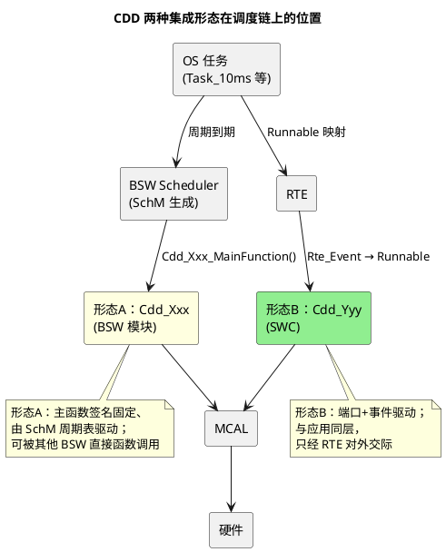

# 03-与BSW-OS集成

> 一句话定位：同一个 CDD 有两种活法——当 BSW 模块（进 BSW Scheduler，被 SchM 调度）或当 SWC（进 RTE，被 OS 任务驱动）；初始化排进 EcuM 阶段表，主函数挂上周期任务表，跨核再立三条规矩。
> 等级：L2 ｜ 前置：[01-CDD定位与边界](01-CDD定位与边界.md)

## 机制详解

### 两种集成形态：BSW 模块 vs SWC

| 维度 | 形态 A：CDD 作为 BSW 模块 | 形态 B：CDD 作为 SWC |
|---|---|---|
| 调度者 | BSW Scheduler（SchM 生成调度表） | RTE（按 SWC 的 Runnable 映射到 OS 任务） |
| 主函数 | 提供 Cdd_Xxx_MainFunction()，由 OS 任务周期调用 | 提供 Runnable（如 CddXxx_Run），RTE 事件/定时触发 |
| 接口 | 函数直调（可被 BSW/SWC 经 RTE 间接触达） | 端口化（P/R 端口，Rte_Call/Read/Write） |
| 配置载体 | BSWMD/ARXML（BSW 模块描述） | SWC 描述（ARXML，端口+Runnable+事件） |
| 适合 | 服务于 BSW 层的驱动（给 CanIf/NvM 打工）、纯后台硬件服务 | 面向应用、有明确业务输入输出的驱动（如传感协议栈） |
| 调用它的人 | 其他 BSW 模块、经 RTE 的 SWC | 仅经 RTE 的 SWC |
| 典型例子 | CDD 的 DMA 服务给 Adc/Spi 打工 | CDD 的专用传感器解析给应用供数 |

选型一句话：**给 BSW 打工/纯后台 → 形态 A；直接面向应用、端口语义清晰 → 形态 B**；两者都合法，但一个 CDD 只选一种，别两头挂。



### MainFunction 挂接方式：周期任务表

形态 A 的 CDD 主函数与标准 BSW 模块同等待遇——进 OS 调度表/SchM 生成的调用序列：

- 在 OS 配置里建（或复用）周期任务，如 Task_10ms；
- 任务体内按序调用：`Cdd_Xxx_MainFunction_10ms()` 与其他 BSW MainFunction（NvM/Fee/Fls…）并列；
- 周期选择直觉：状态推进 10ms/20ms 够用，硬件紧密轮询别靠 MainFunction（那是中断的活）；
- 形态 B 则没有独立 MainFunction——Runnable 由 RTE 事件（含 TimingEvent）触发，周期写在 SWC 的 RTE 事件配置里。

### 初始化顺序：EcuM 阶段表

CDD 的 Init 不是想什么时候调就什么时候调，要排进 EcuM 启动序列：

| EcuM 阶段 | 干什么 | CDD 在这里的事 |
|---|---|---|
| Startup I（ECU 初始化早期，调度前） | Mcu/Port/EcuM 基础 | 一般不放 CDD（除 OS 未起就要动的硬件） |
| Startup II | OS 启动、驱动逐步就绪 | 依赖 MCU 时钟/Pin 的 CDD 在此 Init |
| RUN（Init 阶段） | BSW 各模块 Init、SchM 启动 | 大多数 CDD 的 Cdd_Xxx_Init() 挂这里（经 BswM/SchM 编排） |
| RUN（运行） | 正常业务 | MainFunction/Runnable 周期跑 |
| POST_RUN / Shutdown | 收尾 | CDD 反初始化/关中断、释放资源 |

三条纪律：①依赖谁就在谁之后 Init（依赖时钟就排在 Mcu 后）；②Init 里不开中断，使能放最后一步（见 02 篇）；③Shutdown 路径把中断关干净，别带着活中断进睡眠。

### 跨核注意事项（一段）

多核（TC377 三核、S32K3 双核）上集成 CDD 先立三条规矩：**归属唯一**——一个硬件外设（含它的中断与 DMA 通道）只归一个核管，别的核要用只能通过核间通信借道，禁止双核同时写同一外设寄存器；**中断跟核走**——ISR 在哪个核触发，处理逻辑与共享数据就尽量留在这个核，跨核只传消息；**共享数据要立牌**——跨核共享变量除了 volatile 还要核间屏障/原子访问，通知用 OS 的跨核 ActivateTask 或 IOC/RTE 通道。核间机制的细节在 02 区多核架构笔记展开。

## 配置要点（规范正文）

- **形态声明**：设计文档写明该 CDD 是 BSW 模块还是 SWC，以及它的 MainFunction/Runnable 清单与周期；
- **任务映射表**：CDD 的周期函数挂在哪个 OS 任务、优先级多少，与中断优先级一起排总表；
- **初始化登记**：Cdd_Xxx_Init() 在 EcuM/BswM 序列中的位置、依赖的前置模块列表；
- **关闭序列**：Shutdown 时 CDD 的去初始化步骤与超时预算；
- **MemMap 与段**：代码/变量进 CDD 专用段，链接脚本有据可查（大缓冲区单独段便于放非缓存区）；
- **跨核登记**：外设归属核、中断归属核、跨核接口清单。

## 代码示例

```c
/* ---- 形态 A：BSW 模块式 CDD 的集成点 ---- */

/* 1) EcuM/BswM 编排的 Init 序列（节选，顺序即依赖） */
void BswM_InitSequence(void)
{
    (void)Mcu_Init(&Mcu_Config);          /* 时钟先行 */
    Port_Init(&Port_Config);              /* 引脚就绪 */
    /* ... 其他标准模块 ... */
    (void)Cdd_DmaSrv_Init();              /* CDD：依赖时钟/引脚，排在其后 */
    (void)Cdd_DmaSrv_EnableInterrupts();  /* 最后一步才开中断 */
}

/* 2) OS 任务里的周期主函数（与标准 BSW 并列） */
TASK(Task_10ms)
{
    (void)Cdd_DmaSrv_MainFunction_10ms();  /* CDD 主函数 */
    NvM_MainFunction();
    Fee_MainFunction();
    (void)TerminateTask();
}

/* ---- 形态 B：SWC 式 CDD 的 Runnable ---- */
FUNC(void, CDD_APPL_CODE) CddSens_Run(void)   /* RTE 事件触发 */
{
    uint8 frame[8];
    if (E_OK == Rte_Call_CddSensPort_ReadFrame(frame)) {
        (void)Rte_Write_Pp_SensData(frame);    /* 经端口供数给应用 */
    }
}

/* ---- Shutdown 路径 ---- */
void BswM_ShutdownSequence(void)
{
    Cdd_DmaSrv_DisableInterrupts();       /* 先关中断 */
    Cdd_DmaSrv_DeInit();                  /* 再收资源 */
}
```

## 易错点与陷阱

1. **现象**：CDD Init 在时钟未就绪时调用，外设寄存器写不进去。**原因**：初始化顺序错，依赖未满足。**对策**：EcuM 阶段表按依赖排序，评审查依赖清单。
2. **现象**：同一 CDD 既当 BSW 又当 SWC，两个调度源打架。**原因**：形态未定，双头挂接。**对策**：立项定死形态，04 篇评审第一组有硬性条目。
3. **现象**：MainFunction 忘进任务表，状态机永远不推进。**原因**：调度表漏配（配置工具里没勾）。**对策**：任务映射表与代码对照检查；单元测试跑调度空转。
4. **现象**：Shutdown 后偶发唤醒异常。**原因**：CDD 中断没关，进低功耗带着活中断。**对策**：Shutdown 序列强制"关中断→反初始化"两步走。
5. **现象**：双核同时配置同一外设，寄存器偶发错乱。**原因**：外设归属未定义，两核都碰。**对策**：归属唯一原则，跨核只借消息通道。
6. **现象**：CDD 主函数里等标志位自旋，任务超时。**原因**：把轮询当调度，MainFunction 里忙等。**对策**：等事件用 OS 机制（中断激活任务），MainFunction 只做非阻塞推进。

## 面试高频题

1. **CDD 集成进 AUTOSAR 有哪两种形态？怎么选？**
   答：BSW 模块式（SchM/BSW Scheduler 调度 MainFunction，给 BSW 层打工）或 SWC 式（RTE 事件驱动 Runnable，面向应用）；看服务对象与接口语义，一个 CDD 只选一种。
2. **CDD 的初始化为什么要排进 EcuM 序列？原则是什么？**
   答：保证依赖（时钟/引脚/OS）就绪且全局可追溯；原则：依赖谁排谁后，Init 不开中断，使能放最后。
3. **MainFunction 挂接的典型做法？周期怎么定？**
   答：进周期 OS 任务与标准 BSW MainFunction 并列；状态推进 10/20ms 级，紧实时靠中断不靠轮询。
4. **多核集成 CDD 的核心规矩？**
   答：外设/中断归属唯一核；跨核只传消息；共享数据 volatile+屏障/原子，通知用跨核 ActivateTask 或 IOC。

## 延伸

- [01-CDD定位与边界](01-CDD定位与边界.md)｜[02-中断挂接规范](02-中断挂接规范.md)｜[04-模板与评审清单](04-模板与评审清单.md)：方法论四部曲闭环；
- [SchM 调度表](../../../07-AUTOSAR架构/2-L2进阶/SchM与调度/01-调度表.md)：BSW Scheduler 与周期表的生成机制；
- [EcuM 上下电时序](../../../07-AUTOSAR架构/2-L2进阶/系统服务栈/EcuM/02-上下电时序.md)：启动阶段表与 Shutdown 序列的规范源头；
- [OSEK与AUTOSAR-OS](../../../08-操作系统/2-L2进阶/OSEK与AUTOSAR-OS/README.md)：任务/事件/中断类别的 OS 基础；
- [核间通讯与共享资源](../../../02-芯片与体系结构/3-L3高级/多核架构/03-核间通讯与共享资源.md)：跨核规矩的硬件背景。