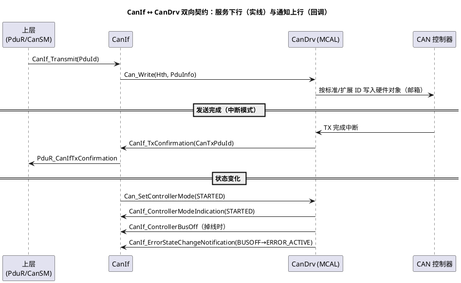

# 01-CanDrv接口契约

> 一句话定位：把 CanDrv 与 CanIf 之间"服务下行、回调上行"的双向契约列成账本，讲透 Hth/Hoh 硬件对象与 CAN_BUSY 的来龙去脉——CAN 配置岗位的日常语言。
> 等级：L2 ｜ 前置：[CAN帧格式](../../../05-汽车网络通讯/1-L1基础/CAN/协议原理/01-帧格式.md)、[MCAL第一课-从点灯到分层驱动](../../00-入门导读/01-MCAL第一课-从点灯到分层驱动.md)

## 原理

CanDrv 是 AUTOSAR 通讯栈里**唯一直接摸 CAN 控制器**的一层：上面 CanIf 只认"Controller/Hth/Pdu"这些抽象，CanDrv 负责把它们翻译成 MultiCAN/FlexCAN 的邮箱与中断。契约是**双向**的：



记住方向感：**CanIf 调它控制收发，它调 CanIf 汇报结果**——所有 `CanIf_*Indication/Confirmation` 都是 CanDrv（在中断或 MainFunction 上下文）回调上去的。

### 硬件对象：Hoh 与 Hth

CAN 控制器的发送资源本质是**一组硬件邮箱**，AUTOSAR 把每个邮箱抽象成 Hardware Object（HOH=Hardware Object Handler，一组同类硬件对象），其中：

- **Hth（Hardware Transmit Handle）**：发送硬件对象句柄——CanIf 靠它把"某个 CanTxPduId"路由到具体邮箱组；
- **Hrh（Hardware Receive Handle）**：接收硬件对象句柄——配合滤波决定哪些 ID 进哪个接收对象。

关键理解：**Hth 数量决定"同时能压着几帧等发"**。配 1 个 Hth 而 CanIf 里挂 10 个 TX PDU，总线一忙就全在排队——CAN_BUSY 的舞台。

### Can_Write 返回值语义

| 返回 | 含义 | CanIf 该干什么 |
|---|---|---|
| CAN_OK | 已受理（进硬件/驱动队列） | 等 TxConfirmation |
| CAN_NOT_OK | 参数错/控制器未 STARTED | 丢弃+DET |
| **CAN_BUSY** | 该 Hth 所有硬件对象都满 | 重试或按策略丢弃（Com 重发机制兜底） |

CAN_BUSY **不是错误**，是背压信号：它告诉上层"发送资源暂时被占满"。常见于高负载+低优先级 ID 常丢仲裁时。

## 双平台硬件单元对照

| 对照项 | TC377（MultiCAN+） | S32K（FlexCAN） |
|---|---|---|
| 硬件对象形态 | 每个 Node 一组报文缓冲+列表 | 每个 Mailbox（MB）一个硬件对象 |
| 节点/实例 | 多 Node 共享报文 RAM | 多实例（CAN0~CANn），每实例最多 32~64 MB |
| 发送队列 | 列表/专用 Basic/FullCAN 缓冲 | MB 逐个填，或 TX FIFO |
| 接收 | 每列表滤波链 | RX FIFO + ID 过滤表 |
| CAN FD | 原生支持 | FlexCAN FD 支持（数据长度到 64B） |
| MCAL 描述 | EB tresos 英飞凌 Can 包 | EB tresos NXP Can 包 |

## MCAL 配置要点 / 接口契约

| API/配置 | 方向 | 签名/含义 | 易错点 |
|---|---|---|---|
| Can_Init | 下行 | `Can_Init(&Can_ConfigType)` | 未 Init 先 Write，静默失败 |
| Can_SetControllerMode | 下行 | `Can_SetControllerMode(Ctrl, STARTED/STOPPED/SLEEP)` | 未 STARTED 就发帧，全数失败 |
| Can_Write | 下行 | `Can_Write(Hth, &PduInfo)` | Hth 与 CanIf 配置不一致→帧发到别的对象 |
| Can_GetControllerErrorState | 下行 | 查 ERROR_ACTIVE/PASSIVE/BUSOFF | 轮询过频占 CPU，一般配状态变化通知 |
| Can_MainFunction_Write/Read | 下行 | 轮询模式的心跳 | 中断模式下仍需按配置调用（空转） |
| CanIf_ControllerModeIndication | 上行 | 模式切换结果回调 | 假定同步生效→状态机卡住 |
| CanIf_TxConfirmation | 上行 | 发送完成确认（带 PduId） | 中断上下文，重活禁止 |
| CanIf_RxIndication | 上行 | 收到帧（CanId+数据） | 回调里直接长处理，阻塞中断 |
| CanIf_ControllerBusOff | 上行 | BusOff 通知 | 依赖 CanSM 恢复序列，CanDrv 只报不治 |

## 代码示例

```c
/* CanIf→CanDrv 发送与回调链示意（伪码骨架，去掉防御性细节） */
Std_ReturnType CanIf_Transmit(PduIdType CanTxPduId, const PduInfoType *PduInfoPtr)
{
    /* 1. 查配置表：PduId → Hth（CanIfTxPduBufferRef→Hoh 映射，工具生成） */
    Can_HwHandleType Hth = CanIf_CfgTxPdu[CanTxPduId].HthRef;
    Can_PduType CanPdu = { .id = CanIf_CfgTxPdu[CanTxPduId].CanId,
                           .swPduHandle = CanTxPduId,
                           .length = PduInfoPtr->SduLength,
                           .sdu = PduInfoPtr->SduDataPtr };
    /* 2. 交给 CanDrv：受理/CAN_BUSY 都会立刻知道 */
    Can_ReturnType ret = Can_Write(Hth, &CanPdu);
    if (CAN_BUSY == ret) { /* 发送对象满：交由上层重试策略 */ }
    return (CAN_OK == ret) ? E_OK : E_NOT_OK;
}

/* CanDrv 内部（中断模式）：TX 完成中断里回调 CanIf */
ISR(Can_TxIsr)
{
    /* 读硬件对象状态，取出 swPduHandle（即当初传入的 PduId） */
    PduIdType confirmedId = CanHw_PopTxObject();
    CanIf_TxConfirmation(confirmedId);   /* 一路向上：PduR→Com 通知发送成功 */
}
```

## 易错点与陷阱

1. **Hth 数量配不够**：现象是高负载时大量 CAN_BUSY、偶发帧延迟百 ms 级；对策：按"同时待发帧数"配硬件对象数，或启用控制器 TX FIFO。
2. **Hth 映射错位**：CanIf 的 PduId 指到错误的 Hoh，帧从另一个控制器/错误 ID 发出；对策：CanIf 与 Can 两份配置联动评审，交叉核对 Hoh 引用。
3. **把 CAN_BUSY 当错误复位系统**：负载波动引发"自愈式重启"；对策：BUSION 是背压，按 Com 层重发策略处理，加计数监控而非直接升级。
4. **回调里做重活**：TxConfirmation/RxIndication 里跑长逻辑，中断延迟暴涨反噬总线吞吐；对策：回调只搬运+置事件，处理回任务。
5. **ID 类型/范围填错**：标准帧 ID 填了 >0x7FF 或 IDE 位与 ID 不匹配，Can_Write 返回 NOT_OK 或帧异常；对策：配置里 id 范围校验开到最严。
6. **模式未 STARTED 就发送**：Can_Init 后直接 Can_Write，全部失败且无显式报错；对策：初始化顺序固化 Can_Init→CanIf_Init→Can_SetControllerMode(STARTED)（详见 [03-与CanIf-LinIf集成](03-与CanIf-LinIf集成.md)）。

## 面试高频题

- **Q：Can_Write 返回 CAN_BUSY 说明什么？上层怎么处理？**
  A：说明该 Hth 关联的硬件对象全满（发不过去/仲裁一直输）；上层应重试或丢弃，靠 Com 的发送重试与上层应用监控兜底——它是背压不是故障。
- **Q：Hth/Hoh 是什么？为什么要这层抽象？**
  A：HOH 把"一个硬件邮箱（报文缓冲）"抽象成标准对象，Hth 是其发送句柄；CanIf 只按 Hth 路由，不关心底下是 FlexCAN MB 还是 MultiCAN 列表——换芯片只重配映射，栈代码不动。
- **Q：CanDrv 和 CanIf 的契约是单向还是双向？各有什么函数？**
  A：双向：下行 CanIf 调 Can_Init/Can_SetControllerMode/Can_Write/MainFunction_*；上行 Can 调 CanIf_TxConfirmation/RxIndication/ControllerModeIndication/ControllerBusOff/ErrorStateChangeNotification。
- **Q：发送完成的确认为什么走回调而不是 Can_Write 同步返回？**
  A：真正的完成点是邮箱成功仲裁上线，可能滞后毫秒级；Can_Write 只代表受理。确认必须异步回调（TxConfirmation），上层据此推进发送队列。

## 延伸

- [03-与CanIf-LinIf集成](03-与CanIf-LinIf集成.md)：一条帧从 PduR 到总线的完整时序；
- [04-中断与轮询模式](04-中断与轮询模式.md)：MainFunction 与中断两条搬运路径的取舍；
- [01-从一帧CAN报文说起-车载网络全景](../../../05-汽车网络通讯/00-入门导读/01-从一帧CAN报文说起-车载网络全景.md)：帧在总线侧的样子；
- [01-SRC模块](../../../02-芯片与体系结构/2-L2进阶/TC377平台/中断系统/01-SRC模块.md)：TX/RX 中断优先级的硬件基础。

---

维护约定：笔记命名 `序号-主题.md`；真实截图放 `_images/`；流程/时序/状态/架构图用 PlantUML 内嵌正文，规范见 [图表规范与模板](../../../00-总览/图表规范与模板.md)。
