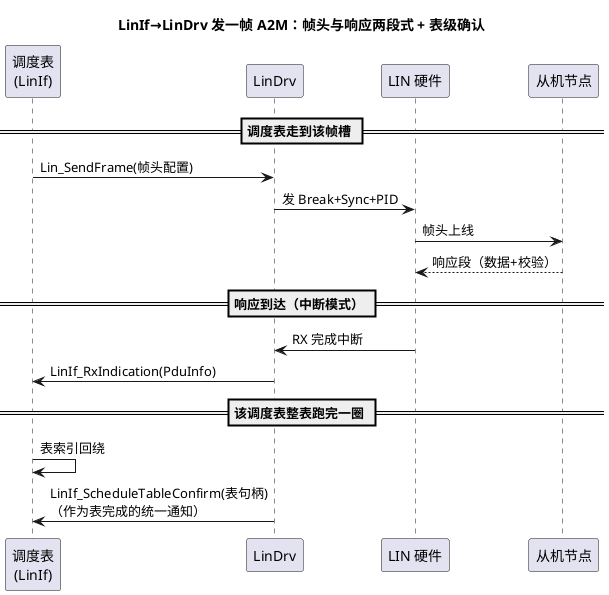

# 02-LinDrv接口契约

> 一句话定位：理清 LinDrv 的帧头/响应两段式世界、LinIf 的调度表确认回调，以及 M2A/A2M 报文方向——LIN 配置岗日常最易含糊的一页账。
> 等级：L2 ｜ 前置：[LIN主从与调度表](../../../05-汽车网络通讯/1-L1基础/LIN/协议原理/01-主从与调度表.md)、[MCAL第一课-从点灯到分层驱动](../../00-入门导读/01-MCAL第一课-从点灯到分层驱动.md)

## 原理

LIN 是**主机调度型总线**：没有仲裁，主机（通常是网关 ECU）按"调度表"逐槽发帧头，从机只应答。一帧 = **帧头**（Break+Sync+PID，主机发）+ **响应段**（数据+校验，由"发布者"填）。发布者是谁，决定帧的类型：

| 类型 | 直觉 | 谁发帧头 | 谁发数据 |
|---|---|---|---|
| M2A（主机→从机） | 主机广播指令 | 主机 | 主机 |
| A2M（从机→主机） | 主机点名叫号 | 主机 | 被点名的从机 |
| 响应（应答段） | 上表里"数据+校验"那半截 | — | 发布者 |

**帧槽与调度表一句话**：帧槽=时刻表上的一格（本帧帧头+响应+空间的时间），调度表=一格接一格的列车时刻表，主机只按表开车，槽长算错整条线晚点。



两段式是理解 LinDrv 的钥匙：**LinDrv 的核心职责是"把帧头发出去 + 把响应段收回来/送出去"**，业务含义（哪个信号、发给谁）全在上层 LinIf/Com。

## 双平台硬件单元对照

| 对照项 | TC377（ASCLIN-LIN） | S32K（LPUART-LIN） |
|---|---|---|
| LIN 支持 | ASCLIN LIN 模式，硬件 break 产生/检测 | LPUART LIN 模式（break/wake 支持） |
| 帧头产生 | 硬件序列（break+sync+PID） | break 硬件+帧头组合（部分版本软件拼） |
| 校验和 | 硬件 checksum（classic/enhanced 可选） | 硬件 checksum 支持 |
| 波特率 | 位时序参数拍数 | LPUART 波特率寄存器 |
| 主/从角色 | 硬件均支持 | 均支持 |
| 休眠唤醒 | 睡眠命令帧+硬件唤醒检测 | 同左，配置项分布不同 |

## MCAL 配置要点 / 接口契约

| API/配置 | 方向 | 签名/含义 | 易错点 |
|---|---|---|---|
| Lin_Init | 下行 | `Lin_Init(&Config)` | 波特率容差超限：从机全不应答 |
| Lin_SendFrame | 下行 | `Lin_SendFrame(Ctrl, &PduInfo)` | 只准备帧头，数据方向看发布者配置 |
| Lin_GetResp | 下行 | 取从机响应状态/数据（两段式实现，签名以栈为准） | 与 RxIndication 混用，双份读数据 |
| Lin_WakeUp / WakeUpInternal | 下行 | 发唤醒脉冲/仅内部唤醒 | 总线恢复时间不足立即发帧，首帧丢 |
| Lin_GoToSleep | 下行 | 发睡眠命令帧后置内部休眠 | 没等确认就断外设时钟 |
| LinIf_RxIndication | 上行 | 收到响应段 | 中断上下文，勿长处理 |
| LinIf_TxConfirmation | 上行 | M2A 帧发送完成 | 与 RxConfirmation 语义混 |
| LinIf_ScheduleTableConfirm | 上行 | 调度表整表完成 | 回调里立刻切表→重入 |
| LinIf_ErrorIndication / TimeoutConfirmation | 上行 | 帧错/无响应超时 | 超时≠总线挂了，可能只是该从机掉线 |

## 代码示例

```c
/* LinIf 侧：调度表驱动的发送与确认骨架（伪码） */
void LinIf_MainFunction(void)
{
    const LinIf_ScheduleTableEntryType *e = &CurTable->Entry[u8SlotIdx];
    Lin_PduType Pdu = { .Pid = e->Pid, .Drc = e->Direction, /* TX/RX */ };
    if (LIN_TX == e->Direction)             /* M2A：数据由主机填 */
    {
        Pdu.Dl = e->Length;  Pdu.SduPtr = e->BufPtr;
    }
    (void)Lin_SendFrame(LIN_CTRL_0, &Pdu);  /* 发帧头；A2M 帧等从机响应 */
}

/* LinDrv 回调链：响应收齐 → LinIf；整表跑完 → 表确认 */
void Lin_RxIsr(void)
{
    Lin_PduType Resp;
    Lin_GetResp(LIN_CTRL_0, &Resp);         /* 两段式：取回从机响应段 */
    LinIf_RxIndication(&Resp);              /* 信号解析回任务/Com 层做 */
    if (ScheduleTableFinished())            /* 本表最后一槽完成 */
    {
        LinIf_ScheduleTableConfirm(CurTable->Handle); /* 通知表完成，可切表 */
    }
}
```

## 易错点与陷阱

1. **发布者方向配反**：M2A 帧配成"等从机数据"，每槽超时、从机永远沉默；对策：按 LDF 逐帧核对 Direction 与发布节点。
2. **槽长按理想波特率算**：未算 LIN 时钟容差（主机约 ±1.5%、从机 ±14%）与帧空间，帧头迟到挤爆表尾；对策：用 LDF 工具算表，手工改表必须重算总时长。
3. **checksum 类型不一致**：主机 enhanced、从机 classic，帧校验必错被判超时；对策：LIN 2.x 默认 enhanced，老节点逐帧显式声明。
4. **唤醒后立即发帧**：从机振荡器未稳定，首帧无响应误判掉线；对策：唤醒后留总线稳定等待（典型 100ms 内）再跑表。
5. **ScheduleTableConfirm 回调里切表**：在回调（中断上下文）改调度表状态引发重入/竞态；对策：回调置标志，切表动作回 LinIf_MainFunction。
6. **把从机超时当总线故障**：单从机掉线频繁 TimeoutConfirmation，误触发整网重启；对策：超时计数按从机隔离，走各自恢复策略。

## 面试高频题

- **Q：LIN 为什么必须有调度表，而 CAN 不用？**
  A：LIN 无仲裁、主机独裁——从机只在被点名帧槽里说话，谁来点名、何时点名全靠调度表；CAN 有 CSMA 仲裁，节点随时竞争，无需时间表。
- **Q：M2A/A2M 帧在驱动层有什么区别？**
  A：帧头都由主机发；区别在响应段发布者：M2A 主机把数据随帧头后送出，A2M 主机只发帧头、等被 ID 点名的从机回数据——驱动配置里的 Direction/TX-RX 就是对这件事的声明。
- **Q：LinDrv 和 LinIf 的分工？**
  A：LinDrv 管"一帧"的物理收发（帧头+响应段+中断），LinIf 管"一张表"（调度、切换、休眠唤醒策略、把帧映射到 PDU）——帧级 vs 表级。
- **Q：LinIf_ScheduleTableConfirm 在什么时机发？**
  A：调度表整表所有槽执行完毕（最后帧的确认之后）由 LinDrv/调度逻辑通知 LinIf，LinIf 借此决定换表或续跑——注意只在上下文安全时切表。

## 延伸

- [01-CanDrv接口契约](01-CanDrv接口契约.md)：同门兄弟 CAN 的契约对照；
- [03-与CanIf-LinIf集成](03-与CanIf-LinIf集成.md)：LinIf 调度表之上与 PduR/Com 的接线；
- [01-从一帧CAN报文说起-车载网络全景](../../../05-汽车网络通讯/00-入门导读/01-从一帧CAN报文说起-车载网络全景.md)：车载网络全景里 LIN 的位置。

---

维护约定：笔记命名 `序号-主题.md`；真实截图放 `_images/`；流程/时序/状态/架构图用 PlantUML 内嵌正文，规范见 [图表规范与模板](../../../00-总览/图表规范与模板.md)。
