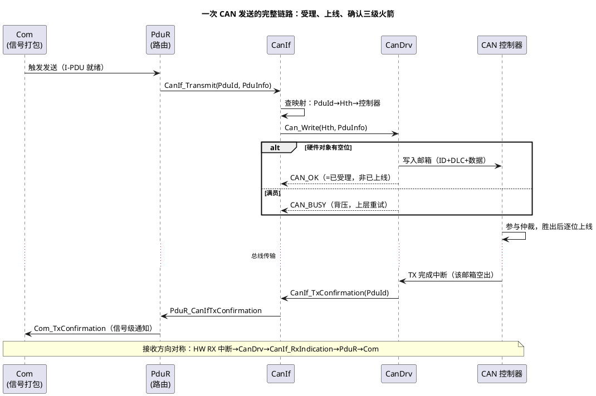
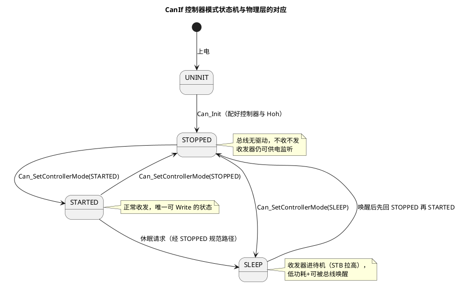

# 03-与CanIf-LinIf集成

> 一句话定位：把"一帧 CAN 从 Com 到总线的全链路时序"、"控制器三态状态机"和"Can_Init→CanIf_Init→STARTED 的铁律顺序"钉成一张挂墙图。
> 等级：L2 ｜ 前置：[01-CanDrv接口契约](01-CanDrv接口契约.md) + [02-LinDrv接口契约](02-LinDrv接口契约.md)

## 原理

### 一次发送的全链路



三级火箭：**受理（Can_Write 返回）→上线（仲裁成功）→确认（TxConfirmation）**，三个时点完全不同步——把它当同步流程理解的人，都会在"为什么发了却没确认"上栽跟头。

### ControllerMode 状态机与物理层



要点：**只有 STARTED 才真正参与总线**；SLEEP 与 STOPPED 的差别在收发器电源模式（SLEEP=待机低功耗、可被唤醒中断拉回）；每次切换的生效以 `CanIf_ControllerModeIndication` 回调为准，不是 API 返回那一刻。

### 初始化顺序（铁律）

1. **Mcu/Port**：时钟起振、CAN 引脚复用、收发器使能脚；
2. **Can_Init**：装控制器配置与硬件对象（完成后处于 STOPPED）；
3. **CanIf_Init**：建立 PduId↔Hth↔控制器映射；
4. **Can_SetControllerMode(STARTED)**：控制器上线，等 ModeIndication；
5. 此后 Com/CanNm 的收发才合法。

LIN 侧同构：Lin_Init→LinIf_Init（含调度表注册）→LinIf_ScheduleTableRequest 起表（见 [02-LinDrv接口契约](02-LinDrv接口契约.md)）。

## 双平台硬件单元对照

| 对照项 | TC377（MCAN 集成） | S32K（FlexCAN 集成） |
|---|---|---|
| 上电后首步 | 报文 RAM 初始化+节点参数 | MB 清空+控制寄存器解锁（如需） |
| STARTED 生效动作 | 节点使能+中断源挂接 | Module 进 Normal 模式 |
| 唤醒路径 | 总线唤醒→节点→CanIf_WakeupNotification | FlexCAN 唤醒中断→同左 |
| BusOff 上报 | 错误状态变化→CanIf_ControllerBusOff | 同左（EWRN/BOFF 阈值可配） |
| 模式切换延迟 | 需等节点同步 | 需等 Freeze 退出 |
| 与收发器联动 | Port 控 STB/EN 引脚 | 同左（CanTrcv 参与时另算） |

## MCAL 配置要点 / 接口契约

| 配置项/API | 含义 | 典型值或签名 | 易错点 |
|---|---|---|---|
| CanIfCtrlDrvRef | CanIf 控制器→Can 控制器绑定 | 每个 Ctrl 一条 | 绑错控制器：帧从别路总线出 |
| CanIfInitRefCfgTxPdu | PduId→Hth 映射 | 与 Can Hoh 数量匹配 | Hth 引用悬空，Can_Write 找不到对象 |
| Can_SetControllerMode | 三态切换 | `Can_SetControllerMode(Ctrl, mode)` | 假定同步生效，不看 Indication |
| CanIf_ControllerModeIndication | 模式切换确认回调 | 上行通知 CanSM | CanSM 状态机被卡：回调没透传 |
| CanIf_SetPduMode | Pdu 级启停 | ONLINE/OFFLINE | Pdu OFFLINE 时静默丢弃，无报错 |
| CanIf_TxConfirmation | 发送确认回调 | 中断上下文 | 在此做重发逻辑→重入 |

## 代码示例

```c
/* 通讯栈初始化顺序（骨架，工程里常由 EcuM/BswM 串起） */
void ComStack_Init(void)
{
    Can_Init(&Can_Config);                       /* 1. 控制器+Hoh 就绪（STOPPED） */
    CanIf_Init(&CanIf_Config);                   /* 2. PduId↔Hth 映射生效 */
    (void)Can_SetControllerMode(CAN_Ctrl0, CAN_CS_STARTED); /* 3. 上线 */
    /* 4. 等 CanIf_ControllerModeIndication 确认后，Com/Nm 才开闸 */
}

/* 发送-确认闭环（应用侧视角） */
void App_SendVehicleSpeed(uint16 u16Spd)
{
    Com_SendSignal(ComConf_ComSignal_VehSpd, &u16Spd);  /* 信号→I-PDU→整链发出 */
    /* 真正完成点在下面的确认回调（Com→RTE 通知），这里只管"递交" */
}

void PduR_CanIfTxConfirmation(PduIdType CanTxPduId)     /* 确认回调（中断上下文） */
{
    /* 只置事件/计数；失败统计与重发策略回任务层 */
}
```

## 易错点与陷阱

1. **STARTED 之前发帧**：Can_Write 全数失败或返回 BUSY，现象是"启动头 100ms 报文全丢"；对策：初始化顺序固化为启动检查单，BswM 卡模式切换完成事件。
2. **模式切换当同步**：Can_SetControllerMode 返回后立刻置业务标志，实际硬件尚在切换；对策：一切以 CanIf_ControllerModeIndication 为准。
3. **SLEEP 前不进 STOPPED**：部分实现要求经 STOPPED 过渡，直跳 SLEEP 失败或收发器状态不齐；对策：按状态机图走规范路径。
4. **BusOff 后没人恢复**：CanDrv 只报 CanIf_ControllerBusOff，恢复（等待→复位→重启）是 CanSM/应用的职责；只配驱动不配恢复策略=总线一挂永不回来。
5. **TxConfirmation 没接 PduR**：CanIf 的确认没路由出去，上层重传逻辑失灵、队列积压；对策：PduR 路由表发送确认路径逐条核对。
6. **LinIf 起表早于 Lin_Init**：调度表请求被拒或静默无效；对策：LinIf_Init 后再 ScheduleTableRequest，顺序写进启动代码模板。

## 面试高频题

- **Q：从 Com 层发一个信号到总线，中间经过哪些模块？**
  A：Com（信号打包）→PduR（按路由表转发）→CanIf（PduId 查 Hth、组 Can_Pdu）→CanDrv（Can_Write 写邮箱）→控制器仲裁上线；完成回调反向：TX 中断→CanIf_TxConfirmation→PduR→Com_TxConfirmation。
- **Q：为什么初始化必须 Can_Init→CanIf_Init→STARTED，倒过来会怎样？**
  A：CanIf 映射依赖 Can 的 Hoh 定义（Init 晚了映射悬空）；未 STARTED 时 Can_Write 拒收——顺序错了轻则报文丢失，重则初始化断言。
- **Q：STOPPED 和 SLEEP 有什么区别？**
  A：都不收不发；STOPPED 是控制器停摆、收发器仍供电监听；SLEEP 让收发器进待机（更低功耗、可被总线唤醒拉回）——对应物理层两种省电档位。
- **Q：发送成功你怎么知道？Can_Write 返回 OK 就算发上去了吗？**
  A：不算。OK 只代表受理进硬件对象；真正上线成功看 CanIf_TxConfirmation（该邮箱成功仲裁且发完）——受理与确认必须分开记日志。

## 延伸

- [01-CanDrv接口契约](01-CanDrv接口契约.md)：契约细节与 CAN_BUSY；
- [04-中断与轮询模式](04-中断与轮询模式.md)：确认/指示回调背后的两种搬运模式；
- [01-从一帧CAN报文说起-车载网络全景](../../../05-汽车网络通讯/00-入门导读/01-从一帧CAN报文说起-车载网络全景.md)：总线侧的帧旅程；
- [02-中断优先级实践](../../../02-芯片与体系结构/2-L2进阶/TC377平台/中断系统/02-IR路由与多核分配.md)：TX/RX 中断在多核的落位。

---

维护约定：笔记命名 `序号-主题.md`；真实截图放 `_images/`；流程/时序/状态/架构图用 PlantUML 内嵌正文，规范见 [图表规范与模板](../../../00-总览/图表规范与模板.md)。
