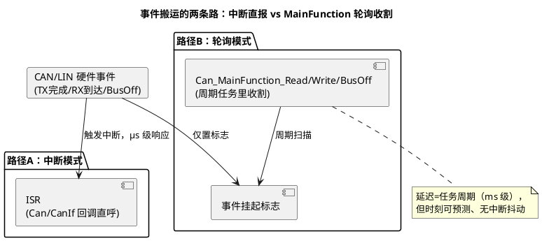

# 04-中断与轮询模式

> 一句话定位：搞清 CanDrv/LinDrv 的 TX/RX/BusOff 事件走中断还是走 MainFunction 轮询、时间片怎么排、中断配置从哪生成——最后一张把通讯栈"跑起来"的机制图。
> 等级：L2 ｜ 前置：[03-与CanIf-LinIf集成](03-与CanIf-LinIf集成.md)

## 原理

### 两种搬运机制

硬件事件（帧到了/发完了/掉线了）总得有人搬给 CanIf——AUTOSAR 给了两条路：



每类事件**独立选择**路径：常见组合"RX 中断+TX 中断+BusOff 轮询"——BusOff 罕见且不急，放轮询省一个中断源。

### 轮询模式的时间片安排

轮询模式的生命线是 **MainFunction 周期**，安排三问：

1. **放哪个任务**：与总线周期对齐的任务（如 5ms 任务对应 500kbp 总线的应用周期），优先级中档——高于慢业务、低于安全相关；
2. **周期多大**：必须满足 `周期 × 帧到达率 < RX FIFO 深度`，否则溢出丢帧；典型 1~10ms；
3. **三个 MainFunction 都要调**：Read/Write/BusOff（按配置），漏一个等于该事件类永远没人收割。

### 中断向量与优先级从哪来

不是手写中断表——**EB tresos 里配置每个 Hoh 的处理类型（Interrupt/Polling）与优先级，生成器据此产出中断配置代码**（S32K：NVIC 优先级+向量注册；TC377：SRC 节点优先级与目标核）。流程：Hoh 配置（CanRxHohCanHwTrgType/优先级）→ Generate → 中断向量文件与 OS/Ioc 配置联动。**手改生成文件一律会被下次 Generate 冲掉**（MCAL第一课铁律）。

优先级直觉：**RX > TX > BusOff**；RX 关乎所有节点（丢帧=全链路断），TX 晚一点只是延迟；同优先级多控制器时注意核间分配，避免两个高频 CAN 全压一个核。

### 性能取舍表

| 维度 | 中断模式 | 轮询模式 |
|---|---|---|
| 延迟 | µs 级（事件即达） | 任务周期级（1~10ms） |
| CPU 占用（空闲时） | 近零 | 固定时间片（恒定烧 CPU） |
| CPU 占用（高负载） | 中断风暴风险 | 平稳（每周期固定收割量） |
| 可预测性/抖动 | 受抢占/其他 ISR 影响 | 时刻固定，好测量 |
| 丢帧风险 | 低（即时处理） | 取决于周期×FIFO 深度 |
| 低功耗兼容 | 事件可唤醒 | 睡眠时无任务跑=不可用 |

经验法则：**车用主力总线（500k CAN）用中断；低频总线/资源受限小控制器用轮询；LIN 主机调度表天然按帧槽走，轮询更常见**。

## 双平台硬件单元对照

| 对照项 | TC377（MCAN） | S32K（FlexCAN） |
|---|---|---|
| 中断体系 | SRC 模块逐节点分配优先级+目标核 | NVIC 统一向量表优先级 |
| 每事件粒度 | 每节点/每列表可独立挂中断 | 每 MB/每 FIFO 区可独立挂 |
| 多核路由 | 中断可指到任意核（IR 路由） | 向量表按核/Instance 固定较多 |
| 配置生成物 | SRC 初始化+ISR 注册 | NVIC 优先级+IRQ handler 注册 |
| 轮询实现 | MainFunction 查节点标志 | MainFunction 查 MB/FIFO 标志 |
| BusOff 事件 | 错误中断或轮询 ECR | BOFF 中断或轮询 ESR |

## MCAL 配置要点

| 配置项 | 含义 | 典型值 | 易错点 |
|---|---|---|---|
| CanTxProcessing | TX 事件路径 | INTERRUPT | TX 中断低于 RX，发送确认抖动被放大 |
| CanRxProcessing | RX 事件路径 | INTERRUPT | 轮询 RX 周期算错=常态丢帧 |
| CanBusOffProcessing | BusOff 路径 | POLLING | 中断+轮询混配后忘了对应 MainFunction |
| CanWakeupProcessing | 唤醒路径 | POLLING | 睡眠态依赖中断唤醒却配了轮询（没人跑） |
| CanMainFunctionRWPeriod | 轮询周期声明 | 与任务周期一致 | 声明与实际任务周期不符，超时计算整体漂移 |
| Hoh 优先级 | 生成中断优先级的来源 | RX>TX>BusOff | 生成文件被手改，重新 Generate 全部回退 |

## 代码示例

```c
/* 轮询模式：在周期任务里统一收割三类事件（含 LIN 主机调度） */
TASK(Task_Comm_5ms)
{
    Can_MainFunction_Read();      /* 收 RX：查各 Hrh 标志→CanIf_RxIndication */
    Can_MainFunction_Write();     /* 收 TX 完成→CanIf_TxConfirmation */
    Can_MainFunction_BusOff();    /* 收 BusOff→CanIf_ControllerBusOff */
    LinIf_MainFunction();         /* LIN 主机：调度表推进+发帧头 */
    (void)Com_MainFunctionRx();   /* 通讯栈上层的周期处理紧随其后 */
    TerminateTask();
}

/* 中断模式：ISR 里直呼回调（生成代码骨架，勿手改） */
ISR(Can0_RxIsr)
{
    /* 读 FIFO/邮箱 → 组 PduInfo → 直接回调 CanIf（中断上下文） */
    CanIf_RxIndication(CanRxPduId, &CanIf_MsgObject);
    /* 注意：中断模式下 Can_MainFunction_Read 仍需周期空跑（按配置） */
}
```

## 易错点与陷阱

1. **轮询周期 × 到达率 > FIFO 深度**：现象是高负载随机丢帧、偶发 FIFO 溢出错误计数增长；对策：按最大帧率×周期+裕量验算，必要时加深 RX FIFO 或改中断。
2. **中断模式漏调 MainFunction**：部分实现里 BusOff/错误恢复路径仍在 MainFunction；对策：无论模式，三个 MainFunction 都进任务模板，中断模式下成本极低。
3. **手改中断配置文件**：生成器一跑，优先级/向量手改全被冲掉且无提示；对策：所有中断参数回到 EB 配置里改，diff 工具盯生成物。
4. **优先级倒挂**：CAN RX 中断低于某高频 SPI 水线中断，RX 长时间排队造成确认延迟与 FIFO 压力；对策：通讯 RX 中断排在中上档，做一次全系统优先级盘点。
5. **睡眠态事件路径断了**：低功耗下任务停摆，轮询 Wakeup 永远不被执行，唤醒失灵；对策：唤醒路径必须中断型（Can_CheckWakeup 挂唤醒源）。
6. **LIN 调度表在错误任务里跑**：LinIf_MainFunction 周期≠帧槽粒度，表整体漂移、从机超时；对策：调度周期与最小帧槽时长对齐并留裕量。

## 面试高频题

- **Q：中断和轮询怎么选？**
  A：高频/低延迟要求（主力 CAN）选中断，空闲省 CPU；负载平稳、追求时刻可预测或小控制器省中断资源选轮询；两类事件可混合配（如 RX 中断+BusOff 轮询）。
- **Q：轮询模式下 MainFunction 放哪个任务，怎么定周期？**
  A：放与总线应用周期对齐的周期任务（典型 1~10ms），优先级中档；周期上界由"RX FIFO 深度 ÷ 最大帧到达率"决定，再留裕量。
- **Q：CAN 中断的优先级是谁配置的？**
  A：不手写——EB tresos 里按 Hoh 配置处理类型与优先级，生成器产出平台中断配置（S32K 走 NVIC，TC377 走 SRC/IR 路由），改配置必须回工具。
- **Q：为什么 BusOff 常配轮询？**
  A：BusOff 罕见、无需 µs 级响应，且恢复本身要等 128×11 个隐性位，轮询粒度足够；省下的中断源给 RX/TX 更划算。

## 延伸

- [03-与CanIf-LinIf集成](03-与CanIf-LinIf集成.md)：模式选择之前的初始化与状态机；
- [01-CanDrv接口契约](01-CanDrv接口契约.md)：两条路径最终都汇入的那份契约；
- [01-SRC模块](../../../02-芯片与体系结构/2-L2进阶/TC377平台/中断系统/01-SRC模块.md)：TC377 中断优先级的硬件机制；
- [02-NVIC与中断](../../../02-芯片与体系结构/1-L1基础/ARM-Cortex-M/02-NVIC与中断.md)：S32K 侧的对应机制。

---

维护约定：笔记命名 `序号-主题.md`；真实截图放 `_images/`；流程/时序/状态/架构图用 PlantUML 内嵌正文，规范见 [图表规范与模板](../../../00-总览/图表规范与模板.md)。
