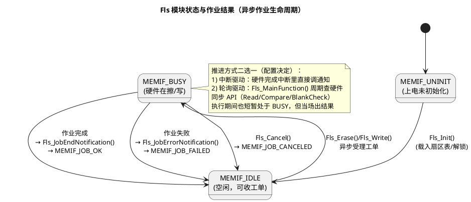

# 01-Fls驱动

> 一句话定位：把"Flash 先擦后写、擦=整扇区洗成全 1、写只能 1→0"这套物理规矩，装进 Fls 这个"递工单式"异步驱动的标准接口里，让上层拿到一把用不坏的仓库钥匙。
> 等级：L2 ｜ 前置：[MCAL第一课-从点灯到分层驱动](../../00-入门导读/01-MCAL第一课-从点灯到分层驱动.md)

## 原理

### 先立三条物理铁律

Flash 的存储单元像一块只能"越写越黑"的黑板：

1. **擦 = 整扇区置 1**：擦除以扇区（Sector）为原子单位，一次把整块擦干净（全 1，读出来 0xFF…）；
2. **写 = 只能把 1 改成 0**：编程以页（Page）为原子单位，只能把位从 1 拉到 0，想改回 1 只能整扇区重擦；
3. **先擦后写**：往"脏"扇区（有 0）里写新数据，要么校验失败要么写废——所以永远"擦→写→标记"成套出现。

层级直觉一句话：**Bank（整栋仓库）> Sector（擦除的房间）> Page（一次搬运的箱子）**。配置工具里填的扇区表，就是把这三个层级翻译成"地址+长度"的清单。

### Fls 的作业模型：递工单，不是亲自搬

Fls_Erase/Fls_Write 返回 E_OK 只表示**工单受理**，硬件在后台慢慢干；干完了 Fls 通过回调（Fls_JobEndNotification，经配置指向 Fee 的通知函数）上报，上层也可以用 Fls_GetJobResult 轮询。Fls_Read/Fls_Compare/Fls_BlankCheck 则是同步函数，当场返回。


记住三件套：**Fls_GetStatus 看忙不忙（IDLE/BUSY），Fls_GetJobResult 看上一张工单干得怎样（OK/FAILED/PENDING/CANCELED），通知回调是"干完了主动喊你"**。

### 双分区直觉：程序区与数据区

Fls 扇区表覆盖的 Flash 通常划成两段用途：**Program 分区**（P-Flash，放代码，刷写时才碰它）和 **EE 分区**（D-Flash/FlexNVM，日常给 Fee 存标定/配置数据）。TC377 的 PFlash 双 bank 还支持"边跑边换 bank 刷程序"；S32K 则用一次性 Program Partition 命令把 FlexNVM 切成"EEE 备份区 + 传统 D-Flash 区"——这笔账在 02 篇 Fee 里接着算。

## 双平台对照

| 对照维度 | TC377（AURIX TC3xx） | S32K1xx |
|---|---|---|
| 程序存储 | PFlash0/1 两个 bank（MB 级），支持 bank 交换刷写 | P-Flash（512KB 级），代码与常量 |
| 数据存储 | DFlash0/1（数百 KB），专给 Fee 用 | FlexNVM（256KB 级），可切分成 EEE 备份/D-Flash |
| 写入粒度 | PFlash 页编程 32B；DFlash 页 8B | phrase 编程 8B，必须按 phrase 对齐 |
| 擦除粒度 | 扇区 4KB/16KB（按 bank 位置不同） | 扇区统一 2KB（P-Flash 与 D-Flash 同） |
| 擦写管理单元 | DMU：擦/写命令经 DMU 寄存器提交执行 | FTFC：命令写入 + 等 CCIF 标志的经典流程 |
| 模拟 EEPROM | 纯软件 Fee（DFlash 上自建磨损均衡） | 硬件 EEE（FlexRAM+CSEc，芯片管磨损）或软件 Fee |
| 保护机制 | 写保护寄存器 + 安全寄存器组，写前先解锁 | FTFC 保护/加速机制，program verify 校验 |

一句话记：**TC377 是"两间独立仓库"（PFlash/DFlash 各有管家 DMU），S32K 是"一间可装修的仓库"（FTFC 统管，FlexNVM 交付前要先 Program Partition 装修一次）**。

## 配置要点

- **扇区表（FlsSectorList）**：每个逻辑扇区的起始地址、大小、所属 device；Fee 用哪几个扇区在这里就定了——Fls 配置里"动了就翻车"的核心表；
- **作业模式**：JobEndNotification/JobErrorNotification 填上层函数（通常 Fee_JobEndNotification/Fee_JobErrorNotification）；或选轮询模式，并保证 Fls_MainFunction 进周期任务表；
- **基地址与总量**：FlsBaseAddress + FlsTotalSize 要与链接脚本/内存映射一致，DFlash 的 CPU 数据映射地址别和操作地址段搞混；
- **驱动代码位置**：擦写 P-Flash 时驱动自身不能在被擦的 bank 里跑——把擦写 API 配到 RAM 段执行（或用双 bank 规避）；
- **超时参数**：擦写最坏等待周期数（如 FlsMaxWriteNormalModeCycles）喂给超时监控，别拿默认值一把梭。
## 代码示例

```c
/* 上层视角：一次"擦+写"的异步序列（轮询风格伪代码） */
Fls_Init(&Fls_ConfigSet_0);                        /* 上电一次 */

#define EE_SECTOR_ADDR   FLS_DF_SECTOR0_START      /* 数据 Flash 某扇区 */
#define EE_SECTOR_SIZE   FLS_DF_SECTOR0_SIZE

typedef enum { ST_IDLE, ST_ERASING, ST_WRITING, ST_DONE, ST_FAULT } JobState_t;
static JobState_t st = ST_IDLE;

void EeJob_Start(const uint8 *buf, Fls_LengthType len)
{
    if ((Fls_GetStatus() != MEMIF_IDLE) ||          /* 忙则拒收——Fls 不排队 */
        ((len % FLS_PAGE_SIZE) != 0U)) {            /* 页对齐铁律 */
        st = ST_FAULT;  return;
    }
    /* 1) 先擦：整扇区、异步递交 */
    if (Fls_Erase(EE_SECTOR_ADDR, EE_SECTOR_SIZE) != E_OK) { st = ST_FAULT; return; }
    st = ST_ERASING;
}

void EeJob_Cyclic(void)                             /* 挂周期任务表 */
{
    switch (st) {
    case ST_ERASING:
        if (Fls_GetJobResult() == MEMIF_JOB_OK) {
            /* 2) 后写：对刚擦净（全 1）的扇区编程 1→0 */
            (void)Fls_Write(EE_SECTOR_ADDR, gBuf, gLen);
            st = ST_WRITING;
        } else if (Fls_GetJobResult() != MEMIF_JOB_PENDING) {
            st = ST_FAULT;                          /* FAILED/CANCELED */
        }
        break;
    case ST_WRITING:
        if (Fls_GetJobResult() == MEMIF_JOB_OK) {
            /* 3) 校验：同步 Compare 当场出结果 */
            st = (Fls_Compare(EE_SECTOR_ADDR, gBuf, gLen) == E_OK)
                ? ST_DONE : ST_FAULT;
        }
        break;
    default: break;                                 /* IDLE/DONE/FAULT 不动 */
    }
}

/* 中断模式则没有上面的轮询：硬件完成中断里 Fls 直接调
   Fls_JobEndNotification()（配置指向 Fee_JobEndNotification），逐层上报 */
```
## 易错点与陷阱

1. **现象**：Fls_Write 返回 E_OK，读回来还是旧数据/0xFF。**原因**：没先擦，或"擦后写过又改"——写只能 1→0，对脏区写入无效。**对策**：写前 Fls_Erase（或 Fls_BlankCheck 确认干净）。
2. **现象**：作业永远停在 MEMIF_JOB_PENDING。**原因**：轮询模式忘了把 Fls_MainFunction 挂进调度表，或中断模式回调/中断没使能。**对策**：先确认推进机制（中断 or 轮询）真的在跑。
3. **现象**：写长度非页大小整数倍时报参数错。**原因**：硬件按页/phrase 编程，尾巴没法"写半页"。**对策**：上层缓冲补齐到页边界，长度按页对齐传。
4. **现象**：擦写程序区偶发程序跑飞/复位。**原因**：驱动代码在被擦写的 P-Flash bank 里执行，把自己脚下的地板拆了。**对策**：擦写 API 全部放 RAM 执行，或用双 bank 交换。
5. **现象**：连续两次作业，第二次返回 E_NOT_OK。**原因**：BUSY 状态又递交新工单，Fls 不排队。**对策**：上层自己的小状态机等回到 IDLE 再发下一张。
6. **现象**：双平台移植后扇区地址全错。**原因**：扇区表按另一颗芯片的映射抄的（如把 DFlash 地址当 PFlash）。**对策**：以各自芯片手册存储映射章节为准重新生成配置。

## 面试高频题

1. **为什么 Flash 必须先擦后写？擦和写的单位分别是什么？**
   答：写只能 1→0，改 0 回 1 只能整扇区重擦；擦以扇区为单位（TC377 4/16KB、S32K 2KB），写以页/phrase 为单位（TC377 32B/8B、S32K 8B）。
2. **Fls_Erase 返回 E_OK 时擦完了吗？怎么知道真完成？**
   答：没有，只表示工单受理；完成靠 Fls_JobEndNotification 回调或 Fls_GetJobResult 轮询，状态由 MEMIF_BUSY 回 IDLE。
3. **Fls 哪些 API 同步、哪些异步？为什么这么设计？**
   答：Read/Compare/BlankCheck 同步（读操作快，当场出结果）；Erase/Write 异步（毫秒级硬件操作不能阻塞调用者，且要与上层 NvM 的异步作业链接力）。
4. **TC377 与 S32K 在"给 Fee 供数据 Flash"上最大的差异？**
   答：TC377 全靠软件 Fee 在 DFlash 上自建磨损均衡；S32K1xx 可用硬件 EEE（FlexRAM+FlexNVM 备份，芯片管磨损），也可把 FlexNVM 当传统 D-Flash 跑软件 Fee。

## 延伸

- [02-Fee模拟EEPROM](02-Fee模拟EEPROM.md)：本篇的"擦后写"如何被 Fee 包装成"看起来随写随改"的 EEPROM；
- [03-与NvM链路](03-与NvM链路.md)：Fls 工单完成的通知如何一层层爬回 NvM；
- [PFlash与DFlash](../../../02-芯片与体系结构/2-L2进阶/TC377平台/存储器映射/01-PFlash与DFlash.md)：TC377 两类 Flash 的地址与组织细节；
- [FTFC机制](../../../02-芯片与体系结构/1-L1基础/S32K平台/存储器与Flash/01-FTFC机制.md)：S32K 擦写命令与 CCIF 流程的平台细节；
- [MCAL第一课-从点灯到分层驱动](../../00-入门导读/01-MCAL第一课-从点灯到分层驱动.md)：Fls 在 MCAL 13 模块里的位置速览。