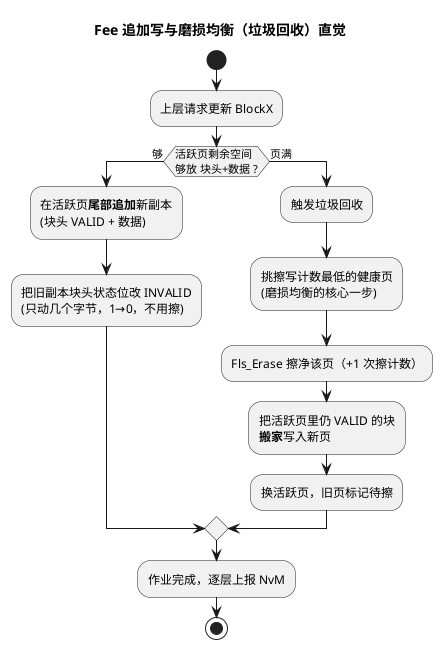

# 02-Fee模拟EEPROM

> 一句话定位：在"只能整扇区擦、写只能 1→0"的 Flash 上，用"追加写 + 页状态机 + 磨损均衡"造出一块看起来随写随改、掉电不丢、还活得够久的假 EEPROM。
> 等级：L2 ｜ 前置：[01-Fls驱动](01-Fls驱动.md)

## 原理

### 为什么不能拿 Flash 直接当 EEPROM 用

三个坑，个个致命：

1. **粒度不匹配**：想改 8 字节，Flash 要整扇区 4KB 重擦重写，一次小改动的代价是把整间仓库搬空再搬回；
2. **寿命有限**：数据 Flash 每个扇区擦写上限典型 10 万次量级（以手册为准），若每 100ms 全量存一次，一天就报废；
3. **掉电一致性**：写到一半断电，旧数据已擦、新数据没写全——车规场景不可接受。

Fee 的三个对策正好一一对应：**追加写（不覆盖旧值）→ 摊薄擦除次数；磨损均衡 → 擦写次数均摊到所有页；页状态机 + 块头状态位 → 掉电后按状态恢复出一致视图**。

### 虚拟页与 Fee Block：地址是查出来的，不是固定的

- **Fee Block**：上层 NvM 看到的"一个可读写数据单元"，由 FeeBlockNumber + 块长度 + 属性描述，例如"3 号块、64 字节、立即写"存车窗标定；
- **物理组织**：Fee 把 Fls 给的 D-Flash 扇区组织成若干**虚拟页**（典型 2 个 bank 交替当"活跃页/备用页"），每页开头有页头（页号、状态、擦写计数）；
- **块头（Block Header）**：每个块副本自带小头部——块号、长度、状态（VALID/INVALID）——写在数据前面；
- **关键直觉**：**FeeBlockNumber → 物理地址的映射是动态的**。同一块每次更新都写到新地址，靠"从后往前扫描、取最新 VALID 副本"找到它；想固定地址存数据，在 Fee 的世界里反而是错误思路。

### 磨损均衡一图：一次更新的完整旅程



一句话记磨损均衡：**谁擦得少就让谁多干点活**——新页永远从"擦写计数最低"的候选里挑，长期看所有页一起变老，而不是一页先死拖垮整片。

### 页状态机：掉电后怎么站起来

每个虚拟页在页头里记着自己的状态：**EMPTY（擦净待用）→ ACTIVE（当前追加写）→ FULL（写满待回收）→ ERASE（等待擦）**。掉电重启后 Fee 扫描页头即可恢复：ACTIVE 页里"新副本 VALID + 旧副本也 VALID"的，按追加顺序取最新；写到一半的数据副本没有 VALID 尾巴，直接当垃圾。页状态机本质就是 01 区状态机思想在存储管理上的落地。
### Block 擦写计数与寿命估算

设计期必算的一笔账（数字示意，具体上限查手册）：

- 设虚拟页 4KB、块长 128B（含块头）→ 一页约可攒 **32 次块更新**才擦 1 次；
- 设扇区擦写上限 10 万次、共 8 页 → 全寿命总块更新数 ≈ 100000 × 8 × 32 ≈ **2.56 亿次**；
- 若每秒写 1 次 ≈ 8 年；每秒写 10 次就只剩 0.8 年——**写频率每升一个量级，寿命缩十倍**。

结论三条：① 追加写把"块更新次数"放大成"扇区擦次数"的比例由页容量/块长决定；② 寿命估算要在设计评审给出并留 10 倍裕量；③ "多久真正落一次 Flash"由 NvM 写策略决定——这就是 03 篇的主场。

## 双平台对照

| 对照维度 | TC377（软件 Fee） | S32K1xx |
|---|---|---|
| Fee 实现形态 | AUTOSAR Fee 跑在 DFlash 上，纯软件 | 二选一：硬件 EEE（FlexRAM）或软件 Fee（传统 D-Flash 分区） |
| 磨损均衡 | Fee 软件算法（虚拟页 + 擦写计数选页） | EEE：CSEc 硬件管；软件 Fee：同左 |
| 掉电一致性 | 页状态机 + 块头状态位 | EEE：record 机制硬件保证；软件 Fee：同左 |
| 块寻址 | 块头扫描，动态映射 | EEE：FlexRAM 直接寻址；软件 Fee：动态映射 |
| 寿命口径 | DFlash 扇区擦写数万~十几万次 | EEE 备份区按 record 计，手册单列指标 |
| AUTOSAR 接口 | Fee 标准接口上接 MemIf/NvM | 同左（EEE 也封装成 Fee/Eep 形态供 NvM 用） |

一句话记：**TC377 的 Fee 是"自己搭帐篷"（软件全包），S32K 的 EEE 是"拎包入住"（硬件管磨损与掉电），但 NvM 往下看都长一个样**——这正是分层的好处。

## 配置要点

- **块表对齐**：FeeBlockSize/FeeBlockNumber 必须与 NvM Block 长度逐块一致（NvM 侧 CRC 长度另算）——最常见翻车点；
- **虚拟页与 bank 数**：页大小与页数决定垃圾回收粒度和磨损均衡效果；典型 2 bank 互为活跃/备用；
- **FeeImmediateData**：立即写块跳过 NvM 缓冲直接落 Flash，只给真正要掉电前抢存的关键块开；
- **DeviceIndex/FeeIndex**：多 Flash 设备时 MemIf 靠它路由，别配错指向另一个 Fls；
- **管理开销**：页头、块头、擦写计数字段都占 Flash，算容量时别按净数据量满打满算。

## 代码示例

```c
/* Fee 内部（大幅简化）：一次块更新的追加写旅程 */
Std_ReturnType Fee_Write(uint16 BlockId, const uint8 *DataPtr)
{
    /* 1) 活跃页还放得下"块头+数据"吗？ */
    if (ActivePageFree() < (FEE_HDR_SIZE + FeeBlockSize(BlockId))) {
        Fee_StartGarbageCollection();      /* 页满：搬家+换页（见磨损均衡图） */
        return MEMIF_JOB_PENDING;          /* 本单先压着，回收完再写 */
    }
    /* 2) 追加写新副本：块头(块号|VALID) + 数据 —— 顺序不能反 */
    Fls_Write(ActivePageTail(),
              PackHdr(BlockId, FEE_VALID), DataPtr, FeeBlockSize(BlockId));
    /* 3) 失效旧副本：只把旧块头状态位 1→0，几字节搞定，不用擦 */
    Fls_Write(OldCopyHdrAddr(), PackHdr(BlockId, FEE_INVALID), FEE_HDR_SIZE);
    return MEMIF_JOB_PENDING;              /* 真完成由 Fls 回调逐层上报 */
}

/* 读：从最新往回找第一个 VALID 副本 */
Std_ReturnType Fee_Read(uint16 BlockId, uint8 *BufferPtr)
{
    Fls_AddressType a;
    for (a = ActivePageTailPrev(); a >= ActivePageStart(); a -= FEE_STEP) {
        if ((HdrBlock(a) == BlockId) && (HdrState(a) == FEE_VALID)) {
            Fls_Read(DataOf(a), BufferPtr, FeeBlockSize(BlockId));
            return E_OK;
        }
    }
    return E_NOT_OK;                       /* 全页扫完没有：该块从未写过 */
}
```
## 易错点与陷阱

1. **现象**：改了 Fee 块长度后读写全乱/校验失败。**原因**：NvM 与 Fee 的块表没逐块对齐，同一块两边长度不一致。**对策**：以 NvM 配置为源头，生成 Fee 块表后逐项核对。
2. **现象**：量产车跑一年后 D-Flash 报坏块。**原因**：某块写频率极高，追加写摊薄后仍把个别页擦穿。**对策**：设计期按"写频率 × 页容量/块长"估寿命并留 10 倍裕量；运行期监控擦写计数。
3. **现象**：掉电重启后个别块回到旧值。**原因**：新副本未写完就断电，或"失效旧副本"先于"写新副本"执行。**对策**：坚持"先写新、后失效旧"的顺序；评审页状态机的每个掉电窗口。
4. **现象**：NvM 写作业周期性超时。**原因**：垃圾回收=整页搬家，耗时远超单块写，超时预算按单块写设的。**对策**：超时按最坏情况（回收+写）设定，或把回收拆成多步在多个周期内完成。
5. **现象**：S32K 上数据"丢了"——EEE 里读不到软件 Fee 写的块。**原因**：EEE 与传统 D-Flash 是两套存储视图，混用两条路各写各的。**对策**：FlexNVM 分区方案项目期定死，一份数据只走一条链路。
6. **现象**：冷启动偶发变慢。**原因**：Fee 初始化要扫描全部页重建映射，页越多越慢。**对策**：控制虚拟页数量；评估是否可缓存映射加速（以掉电一致性为前提）。

## 面试高频题

1. **Flash 不能原地改写，Fee 是怎么让上层"随写随改"的？**
   答：追加写新副本+失效旧副本+页满垃圾回收；块号到物理地址是动态映射，读时取最新 VALID 副本。
2. **磨损均衡为什么必须做？怎么做？**
   答：Flash 寿命按扇区擦写次数计，热点块会把个别扇区擦穿；Fee 换页时选擦写计数最低的健康页，把磨损摊平。
3. **掉电一致性靠什么保证？**
   答：页状态机（EMPTY/ACTIVE/FULL/ERASE）+ 块头状态位 + "先写新后失效旧"的顺序；重启扫描即恢复一致视图。
4. **S32K 的 EEE 和软件 Fee 怎么选？**
   答：EEE 拎包入住（硬件磨损/掉电一致，容量受 FlexRAM 限制）；软件 Fee 灵活可扩（容量随 D-Flash 分区，寿命与策略自己管）；NvM 往下接口一致，选型看容量、指标责任与平台惯例。

## 延伸

- [01-Fls驱动](01-Fls驱动.md)：本篇追加写所依赖的"先擦后写、写 1→0"物理底座；
- [03-与NvM链路](03-与NvM链路.md)：Fee 的作业如何被 NvM 的三种写策略调度；
- [EEE模拟EEPROM](../../../02-芯片与体系结构/1-L1基础/S32K平台/存储器与Flash/02-EEE模拟EEPROM.md)：S32K 硬件 EEE 的 record 与备份区机制；
- [DMU与扇区](../../../02-芯片与体系结构/2-L2进阶/TC377平台/存储器映射/03-DMU与扇区.md)：TC377 D-Flash 扇区组织与擦写命令细节；
- [状态机](../../../01-编程语言/2-L2进阶/数据结构与算法-C实现/04-状态机.md)：页状态机背后通用的状态机设计方法。