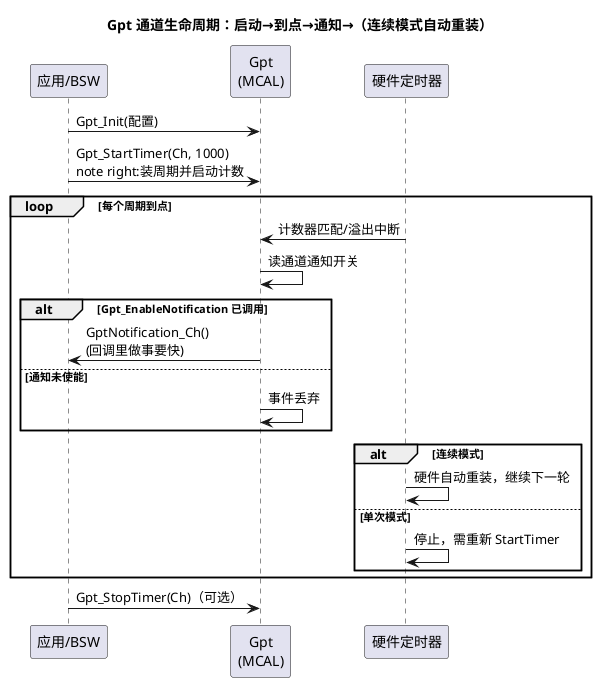

# 01-Gpt定时器

> 一句话定位：Gpt 是 AUTOSAR 给"周期性到点叫我一声"这件事定的标准门面——底层不管用哪个硬件定时器，上层只管 StartTimer/EnableNotification，1ms 任务节拍、超时计数都从这来。
> 等级：L2 ｜ 前置：[Mcu/01-时钟初始化](../Mcu模块/01-时钟初始化.md)

## 原理

### Gpt 是什么、不是什么

Gpt（General Purpose Timer，通用定时器抽象）= **纯时间相关的定时器服务**：到点触发通知（Notification），可选单次（one-shot）或连续（continuous）。它刻意不做另外两件事：

- 不输出波形 → 那是 [Pwm](../Pwm/01-PWM原理.md) 的活；
- 不测量输入信号 → 那是 [02-Icu输入捕获](02-Icu输入捕获.md) 的活。

三个模块在标准上分开，是因为它们的上层用户不同：Gpt 喂 Os/EcuM/BswM 当节拍，Pwm 面向执行器输出，Icu 面向传感器输入。分清"我要的是节拍、是波形、还是测量"，是选模块的第一判断。

### 通道模型：tick 频率 + 计数值 = 周期

每个 Gpt 通道的核心参数是 **tick 频率**（每秒计数多少下）和 **周期 tick 数**。`Gpt_StartTimer(Channel, Period)` 里的 Period 就是 tick 数：

```text
实际周期时间 = Period(tick) ÷ GptChannelTickFrequency(Hz)
例：tick=1MHz，Period=1000 → 1ms 周期
```

tick 频率来自 Mcu 的时钟参考点经预分频（见 [Mcu/01-时钟初始化](../Mcu模块/01-时钟初始化.md)）。**周期上限 GptChannelTickPeriodMax** 由计数器位数（8/16/32bit）决定——同一个周期，tick 频率越高分辨率越好、但可表达的最大周期越小，这是一对天生矛盾。

### 一次周期通知的时序



### 典型用途

- **1ms/5ms 任务节拍**：通知里置事件标志或激活 Os 计数器，任务在调度器里跑（别在回调里干重活）；
- **超时计数**：如 LIN/CAN 应答超时、传感器有效性计时；
- **去抖/延时**：按键去抖、上电延时等待（one-shot 模式顺手）。

## 双平台硬件单元对照

| 通用概念 | TC377（AURIX TC3xx） | S32K |
|---|---|---|
| 通用定时器资源 | GTM 的 TOM/ATOM 通道（MCAL Gpt 映射到 GTM），另 STM 常作系统 tick | eMIOS 统一通道（MCB/OPWMB 等）、FTM、LPTMR（低功耗） |
| 时钟来源 | GTM CMU 输出的固定频率时钟簇（见 [01-GTM架构概览](../../../02-芯片与体系结构/2-L2进阶/TC377平台/GTM/01-GTM架构概览.md)） | PCC 选源（SPLL/FIRC 分频） |
| 低功耗域 | GTM 在特定睡眠模式下可保持运行 | LPTMR 可在低功耗模式跑 |
| 中断路径 | GTM 中断经 SRC 节点进 CPU（见 [01-SRC模块](../../../02-芯片与体系结构/2-L2进阶/TC377平台/中断系统/01-SRC模块.md)） | eMIOS/FTM 中断走 NVIC |
| 资源冲突 | 与 Pwm/Icu 共享 GTM 通道，配置工具做互斥检查 | eMIOS 通道同理，Pwm/Gpt/Icu 分通道分配 |

## MCAL 配置要点

| 配置项 | 含义 | 典型值 | 易错点 |
|---|---|---|---|
| GptChannelTickFrequency | 通道 tick 频率 | 1MHz（1µs 分辨率） | 频率太高导致最大周期不够用；太低则周期不准 |
| GptChannelTickPeriodMax | 该通道可设最大周期 | 65535（16bit） | 大周期需求没核对位数，StartTimer 参数被截断 |
| GptChannelClkSrc | tick 时钟源选择（预分频/直接） | 与 tick 频率配套 | 源与频率不匹配，实际周期偏 N 倍 |
| GptChannelMode | 连续/单次 | 1ms 节拍=连续；延时=单次 | 单次模式忘了"只响一次"，逻辑漏触发 |
| GptNotification | 到点回调函数 | 置标志/发事件 | 回调里跑长任务，阻塞所有低优先级中断 |
| Gpt_EnableNotification（API） | 打开通道通知 | StartTimer 之后调用 | **先 Enable 后 Start 顺序问题见易错点 1** |
| Gpt_StartTimer / StopTimer（API） | 装周期并启动/停止 | — | 重复 Start 行为以 SWS 为准，别依赖 |
| Gpt_GetTimeElapsed（API） | 查已过时间 | 运行时测量 | 返回 tick 数不是 µs，要自己换算 |

## 代码示例

```c
/* 典型用法：1ms 系统节拍（连续模式 + 通知），任务放调度器不在回调里做 */
volatile uint8 Flag_1ms = 0;

/* 配置工具生成回调入口（GptNotification 指向的函数） */
void GptNotification_Tick1ms(void)
{
    Flag_1ms = 1;              /* 只做标记，重活交给主循环 */
}

void App_TimerStart(void)
{
    Gpt_Init(&Gpt_Config);                      /* 实际多在 EcuM 阶段统一 Init */
    Gpt_StartTimer(GptConf_GptChannel_Tick1ms,  /* 通道 */
                   1000u);                      /* 周期：tick 频率 1MHz → 1ms */
    Gpt_EnableNotification(GptConf_GptChannel_Tick1ms);  /* 开通知，缺它永远静默 */
}

int main(void)   /* 主循环消费节拍 */
{
    App_TimerStart();
    for (;;)
    {
        if (Flag_1ms != 0)
        {
            Flag_1ms = 0;
            Task_1ms();        /* 1ms 任务体 */
        }
        /* ... 其他任务 */
    }
}
```

## 易错点与陷阱

1. **通知永远不来**——现象：`Gpt_EnableNotification` 配了回调却一次不进。原因：忘了 `Gpt_StartTimer`——通知使能只是"开门"，定时器没启动就没有到点事件（或通道从未进入运行态）。对策：成对检查 Start+Enable；反过来只 Start 不 Enable 同样静默。
2. **周期差一倍/不整数倍**——现象：示波器量任务节拍是 2ms 而不是 1ms。原因：tick 频率理解错（以为填 µs 其实填 tick 数；或时钟源选错档）。对策：用 `实际周期 = Period ÷ TickFrequency` 现场换算验证。
3. **想要长周期溢出**——现象：StartTimer 参数大就异常。原因：超出 GptChannelTickPeriodMax（计数器位数限制）。对策：降 tick 频率或软件分频（通知里计数 N 次=1 次）。
4. **one-shot 只触发一次就没了**——现象：延时功能偶尔失灵。原因：单次模式到期即停，下次用要重新 StartTimer。对策：单次通道封装"先 Start 再等通知"的使用函数，不假设它自动重来。
5. **回调里干重活**——现象：系统偶发抖动、低优先级中断丢失。原因：Gpt 通知在中断上下文执行，里面做了长循环/阻塞调用。对策：回调只置标志/发 Os 事件，任务体回调度层。
6. **通道资源撞车**——现象：Gpt 加通道后 Pwm 不出波形。原因：双平台底层同源（GTM/eMIOS 通道），Gpt 占掉了 Pwm 的硬件通道。对策：资源规划表统一分配，配置工具的资源检查别忽略告警。

## 面试高频题

1. **Gpt/Pwm/Icu 三个定时器模块怎么分工？**
   答：Gpt 出"时间服务"（节拍/超时），Pwm 出波形，Icu 测输入；底层可能是同一批硬件通道，标准接口按"用途"切开。
2. **Gpt 通知和 Os 的 Counter/Alarm 什么关系？**
   答：常见实现里 Os Alarm 挂在 Counter 上，Counter 由 Gpt/STM 周期中断驱动；Gpt 是"时间源"，Os 是"基于时间的调度"。
3. **tick 频率怎么选？**
   答：分辨率（最小可表达时间）与最大周期（位数限制）之间的折中；给出需求周期范围后反推。
4. **为什么 EnableNotification 和 StartTimer 是两个 API？**
   答：支持"先跑起来再开通知"（如同步启动多通道后再统一开门）与"暂停通知但保持计数"等用法；也解释了为什么只 Enable 不 Start 是静默失败。

## 延伸

- [02-Icu输入捕获](02-Icu输入捕获.md)——输入侧的另一半；
- [01-GTM架构概览](../../../02-芯片与体系结构/2-L2进阶/TC377平台/GTM/01-GTM架构概览.md)、[01-SRC模块](../../../02-芯片与体系结构/2-L2进阶/TC377平台/中断系统/01-SRC模块.md)——TC377 底层定时器与中断路径；
- [01-SCG与PCC](../../../02-芯片与体系结构/1-L1基础/S32K平台/时钟系统/01-SCG与PCC.md)、[01-外设速查表](../../../02-芯片与体系结构/1-L1基础/S32K平台/外设资源清单/01-外设速查表.md)——S32K 定时器资源与时钟选源；
- 关联模块：[Pwm/01-PWM原理](../Pwm/01-PWM原理.md)、[Wdg](../Wdg/README.md)——同为"定时"家族。
