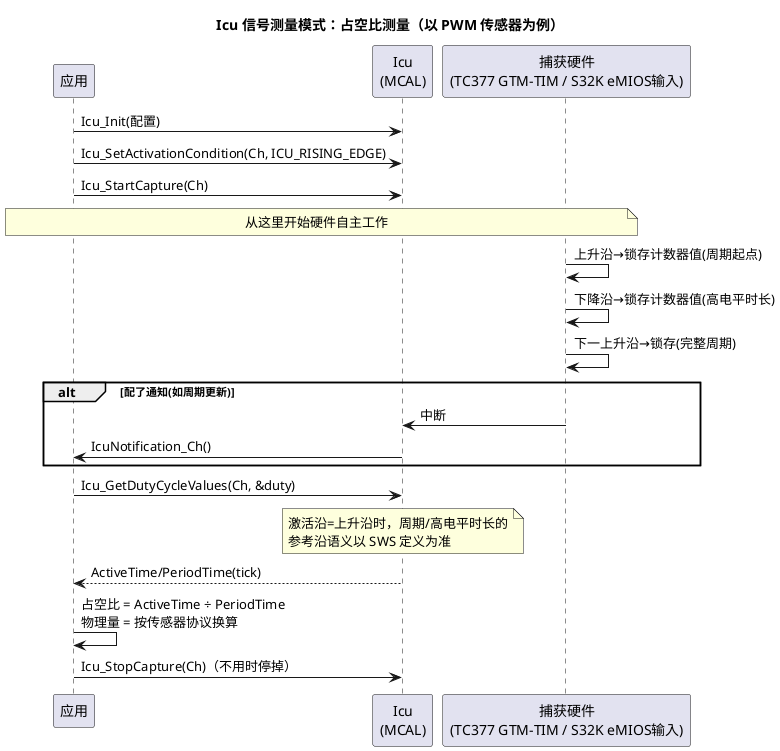

# 02-Icu输入捕获

> 一句话定位：Icu 是"秒表+计数器"的标准门面——硬件替你记下输入信号每个跳变的时刻/个数，软件只管取结果，转速、频率、按键长按从此不用中断里掐时间。
> 等级：L2 ｜ 前置：[01-Gpt定时器](01-Gpt定时器.md)

## 原理

### Icu 的三种模式

Icu（Input Capture Unit，输入捕获单元）按用途分三种模式，配置时先选对模式，其余参数才有意义：

| 模式 | 干什么 | 结果怎么取 | 典型用途 |
|---|---|---|---|
| 边沿检测（ICU_MODE_EDGE_DETECT） | 指定沿一到就通知 | 回调通知 | 按键按下/长按检测、外部事件唤醒 |
| 信号边缘计数（ICU_MODE_SIGNAL_EDGE_COUNTER） | 数指定沿的个数 | Icu_GetEdgeNumbers | 霍尔轮速计数、流量脉冲 |
| 信号测量（ICU_MODE_SIGNAL_MEASUREMENT） | 硬件量周期/高电平时间 | Icu_GetDutyCycleValues / Icu_GetTimeElapsed | PWM 传感器解码（占空比=物理量）、频率测量 |

关键认知：**测量模式下，"两个跳变之间的时间"由硬件定时器锁存**，软件不参与掐表——这就是输入捕获比"外部中断+读时钟"高级的地方：不丢沿、不抖、不吃 CPU。

### 激活条件：先说清楚等什么沿

Icu_SetActivationCondition 设定通道关心哪个沿：上升/下降/双沿。它决定了硬件何时锁存/计数/通知，**没设置（或设了 NONE）通道就永远不触发**。

### 一次信号测量的时序



### 典型用途

- **转速测量**：霍尔/磁电传感器脉冲→边沿计数（累计圈数）或信号测量（周期→转速），1ms 周期由 [01-Gpt定时器](01-Gpt定时器.md) 提供；
- **按键长按/短按**：边沿检测通知起表，Gpt 超时判长按；
- **PWM 输出型传感器解码**：占空比或频率承载物理量（位置/温度），信号测量模式直读。

## 双平台硬件单元对照

| 通用概念 | TC377（AURIX TC3xx） | S32K |
|---|---|---|
| 输入捕获硬件 | GTM 的 TIM（Timer Input Module）通道，细化为边沿检测/电平/脉冲宽度等多种子模式 | eMIOS 输入类模式（SAIC 单动作捕获、IPM 脉冲测量）；FTM 输入捕获；LPTMR 脉冲计数 |
| 时间基准 | GTM 内部计数器（CMU 时钟驱动），见 [02-TOM与ATOM](../../../02-芯片与体系结构/2-L2进阶/TC377平台/GTM/02-TOM与ATOM.md) 同族时钟体系 | eMIOS 全局总线计数器（Master Bus A/B/C/D） |
| 计数器位宽 | TIM 计数器宽度决定最长可测周期 | eMIOS 通道计数器位宽同理 |
| 中断路径 | GTM TIM 中断经 SRC 进 CPU | eMIOS/FTM 中断走 NVIC |
| 资源共享 | TIM 与 TOM/ATOM 同属 GTM，Icu 与 Pwm/Gpt 通道互斥 | eMIOS 通道一个当口只能选一种模式 |

## MCAL 配置要点

| 配置项 | 含义 | 典型值 | 易错点 |
|---|---|---|---|
| IcuChannelMode | 三种模式选一 | 按用途选 | 测周期选成边沿计数，结果全是无意义整数 |
| IcuDefaultStartEdge | 默认激活沿 | ICU_RISING_EDGE | 忘了设/设 NONE，通道永不触发 |
| IcuSignalMeasurementProperty | 量什么：周期/高电平/低电平/占空比 | DUTY_CYCLE | 参考沿理解错，ActiveTime 与 PeriodTime 对不上号 |
| IcuChannelClkSrc | 测量时间基准 | 高频（分辨率） | 频率低则短周期测不准；高则长周期溢出 |
| IcuNotification | 通知回调 | 新结果/新周期时进 | 高频信号通知风暴，宁可轮询 |
| Icu_SetActivationCondition（API） | 运行时设定激活沿 | 升/降/双沿 | 在未初始化/未停止时调用，行为未定义 |
| Icu_StartCapture / StopCapture（API） | 启停捕获 | 用时开不用关 | 只初始化不 Start，读到的永远是旧值 |
| Icu_GetDutyCycleValues（API） | 取高电平时长+周期 | tick 单位 | 结果是 tick 不是 µs，要除以基准频率 |
| Icu_GetEdgeNumbers（API） | 取边沿计数 | 计数模式 | 读取时机不定时，差值算法才稳定 |

## 代码示例

```c
/* 典型用法：PWM 传感器占空比解码（信号测量模式） */
Icu_DutyCycleType duty;   /* ActiveTime / PeriodTime (tick) */

void App_IcuStart(void)
{
    Icu_Init(&Icu_Config);
    /* 关心上升沿启动测量：周期从上升沿到下一上升沿 */
    Icu_SetActivationCondition(IcuConf_IcuChannel_Sensor1, ICU_RISING_EDGE);
    Icu_StartCapture(IcuConf_IcuChannel_Sensor1);
}

/* 周期性采样（如 10ms 任务里轮询，避开高频通知风暴） */
float App_ReadSensorDuty(void)
{
    uint32 period, active;
    Icu_GetDutyCycleValues(IcuConf_IcuChannel_Sensor1, &duty);
    period = (uint32)duty.PeriodTime;
    active = (uint32)duty.ActiveTime;

    if ((period == 0u) || (active > period))    /* 防除零与脏数据 */
    {
        return SENSOR_INVALID;                  /* 信号丢失/未起振，报无效 */
    }
    return (float)active / (float)period;       /* 0.0~1.0 占空比 */
}

/* 另一路：按键长按（边沿检测 + Gpt 超时） */
void IcuNotification_Key(void)
{
    KeyEdgeTimestamp = Gpt_GetTimeElapsed(GptConf_GptChannel_KeyTimer); /* 记沿时刻 */
}
```

## 易错点与陷阱

1. **通道永不触发**——现象：StartCapture 后读值恒 0/旧值。原因：激活沿没设（或 NONE）；或引脚没配成输入/复用没选对（Port 层问题）。对策：按 Port 复用→激活沿→StartCapture 顺序排查。
2. **测量结果偶尔跳大数**——现象：占空比偶发 200%。原因：高频信号+低时间基准，计数器溢出回绕，高/低电平时长跨了溢出点。对策：提高基准频率并核对最长周期，或驱动/硬件支持链式计数时启用。
3. **读值抖动/丢沿**——现象：转速显示抖。原因：软件轮询间隔内多个沿只留最后值，或通道没进测量模式而在裸中断计数。对策：用测量模式硬件锁存；轮询周期对齐信号周期；必要时开 averaging/滤波（以实现能力为准）。
4. **通知风暴**——现象：高频输入时 CPU 全耗在 Icu 回调。原因：EDGE_DETECT 模式对 kHz 级信号开通知。对策：改信号测量/边沿计数+低频轮询；通知仅用于低频事件。
5. **双沿理解偏差**——现象：高电平时间读出来像周期。原因：激活条件与"高/低电平时长的参考沿"定义没对齐（SWS 对 RISING/FALLING/BOTH 下的测量语义有精确定义）。对策：拿示波器对一次真值，确认 ActiveTime/PeriodTime 语义再写换算。
6. **与 Pwm 抢通道**——现象：加 Icu 通道后某 Pwm 失效。原因：TC377 上 TIM/TOM 同属 GTM、S32K 上 eMIOS 通道独占，Icu 占了别人通道。对策：全芯片定时器通道规划表统一分配。

## 面试高频题

1. **Icu 三种模式分别适用什么场景？**
   答：边沿检测=事件通知；边沿计数=脉冲累计；信号测量=周期/占空比，硬件掐表不占 CPU。
2. **用 Icu 测转速，轮询和通知怎么选？**
   答：通知适合低频事件；高频信号用测量模式+周期轮询，或边沿计数+固定时间窗差值，避免中断风暴。
3. **输入捕获比"外部中断里读定时器"好在哪？**
   答：跳变与时间戳由硬件同拍锁存，无软件延迟抖动；不丢沿；CPU 占用低；还能在睡眠模式下工作（视平台）。
4. **占空比测量为什么要设激活沿？**
   答：它定义周期与高电平时长的参考起点，设错则 ActiveTime/PeriodTime 语义全偏。

## 延伸

- [01-Gpt定时器](01-Gpt定时器.md)——本目录前置，节拍与超时；
- [01-GTM架构概览](../../../02-芯片与体系结构/2-L2进阶/TC377平台/GTM/01-GTM架构概览.md)、[03-与MCAL-Pwm的关系](../../../02-芯片与体系结构/2-L2进阶/TC377平台/GTM/03-与MCAL-Pwm的关系.md)——GTM 通道资源共享与互斥的底层原因；
- [01-外设速查表](../../../02-芯片与体系结构/1-L1基础/S32K平台/外设资源清单/01-外设速查表.md)——S32K 捕获类资源盘点；
- 关联模块：[Adc/01-原理与转换链路](../Adc/01-原理与转换链路.md)——传感器输入的"模拟另一半"。
