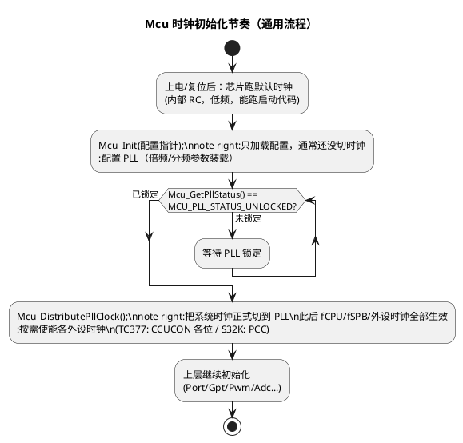

# 01-时钟初始化

> 一句话定位：Mcu 模块的第一职责——把芯片从"上电默认的低频内部时钟"拉到"工程目标频率"，并在 PLL 锁定后把高频时钟分发出去；后面每个外设 MCAL（Gpt/Pwm/Adc/Can…）能不能干活，都取决于这一步有没有做对。
> 等级：L2 ｜ 前置：[MCAL第一课](../../00-入门导读/01-MCAL第一课-从点灯到分层驱动.md)

## 原理

### Mcu 在时钟这件事上管什么

Mcu 模块管三件事：时钟、RAM（见 [02-RAM初始化](02-RAM初始化.md)）、复位（见 [03-复位管理](03-复位管理.md)）。时钟部分拆开就是四步：

1. **选源**：从外部晶振 / 内部 RC 里选出基准（精度、起振时间、功耗的权衡）；
2. **倍频**：用 PLL 把基准抬到内核需要的频率（晶振不可能直接给出 200MHz）；
3. **分频分发**：按域切出内核/总线/外设时钟（fCPU 快、fSPB 慢，各取所需）；
4. **门控**：给每个外设一个时钟开关——不用的时候关省电，这也意味着**用之前必须先开**。

### 时钟初始化的标准节奏



**为什么必须等锁定再分发**：未锁定的 PLL 输出频率不确定，此时切换系统时钟，轻则 CAN 波特率、定时周期全错，重则总线访问超时直接异常。"先确认锁定、再切换"是这条流程的核心纪律。

**为什么时钟初始化必须排在所有外设 MCAL 之前**：外设初始化（如 `Adc_Init`）要写外设寄存器，而写寄存器的前提是该外设时钟已使能、且驱动按"参考点频率"算出的分频系数已生效。时钟没就绪就初始化外设，等于在没通电的房间里按开关。

### 参考点频率：上层模块的"公尺"

Mcu 配置里有一个 **McuClockReferencePointFrequency（时钟参考点频率）**：Gpt/Pwm/Icu/Adc 的 tick 频率都以它为基准换算。Mcu 频率一改，这个参考点变了，所有依赖它的外设参数都要联动重算——这是"改一处、查全链"的典型场景。

## 双平台硬件单元对照

| 通用概念 | TC377（AURIX TC3xx） | S32K |
|---|---|---|
| 时钟管理单元 | CCU（Central Clock Unit），见 [02-CCU与时钟树](../../../02-芯片与体系结构/2-L2进阶/TC377平台/时钟系统/01-CCU与时钟树.md) | SCG（System Clock Generator），见 [01-SCG与PCC](../../../02-芯片与体系结构/1-L1基础/S32K平台/时钟系统/01-SCG与PCC.md) |
| 主倍频器 | 系统锁相环：fOSC（典型 20MHz）→ fPLL（200MHz 级） | SPLL：SOSC（典型 8MHz）倍频到 80MHz 级；Kinetis 血统的 FLL 在 S32K1xx 内核时钟选择里已不用（SPLL/FIRC 为主） |
| 上电默认时钟 | 内部 RC 先跑；SSW（启动软件）阶段按引导头先把 PLL 配好再跳应用 | 复位后跑 FIRC；`SystemInit`（main 之前）按 `clock_config` 再升频 |
| 时钟域 | fCPU0/1/2（内核）、fSPB（外设总线）、fGTM 等 | CORE_CLK / BUS_CLK / SLOW_CLK / FLASH_CLK |
| 外设时钟门控 | CCUCON0..8 寄存器，每模块一位开关，见 [03-外设时钟门控](../../../02-芯片与体系结构/2-L2进阶/TC377平台/时钟系统/03-外设时钟门控.md) | PCC（Peripheral Clock Control）每外设一位，还兼选 LPTMR/FTM 类外设的时钟源 |
| 时钟失效兜底 | 后备时钟：检测到晶振/PLL 失效自动切换维持运行 | 时钟丢失/失锁检测可直接触发复位，原因记录在 RCM（见 [03-复位管理](03-复位管理.md)） |

## MCAL 配置要点

| 配置项 | 含义 | 典型值 | 易错点 |
|---|---|---|---|
| McuClockSettingConfig | 一套完整时钟树参数（源/PLL/各域分频），可配多套用于切换 | 一套目标频率 | 改了 PLL 频率却没同步各域分频，下游全部偏频 |
| McuPLLSettingConfig | PLL 倍频/分频参数 | 20MHz→200MHz 级 | 参数组合超出芯片合法范围，启动卡死在等锁定 |
| McuClockReferencePointFrequency | 时钟参考点，供 Gpt/Pwm/Adc 换算 tick | 与目标频率一致 | 改了频率没改参考点，外设周期整体偏差 |
| 外设时钟使能（厂商参数） | 各外设模块时钟开关（TC377 对应 CCUCON、S32K 对应 PCC） | 用到的外设全开 | **外设时钟没开=外设寄存器写不进**（见易错点 1） |
| Mcu_GetPllStatus（API） | 查询 PLL 锁定状态 | 必须返回 LOCKED 才分发 | 轮询没配超时，晶振不起振就死等 |
| Mcu_DistributePllClock（API） | 把系统时钟切换到 PLL | 锁定后调用一次 | 未锁定就调用，或重复调用（以 SWS 语义为准） |
| 通知机制 | Mcu 本身无通知回调 | — | 时钟失效靠硬件兜底/错误钩子，别指望 Mcu 给你回调 |

## 代码示例

```c
/* EcuM 启动一阶段里的时钟初始化骨架（通用写法，厂商实现细节以 SWS 文档为准） */
void EcuM_InitClock(void)
{
    /* 1. 加载时钟/RAM 复位相关配置 */
    Mcu_Init(&Mcu_Config);

    /* 2. 轮询等待 PLL 锁定（务必带超时，晶振焊接不良时不至于死等） */
    uint32 timeout = MCU_PLL_LOCK_TIMEOUT;
    while ((Mcu_GetPllStatus() != MCU_PLL_STATUS_LOCKED) && (timeout > 0u))
    {
        timeout--;
    }
    if (timeout == 0u)
    {
        /* PLL 迟迟不锁定：按项目策略报错误/走降级时钟，不能带病分发 */
        EcuM_ErrorHook(ECUM_E_CLOCK);
    }

    /* 3. 锁定后把系统时钟正式切到 PLL，fCPU/fSPB/外设时钟全部生效 */
    (void)Mcu_DistributePllClock();

    /* 4. 之后才能初始化 Port/Gpt/Adc 等外设 MCAL（外设时钟在各驱动 Init 内部或此处使能） */
}
```

## 易错点与陷阱

1. **写外设寄存器没反应/直接总线错误**——现象：`Pwm_Init`、`Adc_Init` 之后读寄存器全 0 或触发 Trap/HardFault。原因：该外设时钟没使能，寄存器根本没有供电时钟，写入被忽略或总线无应答。对策：初始化顺序上先使能外设时钟再碰寄存器；TC377 查 CCUCON 各位，S32K 查 PCC。
2. **未锁定就分发**——现象：切换后系统"跑飞"或通信全乱。原因：`Mcu_DistributePllClock` 在 PLL UNLOCKED 状态下调用。对策：严格按"锁定→分发"顺序，加状态检查。
3. **改 PLL 频率后下游全错**——现象：CAN 波特率、Gpt 周期、Adc 采样时间集体偏移。原因：时钟树是联动的，参考点频率、各域分频、外设分频没联动改。对策：把频率改动当成一次小型重新配置评审，从 PLL 到每个用 tick 的模块查一遍。
4. **以为 Mcu_Init 会自己等锁定**——现象：初始化流程里没查状态就分发。原因：把"装载配置"和"时钟生效"混为一谈。对策：显式调用状态查询+分发，写进启动 checklist。
5. **上电偶发起振慢**——现象：低温下偶发起不来。原因：晶振起振时间随温度变长，超时阈值太紧。对策：锁定超时按 DS 最坏情况留裕量，并对超时路径做可观测（记录、可诊断）。

## 面试高频题

1. **Mcu_DistributePllClock 为什么单独存在，不合并进 Mcu_Init？**
   答：分发=切换系统时钟源，是"不可逆且影响全局"的动作，单独给出让集成者能控制"等锁定、外设就绪"之后再切；Mcu_Init 只装载配置，语义上分层。
2. **为什么时钟初始化必须在所有外设 MCAL 之前？**
   答：外设访问寄存器需要时钟已使能；外设驱动内部按参考点频率换算参数，时钟未定时这些参数没有意义。
3. **PLL 一直不锁定怎么排查？**
   答：查晶振是否起振（示波器）、PLL 参数是否在合法 VCO 范围、外部供电/负载电容；软件侧确认超时与降级路径。
4. **外设时钟门控为什么要存在？**
   答：功耗。车规 ECU 有静态电流指标，不用模块关时钟；代价就是"用前必须开"，这是配置工具里外设时钟参数存在的原因。

## 延伸

- [02-CCU与时钟树](../../../02-芯片与体系结构/2-L2进阶/TC377平台/时钟系统/01-CCU与时钟树.md)、[02-PLL配置](../../../02-芯片与体系结构/2-L2进阶/TC377平台/时钟系统/02-PLL配置.md)、[03-外设时钟门控](../../../02-芯片与体系结构/2-L2进阶/TC377平台/时钟系统/03-外设时钟门控.md)——TC377 时钟深水区；
- [01-SCG与PCC](../../../02-芯片与体系结构/1-L1基础/S32K平台/时钟系统/01-SCG与PCC.md)——S32K 侧时钟与外设时钟控制；
- 本目录续篇：[02-RAM初始化](02-RAM初始化.md)、[03-复位管理](03-复位管理.md)；
- 下游应用：[Gpt定时器](../Gpt与Icu/01-Gpt定时器.md)——tick 频率怎么从参考点算出来。
