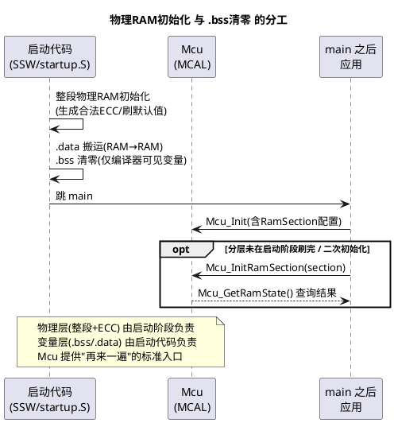

# 02-RAM初始化

> 一句话定位：车规 RAM 带 ECC，上电内容是随机的——不先把 ECC 位"铺"好，第一次读就会炸出双位错误；Mcu 的 RAM 初始化就是按段把物理 RAM 刷成确定初值，这是功能安全"确定性启动"的地基。
> 等级：L2 ｜ 前置：[01-时钟初始化](01-时钟初始化.md)

## 原理

### 为什么车规要专门初始化 RAM

普通单片机 RAM 上电是随机值，`.bss` 清零后就万事大吉。但车规 MCU（TC377 的 DSPR/PSPR、S32K3 的 RAM）普遍带 **ECC（错误校验码）**：数据位和校验位一起存储，读出时校验。问题在于——**上电时数据和 ECC 校验位都是随机的**，随机数据配随机校验码，第一次读就大概率被判定"双位错误（不可纠正）"，直接触发异常/复位。所以必须先"写一遍"（写入会同步生成合法 ECC），让数据与校验位配套。

除了 ECC，还有功能安全视角的第二个理由：**安全状态要求变量初值确定**。ISO 26262 语境下，未初始化内存读到随机值可能导致逻辑失控；把 RAM 刷成已知值（通常 0）是"确定初值"最直接的实现。

### Mcu_RamSection：把 RAM 分段刷

Mcu 把物理 RAM 划成若干 **RamSection（RAM 段）**（按 DSPR0/DSPR1/PSPR/栈区/保留区等切分），每段有基地址、长度、填充模式。好处：

- 可以**按需初始化**（先刷 CPU0 用的段，别的核用之前再刷）；
- 可以**按顺序初始化**（先刷栈所在段，保证后面的 C 代码能跑）；
- 安全手册要求的"启动时全 RAM 校验"可以和分段策略对齐。

### 与 .bss 清零的关系（最容易混）



一句话辨析：**.bss 清零针对"变量"（链接器知道的那部分），RAM 初始化针对"物理 RAM"（包括栈、保留区、链接器看不见的角落，以及 ECC 位）**。前者是 C 语言语义要求，后者是芯片与功能安全要求，两者是包含与互补关系，不是替代关系。

## 双平台硬件单元对照

| 通用概念 | TC377（AURIX TC3xx） | S32K |
|---|---|---|
| 带 ECC 的 RAM | DSPR（数据 RAM）、PSPR（程序 RAM），见 [02-DSRAM-PSPR-DSPR](../../../02-芯片与体系结构/2-L2进阶/TC377平台/存储器映射/02-DSRAM-PSPR-DSPR.md) | SRAM_U/SRAM_L（S32K3 带锁步与 ECC） |
| 谁先刷 RAM | **SSW（Startup Software）阶段**：BMI/引导头检查后、跳应用前，把 RAM 与 PLL 一起配好 | **启动钩子**：`SystemInit`/`startup` 在 main 之前按链接段清 .bss；整段 ECC 初始化由启动代码或安全库完成 |
| RAM 上电状态 | 随机值 + 随机 ECC 位，未刷即读→双位错误 Trap | 随机值；带 ECC 的部分同理（S32K3），S32K1 无 ECC 的普通 SRAM 无此约束 |
| 标准化入口 | Mcu 提供 RamSection 配置与 `Mcu_InitRamSection` | 同左（Mcu 抽象抹平差异） |
| 运行期校验 | ECC 单位错自动纠+可查状态，双位错进 Trap（见 [03-TC377-Trap分类](../../../02-芯片与体系结构/3-L3高级/异常与Trap/01-TC377-Trap分类与TIN.md)） | ECC/锁步相关错误走故障/复位路径 |

## MCAL 配置要点

| 配置项 | 含义 | 典型值 | 易错点 |
|---|---|---|---|
| McuRamSectionBaseAddress / Size | 段的物理范围 | 与链接脚本 RAM 区一致 | 与链接脚本对不上，刷漏或刷到保留区 |
| 填充模式/目标值 | 刷成什么值（常 0） | 0x00000000 | 以为刷 0 就等于 .bss 清零——不是一回事 |
| Mcu_InitRamSection（API） | 运行时（再）初始化某段 RAM | 初始化早期调用 | **刷的段里有活数据**：把已初始化变量/栈刷没，直接飞 |
| Mcu_GetRamState（API） | 查询 RAM 状态（OK/未初始化/错误） | 自检流程调用 | 返回值不看，自检形同虚设 |
| 初始化顺序 | 栈所在段最先 | — | 刷栈段时机不对，函数调用即崩 |
| 多核场景 | 每个核的 DSPR 分别刷 | CPU0/CPU1/CPU2 各自段 | 只刷了 CPU0 的段，别的核上电即 Trap |

## 代码示例

```c
/* 通用骨架：确认 RAM 已就绪，需要时对特定段做（再）初始化 */
void App_InitMemory(void)
{
    /* 1. 查询整体 RAM 状态（多数平台启动阶段已刷，这里做确认） */
    if (Mcu_GetRamState() != MCU_RAMSTATE_OK)
    {
        /* 未初始化/异常：按安全策略处理，不要硬着头皮往下跑 */
        Safety_Report(SEV_MEMORY_UNREADY);
    }

    /* 2. 场景：某片 RAM 归应用自己管（如共享缓冲区），需要确定性复位时再刷 */
    /*    注意：段里不能有还活着的数据——刷之前先保证没人再用 */
    Mcu_InitRamSection(McuConf_RamSection_SharedBuffer);

    if (Mcu_GetRamState() != MCU_RAMSTATE_OK)
    {
        Safety_Report(SEV_MEMORY_INIT_FAIL);
    }
}
```

## 易错点与陷阱

1. **上电即进 Trap/HardFault**——现象：还没进 main 就异常。原因：带 ECC 的 RAM 没初始化，启动代码先读了它（如清 .bss 顺序不当）。对策：确认启动阶段先整段刷 RAM 再碰变量；调试器下载后不复位直接跑也会遇到（下载只写数据位，ECC 位状态取决于工具，用"复位+从头跑"验证）。
2. **刷段把系统刷死**——现象：调用 `Mcu_InitRamSection` 后死机。原因：该段里正放着活跃数据（栈、已初始化全局变量）。对策：段划分时就区分"启动后可刷"与"不可刷"，运行时刷仅限专用缓冲。
3. **只初始化了 CPU0 的 RAM**——现象：多核工程 CPU1 起不来。原因：各核 DSPR 独立，刷了 CPU0 不等于刷了 CPU1。对策：每核段都在配置里，核各自启动路径确认。
4. **把 .bss 清零当 RAM 初始化**——现象：安全审核被打回。原因：.bss 只覆盖链接器可见变量，栈/保留区/ECC 位都没碰。对策：分层描述清楚（见上文时序图），文档写明两层各自责任。
5. **JTAG 下载后偶发异常**——现象：调试器加载程序直接运行 OK，冷启动偶发挂。原因：两种进入路径的 RAM/ECC 状态不同。对策：以 POR（上电复位）路径为准做验收，调试现象不作为依据。

## 面试高频题

1. **为什么车规 RAM 上电后不能直接用？**
   答：ECC 校验位与数据位都是随机的，不配套即读出双位错误；先写入一遍生成合法 ECC。
2. **.bss 清零和 Mcu RAM 初始化什么关系？**
   答：变量层 vs 物理层，启动代码做前者，物理初始化在启动早期（TC377 SSW/S32K 启动钩子），Mcu 提供标准化再初始化入口；互为补充。
3. **`Mcu_InitRamSection` 什么时候敢用？**
   答：目标段确认无人使用（专用缓冲/复位前收尾之后）；刷活数据等于自杀。
4. **怎么验证 RAM 初始化真的生效？**
   答：上电统计 ECC 错误/Trap 是否归零、`Mcu_GetRamState` 返回、冷启动压力测试。

## 延伸

- [01-TC377-BMI与引导头](../../../02-芯片与体系结构/2-L2进阶/启动流程/01-TC377-BMI与引导头.md)、[02-S32K复位流程](../../../02-芯片与体系结构/2-L2进阶/启动流程/02-S32K复位流程.md)——RAM 初始化发生的启动阶段全景；
- [03-链接脚本与分散加载](../../../02-芯片与体系结构/2-L2进阶/启动流程/03-链接脚本与分散加载.md)——段划分与 .bss/.data 的来源；
- [02-DSRAM-PSPR-DSPR](../../../02-芯片与体系结构/2-L2进阶/TC377平台/存储器映射/02-DSRAM-PSPR-DSPR.md)——TC377 存储器布局；
- 本目录他篇：[01-时钟初始化](01-时钟初始化.md)、[03-复位管理](03-复位管理.md)。
