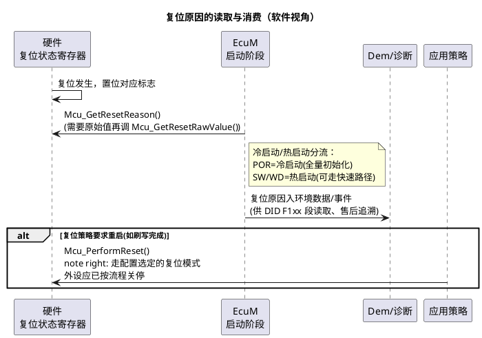

# 03-复位管理

> 一句话定位：复位不是"重新开机"一个词，而是十来种入口不同的硬件行为——读对上次复位的原因（软件复位还是看门狗咬的），EcuM/诊断/售后才知道该走哪条路；必要时再由软件主动触发一次受控复位。
> 等级：L2 ｜ 前置：[01-时钟初始化](01-时钟初始化.md)

## 原理

### 复位类型速查（通用概念）

| 通用类型 | 触发者 | 典型场景 | 复位后 RAM |
|---|---|---|---|
| 上电复位 POR | 电源监测 | KL30 上电、电压跌落 | 不保证 |
| 外部复位引脚 | ESR/PORST 引脚 | 板级复位按钮、电源管理芯片拉低 | 通常保留 |
| 看门狗复位 | WDT 超时 | 程序跑飞/喂狗逻辑死锁 | 通常保留 |
| 软件复位 | 代码主动请求（Mcu_PerformReset / 芯片复位寄存器） | 刷写后重启、故障恢复策略 | 通常保留 |
| 调试复位 | 调试器 | 下载、重启调试 | 取决于工具 |
| 应用/核级复位（部分芯片区分） | 仅复位应用域/单核 | 模块级故障恢复 | 保留范围更大 |

完整链路见 02 区 [04-复位启动初识](../../../02-芯片与体系结构/00-入门导读/04-复位启动初识-第一条指令从哪来.md)。

### 复位原因的生命周期



要点：**复位原因标志是"一次性情报"**——不少平台的标志位读后清除或需要显式清除，必须在启动早期由一个owner 读走保存（如 EcuM），后面谁想用都去问它，避免重复读取拿到已清的状态。

### 复位原因有什么用

- **EcuM**：区分冷/热启动，决定走完整初始化还是快速唤醒路径；
- **诊断/售后**：车厂常用厂商自定义 DID（多落在 0xF180~0xF1FF 段）读"上次复位原因+复位计数"，现场车"夜里自己重启了"就是靠它定位的（看门狗复位多≠偶发软件问题，就是跑飞实锤）；
- **安全机制**：看门狗/时钟失效复位次数超阈值，可触发降级模式（见 [Wdg](../Wdg/README.md)）。

### "复位后要不要重配时钟？"

判断依据只有一条：**这次复位有没有波及时钟域、启动软件有没有重跑**。

- 波及 CCU/SCG 的系统级复位：时钟回默认（PLL 关/默认源），必须重新走 [01-时钟初始化](01-时钟初始化.md) 的流程——好在正常工程里这就是启动路径的一部分；
- 仅内核/应用域复位：时钟域没动，理论上仍在跑目标频率，但要确认启动代码有没有"顺手"重配一遍（重配也无害，前提是外设跟着重新初始化）；
- **真正的坑在 bootloader→App 跳转**：App 入口若不再跑时钟初始化，而 bootloader 又改过时钟，App 里的外设参数全错。对策：跳转前把时钟恢复默认，或 App 里老老实实重新配。

## 双平台硬件单元对照

| 通用概念 | TC377（AURIX TC3xx） | S32K |
|---|---|---|
| 复位状态记录 | RSTSTAT 类寄存器：PORST/外部/看门狗/软件/调试复位分类记录 | RCM 模块 SRS 寄存器：POR/PIN/WDOG/CMD(软件)/JTAG/时钟丢失等 |
| 主动复位 | 软件复位寄存器（SWRSTCON），可区分应用复位/系统复位档位 | 软件复位（System Reset Request），RCM 记为 CMD 类 |
| 看门狗复位 | CPU WDT/安全 WDT，见 [Wdg](../Wdg/README.md) | WDOG（或带窗 WDOG），超时进 RCM 标志 |
| 复位分级 | 应用复位（范围小）vs 系统复位（波及时钟/外设域） | 核复位 vs 系统复位，调试复位单独一档 |
| 读清特性 | 标志位写 1 清除为主（W1C），读走后要记得保存 | RCM 标志同样注意读清/W1C 语义，启动早期一次读全 |

## MCAL 配置要点

| 配置项 | 含义 | 典型值 | 易错点 |
|---|---|---|---|
| McuResetSettingConfig | 复位相关配置（复位模式映射） | 软件复位走系统复位档 | 复位档位选错：想小范围复位却把时钟/外设全拍了 |
| Mcu_GetResetReason（API） | 取"翻译好"的复位原因（POR/SW/WD/外部/未定义） | EcuM 启动早期调用一次 | 多处重复调用，标志已被清/被前一次读走 |
| Mcu_GetResetRawValue（API） | 取原始寄存器值（多位可能同时置位） | 与上条配套用 | 只看翻译值丢失组合信息（如 POR+WD 同时有效） |
| Mcu_PerformReset（API） | 主动复位（按配置的复位模式） | 刷写后/恢复策略 | 复位前外设没按流程关停（通信没冲刷完），复位成"事故" |
| 通知机制 | Mcu 无复位通知回调；复位前钩子靠 EcuM 走 SHUTDOWN 流程 | — | 在任意上下文裸调 PerformReset，丢了关停动作 |

## 代码示例

```c
/* EcuM 启动阶段：一次性读走复位原因（后续都用这个变量） */
static uint16 App_ResetReason = MCU_RESET_UNDEFINED;

void EcuM_ReadResetReason(void)
{
    /* 标准值 + 原始值各取一份：原始值用于组合分析，标准值用于分支判断 */
    Mcu_ResetType reason    = Mcu_GetResetReason();
    uint32       rawValue   = Mcu_GetResetRawValue();

    App_ResetReason = (uint16)reason;
    Dem_SetResetEnvironment(reason, rawValue);   /* 供 DID F1xx 段诊断读取 */

    if (reason == MCU_POWER_ON_RESET)
    {
        /* 冷启动：全量初始化路径 */
        EcuM_SelectStartupPath(ECUM_STARTUP_COLD);
    }
    else if (reason == MCU_WATCHDOG_RESET)
    {
        /* 热启动+看门狗原因：记录事件，必要时进安全降级 */
        Dem_ReportEvent(DEM_EVENT_WDG_RESET);
        EcuM_SelectStartupPath(ECUM_STARTUP_WARM);
    }
    else
    {
        EcuM_SelectStartupPath(ECUM_STARTUP_WARM);
    }
}

/* 刷写完成/恢复策略：受控复位前先走关停流程 */
void App_RequestControlledReset(void)
{
    /* 这里应已完成通信冲刷、NvM 写回等关停动作（EcuM SHUTDOWN） */
    Mcu_PerformReset();   /* 不会返回 */
}
```

## 易错点与陷阱

1. **复位原因读出来总是"未定义"**——现象：所有复位后 `Mcu_GetResetReason` 都返回 UNDEFINED。原因：标志被启动早期某处代码（或上一次读取/清除动作）清掉了。对策：约定唯一 owner（EcuM）启动第一时间读走保存。
2. **软件复位后外设行为诡异**——现象：`Mcu_PerformReset` 后偶发通信错帧。原因：复位前外设没关停（CAN 还在发、NvM 没写完），复位瞬间留下半截状态，且对端没预期。对策：复位必须挂在 EcuM 关停流程之后，不能在中断里裸调。
3. **以为复位都保 RAM**——现象：热启动后变量偶发变值。原因：复位类型不同 RAM 保留策略不同，且启动代码可能重刷 RAM（见 [02-RAM初始化](02-RAM初始化.md)）。对策：跨复位要存的数据放 NoInit 段并确认该复位类型真的保留它。
4. **看门狗复位被当软件复位处理**——现象：车厂复盘"非预期重启"时定位错方向。原因：原因码翻译/保存链路有 bug，或 WD 复位走了普通热启动路径。对策：WD 复位单独分支：记录+计数+超阈值降级。
5. **复位档位不区分**——现象：只想复位应用域，结果时钟域也被拍了，"热启动"变"冷启动"。对策：配置里明确软件复位模式对应的档位（应用/系统级），评审时核对。

## 面试高频题

1. **Mcu_GetResetReason 和 Mcu_GetResetRawValue 的区别？**
   答：前者给标准化枚举（可读性、跨平台），后者给原始寄存器（保留组合信息、厂商细节）；实战两个都留档。
2. **复位原因在 EcuM 和诊断里分别怎么用？**
   答：EcuM 分流冷/热启动路径；诊断侧经 DID（F1xx 段自定义）读上次复位原因+计数，支撑售后追溯。
3. **软件复位前要做什么？**
   答：走 EcuM 关停：通信冲刷、NvM 落盘、外设安全停止，然后才 `Mcu_PerformReset`；直接调等于制造事故。
4. **哪些复位之后必须重配时钟？**
   答：波及时钟域（POR/系统级）；核级/应用级复位理论上不必，但 bootloader 跳 App 场景必须确认时钟状态。

## 延伸

- [04-复位启动初识](../../../02-芯片与体系结构/00-入门导读/04-复位启动初识-第一条指令从哪来.md)——复位类型与启动链路全景；
- [01-TC377-BMI与引导头](../../../02-芯片与体系结构/2-L2进阶/启动流程/01-TC377-BMI与引导头.md)、[02-S32K复位流程](../../../02-芯片与体系结构/2-L2进阶/启动流程/02-S32K复位流程.md)、[03-向量表与复位](../../../02-芯片与体系结构/1-L1基础/ARM-Cortex-M/03-向量表与复位.md)——双平台复位细节；
- 本目录他篇：[01-时钟初始化](01-时钟初始化.md)、[02-RAM初始化](02-RAM初始化.md)；
- 关联模块：[Wdg](../Wdg/README.md)——看门狗复位的生产者。
