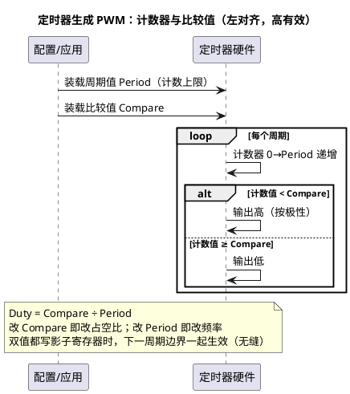

# 01-PWM原理

> 一句话定位：PWM 用"开关时间比"传递大小信息——周期、占空比、极性、对齐方式四个参数定义一路 PWM，MCAL Pwm 模块的所有配置项都是围着这四要素转的。
> 等级：L1→L2 ｜ 前置：[MCAL第一课](../../00-入门导读/01-MCAL第一课-从点灯到分层驱动.md)

## 原理

### PWM 是什么

PWM（Pulse Width Modulation，脉宽调制）= **固定周期里高电平占的比例可调**的方波。平均效果（灯的亮度、电机的力矩、风扇的转速）只看"导通时间占比"，也就是**占空比（Duty Cycle）**。数字引脚只有 0/1，PWM 靠时间维度凑出了"半开半关"。

### 四要素

| 要素 | 含义 | 一句话直觉 |
|---|---|---|
| 周期 Period | 一个开关循环的时长（频率=1/周期） | 慢周期人眼能看到闪烁，快周期一切才"平均" |
| 占空比 Duty | 高电平时长 ÷ 周期（0~100%） | 传递的"数值"本体 |
| 极性 Polarity | 哪个电平算"有效"（高有效/低有效） | 驱动电路是高边还是低边决定，配错=逻辑全反 |
| 对齐方式 Alignment | 计数器锯齿（左对齐/边沿对齐）还是三角波（中心对齐） | 中心对齐谐波好、电机用；左对齐实现简单 |

### 25% / 50% / 75% 波形对比

```wavedrom
{signal: [
  {name: '25%占空比', wave: '1.0..........', data: []},
  {name: '50%占空比', wave: '1...0........'},
  {name: '75%占空比', wave: '1.....0......'},
  {name: '周期边界',   wave: '2.|..|..|....', data: ['T']}
], head: {text: '同周期不同占空比（高有效，左对齐）', tick: 0}}
```

三个波形周期相同，只有高电平"宽度"不同——这就是"脉宽调制"四个字的字面意思。

### 占空比怎么被硬件"算"出来



这就是所有 PWM 硬件的通用骨架（S32K eMIOS/FTM、TC377 GTM TOM/ATOM 全是这个模型的不同包装，见后两篇）。

### 死区：一句话预告

驱动电机的半桥有上管/下管，两管**绝不允许同时导通**（直通=短路）。互补 PWM 切换时给两路之间留一小段"都关"的间隙，这就是**死区（Dead Time）**——S32K FTM 有专门硬件插入，TC377 见 [03-TC377-GTM](03-TC377-GTM.md)。

### 车规典型应用

- **电机驱动**：BLDC/PMSM 的六路互补 PWM（高频+死区+中心对齐）；
- **背光/氛围灯**：LED 调光（高频率避免频闪，人眼与相机双达标）；
- **风扇/水泵**：调速控制（占空比=目标转速指令，很多负载自带 PWM 接口协议）；
- **液压/比例阀**：占空比→平均电流→阀开度。

## 双平台硬件单元对照

| 通用概念 | TC377（AURIX TC3xx） | S32K |
|---|---|---|
| PWM 主力硬件 | GTM TOM/ATOM（16/32bit，资源多，见 [03-TC377-GTM](03-TC377-GTM.md)） | eMIOS 统一通道（OPWMB 等模式，见 [02-S32K-eMIOS-FTM](02-S32K-eMIOS-FTM.md)） |
| 传统定时器路径 | （ERU/CCU6 也可产 PWM，电机场景常见 CCU6） | FTM（FlexTimer，互补+死区强项） |
| 时钟来源 | GTM CMU 固定频率时钟簇（决定分辨率） | PCC 选源（SPLL/FIRC 分频） |
| 死区能力 | 详见 GTM/CCU6 手册与厂商 MCAL 支持 | FTM 内建 DTC 死区插入 |
| 输出映射 | GTM 通道经输出映射到引脚（复用可选性强） | eMIOS 通道与引脚固定映射关系（部分可重映射） |

> 03 区硬件背景：[02-MOS管开关与驱动](../../../03-硬件基础/2-L2进阶/MOS管与三极管/02-MOS管开关与驱动.md)、[03-高边低边驱动](../../../03-硬件基础/2-L2进阶/MOS管与三极管/03-高边低边驱动.md)——PWM 波形出去之后驱动的是什么。

## MCAL 配置要点

| 配置项 | 含义 | 典型值 | 易错点 |
|---|---|---|---|
| PwmPeriod | 通道周期（tick） | 电机 10kHz、调光 >200Hz | 周期=频率倒数，单位是 tick 不是 Hz |
| PwmDutycycleDefault | 上电默认占空比 | 0x0000（0%，安全态） | 默认 50% 直接怼到执行器，电机转一下吓人 |
| PwmPolarity | 高/低有效 | 按驱动电路 | 低有效电路配高有效，逻辑全反 |
| PwmIdleState | 空闲电平（停止后引脚状态） | 通常与"关断"对应 | 空闲态配错=停机时执行器反而全开 |
| PwmChannelClass | 固定周期/可变周期等类别 | 多数固定 | 可变周期通道才允许运行时改周期（见 [04-MCAL配置要点](04-MCAL配置要点.md)） |
| PwmNotification | 周期/边沿通知回调 | 电流采样同步用 | 通知没 Enable 不进，与 Gpt 同理 |

## 代码示例

```c
/* 最小用法：初始化→设占空比（0x8000 = 50%） */
void App_PwmInit(void)
{
    Pwm_Init(&Pwm_Config);
    /* 初始占空比来自配置的 Default，Init 后即输出（若配置使能） */
}

void App_FanSetSpeed(uint8 percent)
{
    uint16 duty;
    if (percent > 100u)
    {
        percent = 100u;                     /* 钳位，防越界 */
    }
    /* MCAL 占空比习惯用 0x8000=100% 的 16bit 表示 */
    duty = (uint16)(((uint32)percent * 0x8000u) / 100u);
    Pwm_SetDutyCycle(PwmConf_PwmChannel_Fan, duty);
}

void App_FanOff(void)
{
    Pwm_SetOutputToIdle(PwmConf_PwmChannel_Fan);  /* 输出切到配置的空闲态（安全） */
}
```

## 易错点与陷阱

1. **占空比单位错**——现象：想设 50%，输出是接近 0。原因：把 0~100 直接当参数传，而 MCAL 语义是 0x0000~0x8000（0~100%）。对策：换算宏统一封装，评审时盯单位。
2. **极性配反**——现象：占空比越大灯越暗/电机反转逻辑异常。原因：驱动电路低有效而配置高有效。对策：对着原理图确认有效电平再配。
3. **空闲态即危险态**——现象：`Pwm_SetOutputToIdle` 后风扇满转。原因：IdleState 配成了"高"而高=全开。对策：空闲态默认选执行器安全侧（通常关断电平）。
4. **频率低于负载响应**——现象：LED 闪烁、电机啸叫。原因：周期太长（频率太低）。对策：调光 ≥200Hz（相机友好更高）、电机按电流环带宽选。
5. **默认占空比非 0**——现象：上电瞬间执行器动一下。原因：Default Duty 配了非 0。对策：默认 0 + 应用逻辑确认后再给值。

## 面试高频题

1. **PWM 四要素是什么，各自影响什么？**
   答：周期定频率（负载响应/噪声）、占空比载信息、极性匹配驱动、对齐方式影响谐波与实现。
2. **左对齐和中心对齐差在哪，电机为什么爱用中心对齐？**
   答：左对齐锯齿计数、实现简单；中心对齐三角计数，边沿对称、电流纹波与谐波更友好，便于对称采样。
3. **PWM 传递的是数字 0/1，怎么控制模拟大小？**
   答：负载（含其惯性/滤波）对时间平均响应，占空比决定平均值；本质是"时间维度的 DAC"。
4. **什么是死区，为什么需要？**
   答：半桥上下管切换时预留的双关断间隙，防直通短路；插多少由管子开关时间决定。

## 延伸

- 本目录续篇：[02-S32K-eMIOS-FTM](02-S32K-eMIOS-FTM.md)、[03-TC377-GTM](03-TC377-GTM.md)、[04-MCAL配置要点](04-MCAL配置要点.md)；
- 平台硬件：[02-TOM与ATOM](../../../02-芯片与体系结构/2-L2进阶/TC377平台/GTM/02-TOM与ATOM.md)（TC377 PWM 硬件）、[01-外设速查表](../../../02-芯片与体系结构/1-L1基础/S32K平台/外设资源清单/01-外设速查表.md)（S32K 资源）；
- 硬件侧：[02-MOS管开关与驱动](../../../03-硬件基础/2-L2进阶/MOS管与三极管/02-MOS管开关与驱动.md)、[03-高边低边驱动](../../../03-硬件基础/2-L2进阶/MOS管与三极管/03-高边低边驱动.md)；
- 节拍来源：[Gpt/01-Gpt定时器](../Gpt与Icu/01-Gpt定时器.md)——占空比调度的时间基准。
