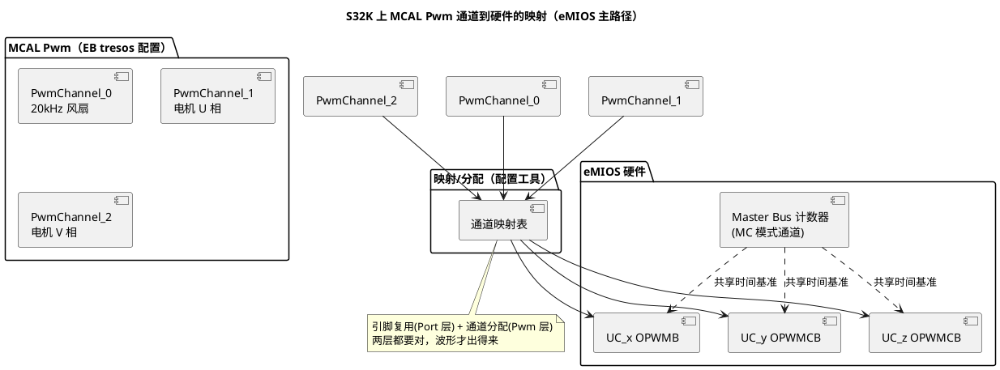

# 02-S32K-eMIOS-FTM

> 一句话定位：S32K 上 MCAL Pwm 的落点主要是 eMIOS 统一通道（一堆模式名要认得），FTM 则是 SDK/裸机路线的经典选择（死区强）——两者都是 [01-PWM原理](01-PWM原理.md) 那套"计数器+比较值"骨架的包装。
> 等级：L2 ｜ 前置：[01-PWM原理](01-PWM原理.md)

## 原理

### eMIOS：统一通道 + 模式菜单

eMIOS（Enhanced Modular Input Output Subsystem）的核心概念是 **UC（Unified Channel，统一通道）**：硬件通道本体一样，靠选"模式"决定它当 PWM、输入捕获还是计数器用。和 PWM 相关的模式要认这几个：

| eMIOS 模式 | 全称直觉 | 干什么 |
|---|---|---|
| OPWMB | 输出脉宽调制（缓冲） | **边沿对齐 PWM 主力**：内部 MCB 计数器 + A/B 两个比较值定占空比，带影子寄存器（下周期无缝更新） |
| OPWMCB | 中心对齐 PWM（缓冲） | 三角波计数，边沿对称，电机友好 |
| OPWMTB | 带触发的 PWM（缓冲） | 在 OPWMB 基础上加触发输入，多通道可被外部信号同步启动 |
| MC(MCB) | 模计数器（缓冲） | 当"总线时间基准"，给别的通道共用计数器 |
| SAIC / IPM | 单动作捕获 / 脉冲测量 | 输入侧（Icu 用，见 [Gpt/02-Icu输入捕获](../Gpt与Icu/02-Icu输入捕获.md)） |

**Master Bus 机制**是 eMIOS 的省资源设计：少数通道跑成 MC 模式当"公共时间基准"，一堆 OPWMB 通道挂在同一条 Master Bus 上共享计数器——每路只需存自己的比较值。MCAL 配置工具会替你分配谁当 Master、谁挂总线，但**通道模式决定它能挂在哪条总线**，理解这点才能看懂工具报的冲突。

### FTM：传统强人，死区内建

FTM（FlexTimer）是 S32K1 家族里与 eMIOS 并存的经典定时器（Kinetis 血统），PWM 能力同样齐全，**电机场景的最大卖点是硬件死区（DTC）**：

- 互补通道对（如 CH0/CH1 互为反相）+ 死区插入器，两路切换间隙自动留白；
- 中心对齐、故障保护输入（FAULT 引脚拉低硬件立即封波，不等软件）；
- MCAL（RTD 体系）在 S32K 上主要用 eMIOS，FTM 多见于 SDK/裸机或 CDD 自研驱动——两条路线的选型要在项目早期定。



### 时钟来源与分辨率

eMIOS/FTM 的 tick 来自 [S32K 时钟系统](../../../02-芯片与体系结构/1-L1基础/S32K平台/时钟系统/01-SCG与PCC.md)（PCC 选源，典型 SPLL/FIRC 分频）。tick 越快，同周期下比较值越大、分辨率越细；但计数器 16bit 有上限——20kHz PWM 在 80MHz tick 下周期计数值 4000，占空比分辨率约 1/4000，够用；若要 100Hz 低频+高分辨率，一条通道就顶不住了（可挂预分频或换思路）。

## 双平台硬件单元对照

| 通用概念 | TC377（对照，详见 [03-TC377-GTM](03-TC377-GTM.md)） | S32K（本篇） |
|---|---|---|
| PWM 主力 | GTM TOM/ATOM | eMIOS UC（OPWMB/OPWMCB） |
| 公共时间基准 | CMU 时钟簇 + TOM 子模块内计数器 | Master Bus（MC 模式通道） |
| 死区 | 以 GTM/厂商 MCAL 支持为准 | FTM 内建 DTC；eMIOS 侧看驱动能力 |
| 互补输出 | ATOM 通道对/映射实现 | FTM 互补通道对原生支持 |
| 通道-引脚关系 | GTM 输出映射可选性强 | eMIOS 通道-引脚基本固定，少数可重映射 |
| 故障封波 | 以安全机制为准 | FTM FAULT 输入硬件封波 |

## MCAL 配置要点

| 配置项 | 含义 | 典型值 | 易错点 |
|---|---|---|---|
| Pwm 通道→硬件通道映射 | MCAL 逻辑通道绑定哪个 eMIOS/FTM 通道 | 按引脚反查 | 选了引脚不支持的通道，编译过、波形无 |
| eMIOS 模式选择（工具内隐含） | 对齐方式/是否带触发 | OPWMB/OPWMCB | 中心对齐需求配成边沿对齐，电机电流采样相位全偏 |
| Master Bus 分配 | 公共计数器给谁用 | 少量通道当 MC | 多通道各起各的计数器，同频不同相；或 Master 被占用冲突 |
| PwmPeriod（tick） | 周期计数 | 20kHz 对应值 | tick 频率与周期换算错（频率意识要有） |
| 时钟源（PCC/SIM 侧） | eMIOS/FTM 时钟与分频 | SPLL 分频 | 改时钟后没回头核对 PWM 频率 |
| 互补/死区（FTM 路线） | 通道对+死区长度 | 按管子开关时间 | 死区太小仍直通冒烟；太大输出波形畸变、力矩损失 |
| 通知 | 周期中断（电流采样同步） | 中心对齐峰点 | 通知没 Enable；或回调太重挤占采样 |

## 代码示例

```c
/* MCAL 标准接口（硬件差异被映射层吃掉，应用看不到 eMIOS/FTM 字样） */
void App_MotorPwmStart(void)
{
    /* 50% 占空比 = 0x4000（0x8000 满量程的一半），中心对齐下即"零电压" */
    Pwm_SetDutyCycle(PwmConf_PwmChannel_MotorU, 0x4000u);
    Pwm_SetDutyCycle(PwmConf_PwmChannel_MotorV, 0x4000u);
    Pwm_SetDutyCycle(PwmConf_PwmChannel_MotorW, 0x4000u);

    /* 电流采样与 PWM 同步：开周期通知，在峰值附近触发采样 */
    Pwm_EnableNotification(PwmConf_PwmChannel_MotorU, PWM_PERIOD);
}

void PwmNotification_MotorU(void)
{
    /* 周期边界：此回调里触发 Adc 组转换（硬件触发更佳，见 Adc 篇） */
    CurrentSample_Trigger();
}
```

> 底层是 eMIOS 还是 FTM，取决于配置的映射；应用代码完全一致——这正是 MCAL 分层价值的直接体现。

## 易错点与陷阱

1. **配置通过但引脚无波形**——现象：万用表量引脚恒定电平。原因：eMIOS 通道与引脚复用没对上（通道-引脚多为固定对应）；或 Port 复用模式没选对；或 PCC 时钟没开（见 [Mcu/01-时钟初始化](../Mcu模块/01-时钟初始化.md)）。对策：按"时钟→Port 复用→通道映射→周期/占空比"四步排。
2. **同频不同相**——现象：三路 PWM 相位对不齐，电机电流异常。原因：各通道用了不同 Master Bus 或各自计数。对策：同组通道挂同一条 Master Bus、由同一触发同步。
3. **死区配小了**——现象：半桥管子发烫甚至炸管。原因：死区长度小于管子实际关断时间（低温/老化更慢）。对策：按管子数据手册最坏开关时间+裕量设定；示波器双通道实测切换间隙。
4. **分辨率不够还不自知**——现象：占空比小步进没反应。原因：tick 低+周期短，比较值只剩几个台阶。对策：算一遍"每 1% 占空比对应几个 tick"，低于 10 就升 tick 或改周期。
5. **FTM/eMIOS 路线混用**——现象：MCAL 配 eMIOS，CDD 里又直接操作 FTM，行为互相干扰。原因：两套定时器虽独立，但引脚/中断/时钟资源纠缠。对策：项目级定时器资源规划表，一条引脚一个 owner。

## 面试高频题

1. **eMIOS 的 Master Bus 是干嘛的？**
   答：MC 模式通道充当公共时间基准，多个输出通道共享计数器，省资源且天然同频同相。
2. **OPWMB 和 OPWMCB 差异？**
   答：边沿对齐（锯齿计数）vs 中心对齐（三角计数）；后者边沿对称、谐波友好，电机电流采样常在峰点同步。
3. **FTM 死区怎么工作？要配多长？**
   答：DTC 在互补通道切换时强制双关断一个可配时长；长度按管子最坏关断时间+裕量。
4. **为什么 MCAL 下应用代码感知不到 eMIOS/FTM？**
   答：通道映射在配置层完成，标准 API 只操作逻辑通道；换硬件只重新配置不改编用代码。

## 延伸

- 本目录：[01-PWM原理](01-PWM原理.md)、[03-TC377-GTM](03-TC377-GTM.md)、[04-MCAL配置要点](04-MCAL配置要点.md)；
- [01-SCG与PCC](../../../02-芯片与体系结构/1-L1基础/S32K平台/时钟系统/01-SCG与PCC.md)——eMIOS 时钟从哪来；
- [01-外设速查表](../../../02-芯片与体系结构/1-L1基础/S32K平台/外设资源清单/01-外设速查表.md)——S32K 定时器通道家底；
- 输入侧姊妹篇：[Gpt/02-Icu输入捕获](../Gpt与Icu/02-Icu输入捕获.md)（SAIC/IPM 模式在此展开）。
