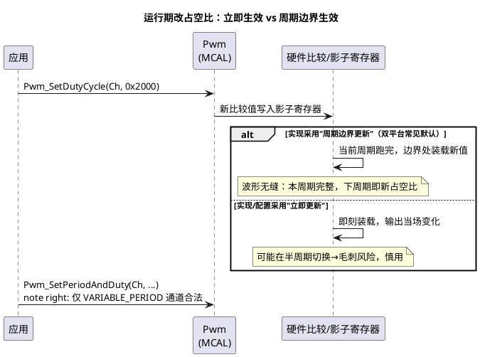

# 04-MCAL配置要点

> 一句话定位：把 [02-S32K-eMIOS-FTM](02-S32K-eMIOS-FTM.md) 和 [03-TC377-GTM](03-TC377-GTM.md) 两个平台篇收拢到标准接口层——通道类别的"能不能改"、IdleState 的安全语义、通知用法、"改占空比何时生效"，是 Pwm 集成评审的四件套。
> 等级：L2 ｜ 前置：[02-S32K-eMIOS-FTM](02-S32K-eMIOS-FTM.md)、[03-TC377-GTM](03-TC377-GTM.md)

## 原理

### PwmChannelConfigSet：配置期的一切从这开始

EB tresos 里 Pwm 模块的主容器叫 **PwmChannelConfigSet**——所有通道定义（周期/占空比/极性/空闲态/类别/通知）都挂在这个容器下，Generate 后变成 `Pwm_Cfg.c` 里的通道表。它回答的是**配置期**问题："这路 PWM 生来是什么样"。**运行期想改占空比/周期，唯一合法路径是标准 API**（Pwm_SetDutyCycle / Pwm_SetPeriodAndDuty），直接改生成表或寄存器都是歪路（下次 Generate 会被覆盖，且绕过影子寄存器会出毛刺）。

### 通道类别：能不能改周期是生下来决定的

| PwmChannelClass | 周期可变？ | 语义直觉 |
|---|---|---|
| PWM_FIXED_PERIOD（+ACTIVE_HIGH/LOW 变体） | 否 | 周期定死，只能改占空比——绝大多数负载（灯/风扇）够用 |
| PWM_VARIABLE_PERIOD（+变体） | 是 | 允许 Pwm_SetPeriodAndDuty 运行时换频率——变频率需求（如谐振控制）才用 |

为什么标准要这样分：可变周期通道的底层实现要支持周期+占空比原子更新（双影子），资源与风险都更高；把"不需要的"锁死在固定类，是在配置期消灭一类误用。

### 占空比/周期修改的合法路径与时序



**"何时生效"没有放之四海的答案**：SWS 对相关条款的要求与各驱动实现（TC377 GTM 影子装载策略、S32K eMIOS 通道更新策略）存在细节差异——工程上以**两点收敛**：① 假设默认在周期边界生效（安全预期）；② 关键路径用示波器实测一次"改值→波形变化"延迟，写进集成记录。对"本周期必须生效"的强需求，去驱动文档里找立即更新选项，找不到就别硬扛。

### IdleState 与通知

- **IdleState**：`Pwm_SetOutputToIdle` 后引脚进入的电平，以及未启动时的默认输出。它的语义是**安全态**——停机、故障、DeInit 都落到这里。配错方向=停机时执行器反而全开（见易错点）。
- **通知类（Notification）**：`Pwm_EnableNotification(Ch, PWM_PERIOD / PWM_RISING_EDGE / PWM_FALLING_EDGE / PWM_BOTH_EDGES)`——到点/到沿回调。最典型用途：**与 PWM 周期同步触发电流采样**（或更进一步由硬件触发链直达 Adc，见 [Adc/03-S32K-ADC-BCTU](../Adc/03-S32K-ADC-BCTU.md)）。与 [Gpt](../Gpt与Icu/01-Gpt定时器.md) 一样：Enable 是独立开关，且通知在中断上下文执行。

## 双平台硬件单元对照

| 通用概念 | TC377（GTM 路线） | S32K（eMIOS/FTM 路线） |
|---|---|---|
| 更新装载机制 | TOM/ATOM 影子寄存器，周期边界装载为主 | eMIOS 缓冲通道下周期生效；FTM 装载点可选 |
| 周期边界同步 | 多通道可共享时基，边界天然对齐 | 同 Master Bus 通道边界对齐 |
| 立即更新能力 | 以驱动/GTM 更新位为准 | 以通道模式/装载配置为准 |
| 通知中断路径 | GTM 中断节点→SRC→CPU | eMIOS/FTM→NVIC |
| 空闲态实现 | 通道强制输出配置电平 | 通道强制输出配置电平 |

## MCAL 配置要点

| 配置项 | 含义 | 典型值 | 易错点 |
|---|---|---|---|
| PwmChannelClass | 固定/可变周期（决定运行期能力） | 默认 FIXED | 评审默认全 FIXED，临时要变频的通道没配 VARIABLE，功能砍半 |
| PwmPeriod | 周期（tick） | 按 tick 频率换算 | VARIABLE 通道运行时上限=计数器位宽 |
| PwmDutycycleDefault | 初始占空比 | 0（安全） | 非 0 初值，上电执行器瞬间动作 |
| PwmIdleState | 空闲电平 | 执行器关断侧 | 与极性联动想清楚，两处都要审 |
| PwmNotification | 通知类型+回调 | PWM_PERIOD | 只配了回调没写 Enable 逻辑，通知静默 |
| Pwm_SetDutyCycle（API） | 改占空比（0~0x8000） | 运行时 | 单位不是百分比；并发上下文调用要加锁策略 |
| Pwm_SetPeriodAndDuty（API） | 改周期+占空比 | 仅 VARIABLE 类 | 对 FIXED 通道调用=配置错误（DEV_ERROR） |
| Pwm_SetOutputToIdle（API） | 切空闲态 | 故障/停机路径 | 用"设 0 占空比"替代它——慢一步且不改变状态语义 |

## 代码示例

```c
/* 一段覆盖四件套的典型应用：变频风扇（可变周期通道）+ 安全停机 */
void App_FanSet(uint16 freqHz, uint8 dutyPercent)
{
    uint16 period; uint16 duty;
    if (freqHz == 0u) { return; }

    /* 周期 tick = 通道tick频率 / 目标频率（数值以配置为准，这里假设 1MHz） */
    period = (uint16)(1000000u / freqHz);
    duty   = (uint16)(((uint32)dutyPercent * period) / 100u * 2u);  /* 换算成满量程 0x8000 语义，以SWS为据 */

    Pwm_SetPeriodAndDuty(PwmConf_PwmChannel_FanVar, period, duty); /* 合法：该通道配了 VARIABLE_PERIOD */
}

void App_FanStopSafe(void)
{
    Pwm_SetOutputToIdle(PwmConf_PwmChannel_FanVar);   /* 直接落空闲态（配置成关断电平） */
}

/* 周期通知：与 PWM 同步的轻量钩子 */
void PwmNotification_FanVar(void)
{
    FanSync_Flag = 1u;    /* 只做标记，重活回任务层 */
}
```

## 易错点与陷阱

1. **改占空比"不生效"/半周期生效**——现象：设值后波形下个周期才变（或当场跳变有毛刺）。原因：实现采用影子装载（周期边界生效）或立即装载策略，与预期不符。对策：预期按"周期边界生效"管理；强需求查驱动立即更新选项；实测记录延迟。
2. **FIXED 通道调 SetPeriodAndDuty**——现象：开发期报参数/开发错误或干脆无效。原因：通道类别没配 VARIABLE_PERIOD。对策：需求评审时就把"哪些通道要变频"定下来，配置一次到位。
3. **用 SetDutyCycle(0) 当停机**——现象：故障停机路径偶发半拍延迟或电平不确定。原因：占空比 0 仍处于"运行态"，不是安全态语义。对策：停机/故障统一走 `Pwm_SetOutputToIdle`。
4. **IdleState 配成"开"**——现象：停机后风扇满转/灯全亮。原因：空闲电平与极性组合想反了。对策：空闲态选执行器关断侧；评审表格里"极性+空闲态"两列一起看。
5. **多上下文并发 SetDutyCycle**——现象：占空比偶发跳变。原因：任务与中断同时改同一通道。对策：单 owner 原则——一个通道只有一个写入者（或经同一互斥层）。
6. **通知永远不进**——现象：回调函数在配置里指了名，运行时从不进。原因：没调 `Pwm_EnableNotification`（Pwm 没有"Init 即开通知"的默认）。对策：启动流程里显式 Enable，与 [Gpt 的坑](../Gpt与Icu/01-Gpt定时器.md)同源同解。

## 评审清单（Pwm 集成四件套）

1. 每路通道：类别（FIXED/VARIABLE）与运行期需求是否匹配？周期/默认占空比/极性/空闲态四项有人逐路签字？
2. 变频通道：是否用到 SetPeriodAndDuty？周期上限（位宽×分辨率）有没有核算？
3. 停机/故障路径：是否统一走 SetOutputToIdle？空闲电平是否=执行器安全侧？
4. 通知：Enable 调用点明确？回调是否只做轻量标记？通道写入者是否唯一？

## 面试高频题

**Q1：PwmChannelClass 的 FIXED_PERIOD 与 VARIABLE_PERIOD 有什么区别？为什么标准要分两类？**
答：FIXED 周期配置期定死，运行期只能 Pwm_SetDutyCycle 改占空比（绝大多数灯/风扇负载够用）；VARIABLE 才允许运行期 Pwm_SetPeriodAndDuty 变频。分开是因为可变周期通道底层要支持周期+占空比原子更新（双影子寄存器），资源与风险更高——把不需要变频的通道锁死在固定类，是在配置期消灭一类误用（对 FIXED 通道调 SetPeriodAndDuty 直接报开发错误）。

**Q2：运行期改占空比什么时候生效？为什么有时看到毛刺？**
答：取决于驱动装载策略：常见默认是写影子寄存器、周期边界装载——本周期完整跑完、下周期无缝切换新占空比；若实现/配置为立即装载，半周期切换就有毛刺风险。工程收敛两点：预期一律按"周期边界生效"管理，关键路径用示波器实测一次"改值→波形变化"延迟写进集成记录；本周期必须生效的强需求查驱动立即更新选项，找不到就别硬扛。

**Q3：为什么故障停机要 用 Pwm_SetOutputToIdle 而不是 SetDutyCycle(0)？**
答：占空比 0 仍处于"运行态"语义——经过装载路径可能慢半拍，且电平归属不确定；SetOutputToIdle 是显式的安全态切换，停机/故障/DeInit 都应落到 IdleState。IdleState 本身要配成执行器关断侧电平（与极性组合联审），配反了就是"停机后风扇满转/灯全亮"。

**Q4：配了 Pwm 通知回调却从不进，先查什么？**
答：先查有没有调 Pwm_EnableNotification——Pwm 没有"Init 即开通知"的默认，Enable 是独立开关，要在启动流程显式调用（与 Gpt 同源同解）。其次看回调是否只做轻量标记（通知在中断上下文执行，重活回任务层），以及通道是否遵循单 owner 原则（多上下文并发 SetDutyCycle 会偶发占空比跳变）。典型正用：PWM_PERIOD 通知与周期同步触发电流采样，更好的做法是硬件触发链直达 Adc（BCTU）。

## 延伸

- 本目录他篇：[01-PWM原理](01-PWM原理.md)、[02-S32K-eMIOS-FTM](02-S32K-eMIOS-FTM.md)、[03-TC377-GTM](03-TC377-GTM.md)；
- 更新机制的硬件根基：[02-TOM与ATOM](../../../02-芯片与体系结构/2-L2进阶/TC377平台/GTM/02-TOM与ATOM.md)、[03-与MCAL-Pwm的关系](../../../02-芯片与体系结构/2-L2进阶/TC377平台/GTM/03-与MCAL-Pwm的关系.md)；
- 通知的近亲：[Gpt/01-Gpt定时器](../Gpt与Icu/01-Gpt定时器.md)（Enable/Start 配对习惯）；
- 触发链下游：[Adc/03-S32K-ADC-BCTU](../Adc/03-S32K-ADC-BCTU.md)——PWM 通知之外，硬件触发直达采样的正解。
