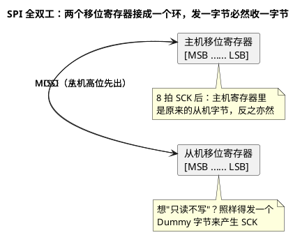

# 01-SPI时序

> 一句话定位：把 SPI 的四根线、四种时钟模式、全双工本质一次讲透，之后读 LPSPI/ASCLIN 手册、配 MCAL Spi 模块时不再靠猜。
> 等级：L2 ｜ 前置：[MCAL第一课-从点灯到分层驱动](../../00-入门导读/01-MCAL第一课-从点灯到分层驱动.md)

## 原理

SPI 是**四线全双工同步串行总线**：SCK（时钟）、MOSI（主出从入）、MISO（主入从出）、CS（片选）。没有地址、没有应答、没有固定帧格式——所有节奏由主机的 SCK 决定，这也是它比 I2C 快一个数量级的原因。

### 全双工的本质：一个环

主机和从机各有一个移位寄存器，通过 MOSI/MISO **首尾相接成一个大环**，每拍一个 SCK，两边同时各挪出一位、挪进一位：



推论：SPI **没有"半双工"也没有"纯读"**——想读从机，必须发点什么（常用 0x00 或 0xFF 作 Dummy）来换取时钟节拍。

### CPOL/CPHA 四模式

两个参数各 1 bit，组合出四种模式。**CPOL 决定 SCK 空闲电平，CPHA 决定在第几个边沿采样**：

| 模式 | CPOL | CPHA | SCK 空闲 | 采样沿 | 切换沿 | 直觉记法 |
|---|---|---|---|---|---|---|
| 0 | 0 | 0 | 低 | 第 1 个（上升） | 下降 | 最常用：CS 拉低即给数，上升沿读数 |
| 1 | 0 | 1 | 低 | 第 2 个（下降） | 上升 | 先晃半拍再采，留给从机准备时间 |
| 2 | 1 | 0 | 高 | 第 1 个（下降） | 上升 | 模式 0 的时钟反相 |
| 3 | 1 | 1 | 高 | 第 2 个（上升） | 下降 | 模式 1 的时钟反相 |

```wavedrom
{signal: [
  {name: 'CS',   wave: '10.......1'},
  {name: 'SCK(模式0)', wave: '0.p.n.p.n.p.', node: '.a'},
  {name: 'MOSI', wave: 'x3.4.5.6.x..', data: ['B7','B6','B5','B4']},
  {name: 'MISO', wave: 'x7.8.9.x....', data: ['B7','B6','B5']}
], head: {text: '模式0：空闲低，上升沿采样（a 处 B7 已被对方读走）', tick: 0}}
```

```wavedrom
{signal: [
  {name: 'CS',   wave: '10.......1'},
  {name: 'SCK(模式3)', wave: '1.n.p.n.p.n.', node: '.a'},
  {name: 'MOSI', wave: 'x3.4.5.6.x..', data: ['B7','B6','B5','B4']}
], head: {text: '模式3：空闲高，第 2 个边沿（上升）采样', tick: 0}}
```

看从机手册的方法：datasheet 会给时序图并标注 "SPI mode 0/3" 或直接给 t_SU/t_HD 相对哪个边沿，照抄即可，不必现场推导。

### 片选的三种形态

| 形态 | 谁来拉放 CS | 特点 | 典型场景 |
|---|---|---|---|
| 硬件片选 | 控制器在传输首尾自动拉放 | 时序精确可编程（Tcsc/Tast 等），但多 Job 间可能自动释放 | 单从机、固定报文 |
| 软件/命令片选 | 驱动按帧序列（首帧 CS_FIRST/中间 CONT/末帧 CS_LAST）控制 | MCAL Job 的默认玩法，能跨多帧保持 | 读 Flash 一条命令多个字节 |
| GPIO 手动 | 应用/上层用 Dio 自己拉放 | 最灵活，但占 CPU、时序不受驱动保证 | 一线多从机切换、非常规器件 |

**关键风险**：有些从器件（如 SPI NorFlash）把"CS 拉高"解释为"命令结束"。若硬件 CS 在字节间隙自动释放，一条读命令会被拦腰截断——这就是 MCAL 里 Job 要声明 CS 保持策略的原因（见 [04-MCAL配置要点](04-MCAL配置要点.md)）。

### 主从与波特率

主机产生 SCK，波特率 = 功能时钟 / 分频。三件事必须想清楚：

1. **从机上限**：从器件手册的 f_SCK(max) 是硬顶，超了不会报错，只会读回错数据；
2. **两端模式必须一致**：模式不匹配的现象是"读到全 0/全 FF 或整体移位一位"；
3. **分频粒度**：LPSPI 是整数级分频，ASCLIN 按位粒度可配——想要非整分频（如 2.5MHz）时先算一遍实际值再填配置工具。

## 双平台硬件单元对照

| 对照项 | TC377（ASCLIN-SPI） | S32K（LPSPI） |
|---|---|---|
| 模块来源 | ASC/LIN/SPI 三合一复用，占用前要想清楚 | 独立 LPSPI 外设（S32K1×3~S32K3 更多） |
| 时钟模式 | 4 模式齐备（CPOL/CPHA 独立位） | 4 模式齐备（TCR.CPOL/CPHA） |
| FIFO | TX/RX 各 16×16bit 组 FIFO | TX/RX 各 4×32bit（S32K1），带 Watermark |
| 片选 | 硬件 CS 时序参数可编程 | TCR.CIN/CONT/PCS 位 + 时序参数寄存器 |
| 波特率 | 按位粒度可配（慢时钟快时钟双源） | 功能时钟 / 整数分频 |
| 旧单元 | QSPI（AURIX 家族早期专用 SPI） | 无（LPUART 可软仿 SPI，不推荐） |

## MCAL 配置要点

时序相关的配置项集中在 SpiDevice 层（完整三级结构见 [04-MCAL配置要点](04-MCAL配置要点.md)）：

| 配置项 | 含义 | 典型值 | 易错点 |
|---|---|---|---|
| SpiClockPolarity | CPOL：SCK 空闲电平 | LOW（模式0/1） | 与从机模式对不上时读数全错 |
| SpiDataShiftEdge | CPHA：第几个沿采样 | LEADING（模式0/2） | 名字不叫 CPHA，新手常找不到 |
| SpiBaudrate | SCK 频率（kbps） | 1000~10000 | 实际值受分频粒度限制，需回读验证 |
| SpiShiftChar LSB/MSB | 先发高位还是低位 | MSB first | 反了数据呈镜像（0x80 变 0x01） |
| SpiCsSelection | 片选形态 | 硬件/软件/GPIO | 选错导致从机状态机被截断 |
| SpiCsPeriod | CS 相对 SCK 的建立/保持 | 按从机 t_CSS/t_CSH | 过快访问会踩从机内部转换时间 |

## 代码示例

```c
/* 裸机风格：轮询收发一个字节（平台无关伪码，展示全双工本质） */
uint8 Spi_SwapByte(uint8 txByte)
{
    while (0u == (SpiHw->SR & SPI_SR_TXE)) { /* 等发送缓冲空 */ }
    SpiHw->TDATA = txByte;                   /* 写发送即启动 SCK */
    while (0u == (SpiHw->SR & SPI_SR_RXNE)) { /* 收满说明 8 拍已走完 */ }
    return SpiHw->RDATA;                     /* 读 RX 顺带清标志，防溢出 */
}

/* 读从机状态寄存器的典型调用：发命令 → 发 dummy 换数据 */
uint8 Spi_ReadStatus(void)
{
    uint8 st;
    Spi_CsLow();                 /* GPIO 手动片选形态 */
    (void)Spi_SwapByte(0x05u);   /* 命令字节，此时返回值是垃圾 */
    st = Spi_SwapByte(0xFFu);    /* dummy 换回从机状态 */
    Spi_CsHigh();                /* 一条命令结束，拉高 CS */
    return st;
}
```

## 易错点与陷阱

1. **模式配反，读到 0xFF/0x00**：现象是数据恒定或移位一位；原因是 CPOL/CPHA 与从机不一致、采样落在切换沿；对策：示波器同时抓 CS/SCK/MISO 对照从机时序图，先验模式再查代码。
2. **只写不读导致 RX FIFO 溢出**：SPI 收发一体，光发不读，RX 侧照样堆数据；溢出后新数据丢失且多数控制器不再报错；对策：收发配对成 Swap，或开 RX 溢出中断。
3. **硬件 CS 在多字节间自动释放**：读 NorFlash 返回错数据；原因是 CS 保持策略没配成"跨帧保持"；对策：MCAL 里 Job 的 CS 形态选软件保持，或退回 GPIO 手动。
4. **波特率超从机上限**：低速正常、高速偶发错数；原因是踩了从机 f_SCK(max) 或走线过长信号完整性劣化；对策：降到手册值一半先验证，再逐步提频。
5. **MSB/LSB 配反**：数据呈位镜像（0x80↔0x01）；对策：先发已知模式 0xA5（非对称字节）比对回读。
6. **多从机共 MISO 未释放**：某从机未选通时 MISO 仍被驱动，拉垮总线；对策：确认从机 MISO 是三态、必要时加隔离/上拉。

## 面试高频题

- **Q：SPI 四种模式怎么快速记住？**
  A：CPOL=时钟空闲电平（0 低 1 高）；CPHA=第几个边沿采样（0 第一个、1 第二个）。模式 0 与 3 覆盖九成器件，剩下两种是它们的时钟反相。
- **Q：SPI 为什么天然全双工？怎么实现"只读"？**
  A：主从移位寄存器接成环，SCK 每拍双向各移一位，所以发一个字节必然同时收到一个字节；"只读"就是发 Dummy 字节换取时钟。
- **Q：SPI 与 I2C、UART 的取舍？**
  A：SPI 快（无地址开销、时钟可到几十 MHz）、引脚多（4 线 vs 2 线）、无应答无仲裁，适合片内高速外设（Flash/ADC/收发器配置口）；I2C 省引脚带应答，适合低速多器件；UART 异步点对点。
- **Q：SPI 没有应答机制，可靠性靠什么？**
  A：靠上层协议——命令字+校验（CRC/重读比对），以及时序合规（模式/波特率/CS 保持）。驱动层能做的只有把错误（溢出/超时）上报。

## 延伸

- [02-S32K-LPSPI](02-S32K-LPSPI.md)：时序参数落到 NXP 的 FIFO 与水线；
- [03-TC377-ASCLIN-SPI](03-TC377-ASCLIN-SPI.md)：英飞凌三合一单元怎么复用出 SPI；
- [MCAL第一课-从点灯到分层驱动](../../00-入门导读/01-MCAL第一课-从点灯到分层驱动.md)：本时序如何被包进 MCAL 统一门面；
- [01-CCU与时钟树](../../../02-芯片与体系结构/2-L2进阶/TC377平台/时钟系统/01-CCU与时钟树.md)：波特率的时钟从哪来。

---

维护约定：笔记命名 `序号-主题.md`；真实截图放 `_images/`；流程/时序/状态/架构图用 PlantUML 内嵌正文，规范见 [图表规范与模板](../../../00-总览/图表规范与模板.md)。
