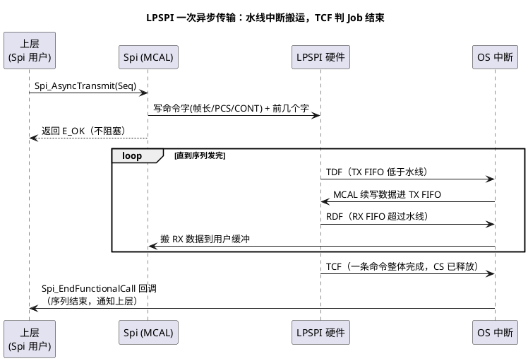

# 02-S32K-LPSPI

> 一句话定位：站在 S32K 的 LPSPI 硬件上理解 FIFO、水线、完成标志与片选时序参数，看懂 EB tresos 里那堆 LPSPI 配置项到底在配什么。
> 等级：L2 ｜ 前置：[01-SPI时序](01-SPI时序.md)

## 原理

LPSPI（Low Power SPI）是 S32K 全系的 SPI 外设：一个**命令驱动**的控制器——你不是直接拍 SCK，而是往 TX FIFO 写"命令字 + 数据"，命令字里带 CS 选择、帧长、片选保持等属性，硬件按命令自动完成一次传输。

### FIFO 与水线（Watermark）

S32K1 的 LPSPI 有 **TX/RX 各 4 字（32bit）FIFO**。水线是一个可编程阈值：

- TX 水线：FIFO 里的字数 **≤ 水线**时触发 TDF 标志/中断，提醒"该续货了"；
- RX 水线：FIFO 里的字数 **> 水线**时触发 RDF 标志/中断，提醒"该取货了"。



### 完成标志的层级直觉

| 标志 | 置位含义 | 用途 |
|---|---|---|
| TDF/RDF | FIFO 需要服务（水线触发） | 中断/DMA 搬数据 |
| TCF | 一条命令字描述的传输**整体完成**（含 CS 释放） | MCAL 判 Job 完成 |
| 完成类收尾（LTF 类） | 帧序列最后一条命令完成 | MCAL 判 Sequence 完成、触发回调 |

直觉：**TDF/RDF 管"搬"，TCF 管"完"**。只看 FIFO 空就宣布结束是新手常见错误——最后一个字可能还在移位器里飞。

### 片选时序参数与从器件匹配

LPSPI 的 CS 时序在时钟配置寄存器里由三个延迟控制（名字以 RTD/手册为准，直觉如下）：

| 参数 | 直觉 | 匹配的从机手册量 | 配错的典型后果 |
|---|---|---|---|
| CS 建立（t_CSC） | CS 拉低 → 首个 SCK 沿的延迟 | t_CSS | 从机还没进入选通态就开拍，首字节错 |
| CS 保持（t_AST） | 末个 SCK 沿 → CS 释放的延迟 | t_CSH | 从机没存完最后一位，末字节错 |
| 帧间延迟（DBT 类） | 两条命令间 SCK 停拍时间 | 从机 t_rec / 页写忙判读 | 连续访问过快，从机内部没转换完 |

配置方法：查从机手册时序表 → 换算成 LPSPI 功能时钟的拍数 → 填进配置工具，让工具生成 CCR 类寄存器值；**默认最小值常为 0 拍，高速器件一定要手动给足**。

### MCAL Channel/Sequence 怎么落到 LPSPI

一句话映射：**Channel（一段缓冲+数据宽度）拼进 Job（一条 CS+一组时序参数，≈LPSPI 一条/一组命令字），多个 Job 编排成 Sequence（命令级联）**。EB tresos 里选择 `SpiHwUnit = LPSPI_0` 后，Sequence→Job→Channel 的树最终生成命令字模板与中断/DMA 搬运代码。三级结构的展开见 [04-MCAL配置要点](04-MCAL配置要点.md)。

## 双平台硬件单元对照

| 对照项 | S32K（LPSPI） | TC377（ASCLIN-SPI） |
|---|---|---|
| FIFO 深度 | TX/RX 各 4×32bit（S32K1） | TX/RX 各 16 字（组合成组） |
| 水线机制 | 有，寄存器编程阈值 | 有，以"组"为单位挂起/唤醒 |
| 完成判定 | TCF（命令完成）+ FIFO 标志 | 模块级标志+组 FIFO 空 |
| 片选时序 | CCR 类寄存器给 CS 建立保持延迟 | Tcsc/Tast/Tidat 等参数 |
| 时钟源 | 功能时钟来自 PCC 分配，整数分频 | 快/慢双时钟源，按位粒度 |
| 多 CS 支持 | 命令字 PCS 位选 4 个 CS，硬件自动 | 硬件 CS 有限，多用 GPIO |

## MCAL 配置要点

| 配置项 | 含义 | 典型值 | 易错点 |
|---|---|---|---|
| SpiHwUnit | 绑定哪个 LPSPI 实例 | LpspiHwUnit_0 | 与 Port 引脚复用选的实例不一致，白配 |
| SpiBaudrate | SCK 频率 | ≤从机 f_SCK(max) | 实际频率=功能时钟/整数分频，回读验证 |
| TX/RX 水线 | FIFO 服务阈值 | S32K1 常配 1~2 | 全 0 时中断风暴，最大值反而失去流水线意义 |
| CS 建立/保持参数 | t_CSC/t_AST | 按从机手册拍数 | 默认 0，高速从机首末字节出错 |
| SpiDataWidth | 单字位宽（帧长） | 8/16/32bit | 非 8bit 时上层缓冲类型要匹配 |
| 中断/DMA 使能 | 搬运方式 | 中断为主 | DMA 与水线联合配置，漏一项就卡 FIFO |

## 代码示例

```c
/* MCAL 标准用法：IB 缓冲 + 异步发送（S32K LPSPI，内部按水线中断搬运） */
static uint8 au8TxBuf[4] = {0x9Fu, 0x00u, 0x00u, 0x00u}; /* NorFlash JEDEC-ID 命令 */
static uint8 au8RxBuf[4];

void Read_JedecId(void)
{
    (void)Spi_WriteIB(SpiConf_SpiChannel_Chan_FlashCmd, au8TxBuf); /* 填 TX 缓冲 */
    /* 异步启动：立即返回，数据由 TDF/RDF 水线中断逐字搬运 */
    (void)Spi_AsyncTransmit(SpiConf_SpiSequence_Seq_FlashRead);
}

/* 序列完成回调（中断上下文，只做轻量动作） */
void Spi_EndFunctionalCall(void)
{
    /* 读回数据：此刻 TCF 已到，CS 已释放，数据可靠 */
    (void)Spi_ReadIB(SpiConf_SpiChannel_Chan_FlashRx, au8RxBuf);
    /* 正确姿势：置事件标志，把解析挪到任务里；别在这里做重活 */
    SetEvent(SpiDone);
}
```

## 易错点与陷阱

1. **FIFO 空就当传输完**：上层判断只看"我写完了"，但移位器还差最后一拍；现象是末字节偶发旧值；对策：等 TCF/完成回调，别自造轮询。
2. **水线配满（=FIFO 深度）**：TX 侧每写满才触发，吞吐骤降还可能下溢；对策：水线留 1~2 字余量，维持流水线。
3. **CS 时序全默认 0**：读 NorFlash 首字节 FF、末字节错；原因是 t_CSS/t_CSH 不满足从机；对策：按手册拍数配 CS 建立/保持。
4. **Job 间 CS 误释放**：命令字没设 CONT/保持，多字节命令被截断；对策：Job 配 CS 保持（软件片选形态），或合入同一 Sequence。
5. **数据宽度与缓冲不匹配**：SpiDataWidth=32 时上层却给 uint8 缓冲；现象是数据错位/截断；对策：宽度、缓冲长度、字节序三查。
6. **中断里做重活**：水线中断里等另一个 SPI、跑长循环，阻塞同优先级中断导致下溢；对策：中断只搬数据置标志，业务逻辑回任务层。

## 面试高频题

- **Q：LPSPI 的水线是干什么的？配大配小各有什么影响？**
  A：FIFO 服务阈值。配小→中断频繁、CPU 占用高但延迟低；配大→中断少但容易在突发时溢出/下溢；工程上按"一次中断能搬完一段缓冲"折中。
- **Q：TCF 和 FIFO 空标志有什么区别？**
  A：FIFO 空只说明"软件侧没活了"，TCF 说明"移位器最后一位也飞完了、CS 已按配置动作"；判完成必须以后者为准。
- **Q：MCAL 的 Channel/Job/Sequence 分别对应 LPSPI 什么？**
  A：Channel≈一段缓冲+帧长；Job≈一条 CS 命令（命令字+时序参数）；Sequence≈多条命令的级联编排，一次异步传输的调度单位。
- **Q：为什么读 Flash 要跨多帧保持 CS？**
  A：从机把 CS 上升沿当命令边界，中途释放等于命令作废；所以 Job 声明 CS 保持策略，硬件按命令字 CONT 位维持。

## 延伸

- [01-SPI时序](01-SPI时序.md)：CPOL/CPHA 与全双工的地基；
- [04-MCAL配置要点](04-MCAL配置要点.md)：三级结构与同步/异步的完整展开；
- [01-SCG与PCC](../../../02-芯片与体系结构/1-L1基础/S32K平台/时钟系统/01-SCG与PCC.md)：LPSPI 功能时钟从哪分来；
- [01-内核与资源对比](../../../02-芯片与体系结构/1-L1基础/S32K平台/S32K1与S32K3对比/01-内核与资源对比.md)：S32K1 与 S32K3 的 LPSPI 资源差异。

---

维护约定：笔记命名 `序号-主题.md`；真实截图放 `_images/`；流程/时序/状态/架构图用 PlantUML 内嵌正文，规范见 [图表规范与模板](../../../00-总览/图表规范与模板.md)。
