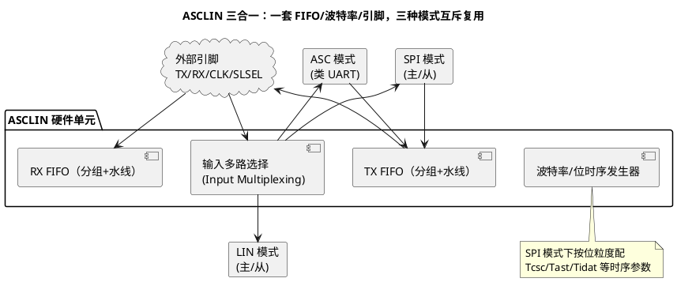

# 03-TC377-ASCLIN-SPI

> 一句话定位：看懂 TC377 的 ASCLIN 怎么用一套引脚和 FIFO 同时伺候 ASC/LIN/SPI 三种协议，以及"输入源选择"这个 S32K 上没有的坑。
> 等级：L2 ｜ 前置：[01-SPI时序](01-SPI时序.md)

## 原理

ASCLIN = **ASC/LIN/SPI 三合一串行接口**。英飞凌把三种串行协议的公共部分（引脚、FIFO、波特率发生器、中断）做进同一个模块，运行时只能以**一种模式**工作——这是资源紧张的取舍：芯片外设数量有限，让每个串口单元"能屈能伸"，代价是三协议互斥、配置更容易串台。



### 输入源选择（Input Multiplexing）

TC377 上**"引脚复用"和"输入信号选择"是两件事**：Port 模块把某引脚设为 ASCLIN 功能，只是把输出路径接上；输入方向还要在 ASCLIN 的输入控制里声明"本模块的 RX/MISO/SLSEL 从几号脚进来"——同一个 ASCLIN 的输入可以来自不同引脚（板级布线自由），但配错就是"发得出收不到"。

### TX/RX FIFO 与波特率发生器

- **FIFO**：TX/RX 各若干组（group）字深度，每组独立水线，可**挂起（suspend）/恢复（resume）**——一批数据搬完自动停在组边界，下一批续传；MCAL 用它实现 Channel 级的缓冲切换；
- **波特率发生器**：SPI 模式下不走 ASC 的"采样 16 倍频"思路，而是**按位粒度**直接给每类位时间（时钟建立 Tcsc、时钟尾 Tast、帧间空闲等）配功能时钟的拍数——所以能配出 2.5MHz 这类"非整数分频"效果。

### 与 QSPI 的关系（一句话）

TC2xx 旧家族的专用 QSPI 模块在 TC3xx 上被砍掉，SPI 职责并入 ASCLIN——**从 TC2xx 移植过来的 QSPI 寄存器代码在 TC377 上一行都不能用**，须按 ASCLIN-SPI 重写或直接换 MCAL Spi。

## 双平台硬件单元对照

| 对照项 | TC377（ASCLIN-SPI） | S32K（LPSPI） |
|---|---|---|
| 模块定位 | ASC/LIN/SPI 三合一，模式互斥 | 独立 SPI 外设，专职 |
| 输入路径 | 输入源选择寄存器，可选多脚 | 引脚复用即输入（固定映射） |
| FIFO | TX/RX 分组 FIFO，组可挂起/恢复 | 4×32bit 简单 FIFO+水线 |
| 波特率 | 按位时序参数（拍数级粒度） | 整数分频 |
| 片选 | SLSEL 引脚/软件控制 | 命令字 PCS 位选 CS |
| 多核访问 | 各核可见，须软件互斥 | 单主为主，DMA 辅助 |

## MCAL 配置要点

| 配置项 | 含义 | 典型值 | 易错点 |
|---|---|---|---|
| ASCLIN 实例与模式 | 选哪个 ASCLIN、以 SPI 模式初始化 | AsclinHwUnit_x_SPI | 同实例被 ASC/LIN 配置重复占用，后初始化的覆盖前者 |
| 输入源选择 | RX/MISO/SLSEL 从哪个引脚进 | 按 Port 分配 | Port 配了复用却忘了选输入源：只发不收 |
| 位时序参数 | Tcsc/Tast/帧间空闲拍数 | 按从机手册 | 沿用 ASC 模式的波特率思路，首尾字节出错 |
| 时钟源 | 功能时钟（fPLL/fSPB 等） | 与 Mcu 时钟树一致 | Mcu 降频后波特率跟着变，重新校准 |
| FIFO 组水线 | 每组多少字触发搬运 | 1~2 | 组挂起后未恢复，第二次传输永远等不到数据 |
| 主/从角色 | MASTER/SLAVE | MASTER | 从机的 SLSEL 接法与角色不匹配，无时钟 |

## 代码示例

```c
/* MCAL 视角：ASCLIN-SPI 上做一次同步传输（阻塞式，适合初始化期读器件 ID） */
static uint8 au8Cmd[1]  = {0x9Fu};              /* JEDEC-ID 命令 */
static uint8 au8IdRx[3];

Std_ReturnType Spi_ReadFlashId(void)
{
    /* 同步模式：函数内部等 ASCLIN 组 FIFO 传完才返回（含 Tast 尾时序） */
    (void)Spi_SetAsyncMode(SPI_SYNC);
    (void)Spi_WriteIB(SpiConf_SpiChannel_Chan_Cmd, au8Cmd);
    if (E_OK != Spi_SyncTransmit(SpiConf_SpiSequence_Seq_IdRead))
    {
        return E_NOT_OK;                        /* 超时：查输入源/片选/波特率 */
    }
    (void)Spi_ReadIB(SpiConf_SpiChannel_Chan_IdRx, au8IdRx);
    /* 运行期切回异步：后续大数据量传输走中断/水线搬运，不占任务时间 */
    (void)Spi_SetAsyncMode(SPI_ASYNC);
    return E_OK;
}
```

## 易错点与陷阱

1. **同一 ASCLIN 被三协议抢占**：现象是 LIN 突然收不到帧或 SPI 读数全 FF；原因是 EB 里 ASC/LIN/SPI 配置都指向 AsclinHwUnit_0；对策：画一张 ASCLIN 实例分配表，一实例一协议。
2. **只发不收**：示波器看 MOSI 有波形、MISO 无反应；原因是输入源选择没指向实际引脚（Port 复用≠输入接通）；对策：核对 ASCLIN 输入控制寄存器与引脚号。
3. **位时序按 ASC 直觉配**：SPI 首字节丢失或末字节粘连；对策：SPI 模式用位粒度参数（Tcsc/Tast），对照从机时序图换算拍数。
4. **FIFO 组挂起未恢复**：第一次传输正常，第二次卡死；对策：异常路径（取消/超时）里显式恢复组，或在 Spi_Cancel 后统一复位状态。
5. **Mcu 降频忘了 SPI**：改低 PLL 后 SPI 波特率/时序整体偏慢甚至超时；对策：波特率与时钟源联动检查，配置评审时对表。
6. **TC2xx QSPI 代码直接移植**：编译报一堆未定义寄存器；对策：按 ASCLIN-SPI 重写，或直接改用 MCAL Spi 标准接口。

## 面试高频题

- **Q：ASCLIN 三合一的好处与代价？**
  A：好处是外设资源复用、引脚灵活（同单元可当 UART/LIN/SPI 用，适配不同板级）；代价是三协议互斥、配置复杂度高、移植期易踩"被占用"的坑。
- **Q：输入源选择和 Port 引脚复用有什么区别？**
  A：Port 复用管"输出+功能归属"，输入源选择管"这根脚的信号送进模块哪个输入"——两步都配对，数据通路才通；S32K 上两步合一，所以跨平台移植时容易漏第二步。
- **Q：ASCLIN 的 FIFO 分组挂起机制有什么用？**
  A：让一次长传输按组切片，每组结束自动暂停，软件确认/切换缓冲后续传——MCAL 用它把多个 Channel 的数据无接缝地串在一次硬件传输里。
- **Q：TC3xx 为什么放弃 QSPI？**
  A：外设架构向三合一通用串口收敛，减少专用模块数量、统一驱动模型；旧 QSPI 代码须按 ASCLIN-SPI 迁移。

## 延伸

- [01-SPI时序](01-SPI时序.md)：模式与全双工基础；
- [04-MCAL配置要点](04-MCAL配置要点.md)：ASCLIN 之上再包一层 Job/Sequence；
- [01-iLLD分层设计](../../../02-芯片与体系结构/2-L2进阶/TC377平台/资源与iLLD/01-iLLD分层设计.md)：MCAL Spi 底下就是这层 iLLD；
- [01-CCU与时钟树](../../../02-芯片与体系结构/2-L2进阶/TC377平台/时钟系统/01-CCU与时钟树.md)：位时序拍数的时钟从哪来。

---

维护约定：笔记命名 `序号-主题.md`；真实截图放 `_images/`；流程/时序/状态/架构图用 PlantUML 内嵌正文，规范见 [图表规范与模板](../../../00-总览/图表规范与模板.md)。
