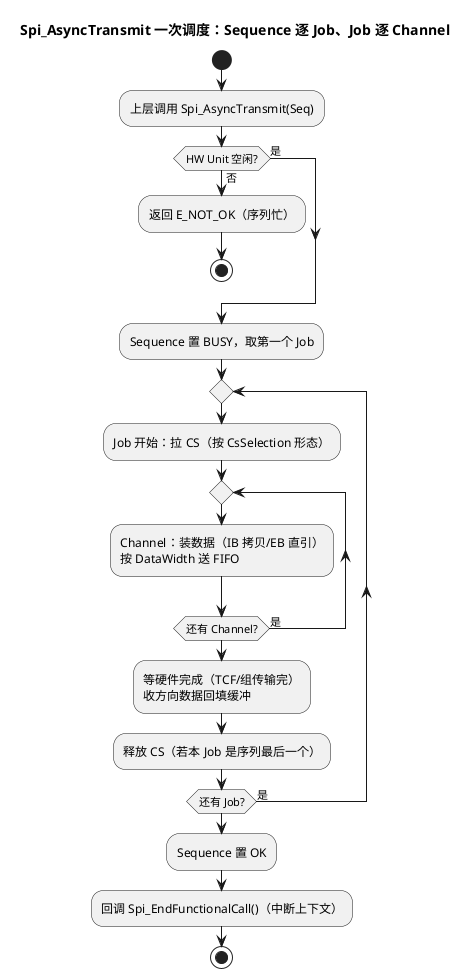

# 04-MCAL配置要点

> 一句话定位：拆开 MCAL Spi 最难懂的 Channel→Job→Sequence 三级结构，讲清同步/异步、IB/EB 缓冲与回调纪律，让 EB tresos 里那棵配置树有骨架可抓。
> 等级：L2 ｜ 前置：[02-S32K-LPSPI](02-S32K-LPSPI.md) + [03-TC377-ASCLIN-SPI](03-TC377-ASCLIN-SPI.md)

## 原理

### 三级结构：为什么不是"一发就完"

SPI 硬件的自然节奏是"**一次片选周期 = 一段连续字节流**"，而应用的需求是"读器件 ID、写 256 字节、读状态"这类**命令序列**。MCAL 用三级结构把两者对齐：

| 层级 | 直觉 | 对应硬件 | 关键属性 |
|---|---|---|---|
| SpiChannel | 一段缓冲（一次"喂数"） | FIFO 里的一段数据 | 数据宽度、长度、IB/EB、默认填充值 |
| SpiJob | **一次 CS 有效周期** | 一个片选+一组时序参数（LPSPI 命令字/ASCLIN 组） | 绑定 SpiDevice、CS 形态、优先级 |
| SpiSequence | 一次完整业务命令 | 多个 Job 的编排，异步调度单位 | 一次 Spi_AsyncTransmit 的粒度 |

例：读 NorFlash 一页 = Sequence{ Job1(CS 保持：发读命令+地址), Job2(同 CS：收数据) }——**Job2 必须共享 Job1 的 CS 周期或配置 CS 连续**，这正是"读命令被截断"问题在配置层的解法。



### 同步 vs 异步

- **异步**：`Spi_AsyncTransmit(Seq)` 立即返回，数据靠水线中断/DMA 搬运，完成时回调 `Spi_EndFunctionalCall`——运行期主力；
- **同步**：`Spi_SyncTransmit(Seq)` 阻塞到传完（轮询硬件），**不依赖中断**——启动早期（OS/中断未就绪）读器件 ID、标定一次性刷写的首选。

### IB 与 EB 缓冲

| 类型 | 数据放哪 | API | 取舍 |
|---|---|---|---|
| IB（Internal Buffer） | 驱动内部静态数组 | Spi_WriteIB / Spi_ReadIB | 安全（缓冲归驱动管），但有拷贝开销与长度上限 |
| EB（External Buffer） | 直接用上层指针 | Spi_SetupEB | 零拷贝，但**上层必须保证传输期间缓冲有效** |

### 回调纪律（一句话）

`Spi_EndFunctionalCall` 在**中断上下文**执行：只做"置事件/计数/翻标志"，解析数据、日志、再发 SPI 一律回任务层做。

## 双平台硬件单元对照

| 对照项 | TC377（ASCLIN-SPI 实现） | S32K（LPSPI 实现） |
|---|---|---|
| Job 承载 | ASCLIN 组 FIFO，组挂起/恢复切片 | LPSPI 命令字序列 |
| Channel 切换 | 组边界自动换源 | 按命令字/中断逐段喂数 |
| 完成判定 | 组传完+模块标志 | TCF+FIFO 空 |
| CS 保持实现 | 软件 CS 形态为主 | 命令字 CONT 位/软件形态 |
| 搬运方式 | 水线中断/DMA | 水线中断/DMA |
| 配置载体 | EB tresos + MCAL 描述文件 | EB tresos + S32K MCAL 描述文件 |

## MCAL 配置要点

| 配置项 | 层级 | 含义 | 典型值 | 易错点 |
|---|---|---|---|---|
| SpiDataWidth / SpiBufferLength | Channel | 单字位宽/缓冲长度 | 8bit / 1~N | 与上层实际报文长度不一致：多丢少补 Default |
| SpiDefaultData | Channel | 不足位/未初始化时填充 | 0xFF | 读器件时忘了它会被当 dummy 发出去 |
| SpiBufferType | Channel | IB 或 EB | IB 起步 | EB 与异步组合最易踩生存期坑 |
| SpiDeviceAssignment | Job | 绑定 Device（波特率/模式载体） | 每 CS 一个 Device | 两个从机共用 Device，时序参数互相覆盖 |
| SpiCsSelection | Job | CS/连续片选形态 | CS 连续 | 多 Job 序列选了"每 Job 释放"，命令被截断 |
| SpiJobPriority | Job | 同 HW 并发时顺序 | 常态默认 | 改了优先级又依赖先后顺序，时序反了 |
| SpiSeqAllowedHwUnit | Sequence | 允许跑在哪个 HW | 单一 HW | 配了两个 HW 又无调度逻辑，结果不确定 |
| SpiTransmitMode | Sequence | 同步/异步 | 异步 | 同步序列被运行期任务调用，长阻塞 |

## 代码示例

```c
/* IB：初始化期读 ID（同步，不依赖中断） */
void FlashInit_ReadId(void)
{
    (void)Spi_SetupEB(SpiConf_SpiChannel_Chan_Tx, au8Cmd, NULL_PTR, 1u);
    (void)Spi_SyncTransmit(SpiConf_SpiSequence_Seq_Id);
}

/* EB：运行期整页写（异步零拷贝，注意缓冲生存期） */
static uint8 au8Page[256];                 /* 必须是静态/堆缓冲，不能是栈上临时量 */
Std_ReturnType FlashWritePage(const uint8 *pu8Src)
{
    (void)Spi_SetupEB(SpiConf_SpiChannel_Chan_DataTx, pu8Src, NULL_PTR, 256u);
    return Spi_AsyncTransmit(SpiConf_SpiSequence_Seq_PageWrite); /* 立即返回 */
}

/* 完成回调：中断上下文，只做轻量动作 */
volatile boolean bSeqDone = FALSE;
void Spi_EndFunctionalCall(void)
{
    bSeqDone = TRUE;                       /* 置标志，业务逻辑回任务里做 */
}
```

## 易错点与陷阱

1. **Sequence 忙时返回 E_NOT_OK 被忽略**：现象是"偶发丢一次发送"；原因是上一个序列还没传完又提交；对策：检查返回值+忙则重试/排队，别盲调。
2. **EB 缓冲生存期**：异步还没传完，上层把栈上数组返回/复用，发出垃圾数据；对策：EB 缓冲用静态分配，完成回调后才允许复用。
3. **SpiWriteIB 长度语义**：按配置的 BufferLength 拷贝，调用方给短了会补 DefaultData——把 0xFF 当真实数据发出去；对策：配置长度=真实报文长度，或改 EB。
4. **回调里做重活/再调 Spi API**：回调里同步等下一次传输或长循环，中断堆积、系统卡死；对策：回调只置事件，任务层消化。
5. **多 Job 序列的 CS 形态配错**：每个 Job 都"独立 CS"，跨 Job 命令被从机当作新命令；对策：序列内 Job 配 CS 连续/保持，仅最后一个释放。
6. **同步传输在运行期滥用**：阻塞几十 ms 的任务抖动、看门狗逼近；对策：同步只用于启动早期，运行期一律异步。

## 面试高频题

- **Q：为什么 MCAL Spi 要分 Channel/Job/Sequence 三级？**
  A：对齐两个世界：Channel 对齐"喂数据的缓冲单位"，Job 对齐"一个片选周期的硬件单位"，Sequence 对齐"一次业务命令的调度单位"——让"读一页 Flash=发命令+收数据（同一 CS）"这类需求能被配置表达。
- **Q：IB 和 EB 怎么选？**
  A：小而频繁、想省事选 IB（驱动管缓冲，代价是拷贝）；大块数据、追求吞吐选 EB（零拷贝，代价是上层负责生存期）；混合系统常见"小命令 IB、大数据 EB"。
- **Q：Spi_AsyncTransmit 返回 E_OK 代表发送完成了吗？**
  A：不代表。只代表序列已受理；完成信号是 Spi_GetSequenceResult==SPI_SEQ_OK 或 Spi_EndFunctionalCall 回调。
- **Q：Spi_EndFunctionalCall 里能干什么不能干什么？**
  A：中断上下文——能：置事件/标志、计数；不能：阻塞等待、日志、再提交 SPI 传输（重入）。

## 延伸

- [02-S32K-LPSPI](02-S32K-LPSPI.md) / [03-TC377-ASCLIN-SPI](03-TC377-ASCLIN-SPI.md)：三级结构落到的两套硬件；
- [MCAL第一课-从点灯到分层驱动](../../00-入门导读/01-MCAL第一课-从点灯到分层驱动.md)：配置生成流程的地基；
- [02-iLLD与MCAL的关系](../../../02-芯片与体系结构/2-L2进阶/TC377平台/资源与iLLD/02-iLLD与MCAL的关系.md)：MCAL Spi 实现底下那层；
- [03-中断优先级实践](../../../02-芯片与体系结构/2-L2进阶/TC377平台/中断系统/03-中断优先级实践.md)：水线中断优先级怎么定。

---

维护约定：笔记命名 `序号-主题.md`；真实截图放 `_images/`；流程/时序/状态/架构图用 PlantUML 内嵌正文，规范见 [图表规范与模板](../../../00-总览/图表规范与模板.md)。
