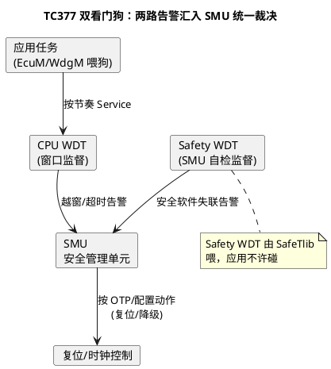

# 02-TC377-WDT

> 一句话定位：摸清 TC377 的"双狗"结构（CPU WDT + Safety WDT），用 SRVL/SRVH 窗口寄存器直觉吃透解锁-喂狗-锁定三段式，知道为什么这颗芯片的狗归 SMU 管。
> 等级：L2 ｜ 前置：[01-看门狗原理](01-看门狗原理.md)

## 原理

### 双看门狗结构：谁监督谁

TC377 有**两条独立的狗**，分工不同：

- **CPU WDT**：监督**应用代码**——喂狗节奏乱（任务卡死/调度异常）就咬，是最贴近业务的一层；
- **Safety WDT**：归 **SMU（Safety Management Unit，安全管理单元）**直管，监督**安全管理软件本身**（如英飞凌 SafeTlib 的自检流程）——应用层够不着它，两条狗的超时告警都汇入 SMU，由 SMU 按安全概念决定最终动作（复位/降级/NMI）。



一句话记法：**CPU WDT 咬应用，Safety WDT 咬安全软件，SMU 是唯一有牙齿的执行者**。多核/Lockstep 细节在 02 区安全篇展开。

### 寄存器直觉：CTR 与 SRVL/SRVH

| 寄存器（直觉名） | 作用 | 喂狗语义 |
|---|---|---|
| CTR（控制） | 使能、时钟预分频、触发模式选择 | 分频决定倒数快慢，配错=超时时间整体漂移 |
| SRV（服务） | **写一次=喂一次**：计数器清零重倒 | 写的时机必须在窗口内 |
| SRVL（窗口下限） | 最早合法喂狗点（计数值下界） | 早于它喂→越窗告警 |
| SRVH（窗口上限） | 最晚合法喂狗点（计数值上界） | 晚于它（或数到顶）→超时告警 |

窗口直觉：计数器一路爬升，**只有爬进 [SRVL, SRVH] 区间时写 SRV 才算合法喂狗**——这就是 01 篇"喂早也咬"的寄存器级实现。

### 触发模式：超时 / OTP

- **超时模式（TIMEOUT）**：计到上限触发告警，行为经 SMU 按**运行时可配**的响应走——开发期友好；
- **OTP 模式**：响应规则在**生命周期编程（一次性）阶段锁定**，之后任何人改不了——量产件的安全兜底，想关狗？门都没有。

### 解锁-喂狗-锁定三段式

TC377 的 WDT 寄存器被 **ENDINIT**（安全寄存器全局锁）保护：

1. **解锁**：向 WDT 控制寄存器写规定的密钥对，清掉 ENDINIT 位；
2. **操作**：改配置（分频/窗口/模式），或运行期写 SRV 喂狗（喂狗本身不需要解锁，否则太危险）；
3. **锁定**：重新置位 ENDINIT——**忘了这步，整套安全寄存器裸奔**，任何野指针都能改狗。

## 双平台硬件单元对照

| 对照项 | TC377（WDT） | S32K（WDOG/S32K3 WWDT） |
|---|---|---|
| 狗的条数 | CPU WDT ×每核 + Safety WDT | S32K1 一条 WDOG；S32K3 WWDT（可多路） |
| 窗口实现 | SRVL/SRVH 上下限寄存器 | S32K1 CS.WIN 位+WINV；S32K3 窗口寄存器 |
| 告警出口 | 统一汇入 SMU 裁决 | 直接复位/中断（S32K3 加预警中断） |
| 写保护机制 | ENDINIT 安全锁+密钥对 | CNT 写解锁魔数序列 |
| 不可逆锁定 | OTP 响应锁定 | S32K1 CS.UPDATE=0 后锁定 |
| 独立时钟 | 独立 WDT 振荡 | LPO 1kHz |

## MCAL 配置要点

| 配置项 | 含义 | 典型值 | 易错点 |
|---|---|---|---|
| WdgHwUnit | 选 CPU WDT（MCAL 只管应用狗） | CPU0 WDT | 误配到 Safety WDT，应用喂不上、SafeTlib 又没喂，直接复位 |
| WdgTimeoutPeriod | 等效 SRVH 时间 | 1000 ms 级 | 分频+LPO 精度换算，留 ±5% 裕量 |
| WdgWindowPeriod | 等效 SRVL 开窗比例 | 60% | 早喂复位被当成"狗坏了"排查半天 |
| WdgTriggerMode | 到期动作（经 SMU 路由） | 复位 | 开发期选 NMI 便于调试，量产忘改回复位 |
| WdgDefaultMode | Wdg_Init 后的模式 | WDGIF_FAST_MODE 等 | 与 EcuM 各阶段的模式切换表对不上 |

## 代码示例

```c
/* 配置期：解锁 → 改窗口/分频 → 锁定（安全寄存器三段式） */
void Wdt_ConfigWindow(void)
{
    IfxScuWdt_clearSafetyEndinit();          /* 1. 解锁：清 ENDINIT（内部写密钥对） */
    MODULE_CPU0WDT.WDTSRVL.U = WDTSRVL_VALUE; /* 2a. 窗口下限：最早喂狗点 */
    MODULE_CPU0WDT.WDTSRVH.U = WDTSRVH_VALUE; /* 2b. 窗口上限：最晚喂狗点 */
    IfxScuWdt_setSafetyEndinit();            /* 3. 锁定：恢复 ENDINIT，切勿遗漏！ */
}

/* 运行期喂狗：直接写 SRV（无需解锁），必须落在窗口内 */
void Wdt_FeedCpu0(void)
{
    MODULE_CPU0WDT.WDTSRV.U = WDT_SERVICE_PATTERN; /* 任意值写入=喂狗 */
}
```

## 易错点与陷阱

1. **改完配置忘了置回 ENDINIT**：现象是后续任何野写都能动安全寄存器，评审必挂；对策：解锁/锁定成对封装成一个函数，lint 检查成对调用。
2. **喂错狗**：应用喂了 Safety WDT 或反过来；现象是"明明喂了还复位"；对策：画狗-属主表：CPU WDT→WdgM/Wdg，Safety WDT→SafeTlib 专属。
3. **SRVL/SRVH 写反或相等**：窗口为空，怎么喂都越窗；对策：SRVL < 正常最早喂点 < SRVH，初始化时用断言验一遍。
4. **超时时间按理想时钟算**：忽略 WDT 独立振荡 ±数 % 漂移，边界上偶发复位；对策：裕量 ×1.5 覆盖温漂。
5. **开发期 NMI 动作带进量产**：狗咬只进 NMI 不复位，车真死机了不自愈；对策：模式配置与构建变体（Debug/Release）绑定复查。
6. **OTP 锁定前没验证**：生命周期编程后响应策略不可改，窗口错了只能换片；对策：OTP 前全工况窗口测试，OTP 是最后一道工序。

## 面试高频题

- **Q：TC377 为什么要两条狗？一条不够吗？**
  A：监督者自身也要被监督：CPU WDT 盯应用，Safety WDT 盯安全软件（SafeTlib 自检流），两路告警汇入 SMU 统一裁决——避免"监督软件自己卡死却没人管"的死角。
- **Q：SRVL/SRVH 在寄存器层怎么实现"喂早也咬"？**
  A：计数器爬升途中写 SRV 时，硬件检查当前计数值是否落在 [SRVL,SRVH]：低于下限=过早、高于上限=过晚，两者都产生告警，只有区间内写入才清零计数器。
- **Q：为什么喂狗不需要解锁 ENDINIT？**
  A：喂狗是每拍都要做的高频合法动作，若先解锁则每次都打开安全寄存器窗口，风险大于收益；所以喂狗路径与配置路径分离，配置才需要密钥解锁。
- **Q：OTP 模式的意义是什么？**
  A：把"狗咬之后的动作"在生命周期编程阶段一次性烧死，之后软件无法篡改或关闭——保证量产件上安全机制不可被绕过。

## 延伸

- [01-看门狗原理](01-看门狗原理.md)：窗口与喂狗序列的地基；
- [04-WdgM联动](04-WdgM联动.md)：谁来决定喂狗时机；
- [05-Lockstep安全机制](../../../02-芯片与体系结构/3-L3高级/TriCore架构/05-Lockstep安全机制.md)：TC377 硬件安全机制家族；
- [01-主从核启动](../../../02-芯片与体系结构/3-L3高级/多核架构/01-主从核启动.md)：多核下各核喂狗职责划分。

---

维护约定：笔记命名 `序号-主题.md`；真实截图放 `_images/`；流程/时序/状态/架构图用 PlantUML 内嵌正文，规范见 [图表规范与模板](../../../00-总览/图表规范与模板.md)。
