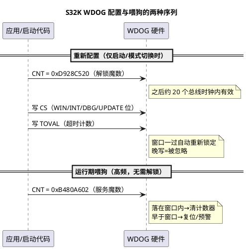

# 03-S32K-WDOG

> 一句话定位：以 S32K1 的 WDOG_CS 寄存器为地图读懂每个开关位，看 S32K3 WWDT 的窗口+预警中断升级，掌握解锁魔数序列与调试器挂起配置这些日常踩坑点。
> 等级：L2 ｜ 前置：[01-看门狗原理](01-看门狗原理.md)

## 原理

### S32K1 WDOG：一个 CS 寄存器说清所有开关

S32K1 的 WDOG 精简到两个核心寄存器：**CS**（控制/状态）+ **TOVAL**（超时值，LPO 1kHz 计数）。CS 的关键位：

| 位 | 直觉 | 量产典型值 |
|---|---|---|
| EN | 狗的总开关 | 1（启动早期就开） |
| INT | 到期**先中断不复位**（中断里还能抢救） | 0（直接复位最稳） |
| WIN | 开窗口模式：**喂早也咬** | 1（功能安全要求） |
| UPDATE | 是否允许重新配置（=0 后锁死） | 开发 1 / 量产看策略 |
| DBG | 调试器挂起时**暂停计数** | 调试 1 / 量产 0 |
| STOP/WAIT | 低功耗模式下暂停与否 | 按休眠策略 |
| PRES | 预分频：tick 从 1ms 拉长到 128ms | 长超时场景用 |
| FLG | 到期已发生标志（复位原因排查用） | — |

口诀：**INT 管"咬之前喊一嗓子"，WIN 管"喂太早也翻脸"，UPDATE 管"还能不能改"，DBG 管"调试时让不让狗睡觉"**。

### S32K3 WWDT：窗口 + 中断预警的进阶

S32K3 把 WDOG 升级为 **WWDT（Windowed WDT）**：窗口起点由专门寄存器配置（不再像 S32K1 那样窗口规则写死），并在窗口之前加了**预警中断**——喂狗进程落后时先中断提醒，软件还来得及补救，补救不成才真正复位。对功能安全的好处：把"咬狗"从突然死亡变成"预警→复位"两级响应，可诊断性大幅提升。

### 重新配置解锁序列：20 个总线时钟的窗口

WDOG 运行后默认锁死，改配置（CS/TOVAL）必须先**写 CNT 解锁魔数**（S32K1 为 0xD928C520），解锁只在随后**极短窗口（约 20 个总线时钟）**内有效，写完目标寄存器立即自动回锁。这个设计防止跑飞代码慢悠悠地改狗配置。



注意：**解锁魔数 ≠ 喂狗魔数**，写错成对方就白写或误触发。

### LPO 时钟独立性

S32K 的 WDOG 由 **LPO（1kHz 片内低速振荡器）**驱动，不从 SCG 的 PLL/FIRC 走线——主时钟树整个趴下，狗照数不误。代价：LPO 精度 ±（数 %），TOVAL 要按最坏精度留裕量；另外低功耗模式是否暂停由 CS.STOP/WAIT 决定，**配错会出现"睡一觉醒来被咬"**。

### 调试器挂起：DBG 位

停在断点时 CPU 不跑，喂狗自然停摆，狗到点就把调试会话咬掉——CS.DBG=1 让**调试挂起期间计数暂停**。只应在调试构建打开，量产版狗必须全速跑。

## 双平台硬件单元对照

| 对照项 | S32K1（WDOG） | S32K3（WWDT） | TC377（WDT） |
|---|---|---|---|
| 窗口配置 | CS.WIN 开关，规则固定 | 专门窗口寄存器，灵活 | SRVL/SRVH 上下限 |
| 预警中断 | 无（INT 位=到期中断） | 窗口前预警中断 | 经 SMU 告警 |
| 解锁方式 | CNT 写 0xD928C520 | UNLOCK 序列寄存器 | ENDINIT+密钥对 |
| 喂狗方式 | CNT 写 0xB480A602 | 写服务寄存器 | 写 SRV 任意值 |
| 独立时钟 | LPO 1kHz | LPO | 独立 WDT 振荡 |
| 调试暂停 | CS.DBG 位 | 对应 DBG 配置 | 调试挂起可暂停 |

## MCAL 配置要点

| 配置项 | 含义 | 典型值 | 易错点 |
|---|---|---|---|
| WdgHwUnit | 选哪路狗 | S32K1 唯一；S32K3 按核/域选 | 多路狗喂错路，复位照旧 |
| WdgTimeoutPeriod | TOVAL 等效时间 | 500~2000 ms | 单位是 LPO tick，别按总线时钟算 |
| WdgWindowPeriod | 开窗点 | 40%~60% | S32K1 窗口规则固定，先读手册再定喂狗周期 |
| WdgClockReference | 时钟源 | LPO | 改成主时钟派生=丢独立性 |
| WdgDebuggerEnable | DBG 位 | 调试 1/量产 0 | 量产忘关，狗在调试器场景形同虚设 |
| WdgSettingMode(休眠) | STOP/WAIT 行为 | 按休眠策略 | 睡眠不暂停→被咬；一直暂停→休眠失去监督 |

## 代码示例

```c
/* S32K1 风格：启动期重新配置 WDOG（解锁→改→自动回锁） */
void Wdog_Reconfig(uint16 u16TimeoutMs)
{
    WDOG->CNT = (uint32)0xD928C520u;          /* 1. 解锁魔数（20 总线时钟窗口开启） */
    __asm volatile("nop");                     /* 紧凑写完，不要插入慢操作 */
    WDOG->TOVAL = u16TimeoutMs;                /* 2. 超时值（LPO 1kHz：值即 ms） */
    WDOG->CS   = WDOG_CS_EN(1)     |           /* 使能 */
                 WDOG_CS_WIN(1)    |           /* 窗口模式：喂早也咬 */
                 WDOG_CS_UPDATE(1) |           /* 仍允许后续重配 */
                 WDOG_CS_DBG(1);               /* 调试构建才置 1，量产置 0 */
}

/* 运行期喂狗：服务魔数，由 Wdg_SetTriggerCondition 间接触发 */
void Wdog_Feed(void)
{
    WDOG->CNT = (uint32)0xB480A602u;          /* 喂狗魔数≠解锁魔数！ */
}
```

## 易错点与陷阱

1. **解锁窗口内没写完**：解锁与写 CS/TOVAL 之间插了函数调用/慢总线访问，20 时钟已过，写入被静默忽略；对策：三步写紧凑排布，不做任何夹带。
2. **UPDATE=0 又想改配置**：量产锁定后所有重配写无效，低功耗超时调整做不了；对策：需要运行时改狗的策略在锁定前想清楚。
3. **WIN 开了、喂狗却在任务开头**：每次喂都早于窗口，上电即复位循环；对策：喂狗点放在受监督任务的**末端**，验证落在 (开窗, 关窗) 内。
4. **调试器一断点就复位**：DBG 位没开；对策：调试构建置 DBG，用编译变体隔离，量产复查归零。
5. **低功耗模式被咬**：STOP/WAIT 位默认不暂停，睡眠期 LPO 照数；对策：休眠前 Wdg_SetMode 切长超时或允许暂停，唤醒后立刻恢复。
6. **S32K1 序列搬到 S32K3 想当然**：解锁/服务魔数与寄存器布局不同，移植后狗"喂不上"；对策：以 RTD 对应版本手册为准，封装在平台层。

## 面试高频题

- **Q：CS 里 INT 位和 S32K3 的预警中断有何不同？**
  A：INT 是"到期时用中断代替复位"（单级，中断没处理照样危险）；S32K3 预警是"窗口前先提醒、复位前再给一次机会"（两级响应），可诊断性更好。
- **Q：解锁序列为什么要限 20 个总线时钟？**
  A：让"合法改配置"的时间窗极短：正常代码紧凑写完没问题；跑飞代码既要知道魔数又要在 20 拍内连续正确写两个寄存器，概率趋近于零。
- **Q：DBG 位量产为什么不许置 1？**
  A：调试器挂起时狗暂停=攻击者/产线工装可以用调试口无限期冻结系统而不触发复位，安全机制被旁路。
- **Q：WDOG 用 LPO 的利弊？**
  A：利：独立于主时钟域，时钟树死了狗还在；弊：精度差（±数 %）需超时裕量，且休眠策略要单独考虑 STOP/WAIT 位。

## 延伸

- [01-看门狗原理](01-看门狗原理.md)：窗口/独立时钟的通用地基；
- [04-WdgM联动](04-WdgM联动.md)：喂狗决策上收到 WdgM 之后的变化；
- [01-内核与资源对比](../../../02-芯片与体系结构/1-L1基础/S32K平台/S32K1与S32K3对比/01-内核与资源对比.md)：两代 S32K 的安全外设差异；
- [02-S32K复位流程](../../../02-芯片与体系结构/2-L2进阶/启动流程/02-S32K复位流程.md)：狗咬后从复位向量重新爬起的全过程；
- [01-SCG与PCC](../../../02-芯片与体系结构/1-L1基础/S32K平台/时钟系统/01-SCG与PCC.md)：LPO 在时钟系统里的位置。

---

维护约定：笔记命名 `序号-主题.md`；真实截图放 `_images/`；流程/时序/状态/架构图用 PlantUML 内嵌正文，规范见 [图表规范与模板](../../../00-总览/图表规范与模板.md)。
