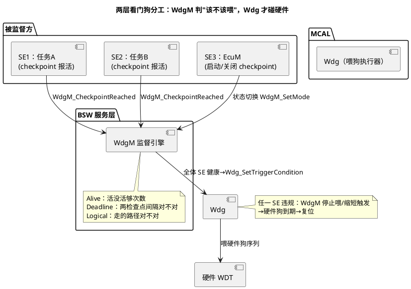
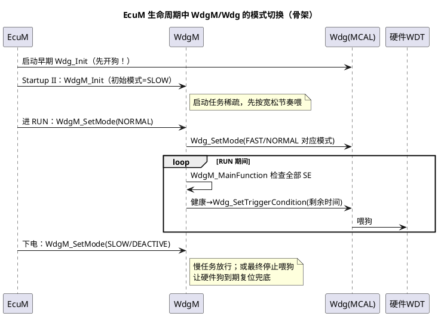

# 04-WdgM联动

> 一句话定位：画清"BSW WdgM 管决策、MCAL Wdg 管喂狗"的两层分工，吃透 Alive/Deadline/Logical 三种监督与 EcuM 启动关闭时的模式切换，从此不再把两个模块混为一谈。
> 等级：L2 ｜ 前置：[01-看门狗原理](01-看门狗原理.md)

## 原理

### 两层分工：决策与执行分离

直接让每个任务各自喂硬件狗等于没狗（谁都能喂，卡死的照样被别人代喂）。AUTOSAR 的解法是插进一个**决策层**：



一句话：**WdgM 只回答"系统是否值得续命"，Wdg 负责按答案去摸狗头**。硬件狗永远存在，WdgM 卡死时它照咬不误——这叫监督者也须被监督。

### 三种监督各防什么

| 监督类型 | 检查什么 | 典型违规 | 直觉 |
|---|---|---|---|
| Alive | 周期内 checkpoint 报到**次数**在 [min,max] | 任务卡死（太少）/任务狂转（太多） | "活没活够、别刷屏" |
| Deadline | 两个 checkpoint **之间**的时间在 [min,max] | 处理太快（缓存命中异常）/太慢（阻塞） | "这段路用时正常吗" |
| Logical | checkpoint 到达**顺序**符合预定图 | 跳步/回跳/跑了不该走的分支 | "走的路线对吗" |

三件套合起来覆盖"频率、时长、路径"三个维度的程序流错误，是 ISO 26262 对软件监督的典型落法。

### Shutdown：分阶段降低喂狗频率

正常喂狗频率按 RUN 阶段任务节奏定；但下电序列（EcuM SHUTDOWN：刷 NvM、发最后一帧网络管理报文）比正常运行慢得多。若维持原节奏，狗会在关机半路咬人。所以 WdgM 支持**按模式切换监督参数**：进 SHUTDOWN 前 EcuM 调 `WdgM_SetMode`，切到低频/宽松模式（对应 MCAL 侧 Wdg 的 SLOW 模式、更长的 WdgSettings 超时集），必要时最终**主动停止喂狗**，让狗到期复位作为下电兜底——"分阶段降低喂狗频率"不是偷懒，是让关机既慢得下来又仍受保护。

### 与 EcuM 的启动关闭时序



关键顺序：**狗要在生命周期最早期就开**（裸奔窗口最短），WdgM 再接管喂狗节奏——顺序反了等于启动期没人管狗。

## 双平台硬件单元对照

| 对照项 | TC377 方案 | S32K 方案 |
|---|---|---|
| 喂的哪条狗 | CPU WDT（SMU 裁决出口） | WDOG/WWDT（直接复位出口） |
| 模式载体 | WdgSettingsFast/Normal/Slow 映射 WDT 窗口 | 映射 TOVAL/窗口位 |
| Safety WDT | SafeTlib 独立喂，WdgM 不碰 | 无对应（S32K3 按域另配） |
| 咬后行为 | SMU 按安全概念动作 | 复位（S32K3 可预警中断） |
| WdgM 实现来源 | Vector/EB 等 BSW 栈，平台无关 | 同左（BSW 与芯片解耦） |

## MCAL 配置要点 / 接口契约

| 配置项/API | 含义 | 典型值或签名 | 易错点 |
|---|---|---|---|
| WdgMSE / Checkpoint | 监督实体与检查点 | `WdgM_CheckpointReached(SE, CP)` | checkpoint 忘埋=该 SE 永远"健康"假象 |
| WdgMAliveSupervision | 活监督参数 | Reference=任务周期×MainFunction 比 | min/max margin 过窄，正常抖动被咬 |
| WdgMDeadlineSupervision | 期限监督参数 | 起止 CP + min/max | 起止 CP 埋在同一循环里，永远测不出 |
| WdgMMode | 监督模式集 | SLOW/NORMAL/FAST/… | 模式切换处 Wdg 侧超时没同步加长 |
| WdgM_SetMode | EcuM 切模式 | `WdgM_SetMode(mode)` | 忘切=下电慢任务被咬（高频误报） |
| Wdg_SetTriggerCondition | 延后到期（喂狗化身） | `Wdg_SetTriggerCondition(timeout)` | 参数是"还要多久"，不是绝对时刻 |
| WdgM_MainFunction | 监督引擎心跳 | OS 任务周期 10~50ms | 周期≠参数假定的周期，全家算错 |

## 代码示例

```c
/* 任务侧：被监督实体报活（Alive checkpoint） */
TASK(Task_20ms)
{
    /* ... 业务 ... */
    (void)WdgM_CheckpointReached(SEID_Task20ms, CPID_Task20ms_Loop); /* 循环末报活 */
    TerminateTask();
}

/* 周期任务里驱动 WdgM 引擎（OS 调度） */
TASK(Task_WdgM)
{
    (void)WdgM_MainFunction();   /* 检查全部 SE；全体健康时内部调用
                                    Wdg_SetTriggerCondition 完成间接喂狗 */
    TerminateTask();
}

/* EcuM 下电回调：切慢模式，给 NvM 刷写留时间 */
void EcuM_ShutdownHook(void)
{
    (void)WdgM_SetMode(WdgMConf_Mode_Slow);   /* 对应 Wdg 侧更长超时集 */
}
```

## 易错点与陷阱

1. **WdgM_MainFunction 没跑或跑错周期**：现象是上电几秒后莫名复位；原因是引擎没心跳，所有 SE 判死，停止喂狗；对策：确认 OS 任务激活+周期与配置参数同源。
2. **Alive margin 太紧**：min 卡在理论周期上，任务稍抖就违规；对策：min 按周期×(1-裕量)，max 按(1+裕量)，先宽后紧。
3. **Shutdown 忘切模式**：下电刷 NvM 慢任务超了 RUN 节奏，复位当崩溃报；对策：EcuM shutdown 钩子里 WdgM_SetMode(SLOW)，Wdg 侧同步配 WdgSettingsSlow。
4. **配了 WdgM 却没配任何 SE**：监督集为空=永远"全体健康"，狗被无脑喂；对策：配置评审检查 SE 清单非空且覆盖关键任务。
5. **多核 SE 汇报延迟**：从核 checkpoint 跨核到 WdgM 所在核，Alive 判定偏移；对策：跨核裕量单独放宽，或各核独立 WdgM 实例。
6. **把 WdgM 当硬件狗**：以为 WdgM 自身能复位系统；实际复位能力永远来自硬件 WDT，WdgM 只是决定何时停止"续命"。

## 面试高频题

- **Q：WdgM 和 Wdg（MCAL）到底谁喂狗？**
  A：Wdg 执行喂（碰寄存器），WdgM 决定喂不喂——WdgM_MainFunction 评估全部监督实体，健康才调 Wdg_SetTriggerCondition 续命；任何违规都通过"停止续命"让硬件狗咬人。
- **Q：三种监督分别对应什么失效模式？**
  A：Alive 防任务卡死/狂转（频率错）；Deadline 防阶段超时或异常加速（时长错）；Logical 防控制流跑偏（路径错）。
- **Q：为什么下电阶段要降低喂狗频率甚至停喂？**
  A：下电慢任务（NvM 刷写、NM 报文）节奏远慢于 RUN；不切模式会被误咬，切到慢模式后既放行慢流程又保留兜底，最终停喂让狗复位作为最后的下电保障。
- **Q：硬件狗在 WdgM 失效时还有用吗？**
  A：有——这正是两层设计的意义：WdgM 卡死没人调 Wdg_SetTriggerCondition，硬件狗自然到期复位；监督者自身也被硬件狗监督。

## 延伸

- [02-TC377-WDT](02-TC377-WDT.md) / [03-S32K-WDOG](03-S32K-WDOG.md)：两层分工中的硬件执行端；
- [01-主从核启动](../../../02-芯片与体系结构/3-L3高级/多核架构/01-主从核启动.md)：多核下 SE 与 WdgM 的分布问题；
- [05-Lockstep安全机制](../../../02-芯片与体系结构/3-L3高级/TriCore架构/05-Lockstep安全机制.md)：硬件容错与软件监督的配合；
- [07 区 WdgM 监督实体与checkpoint](../../../07-AUTOSAR架构/2-L2进阶/系统服务栈/WdgM/01-监督实体与checkpoint.md)：BSW 侧展开。

---

维护约定：笔记命名 `序号-主题.md`；真实截图放 `_images/`；流程/时序/状态/架构图用 PlantUML 内嵌正文，规范见 [图表规范与模板](../../../00-总览/图表规范与模板.md)。
