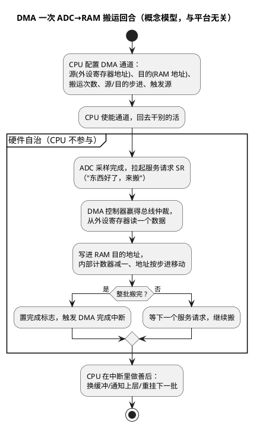

# 01-DMA原理

> 一句话定位：DMA 是挂在总线上的专职搬运工——外设一句"东西好了"它就自己搬，CPU 只在搬完时被打扰一下，本篇建立直觉与地图，寄存器细节留给工程篇。
> 等级：L2→L3 ｜ 前置：[MCAL第一课-从点灯到分层驱动](../../00-入门导读/01-MCAL第一课-从点灯到分层驱动.md)

## 太长不看

> - 人话直觉：DMA 就是不占 CPU 的搬运工，外设喊一嗓子它就把数据从外设寄存器搬到内存（或反向），搬完才敲一下 CPU 的门。
> - 本篇解决：为什么用 DMA、搬运一圈长什么样、通道/请求/描述符这些词到底是什么关系。
> - 赶时间记住：①DMA 与 CPU 都是总线主人，搬数据不经过 CPU 寄存器；②搬运由"请求源触发+搬运规则"描述，规则放在一个叫描述符/寄存器组的小表格里；③搬完通常走中断通知，CPU 的活变成"配置+善后"。

## 原理

### 一次搬运的完整回合（activity 图）



三个直觉锚点：

1. **触发驱动**：DMA 不自己"决定"搬运，由外设的服务请求（TC377 语境叫 SR，S32K 语境叫 DMA 请求）按节奏触发，一拍搬一个或一小串；
2. **规则先行**：源地址、目的地址、步进、次数这些"搬运规则"由 CPU 提前写好，DMA 只是执行者；
3. **完成才打扰 CPU**：全程 CPU 零参与，只有收尾中断需要 CPU。

### 为什么用 DMA：三笔账

- **CPU 卸载**：不搬数据，CPU 就不用在每个字节上进出中断——1Mbps 的 UART 每字节约百十来个周期，轮询/单字节中断直接吃掉大半 CPU；
- **带宽**：搬运走总线直接到内存，不经过 CPU 寄存器倒手，大数据流（ADC 连续采样、大块 SPI 帧吞吐）更快更省；
- **确定性**：搬运时序不随软件负载抖动，硬实时采样/通信窗口更容易保证。

### 总线主从一句话 + 描述符一段

- **总线主从**：CPU、DMA 控制器都是能主动发起读写的"总线主（Master）"，外设与内存是被动应答的"从（Slave）"；DMA 的本事就是自己当主，替 CPU 跑腿。
- **描述符/链表一段话**：搬运规则（源/目的/次数/步进/下一跳）打包成一张小表格，S32K 叫 TCD（传输控制描述符），有的实现还支持把多个描述符串成链表自动接力、实现"搬完这块自动搬下一块"——本专题点到为止，描述符字段级细节留给工程阶段查手册。

## 双平台对照

| 对照维度 | TC377（AURIX TC3xx） | S32K1xx |
|---|---|---|
| DMA 引擎 | 两个多通道 DMA（DMA0/DMA1），几十个通道 | 一个 eDMA（32 通道）+ 前级 DMAMUX 请求路由器 |
| 请求接入 | 外设服务请求 SR 直连通道 | 外设请求先进 DMAMUX，再分配给 eDMA 通道 |
| 搬运规则载体 | 通道寄存器组（TSR/ADICR/SADR/DADR 等直觉即"规则表"） | TCD 传输控制描述符（每通道一张，16 个字段左右） |
| 链式接力 | 支持链接模式（channel chaining/link） | TCD 链表/.scatter-gather，MAJOR 循环完成自动加载下一 TCD |
| 典型用户 | ADC 结果、ASCLIN 收发、GTM 数据流 | LPUART/LPSPI/LPI2C 收发、ADC 转换结果 |
| 软件生态 | iLLD 封装 + 常以 CDD 形态接入 AUTOSAR | RTD edma_drv/DMAMUX 驱动，常以 CDD 接入 |

一句话记：**TC377 是"多组通道各自接活"，S32K 是"请求先过路由器（DMAMUX）再进真 DMA（eDMA）"**——两平台的配置路径都由此定形。

## 配置要点

（点到即止，路径而非寄存器）

- **选触发源**：先确定"谁喊搬"（ADC 转换完成？UART 收满？定时器？），这决定请求源选择/路由配置；
- **写搬运规则**：源地址（外设数据寄存器）、目的地址（RAM 缓冲）、单次宽度、总次数、地址步进（外设侧通常固定不步进，RAM 侧递增）；
- **定完成动作**：搬完触发中断/只置标志，中断里做缓冲交接；
- **通道优先级**：多通道并存时定优先级与抢占策略（02/03 篇展开）；
- **AUTOSAR 视角**：DMA 不是标准 MCAL 模块，通常以 CDD 形态为 Adc/Spi/CanDrv 提供后台搬运——正是 CDD 方法论（2-L2进阶/CDD设计方法论）的典型服务对象。

## 代码示例

```c
/* 一次 ADC→RAM 搬运的通道配置伪代码（概念级，平台细节见 02/03 篇） */
typedef struct {
    volatile uint32 *srcAddr;    /* 源：ADC 结果寄存器地址（不步进） */
    uint16          *dstAddr;    /* 目的：RAM 缓冲（每次 +2 步进） */
    uint16          count;       /* 搬运次数：攒够 N 个采样 */
    uint8           trigger;     /* 触发源：ADC 组转换完成请求 */
    uint8           ch;          /* 通道号 */
} DmaXferCfg_t;

void Dma_AdcToRam_Setup(const DmaXferCfg_t *c)
{
    Dma_ConnectTrigger(c->ch, c->trigger);       /* 路由：谁触发本通道（S32K 在 DMAMUX 配） */
    Dma_SetSource(c->ch, c->srcAddr, WIDTH_16B, /* 源地址/宽度 */
                  FIXED_ADDR);                   /* 外设寄存器地址不动 */
    Dma_SetDest(c->ch, c->dstAddr, WIDTH_16B,
                INCREMENT_2B);                   /* RAM 每写一个走 2 字节 */
    Dma_SetCount(c->ch, c->count);               /* 搬 N 个后置完成标志 */
    Dma_EnableDoneIrq(c->ch);                    /* 完成中断：CPU 只在这时出现 */
    Dma_Start(c->ch);                            /* 使能，进入待命 */
}

/* ISR(Cdd_DmaCh0Handler) 里：缓冲交接 + 重挂 */
if (Dma_IsDone(DMA_CH0)) {
    Dma_ClearDone(DMA_CH0);
    AdcGroup_NotifyBufferReady(g_adcBuf);        /* 半满/全满双缓冲切换 */
    Dma_SetDest(DMA_CH0, g_adcBufNext, WIDTH_16B, INCREMENT_2B);
    Dma_Start(DMA_CH0);
}
```

## 易错点与陷阱

1. **现象**：DMA"搬了个寂寞"（目的缓冲全 0/全 0xFF）。**原因**：触发源没接对（外设根本没发请求）或通道没使能。**对策**：先用轮询确认外设真在产生数据，再查请求路由与使能位。
2. **现象**：偶发数据错位/半批旧半批新。**原因**：CPU 正在读缓冲时 DMA 又开始写（缓冲无交接协议）。**对策**：双缓冲+完成中断切换，读/写永远不同缓冲。
3. **现象**：改了缓冲指针后 DMA 仍写老地址。**原因**：只改了 C 变量没重新编程目的地址寄存器/描述符。**对策**：换缓冲必须走一次 DMA 重配置（或用链接描述符自动换）。
4. **现象**：Cache 平台上偶发读到旧数据。**原因**：DMA 直接写内存，CPU 的 Cache 里还是旧副本。**对策**：缓冲放非缓存区或搬运边界做 Cache 维护（详见 02 区 Cache 与 MPU 笔记）。
5. **现象**：传输计数对不上（多搬/少搬）。**原因**：宽度与步进配置不匹配（如 16 位数据按 8 位步进）。**对策**：源/目的宽度、步进、计数三项对着手册单位逐一核。
6. **现象**：与低优先级通道互踩，偶发丢数据。**原因**：优先级/抢占策略没规划，高带宽通道饿死别人。**对策**：按"谁丢不起数据谁优先"排优先级（02/03 篇展开）。

## 面试高频题

1. **DMA 和 CPU 中断方式搬数据有什么区别？各自的开销在哪？**
   答：DMA：一次配置+一次完成中断；中断方式：每字节/每帧进一次中断，CPU 开销与数据量成正比。
2. **DMA 搬运时 CPU 在干什么？两者会冲突吗？**
   答：CPU 继续跑任务；两者都是总线主，靠总线仲裁分时，极端时 CPU 带宽被挤占（需留预算）。
3. **什么是描述符？为什么需要它？**
   答：搬运规则的表格化（源/目的/次数/步进/下一跳）；有了它才能"一次配置多次执行"和链式接力。
4. **DMA 用在哪些场景最划算？**
   答：周期性大数据流：ADC 连续采样、高速 UART/SPI 收发、CAN/LIN 报文缓冲，判据是"中断频率高到吃 CPU"。

## 延伸

- [02-TC377-DMA](02-TC377-DMA.md)｜[03-S32K-eDMA-DMAMUX](03-S32K-eDMA-DMAMUX.md)：本篇概念落到双平台的配置路径；
- [总线与DMA](../../../02-芯片与体系结构/2-L2进阶/体系结构通用/04-总线与DMA.md)：总线主从、仲裁与带宽的体系结构视角；
- [Cache与MPU](../../../02-芯片与体系结构/2-L2进阶/体系结构通用/03-Cache与MPU.md)：DMA 与 Cache 一致性问题的原理；
- [CDD定位与边界](../../2-L2进阶/CDD设计方法论/01-CDD定位与边界.md)：DMA 作为典型非标模块接入 AUTOSAR 的形态；
- [MCAL第一课-从点灯到分层驱动](../../00-入门导读/01-MCAL第一课-从点灯到分层驱动.md)：DMA 在 MCAL 家族速览表中的位置。
- 工程深入场景：多通道 ADC 连续采样进双缓冲 + CAN 报文 DMA 收发并存时的通道优先级规划。