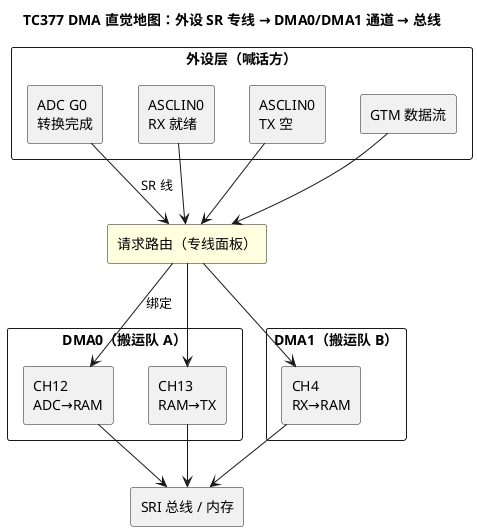

# 02-TC377-DMA

> 一句话定位：TC377 的 DMA0/DMA1 是两组自带几十条通道的搬运队，外设的服务请求（SR）按线号点名通道干活——本篇给直觉与配置路径，寄存器细节点到即止。
> 等级：L2→L3 ｜ 前置：[01-DMA原理](01-DMA原理.md)

## 太长不看

> - 人话直觉：TC377 有 DMA0/DMA1 两个搬运队，每队几十条通道；每个外设的服务请求 SR 像一根专线，预先接死到某条通道，谁喊谁对应的通道就动。
> - 本篇解决：请求线怎么接、通道怎么配、优先级怎么排，以及 ADC/ASCLIN 两个典型场景的路径。
> - 赶时间记住：①一条外设 SR 线绑定一条 DMA 通道（编译期就定）；②通道搬运规则=源/目的/步进/次数，写在通道寄存器组里；③优先级+抢占决定多通道并存时的秩序，高带宽高紧急的排前面。

## 原理

### 通道与请求源：专线制，不是总调度

TC377（AURIX TC3xx）的直觉模型：

- **两个多通道 DMA 引擎**：DMA0 与 DMA1，各自带几十条通道（如各 48 条），互相独立，天然可以把"通讯类"与"采样类"分引擎隔离；
- **服务请求 SR（Service Request）**：外设喊话的物理连线，每个外设事件源（如"ADC 组 Gx 转换完成"）有自己的 SR 输出；
- **专线绑定**：SR 线接到哪条 DMA 通道，在路由层（DMA 请求路由，DAMA 类配置）里静态指定——"哪个请求触发哪条通道"是设计期决定，不是运行期抢的。



### 通道优先级与抢占

- 每条通道有**优先级**，同引擎内仲裁：优先级高的先获得总线；典型做法——丢不起数据的（CAN 收、ADC 实时流）排高，搬不急的（日志类大块搬）排低；
- 支持**抢占**：高优先级通道可以打断低优先级通道正在进行的搬运，代价是恢复时要还原通道上下文（时间开销），所以要"分级少、级差有理由"；
- 两个引擎之间互不抢占，靠分引擎规划天然隔离抖动。

### 典型场景（点到即止）

- **ADC 结果搬运**：触发源=转换完成 SR → 每次搬 1 个（或 2 个）结果进 RAM 双缓冲，攒满半区发完成中断，应用层零打扰拿到连续采样流；
- **ASCLIN 收发**：RX 就绪 SR 触发"外设→RAM"通道（收），TX 空 SR 触发"RAM→外设"通道（发），两通道一对，串口吞吐不再吃 CPU。

## 双平台对照

| 对照维度 | TC377 DMA0/DMA1 | S32K eDMA+DMAMUX |
|---|---|---|
| 结构 | 两组多通道 DMA，各几十条通道 | 单 eDMA（32 通道）+ 前置 DMAMUX 路由 |
| 请求接入 | SR 专线静态绑定通道 | 请求经 DMAMUX 动态分配到 eDMA 通道 |
| 规则载体 | 通道寄存器组（源/目的/步进/计数） | 每通道一张 TCD 描述符 |
| 链式接力 | 通道链接/两通道乒乓 | TCD 链表、scatter-gather |
| 优先级 | 通道优先级+可抢占 | 通道固定优先级+轮转仲裁可选 |
| 软件生态 | iLLD 封装，AUTOSAR 里常做 CDD | RTD edma_drv，AUTOSAR 里常做 CDD |

一句话记：**TC377 像两家搬家公司各管一摊（专线直达），S32K 像一家公司+总台转接（DMAMUX 排线）**。

## 配置要点

- **第一步永远是接请求线**：列出外设事件源 → 选定 DMA 引擎与通道号 → 在路由配置里把 SR 绑定到该通道（一张"请求线分配表"先于代码存在）；
- **通道规则四件套**：源地址（外设数据寄存器，固定）、目的地址（RAM 缓冲，递增）、单次宽度、总次数；收发两个方向配两条通道；
- **中断与完成方式**：整批完成（攒满缓冲）才开中断，逐次搬运靠硬件；双缓冲切换放中断里；
- **优先级表**：按数据丢失代价排序，写进设计文档；抢占级差控制在 2~3 级；
- **在 AUTOSAR 中的位置**：DMA 非 MCAL 标准模块，通常以 CDD 封装给 Adc/Spi/CanDrv 用——接口设计与评审规则见 2-L2进阶/CDD设计方法论。

## 代码示例

```c
/* TC377：ADC 结果 → RAM 双缓冲的通道配置伪代码（iLLD 风格直觉版） */
void CddDma_AdcStream_Init(void)
{
    /* 1) 接线：ADC G0 转换完成 SR 绑定到 DMA0 的 CH12 */
    IfxDma_ConnectRequest(SRC_ADC_G0_CH0, IFXDMA_ENGINE_0, CH_12);

    /* 2) 规则：源固定 / 目的递增 / 每次 16bit / 共 128 次 */
    IfxDma_ChannelCfg_t cfg = {
        .srcAddr  = (uint32)&MODULE_VADC.G0.RES0,   /* 外设结果寄存器 */
        .dstAddr  = (uint32)g_adcBuf[0],            /* 双缓冲第 0 块 */
        .width    = IFXDMA_WIDTH_16,
        .count    = 128u,
        .srcStep  = IFXDMA_STEP_0,                  /* 外设地址不动 */
        .dstStep  = IFXDMA_STEP_2,                  /* RAM 逐半字递增 */
        .priority = 3u,                             /* 丢不起，排高 */
    };
    (void)IfxDma_InitChannel(CH_12, &cfg);
    IfxDma_EnableDoneIrq(CH_12);                    /* 攒满才喊 CPU */
    IfxDma_Start(CH_12);
}

/* ISR(Cdd_Dma0Ch12Handler) —— 通道 12 服务中断 */
ISR(Cdd_Dma0Ch12Handler)
{
    IfxDma_ClearDone(CH_12);
    AdcStream_SwapHalf();                           /* 半满/全满双缓冲交接 */
    IfxDma_SetDest(CH_12, (uint32)AdcStream_NextHalf());
    IfxDma_Start(CH_12);
}
```

## 易错点与陷阱

1. **现象**：通道配好但永远不动。**原因**：SR 绑定错线/选错引擎，或外设侧根本没使能 DMA 请求（ADC 只配了中断模式）。**对策**：先确认外设真的在拉 SR（示波器/寄存器状态），再核对路由表。
2. **现象**：收发方向搞反，写外设寄存器把外设搞挂。**原因**：TX 通道的源/目的配反（把 RAM 当了源读没问题，但把外设数据寄存器当目的写会破坏状态）。**对策**：方向二字诀——"收：外设→RAM；发：RAM→外设"，配置后先在仿真器里空跑验证。
3. **现象**：低优先级通道偶发丢数据。**原因**：高优先级通道持续占用总线+抢占太狠。**对策**：重新排优先级/限制抢占级差；把大块搬运切小批。
4. **现象**：双缓冲切换后数据仍写老地址。**原因**：中断里只换了软件指针，没重编程通道目的地址并重新 Start。**对策**：换缓冲必须走"停通道→改地址→再启动"完整序列。
5. **现象**：DMA0/DMA1 同名宏混用，配置互相覆盖。**原因**：两引擎寄存器布局相似，宏只差一个数字。**对策**：请求线分配表里连引擎号一起写，代码评审对表。
6. **现象**：与 iLLD 的初始化顺序打架，偶发首包丢。**原因**：DMA 通道先 Start 而 ADC 后启动（第一拍请求丢失不补）。**对策**：外设先就绪、通道后启动，或首拍容忍丢弃。

## 面试高频题

1. **TC377 的 DMA0/DMA1 为什么要两组？**
   答：隔离与带宽：把实时采样与通讯流分引擎，互不抢占、互不抢总线配额，抖动可控。
2. **服务请求 SR 是什么？和中断有什么区别？**
   答：外设事件到 DMA 的硬件请求线；同一事件可以既触发 DMA 又触发 CPU 中断（或只给 DMA），SR 是"喊 DMA 干活"，中断是"喊 CPU 干活"。
3. **通道优先级怎么排？抢占有什么代价？**
   答：按丢数据代价排；抢占要保存/恢复通道上下文，级差多则开销大，控制在少量层级。
4. **ASCLIN 的 DMA 收发为什么要配两条通道？**
   答：收（外设→RAM）与发（RAM→外设）方向相反、触发源不同（RX 就绪/TX 空），天然一对通道。

## 延伸

- [01-DMA原理](01-DMA原理.md)｜[03-S32K-eDMA-DMAMUX](03-S32K-eDMA-DMAMUX.md)：概念底座与另一平台的对照实现；
- [SRC模块](../../../02-芯片与体系结构/2-L2进阶/TC377平台/中断系统/01-SRC模块.md)：SR/中断请求源在 TC377 中断系统里的机制背景；
- [中断优先级实践](../../../02-芯片与体系结构/2-L2进阶/TC377平台/中断系统/03-中断优先级实践.md)：DMA 完成中断优先级与 OS 阈值的协同；
- [CDD中断挂接规范](../../2-L2进阶/CDD设计方法论/02-中断挂接规范.md)：ISR() 宏挂接完成中断的规范写法；
- [常用iLLD接口速查](../../../02-芯片与体系结构/2-L2进阶/TC377平台/资源与iLLD/03-常用iLLD接口速查.md)：iLLD 侧 DMA/外设接口入口。
- 工程深入场景：GTM 高速数据流 + 双 ADC 组同步采样时，DMA0/DMA1 引擎级隔离与 SR 线分配表评审。