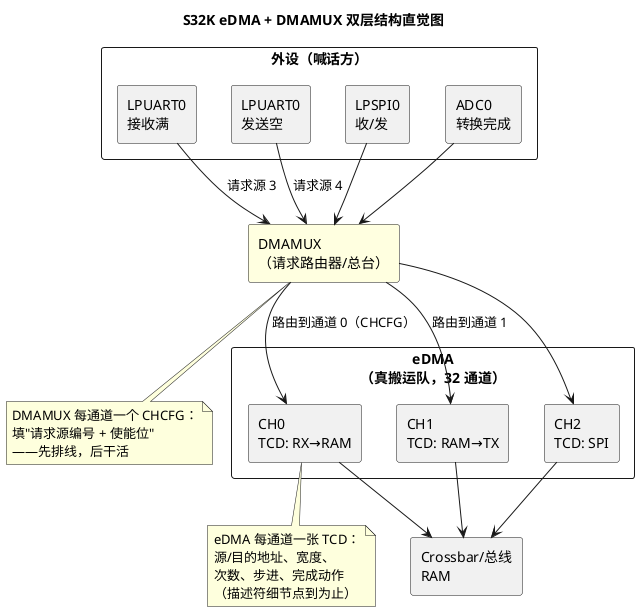

# 03-S32K-eDMA-DMAMUX

> 一句话定位：S32K 的搬运体系是"总台（DMAMUX）+ 搬运队（eDMA）"两层——请求先过总台排线，再由带 TCD 描述符的真 DMA 干活，本篇记住使能路径与两个串口场景即可。
> 等级：L2→L3 ｜ 前置：[01-DMA原理](01-DMA原理.md)

## 太长不看

> - 人话直觉：DMAMUX 是个"请求路由器"，把几十路外设请求排到 eDMA 的 32 条通道上；真正搬数据的是 eDMA，每条通道一张 TCD 小表格装着搬运规则。
> - 本篇解决：两层结构怎么理解、一条通道从请求到搬运的使能路径（三步）、LPUART/LPSPI 怎么搭。
> - 赶时间记住：①先配 DMAMUX（选源→选通道→使能），再配 eDMA（写 TCD→开中断→使能）；②TCD 就是"搬运工单"，字段细节查手册即可；③RTD 的 edma_drv 是官方封装，AUTOSAR 工程里常以 CDD 形态再包一层。

## 原理

### 双层结构：总台 + 搬运队



两句话记住分工：**DMAMUX 决定"哪路请求用哪条通道"（接线员），eDMA 决定"这条通道怎么搬"（搬运规则在 TCD）**。TC377 的专线绑定相当于把接线员的活固化了，S32K 把它拆成了显式的一层。

### 通道使能三步路径

1. **配 DMAMUX**：给目标通道写 CHCFG——选择请求源（Source Number）并使能该路由；
2. **配 eDMA**：为该通道填 TCD（源地址、目的地址、搬运宽度、major/minor 计数、步进、完成中断使能）；
3. **使能通道**：置 ERQ（通道请求使能）位，请求一来即开始搬运；完成后按 TCD 配置发中断/自动加载下一 TCD。

### 软件生态一句话

S32K RTD（Real-Time Drivers）提供 `edma_drv`/`dmamux` 驱动封装：初始化、通道配置、回调注册都走它；AUTOSAR 工程里通常再以 CDD 包一层给 LPUART/LPSPI/Adc 用（DMA 非 MCAL 标准模块，接入规范见 2-L2进阶/CDD设计方法论）。

### 典型场景（点到即止）

- **LPUART 收发**：收=请求源"接收满"→路由 CHx→TCD（UART 数据寄存器固定地址→RAM 递增）；发=请求源"发送空"→另一条通道（RAM→数据寄存器），两条通道配一对，高速串口不再逐字节进中断；
- **LPSPI 收发**：SPI 每帧收发同体，一条通道"TCD 源/目的都用 SPI 数据寄存器+RAM"即可同时完成收发搬运（或收发两条，按帧结构配）。

## 双平台对照

| 对照维度 | S32K eDMA+DMAMUX | TC377 DMA0/DMA1 |
|---|---|---|
| 结构 | 单 eDMA 32 通道 + 前置 DMAMUX 路由 | 两组多通道 DMA，SR 专线直连 |
| 路由配置 | 运行期写 CHCFG 选源（显式一层） | 设计期静态绑定（固化） |
| 规则载体 | 每通道一张 TCD 描述符 | 通道寄存器组 |
| 链式接力 | TCD 完成后自动加载下一 TCD（scatter-gather） | 通道链接/乒乓 |
| 优先级 | 固定优先级或轮转仲裁 | 通道优先级+抢占 |
| 官方驱动 | RTD edma_drv/dmamux | iLLD IfxDma 系列 |
| 常见接入 | CDD 包装给 LPUART/LPSPI/Adc | CDD 包装给 ASCLIN/ADC/GTM |

一句话记：**S32K 多了"接线"这一步（DMAMUX），换来请求源可灵活重排；TC377 少一层但接线是死的**——移植时最容易踩的就是"忘了配 MUX"。

## 配置要点

- **请求源编号表**：每个外设事件的 Source Number 是芯片手册定死的（LPUART0 RX、LPSPI0…各一个号），配置前先抄一张表，DMAMUX 的 CHCFG 全靠它；
- **TCD 一次写全**：源/目的、宽度、minor/major 计数、步进、完成中断、是否链接下一 TCD——半张 TCD 就开跑是最隐蔽的坑；
- **通道分配表**：32 通道全工程统一编号（哪路外设用哪条），避免 CDD 之间撞车；收发成对分配便于维护；
- **RTD 初始化顺序**：时钟（PCC）→ DMAMUX init → eDMA init → 通道配置；关中断窗口里配 TCD，配完再开；
- **AUTOSAR 视角**：以 CDD 形态接入时，对外只暴露"搬运服务"接口，TCD/CHCFG 细节封在 CDD 内部（接口边界见 CDD/01，集成见 CDD/03）。

## 代码示例

```c
/* S32K RTD 风格伪代码：LPUART0 RX → RAM 环形缓冲（概念级） */
void CddDma_LpuartRx_Init(void)
{
    /* 1) DMAMUX：把"请求源 3（LPUART0 RX）"路由到 eDMA 通道 0 并使能 */
    DMAMUX_SetSource(0u, DMAMUX_LPUART0_RX);   /* CH0 ← 源 3 */
    DMAMUX_EnableChannel(0u);

    /* 2) eDMA：为通道 0 填 TCD 工单 */
    edma_channel_config_t tcd = {
        .srcAddr          = (uint32)&LPUART0->DATA,  /* 外设数据寄存器，固定 */
        .destAddr         = (uint32)g_uartRxBuf,      /* RAM，每字节 +1 */
        .srcWidth         = WIDTH_BYTE,
        .destWidth        = WIDTH_BYTE,
        .minorLoopCount   = 1u,                       /* 每请求搬 1 字节 */
        .majorLoopCount   = UART_BUF_SIZE,            /* 攒满整缓冲算一单 */
        .srcStep          = STEP_0,
        .destStep         = STEP_1,
        .intMode          = INT_ON_MAJOR_DONE,        /* 满了才喊 CPU */
    };
    EDMA_DRV_ConfigChannel(0u, &tcd);
    EDMA_DRV_InstallCallback(0u, CddDma_UartRxDone);

    /* 3) 使能通道请求：接线完成，请求一到就搬 */
    EDMA_DRV_StartChannel(0u);
    LPUART_EnableRxDma(LPUART0);              /* 外设侧：开 DMA 请求输出 */
}

/* 完成中断：环形缓冲翻面 + 重挂 */
void CddDma_UartRxDone(void *param)
{
    EDMA_DRV_ClearIntFlag(0u);
    UartRing_OnHalfFull();                    /* 半满/全满双缓冲交接 */
    EDMA_DRV_SetDestAddr(0u, (uint32)UartRing_NextHalf());
    EDMA_DRV_StartChannel(0u);
}
```

## 易错点与陷阱

1. **现象**：TCD 配得完美，通道纹丝不动。**原因**：忘了配/使能 DMAMUX（请求根本没排到通道）。**对策**：牢记三步路径——MUX 先行；调试先读 CHCFG 确认源号。
2. **现象**：请求源编号抄错，搬的是别的外设的数据。**原因**：Source Number 是手册定死的编号表，凭印象填必错。**对策**：编号表进设计文档，配置评审对表打钩。
3. **现象**：搬运次数忽多忽少。**原因**：minor/major 计数单位搞混（每次请求搬几个 × 共几单）。**对策**：minor=单请求搬运量，major=请求数，两者相乘才是总量，对着 TCD 字段名义理解。
4. **现象**：双缓冲切换后写穿缓冲。**原因**：换目的地址时通道还使能着，新地址没生效就来了新请求。**对策**：停通道→改 TCD→再启动；或用链接 TCD 让硬件自动换。
5. **现象**：外设侧不动，只有 DMA 空等。**原因**：外设的 DMA 请求输出没打开（LPUART 的 DMA 使能位/PCC 时钟没开）。**对策**：使能路径最后一步"外设侧开请求"别漏。
6. **现象**：多 CDD 各配各的通道，偶发互相覆盖。**原因**：没有全工程通道分配表，两个 CDD 用了同一条。**对策**：通道号集中分配、宏定义统一管理（见 CDD/04 模板）。

## 面试高频题

1. **DMAMUX 和 eDMA 各干什么？为什么 S32K 要两层？**
   答：MUX 是请求路由器（源→通道），eDMA 是真搬运引擎（TCD 规则执行）；分层让 32 通道对上百请求源灵活重排，不用硬件固化。
2. **描述一条通道的完整使能路径。**
   答：DMAMUX 选源+使能 → eDMA 填 TCD → 置 ERQ 使能 → 外设侧开 DMA 请求输出。
3. **TCD 是什么？为什么说它是"工单"？**
   答：每通道的传输控制描述符：源/目的/宽度/次数/步进/完成动作全在里面，CPU 只交单，DMA 照单执行。
4. **LPUART 的 DMA 收发怎么搭？**
   答：收：RX 满请求→通道（外设→RAM）；发：TX 空请求→通道（RAM→外设）；成对配置+完成中断切双缓冲。

## 延伸

- [01-DMA原理](01-DMA原理.md)｜[02-TC377-DMA](02-TC377-DMA.md)：概念底座与另一平台实现；
- [NVIC与中断](../../../02-芯片与体系结构/1-L1基础/ARM-Cortex-M/02-NVIC与中断.md)：eDMA 完成中断进入 Cortex-M 的机制背景；
- [SDK与RTD生态对比](../../../02-芯片与体系结构/1-L1基础/S32K平台/S32K1与S32K3对比/02-SDK与RTD生态对比.md)：edma_drv 所在的 RTD 生态全景；
- [CDD定位与边界](../../2-L2进阶/CDD设计方法论/01-CDD定位与边界.md)：DMA 这类非标模块接入 AUTOSAR 的边界划分；
- [环形缓冲区](../../../01-编程语言/2-L2进阶/数据结构与算法-C实现/01-环形缓冲区.md)：DMA 双缓冲交接背后的缓冲区设计。
- 工程深入场景：多路 LPUART + LPSPI 全 DMA 化时的全工程通道分配表与 Cache 一致性预算。