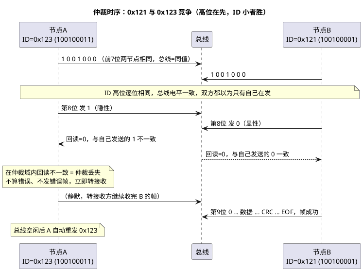

# 03-仲裁与填充

> 一句话定位：显性压隐性的"线与"+逐位回读，让 ID 最小的报文无损赢得总线；5 连同位插反的填充规则既是同步的需要，也是帧长计算的变量——这两条是"为什么 CAN 不能变速发"的答案源头。
> 等级：L1→L2 ｜ 前置：[01-帧格式](01-帧格式.md)

## 原理

### 电平与线与

| 逻辑 | 电平 | 物理表现 |
|---|---|---|
| 显性 0 | 差分约 2 V（CANH≈3.5 V，CANL≈1.5 V） | 任何一个节点驱动即生效 |
| 隐性 1 | 差分≈0 V（双线均≈2.5 V） | 所有节点都释放才成立 |

这就是**线与**：多节点同时驱动，只要有一个发 0，总线就是 0（收发器内部电路与 OC 门线与同族，见 [OC-OD门与线与](../../../../03-硬件基础/1-L1基础/上拉下拉电阻/03-OC-OD门与线与.md)）。发送方逐位回读总线电平与自己发送值比较——仲裁与位错误检测都靠这一个动作。

### 两节点竞争（ID 小者胜）

节点 A 发 0x123、节点 B 发 0x121，同时在空闲后启动：

四条仲裁规则：

1. **ID 数值小（先出现显性位差）者优先**——从 SOF 后第一位开始逐位比较，最先发出 1 而总线上是 0 的节点出局；
2. 仲裁只发生在**仲裁域**（SOF~r0，含 IDE/SRR），丢仲裁不算错误、不发错误帧；
3. 丢仲裁的帧**不丢弃**：控制器自动转接收，帧间隔后随空闲自动重发（应用无感）；
4. 同 ID 竞争：标准数据帧（RTR=0）> 标准远程帧 > 扩展数据帧（SRR=1）> 扩展远程帧。

## 详解：填充规则与帧长影响

### 位填充（Bit Stuffing）

| 规则 | 内容 |
|---|---|
| 作用范围 | **SOF 到 CRC 序列**之间（含 ID、控制、数据、CRC 位流） |
| 插入条件 | 连续 5 个同极性位后，自动插入 1 个**反极性**位 |
| 不填充的区域 | CRC 界定符、ACK 槽、ACK 界定符、EOF、帧间隔，以及错误帧/过载帧固定格式 |

直觉：填充保证帧内**最多 6 个位时间必有一个边沿**——重同步（见 [02-位时序](02-位时序与采样点.md)）才有持续校准相位的素材；同时把长隐性/显性串打散，利于收发器与直流平衡相关的误码控制。

### 对帧长的影响

最坏情况下每 4 个原始位多 1 个填充位：8 字节标准帧原始 108 位，实测 110~130 位浮动。影响三处工程账：

- 总线负载率估算（CANoe 统计的是实测位流）；
- 最坏响应时间分析（E2E/调度表报文周期要留 ~20% 余量）；
- 自研位级解析/示波器量帧长时，别拿固定 111 位当常数。

### 为什么经典 CAN 不能"变速发"

仲裁的本质是**多个节点同一位时间内逐位互相比电平**：这要求全网位时序严格一致（同速率、同采样点），位边界错开就无法公平比较，回读比较也会误判为错误帧。所以速率是**总线属性**而非报文属性——想快只能在仲裁结束后整体换挡，这正是 CAN-FD 的 BRS 思路（见 [CAN-FD/01-FD帧与BRS](../CAN-FD/01-FD帧与BRS.md)），且仲裁段速率仍必须全网统一。

## 配置层/工程关联

- **ID 分配即优先级分配**：通讯矩阵里安全/底盘类（ESP、电池管理）拿小 ID，信息娱乐拿大 ID——改 ID 等于改实时性，走变更评审；
- 保留 ID：0x000 优先级最高但常被 OEM 保留（如安全帧专用），诊断 0x7DF/0x7E0~0x7E7、网络管理 0x400~0x4FF 段等都有惯例，别占用；
- CanIf/Com 只配"发什么"，仲裁行为完全在控制器硬件里，无任何可配项——这也是它确定性的来源；
- 负载与饿死：周期 10 ms 的低优先级帧在 70%+ 负载时可能连续丢仲裁，超时（Com 的 deadline monitoring）误报"发送失败"，其实是排队等待。

## 易错点与陷阱

1. **以为 ID 大的优先**：现象是"调大 ID 后报文反而发不出去/超时"。原因：数值越大优先级越低。对策：按优先级重排 ID。
2. **以为仲裁失败=帧丢了**：CANoe 里看不到某帧某周期出现只是被压制，控制器会重发；应用层重发+控制器重发叠加才导致总线雪崩——**应用慎做发送超时重发**。
3. **两节点配了相同 ID 发不同数据**：仲裁不分胜负，一路发到数据域/CRC 才撞车→错误帧→双双重发→总线风暴。对策：DBC 审查 ID 唯一性（发送方唯一）。
4. **手工解析位流忘了去填充**：自研总线记录/示波器对照时，把填充位当数据位，CRC 永远对不上。
5. **误以为 EOF 后可以立即发**：错误界定符/帧间隔 3 位内若被别的节点抢先，重发的又是别人——低优先级帧的"延迟抖动"主要来自这里，而非软件。
6. **拿仲裁域外的不一致当丢仲裁**：仲裁域之后（数据域起）回读不一致是**位错误**，会发错误帧并 +8 错误计数（见 [04-错误帧](04-错误帧.md)），与丢仲裁的静默退让是两码事。

## 面试高频题

**Q1：两节点同时发送，谁赢？输的节点怎么办？**
答：从 ID 最高位起逐位线与比较，先出现"我发 1、总线 0"的节点仲裁失败，立即静默转接收方；帧间隔后总线空闲自动重发，应用无感知。整个过程无冲突损耗，故称无损仲裁。

**Q2：为什么 ID 小优先？物理上如何实现？**
答：显性 0 线与压过隐性 1；ID 小意味着更早出现显性位差。发送方逐位回读比较即可判定，无需额外协调。

**Q3：什么是位填充？哪些区域不填充？**
答：SOF~CRC 序列间连续 5 个同极性位后自动插 1 个反极性位，保证边沿密度供重同步；CRC 界定符之后（ACK、EOF、帧间隔）及错误/过载帧不填充。

**Q4：经典 CAN 为什么不能不同节点用不同速率？**
答：仲裁与位错误检测依赖同一位时间内的逐位回读比较，速率/采样点不一致即无法公平仲裁且互相制造错误帧；速率是总线属性。CAN-FD 也只在仲裁结束后切换数据段速率，仲裁段仍全网统一。

## 延伸

- [02-位时序与采样点](02-位时序与采样点.md)：仲裁逐位比较所依赖的位时序与同步机制；
- [04-错误帧](04-错误帧.md)：仲裁域外回读不一致的后果——错误帧与错误计数；
- [CAN-FD/01-FD帧与BRS](../CAN-FD/01-FD帧与BRS.md)："仲裁后换挡"的合法实现；
- [OC-OD门与线与](../../../../03-硬件基础/1-L1基础/上拉下拉电阻/03-OC-OD门与线与.md)：线与的电路本质；
- [通讯数据库](../../通讯数据库/README.md)：ID 分配/优先级规划在通讯矩阵中的管理。
