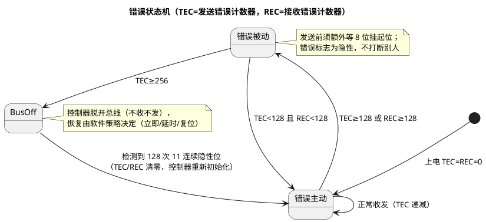

# 04-错误帧

> 一句话定位：错误帧是 CAN 的"当场报错"机制——5 种错误类型、TEC/REC 双计数器、错误主动/被动/busoff 三态，构成一套不依赖主机的总线自治故障隔离；读懂它，CANoe 里的错误帧和 busoff 现象才有了因果链。
> 等级：L2 ｜ 前置：[01-帧格式](01-帧格式.md)

## 原理

任一节点检测到错误，立即发出**错误帧**打断当前帧（帧很短，当场重传比事后纠错便宜）：

```
错误帧结构（错误主动节点视角）
|←— 错误标志 —→|←— 叠加标志(0~6位) —→|←— 错误界定符 —→|←— 帧间隔 —→|
| 6 个显性位     | 其他节点相继发标志     | 8 个隐性位        | 3 个隐性位   |
| (被动节点为    | 叠加后显性段可达       |                  |             |
|  6 个隐性位)   | 最多 12 位             |                  |             |
```

- **主动错误标志**：6 个显性位——故意破坏填充规则（连续显性>5 位），让总线上所有还在正常收发的节点也能立刻发现异常并连锁报错；
- **被动错误标志**：6 个隐性位——错误被动的节点"怀疑自己"，不再强行打断别人，只做记录；
- **错误界定符**：8 个隐性位 + 3 位帧间隔，给所有节点恢复到一致起点。

### 三态与计数器



## 详解：错误类型与计数规则

### 五种错误类型

| 错误类型 | 谁能发现 | 触发条件 |
|---|---|---|
| 位错误 | 发送方（及回读节点） | 发送的位与回读总线值不一致（仲裁域内的"输掉"不算） |
| 填充错误 | 收/发双方 | SOF~CRC 间出现 6 个连续同极性位 |
| CRC 错误 | 接收方 | CRC 重算不一致（在 ACK 槽后报出） |
| ACK 错误 | 发送方 | ACK 槽内未回读到显性（没人应答/全错） |
| 格式错误 | 接收方 | CRC 界定符/ACK 界定符/EOF 等固定隐性位上出现显性 |

### 错误计数规则（Bosch CAN 2.0 §8 简化口径）

| 场景 | 计数器 | 变化 |
|---|---|---|
| 发送节点发现错误并发错误标志（位/填充/格式/ACK 错） | TEC | **+8** |
| 接收节点发现错误并发错误标志（位/填充/格式/CRC 错） | REC | **+8** |
| 成功发送一帧 | TEC | −1 |
| 成功接收一帧 | REC | −1 |
| 错误被动节点发标志后首位回读到显性（总线上还有别人） | TEC/REC | +8 / +1（特殊规则） |

设计直觉：**发送错 +8 远快于好帧 −1 的回落**，坏发送方约 32 个坏帧就进被动、256 进 busoff，被自动隔离出总线；纯接收方即使常报错，最多停在错误被动（REC 永远到不了 256），不会 busoff——"制造错误的人先出局"。

### 错误界定与 IFS

错误界定符 8 隐性 + 帧间隔 3 隐性 = 11 位恢复期；busoff 恢复条件"128 次 11 连续隐性位"用的同一计量——总线要么空闲连出，要么靠别的错误帧界定符连出，因此**拔掉问题节点后总线能自愈**，恢复时长取决于剩余流量。

## 配置层/工程关联

- TEC/REC 可读：TC377 M_CAN 读 PSR/ECR 寄存器，S32K FlexCAN 读 ECR——把两个计数器 + 错误类型打进 Dem/Dlt 日志，是 busoff 排障的第一手证据；
- AUTOSAR 链路：CanDrv 上报 → CanIf_ControllerBusOff → CanSM/EcuM 走 busoff 恢复策略（立即恢复 / 延时恢复 / 复位重启），恢复节奏由 BswM/CanSM 配置决定，详见 [总线错误与恢复](../总线错误与恢复/README.md)；
- 错误被动是"亚健康"信号：某节点持续 REC 偏高（偶发 CRC 错）往往对应采样点/终端电阻/EMC 问题，应在它 busoff 前处理（见 [02-位时序](02-位时序与采样点.md)、[收发器/03-终端电阻与拓扑](../收发器与物理层/03-终端电阻与拓扑.md)）；
- CANoe 的 Error Frame 统计按错误类型分列，先分清"只有 ACK 错"（对端没醒/没上电）还是"CRC/格式错"（物理层/时序）再动手。

## 易错点与陷阱

1. **单节点上电即 busoff**：现象是自检阶段 TEC 飙到 256。原因：对端未上电，每帧 ACK 错 +8。对策：区分"调试环境无对手"与真故障，台架加陪跑节点或临时抑制发送。
2. **busoff 后立即恢复再立即 busoff**：反复进出 busoff 说明病根未除（该节点发送硬件/波特率错）。对策：恢复前先读 TEC 走势与错误类型，别只做"复位了事"。
3. **把错误被动当 busoff**：错误被动仍能收发（只是受限），CANoe 里表现为偶发错误帧+帧间隔加长。对策：读计数器确认是 128 还是 256 档。
4. **错误帧是"别的节点发给我的"误解**：错误帧由每个发现错误的节点自己发出，多节点叠加——CANoe 里一个错误帧可能对应多个节点同时报错。
5. **以为 CRC 错会被重传纠正到应用无感**：控制器确实重发，但**已被部分节点接收的坏帧**若上层无 E2E 保护，可能产生瞬时错值——安全相关报文必须配 E2E（CRC+计数器）。
6. **拔掉故障节点后总线不恢复**：检查是否有节点卡在 busoff 等恢复条件（如总线一直有流量打扰 11 连续隐性位），或软件恢复策略未触发重启控制器。

## 面试高频题

**Q1：错误主动/被动/busoff 的阈值与行为差异？**
答：TEC、REC <128 错误主动（发 6 显性标志，可打断别人）；任一 ≥128 错误被动（发 6 隐性标志、发送前多等 8 位）；TEC ≥256 busoff（脱开总线）。恢复条件：检测到 128 次 11 个连续隐性位，计数器清零回错误主动。

**Q2：为什么发送错误 +8、成功才 −1？**
答：让"制造错误的节点"快速出局（约 32 个坏帧进被动、256 进 busoff），而健康节点少量偶发错误可被成功帧慢慢抵消，实现无主机的故障自治隔离；纯接收节点永不 busoff。

**Q3：CAN 有哪五种错误？各由谁发现？**
答：位错误（发送方回读不一致）、填充错误（双方，6 连同位）、CRC 错误（接收方）、ACK 错误（发送方，无人应答）、格式错误（接收方，固定隐性位被占）。其中 ACK 错误只在发送方发现——所以单节点测试必 busoff。

**Q4：错误帧结构是什么？为什么主动标志用 6 个显性位？**
答：错误标志 + 叠加标志（最多 12 位显性）+ 8 位隐性界定符。6 个显性位故意违反"5 连同位必插反"的填充规则，保证全网无论处于帧内什么位置都能立刻识别并连锁报错。

## 延伸

- [总线错误与恢复](../总线错误与恢复/README.md)：busoff 恢复策略与排障实录（本篇的工程续集）；
- [02-位时序与采样点](02-位时序与采样点.md)：CRC/格式错误的时序根因；
- [收发器与物理层/03-终端电阻与拓扑](../收发器与物理层/03-终端电阻与拓扑.md)：错误计数的物理层根因（反射、终端）；
- [CAN-FD/01-FD帧与BRS](../CAN-FD/01-FD帧与BRS.md)：FD 帧的 ESI 位——发送方错误状态直接进帧里广播；
- [CanDrv接口契约](../../../../04-MCAL与外设驱动/2-L2进阶/CanDrv与LinDrv/01-CanDrv接口契约.md)：busoff 事件从控制器中断到 CanIf/CanSM 的上报路径。
