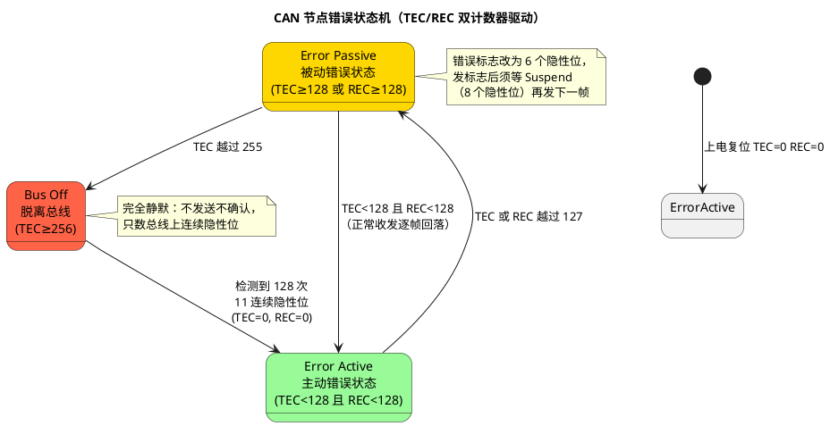

# 01-错误计数器与状态

> 一句话定位：CAN 靠 TEC/REC 两个 8 位计数器给每个节点"记过"，涨过 128 变 Error Passive、涨过 256 变 Bus Off——读懂这张记过簿，就掌握了 CAN 自诊断的全部语言。
> 等级：L2 ｜ 前置：[04-错误帧](../协议原理/04-错误帧.md)

## 原理

每个 CAN 控制器内驻着一对独立计数器：**TEC（发送错误计数器）** 管发送方向的罪，**REC（接收错误计数器）** 管接收方向的罪。两者都按 Bosch CAN 2.0 的 Rule 1~12 增减，共同决定节点处于三态之一：

计数器增减规则表（工程化表述，细节以 Bosch 规范 Rule 1~12 为准）：

| 事件 | TEC | REC | 说明 |
|---|---|---|---|
| 发送节点检出错误并发错误标志 | +8 | — | 发错重罚 |
| 接收节点检出错误（发主动错误标志） | — | +1 | 收错轻罚 |
| 发主动错误标志/过载标志后，标志首位被显性覆盖 | +8 | +8 | 说明总线上还有别人在报错 |
| 成功发送一帧（有 ACK、无错误） | −1 | — | 逐帧赎罪 |
| 成功接收一帧 | — | −1 | Error Passive 下成功接收后 REC 置 119~127 |
| Error Passive 节点成功发送一帧 | 置 119~127 | — | 直落门槛以下 |
| Bus Off 后检测到 128×11 连续隐性位 | 置 0 | 置 0 | 唯一的自动复位通道 |

**不对称是精髓**：发错 +8、收错 +1——发不出 ACK 说明"别人没收到我"，问题大概率在自己；而收错可能只是替别人报错，罚得轻。这保证坏节点最快被隔离。

## 详解

三态对节点行为的实际影响：

| 行为 | Error Active | Error Passive | Bus Off |
|---|---|---|---|
| 正常收发 | ✔ | ✔（仍可收发） | ✘ 完全静默 |
| 错误标志 | 6 个显性位（能压制总线） | 6 个隐性位（几乎不扰总线） | 无 |
| 发送前额外等待 | 无 | Suspend：8 个隐性位 | — |
| ACK 参与 | 正常 | 正常（仍是有效接收者） | 不发 ACK |
| 对外表现 | 正常公民 | "带病工作"，别人几乎察觉不到 | 网络里查无此节点 |

几个工程上必懂的细节：

1. **Error Passive 不是断网**：节点仍在报文交互，只是发错误时不敢用显性位打断总线。表现为偶发一帧坏数据不再拖累全网。
2. **单节点孤立测试必然涨 TEC**：总线上只有一个节点时没人回 ACK，每发一帧 TEC+8，约 32 帧后进入 Error Passive（此时它发 ACK 位别人收不到显性确认——所以台架上单板回环要两节点或开控制器的自发自收/内部 ACK）。
3. **Bus Off 判定只看 TEC**：REC 再高也只是 Error Passive；TEC 一破 256 立即脱离总线。
4. **恢复路径有两条**：Error Passive→Active 靠正常收发把计数磨下去；Bus Off→Active 靠数 128 次 11 连续隐性位（约 1.4ms @500kbps），这是硬件行为，与软件无关。

错误类型与计数器涨速的对应关系（承接 [04-错误帧](../协议原理/04-错误帧.md) 的五种错误）：

| 错误类型 | 谁先发现 | 计数器走向 | 典型病因 |
|---|---|---|---|
| ACK 错误 | 发送方 | TEC +8（无人应答） | 对端全掉/单节点台架/终端损坏 |
| 位错误 | 发送方 | TEC +8（回读不符） | 收发器损坏/TXD 卡显性 |
| 填充错误 | 接收方 | REC +1 | 位时序错/干扰 |
| CRC 错误 | 接收方 | REC +1（发送方随后因 ACK 错 +8） | 采样点不一致/振铃 |
| 格式错误 | 接收方 | REC +1 | 帧尾区被干扰/EOF 出错 |

读法：**TEC 涨得快的节点是"病灶"，REC 普涨的节点是"邻居"**——一张错误统计表按节点分列 TEC/REC 涨速，病灶一眼可辨。

## 配置层/工程关联

- **CanDrv/CanIf**：CanIf 可配错误状态通知——控制器跨档时 CanDrv 回调 `CanIf_ErrorStateChangeNotification(CanIfErrorStateType)`；应用亦可轮询 `Can_GetControllerErrorState()` 返回 `CAN_ERRORSTATE_ACTIVE / PASSIVE / BUSSOFF`。Bus Off 另有专线回调 `CanIf_ControllerBusOff()`。
- **CanSM**：把控制器错误状态揉进状态机（SILECOM/FULLCOM 与 BusOff 子状态），错误档位变化会触发模式切换与恢复流程，见 [02-busoff恢复策略](02-busoff恢复策略.md)。
- **硬件侧**：TC377 MultiCAN+ 的 ECR 寄存器（TEC/REC 各 8 位，调试器可实时观察）；S32K FlexCAN 同名 ECR。排查时"盯着 ECR 跑"比盯 Trace 更早看到病灶。
- **CANoe**：Statistics 窗口按节点给出 Error Counter 曲线；Trace 中 Error Frame 的类型（Form/CRC/ACK/Stuff）配合计数器走势，是判断"谁在犯案"的一线证据。

## 易错点与陷阱

1. **现象**：台架单节点测试，自己的帧"发不出去"。**原因**：无对端 ACK，TEC 一路 +8。**对策**：双节点对发，或使能控制器 Loopback/自 ACK 模式。
2. **现象**：某节点 REC 涨到 Error Passive 就以为它坏了。**原因**：REC 高常常是"替人受过"——干扰或对端发坏帧，报错的接收方都 +1。**对策**：先看是谁的 TEC 在涨（发坏帧的人），REC 高只是伴生现象。
3. **现象**：Bus Off 恢复后几十毫秒又 Off，以为恢复逻辑失效。**原因**：病根（TXD 卡显性、ID 冲突、位时序错）未除，恢复即复发。**对策**：Bus Off 恢复只治"隔离"，不治"病因"，先抓现场再谈恢复。
4. **现象**：错误状态通知一直不来。**原因**：CanIf 的 ErrorStateNotification 开关没配，或驱动只支持轮询模式。**对策**：配置 CanIfEnableErrorStateNotifications，或周期调 Can_GetControllerErrorState 兜底。
5. **现象**：CANoe 里仿真节点永远 Error Active。**原因**：仿真节点默认不真实维护 TEC/REC，也不注入错误。**对策**：验证错误行为要上真实硬件（或 CANoe 硬件 + 干扰卡）。

## 面试高频题

1. **问：TEC 和 REC 的增减规则是什么？为什么发送错误 +8 而接收错误只 +1？**
   答：发送方每发一次错误标志 TEC+8，接收方每检出一次错误 REC+1，成功发送/接收各 −1；不对称罚则基于"发送错误更可能意味着自己坏"的贝叶斯判断，让故障源最快被隔离出总线。
2. **问：三个错误状态的边界值？**
   答：Error Active：<128（双计数器均）；Error Passive：任一计数器 ≥128 且 TEC≤255；Bus Off：TEC≥256。128 与 256 由 8 位计数器结构天然决定。
3. **问：Error Passive 节点会拖垮总线吗？**
   答：不会——它的错误标志是 6 个隐性位，几乎不影响总线电平；代价只是它发错误帧后须等 8 个隐性位 Suspend，且此时它的 ACK 仍照常（作为有效接收者时）。
4. **问：Bus Off 后节点如何自己回到总线？**
   答：硬件持续监测总线，累计检测到 128 次 11 个连续隐性位（总线空闲序列）即把 TEC/REC 清零、重回 Error Active；软件（AUTOSAR CanSM）在此之上叠加重启控制器与延迟策略。

## 延伸

- [02-busoff恢复策略](02-busoff恢复策略.md)——Bus Off 之后的 AUTOSAR 恢复流程与退避策略
- [03-排障实录](03-排障实录.md)——用本文的计数器语言破三个真实案件
- [从一帧CAN报文说起-车载网络全景](../../../00-入门导读/01-从一帧CAN报文说起-车载网络全景.md)——错误状态在整个通讯链里的位置
- [CanDrv接口契约](../../../../04-MCAL与外设驱动/2-L2进阶/CanDrv与LinDrv/01-CanDrv接口契约.md)——错误回调在驱动接口层的形态
