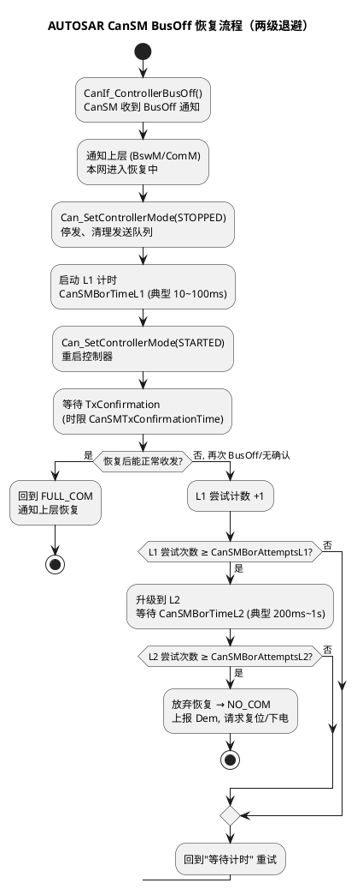

# 02-busoff恢复策略

> 一句话定位：Bus Off 硬件只负责"数够 128 次 11 个隐性位就放你回来"，但什么时候放、放几次、失败了怎么办——是 CanSM 的两级恢复与退避策略说了算，这一篇把软硬件两层恢复掰开对齐。
> 等级：L2 ｜ 前置：[01-错误计数器与状态](01-错误计数器与状态.md)

## 原理

Bus Off 后节点**完全静默**：不发送、不 ACK、不参与任何总线活动，唯一在做的事是数总线上连续 11 个隐性位的出现次数——**数满 128 次（约 1.4ms @500kbps）硬件即具备复位条件**。但"具备条件"不等于"直接放行"，芯片给了两条路：

| 恢复方式 | 机制 | 典型配置 |
|---|---|---|
| 自动恢复 | 控制器自己数满 128×11 隐性位，直接清 TEC/REC 回 Error Active | S32K FlexCAN：BOFFREC=0 |
| 软件恢复 | 控制器数满后停在 Bus Off 状态等指令，软件监控状态位（如 FlexCAN 的 BOFF 标志、TC377 MCAN 节点状态）后重启控制器 | FlexCAN BOFFREC=1；或 CanSM 主动 STOPPED→STARTED |

AUTOSAR 站软件侧：**CanSM 是 Bus Off 恢复的导演**，把"硬件能自动回"升级成"受控地回"——给总线喘息、给自己重启收发环境、给上层一个干净的模式切换：

## 详解

- **为什么要等一等再回**：Bus Off 的常见根因（收发器损坏、TXD 卡显性、严重干扰）在毫秒级不会自愈。立即重启会立刻再 Bus Off，且每次回网都发一堆帧冲击总线——恢复间隔是对全网的保护。
- **两级参数的分工**：L1（短间隔、多次数）对付偶发干扰型 Bus Off，用户无感；L2（长间隔）对付持续性故障，避免高频重试刷屏 Dem；两级都耗尽说明硬件级问题，交出去复位。
- **为什么用 TxConfirmation 当恢复判据**：重启后能收到发送确认，意味着总线上有人 ACK、仲裁与 CRC 全链路走通——比"定时器到了就算恢复"多一层总线级证据，避免"控制器回来了、总线还坏着"的假阳性。
- **指数退避是 OEM 定制**：AUTOSAR 标准参数是两级固定时长；不少 OEM 规范要求重试间隔按 2^n 递增（如 10/20/40/80/160ms 封顶），在 CanSM 之上或定制 CanSM 内实现。**对接前必读 OEM 的 Bus Off 章节**，各家对"几次算 L1、间隔多长、要不要报 DTC"几乎没有两份相同的规范。
- **与 Dem 的关联**：Bus Off 属于通信类 DTC（OEM 定义，如 `U1000 总线关闭`）。工程做法：CanSM 恢复入口挂 Dem_SetEventStatus(EVENT_FAILED)，恢复成功后置 PASSED；连续失败触发 QF/严重级。没有 Dem 上报的 Bus Off 恢复，在整车视角等于"悄悄掉线又悄悄回来"，售后查无实据。

一组典型参数算例（把两级流程换算成最坏时长）：

| 参数 | 示例值 | 含义 |
|---|---|---|
| CanSMBorTimeL1 | 50 ms | L1 重试间隔 |
| CanSMBorAttemptsL1 | 3 | L1 尝试上限 |
| CanSMBorTimeL2 | 1000 ms | L2 重试间隔 |
| CanSMBorAttemptsL2 | 2 | L2 尝试上限 |
| CanSMTxConfirmationTime | 100 ms | 单次恢复成功判据窗 |

最坏恢复总时长 ≈ 3×(50+100) + 2×(1000+100) ≈ **2.65s**——这个数要和三层预算对表：网络管理 NM 超时（典型 2s）、EcuM RUN 保持窗口、应用降级策略。算例里 2.65s 已超 NM 超时，意味着持续性故障下节点会先被 NM 判死网——要么压缩 L2 参数，要么接受"BusOff 未耗尽先被 NM 接管"的整车行为。**参数不是拍脑袋：先算最坏时长，再对预算表**。

## 配置层/工程关联

- **CanSM 配置项**：`CanSMBorTimeL1/L2`（两级等待时长）、`CanSMBorAttemptsL1/L2`（两级尝试次数）、`CanSMTxConfirmationTime`（恢复成功判据窗口）、`CanSMBorCycleTime`（轮询周期）——这些是 EB tresos 里 CanSM 模块的主戏。
- **CanIf/CanDrv**：BusOff 通知链 `CanDrv 中断 → CanIf_ControllerBusOff → CanSM_ControllerBusOff`；错误档位变化走 `CanIf_ErrorStateChangeNotification`（见 [01-错误计数器与状态](01-错误计数器与状态.md)）。
- **芯片侧**：TC377 MCAN 节点状态机可查 BUSOFF 档位；S32K FlexCAN 的 CTRL1.BOFFREC 决定自动/手动恢复——**配置 CanSM 软件恢复时应置手动**，否则硬件抢先回网，CanSM 的 STOPPED/STARTED 序列与控制器实际状态错拍，模式指示会乱。
- **上层联动**：BusOff 期间 CanSM 上报模式变化，BswM 可据此切 limp-home 报文集；Nm 停发会引发 NM 超时——注意 OEM 对"BusOff 恢复期间 NM 是否豁免"的规定。
- **EcuM/复位链**：两级恢复耗尽后，CanSM 上报 NO_COM，BswM 可请求 EcuM 复位或进入安全状态——这条"最后一手"要与功能安全概念（失效反应时间）一致，不能比 ASIL 要求的反应慢。

## 易错点与陷阱

1. **现象**：BusOff 后总线上看该节点"闪进闪出"，每几十毫秒一波错误帧。**原因**：恢复间隔配太短+根因未除。**对策**：L1 时长按 OEM 规范，且先用抓包确认根因类别再定恢复参数。
2. **现象**：CanSM 状态机卡在恢复中，控制器却已回网发帧。**原因**：芯片自动恢复（BOFFREC=0）与 CanSM 手动恢复叠加。**对策**：软件恢复方案下显式配手动恢复位。
3. **现象**：恢复成功但应用信号全是死值。**原因**：Com 层没收到模式切换通知，Rx deadline 监控未重启。**对策**：确认 CanSM→ComM→Com 的模式通知链完整。
4. **现象**：产线端检 BusOff DTC 大量误报。**原因**：把 Error Passive 也当 BusOff 上报。**对策**：DTC 只挂 BUSOFF 档位；Error Passive 另用统计量或不上报。
5. **现象**：BusOff 恢复期间被 NM 判掉网、引发全车级联复位。**原因**：NM 超时窗口小于两级恢复总时长。**对策**：核算 L1×AttemptsL1 + L2×AttemptsL2 最坏总时长，与 NM 超时、EcuM 状态协同。
6. **现象**：CANoe 里节点明明已回网，CanSM 状态还停在"恢复中"。**原因**：TxConfirmation 判据窗内恰好没有该节点的发送任务，无帧可发就无确认可收。**对策**：恢复判据窗内安排一帧低频心跳帧（哪怕 1s 一发），给判据提供证据源。

## 面试高频题

1. **问：Bus Off 的硬件恢复条件是什么？为什么还需要软件恢复流程？**
   答：检测到 128 次 11 个连续隐性位后 TEC/REC 清零回 Error Active。软件恢复的价值在于受控重启（清发送环境、给模式切换）、退避保护全网、失败升级与 Dem 上报——硬件只保证"能回"，不保证"该回"。
2. **问：CanSM 两级恢复的关键参数与含义？**
   答：CanSMBorTimeL1/AttemptsL1 短间隔多次重试对付偶发故障；CanSMBorTimeL2/AttemptsL2 长间隔兜底持续故障；CanSMTxConfirmationTime 作为"恢复成功"的判据窗口；耗尽后放弃恢复并上报。
3. **问：什么是指数退避？AUTOSAR 里怎么做？**
   答：重试间隔按 2^n 递增，避免故障节点高频冲击总线；标准 CanSM 只有两级固定时长，指数退避多为 OEM 定制要求，在集成层实现。
4. **问：BusOff 应不应该报 DTC？**
   答：应报（OEM 通信类 DTC），且恢复成功要置 PASSED 区分"闪断"与"持续断"；持续失败需升级为请求复位类处理。

## 延伸

- [01-错误计数器与状态](01-错误计数器与状态.md)——Bus Off 从哪来：TEC/REC 的记过簿
- [03-排障实录](03-排障实录.md)——三个真实 BusOff/Error Passive 案件的完整复盘
- [CanDrv接口契约](../../../../04-MCAL与外设驱动/2-L2进阶/CanDrv与LinDrv/01-CanDrv接口契约.md)——BusOff 通知回调在驱动接口的形态
- [从一帧CAN报文说起-车载网络全景](../../../00-入门导读/01-从一帧CAN报文说起-车载网络全景.md)——恢复策略在整个通讯栈里的位置
