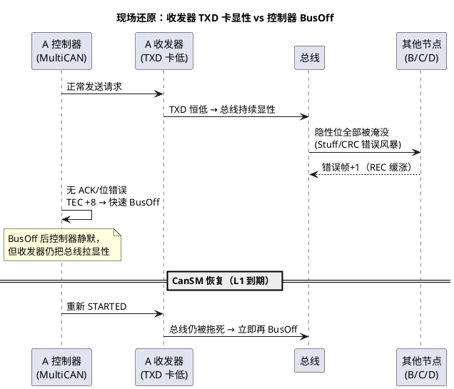
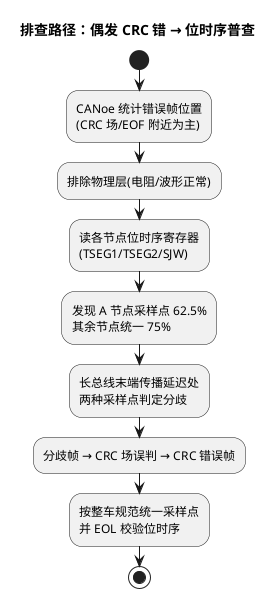

# 03-排障实录

> 一句话定位：三个真刀真枪的总线故障案——收发器卡显性、采样点不一致、终端电阻缺失——用 TEC/REC 的账本语言+CANoe 现场证据，把"从现象到根因"的推理链完整走一遍。
> 等级：L2 ｜ 前置：[01-错误计数器与状态](01-错误计数器与状态.md)

## 案例一：TEC 涨到爆表——收发器 TXD 卡显性

**现象**：路试中某 ECU（下称 A 节点）频繁掉线，CANoe Trace 里 A 的周期帧时有时无；Statistics 显示 A 节点反复 Bus Off（约每秒一次"复活"）。

**抓包特征**：A 掉线期间全网错误帧风暴（Stuff/CRC 错误连片）；总线偶尔整段显性无帧结构；其他节点 REC 也在缓涨（替人报错）。

**排查路径**：① CANoe 锁定"错误风暴与 A 的 BusOff 同步"→ ② 台架逐节点断电（拔件法）：拔掉 A，全网立刻干净 → ③ 示波器测 A 的 TXD 引脚：恒低电平（控制器侧未发送时也低）→ 收发器 ESD 损伤把 TXD 死锁在显性。
**根因**：收发器损坏，TXD 卡显性；控制器 BusOff 只是"病人症状"，病根在物理层。
**修复**：更换收发器，排查静电/浪涌入口（该线束 plug 在座椅滑轨旁，摩擦破皮搭铁）。
**复盘**：BusOff 反复复发+拔件隔离是物理层故障的标准打法；先看"BusOff 后总线是否仍被拖累"——是，则收发器嫌疑最大。

## 案例二：偶发 CRC 错——采样点不一致

**现象**：台架偶发（约千分之几）CRC 错误帧，高负载压测时概率上升 10 倍；无节点 BusOff，个别节点 REC 缓慢爬到 Error Passive 附近又回落。

**抓包特征**：错误帧出现在正常帧的最后一位到 EOF 区间（CRC/ACK 场附近）；错误帧与特定发送节点强相关；短帧好、长帧（8 字节）差。

**根因**：A 节点移植了别家工程的位时序配置（62.5%），与全网 75% 不一致。传播延迟把边沿推到临界区后，不同采样点对同一电平判出不同位值，接收端算出的 CRC 与发送端不符。
**修复**：统一采样点与 SJW 到 OEM 通讯规范值（500kbps/75%）；位时序参数纳入 EOL 校验。
**复盘**："偶发+与特定节点相关+错误集中在帧尾"是采样点/位时序问题的指纹；位时序是"全网公共约定"，不是单节点自由裁量。

## 案例三：周期性 Error Passive——终端电阻缺失

**现象**：某车型 CAN 分支最长的节点（门域）每天数次进 Error Passive，表现为短暂丢几帧后自愈；BusOff 极少。

**抓包特征**：错误帧集中在显性→隐性边沿后（Form/位错误）；示波器看 CANH/CANL：边沿后明显振铃（过冲+衰减震荡），持续约 1~2 个位时间。

| 排查步 | 动作 | 结果 |
|---|---|---|
| 1 | 断电测 OBD 口 CANH-CANL 电阻 | 约 110Ω（正常应 ≈60Ω：两端 120Ω 并联） |
| 2 | 逐段排查线束 | 后段分支上一个 120Ω 终端未接（设计变更后漏装） |
| 3 | 补装终端+复测波形 | 振铃显著收敛，错误帧归零 |
| 4 | 三天路试复测 | 无再发 |

**根因**：终端电阻缺失 → 阻抗不匹配 → 边沿反射振铃；采样窗口落在振铃区时误判，长分支末端节点首当其冲，计数器周期性爬坡又回落。
**修复**：补装 120Ω 终端；把"两端各一个 120Ω"写进线束检验单。
**复盘**：物理层三件套（终端电阻/总线长度/分支长度）永远排在软件排查前面——一个万用表 30 秒能省一天代码排查。

## 三案共性复盘

1. **错误计数器是"谁病了"的第一证词**：TEC 涨=发送方嫌疑，REC 涨=替人受过；涨速（+8/帧 vs +1/帧）直接指示病灶距离。
2. **错误帧位置是"病在哪"的第二证词**：帧尾 CRC/ACK 区→位时序/采样点；边沿附近→物理层振铃；整段显性→收发器/短路。
3. **BusOff 恢复策略只保命不治病**：三个案例里 CanSM 都"正确地"反复重启了节点——恢复流程正常工作不代表问题解决，见 [02-busoff恢复策略](02-busoff恢复策略.md)。

## 易错点与陷阱

1. **现象**：把其他节点的 REC 上涨当成"多个节点都有问题"。**原因**：单点故障（A 卡显性）会让全网 REC 普涨。**对策**：找 TEC 涨得最快、最先 BusOff 的那一个。
2. **现象**：换新收发器后偶发 CRC 仍在。**原因**：案例二/三是"公共环境病"，换件无效。**对策**：先分类——单点病（换件）vs 全网病（时序/物理层）。
3. **现象**：台架不复现，整车才复现。**原因**：线束长度/分支/负载与台架不同。**对策**：台架尽量复刻整车拓扑（长度+分支+终端）。
4. **现象**：CANoe 过滤器只看报文漏了错误帧。**原因**：Trace 默认不显示 Error Frame。**对策**：排障时显式打开 Error Frame 显示与 Statistics 累计。
5. **现象**：振铃误判为干扰，加屏蔽了事。**原因**：反射是阻抗问题不是 EMC 问题。**对策**：先测终端电阻再谈屏蔽。

## 面试高频题

1. **问：总线上一节点反复 BusOff，你的排查顺序？**
   答：先看 BusOff 期间总线是否仍被拖累（区分控制器病 vs 收发器病）→ 拔件法隔离故障节点 → 示波器看 TXD/RXD 与总线电平 → 位时序普查 → 终端电阻与波形。
2. **问：为什么采样点不一致会造成偶发 CRC 错而非全错？**
   答：只有当传播延迟把边沿推入两个采样点的分歧区时才误判，短帧/低负载时边沿裕量足够，故呈概率性、与帧长和负载相关。
3. **问：如何用万用表判断终端电阻缺失？**
   答：总线断电后测 CANH-CANL：两端各 120Ω 并联应约 60Ω；明显偏高说明有终端缺失，接近 120Ω 说明只剩一端。

## 延伸

- [01-错误计数器与状态](01-错误计数器与状态.md)——读懂本文用到的 TEC/REC 证词
- [02-busoff恢复策略](02-busoff恢复策略.md)——案例中反复出现的 CanSM 行为
- [从一帧CAN报文说起-车载网络全景](../../../00-入门导读/01-从一帧CAN报文说起-车载网络全景.md)——把案件放回全链路地图
- [01-收发器选型TJA1145](../收发器与物理层/01-收发器选型TJA1145.md)——案例一收发器 TXD 卡显性的硬件专题；
- [03-终端电阻与拓扑](../收发器与物理层/03-终端电阻与拓扑.md)——案例三终端电阻缺失的物理层原理。
