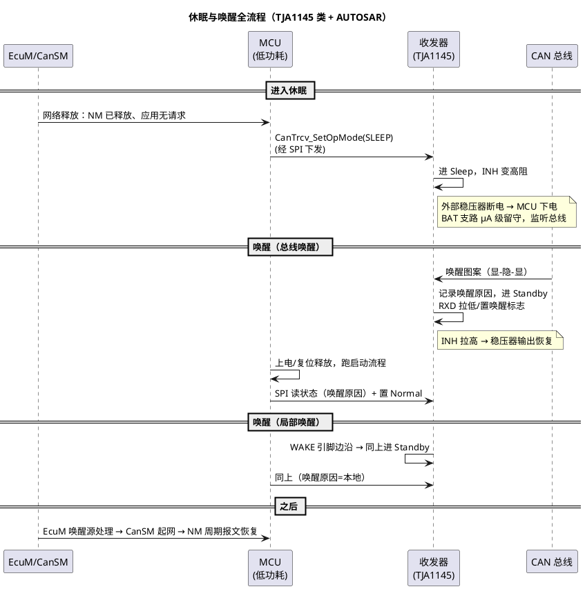

# 02-唤醒与休眠

> 一句话定位：整车下电后靠 KL30 常电续命，"睡得深、醒得快、不假醒"全靠收发器与 MCU 的休眠握手——本篇讲透 Sleep 链路、总线/局部两条唤醒路径、与 NM 报文的配合，以及假醒排查速查表。
> 等级：L2 ｜ 前置：[01-收发器选型TJA1145](01-收发器选型TJA1145.md)

## 原理

整车对 ECU 的要求：下电后静态电流压到 µA~mA 级，但**任何一次网络事件都必须能把整节点拉起来**。分层实现：

- **MCU 侧**：进入 Standby/低功耗模式，时钟关、RAM 保持，靠 GPIO 中断或 CAN 事件唤醒；
- **收发器侧**：进 Sleep/Standby，BAT 支路留守（µA 级），持续监测总线唤醒条件；
- **电源侧**：INH 控制的主稳压器断电（以 TJA1145 为例），唤醒时最先恢复。

### 两条唤醒路径

| 路径 | 触发 | 特点 |
|---|---|---|
| 总线唤醒（远程） | 总线上出现**唤醒图案**：显性段→隐性段→显性段（各段有 µs 级时长门槛，ISO 11898-2:2016）；PN 收发器还可按**选择性唤醒帧**（ID+数据匹配）唤醒 | 单个短显性毛刺不触发——收发器自带滤波，这是第一道防假醒 |
| 局部唤醒（本地） | **WAKE 引脚**边沿（接 KL15、硬线唤醒信号或相邻 ECU） | 不依赖总线，速度快、可指向唤醒 |

### 休眠握手与唤醒时序

## 详解：与 NM 报文的配合、假醒速查

### 与网络管理的配合（预告）

- **睡的节奏由 NM 定**：全网节点停发 NM 报文→NM 状态机走 Prepare Bus Sleep→Bus Sleep→CanSM 调 CanTrcv_SetOpMode(SLEEP)——收发器"敢睡"的前提是网管层确认全网都睡；
- **醒的第一帧是 NM**：被唤醒节点起来后立即发 NM 报文"我醒了"，把整个网段拉回 Repeat Message/Normal，随后应用报文恢复——细节在 [网络管理](../../../2-L2进阶/网络管理/README.md)；
- **PN 的价值**：选择性唤醒让"不需要醒的 ECU"在网段活跃时继续睡（按 ID 过滤唤醒帧），是降整车功耗的进阶手段。

### 假醒来源速查表

| 现象 | 常见来源 | 对策 |
|---|---|---|
| 夜间偶发醒一次又睡回 | 总线耦合毛刺（大电流负载切换、点火脉冲） | 确认收发器唤醒图案滤波在位；CANH/L 对绞与屏蔽；TVS |
| WAKE 线毛刺唤醒 | KL15 检测线无滤波，点火抖动 | WAKE 加 RC 滤波/施密特 |
| 一醒就全网醒 | 某节点被误唤醒后发 NM 报文广播 | 先定位"谁先醒"（按唤醒原因寄存器），再治该节点 |
| FD 网段误醒 | 非 /FD 收发器收到 CAN-FD 帧误判 | 选 FD-passive 变体（见 [01-收发器选型TJA1145](01-收发器选型TJA1145.md)） |
| 静态电流周期性跳变 | MCU 反复短醒（看门狗/定时器残留） | 休眠前逐项关外设时钟与调试口 |
| 休眠电流下不来 | BAT 支路外挂负载/上拉、稳压器未真断 | 断支路法逐项量电流 |

## 配置层/工程关联

- AUTOSAR 链：**EcuM**（睡眠请求/唤醒源）→ **CanSM**（停网/起网）→ **CanIf** → **CanTrcv**（SetOpMode NORMAL/STANDBY/SLEEP）；TJA1145 的 SPI 序列封装在 CanTrcv（或厂商 Trcv 驱动）里；
- 唤醒原因要落日志：CanTrcv 读回的唤醒源（总线/本地/欠压复位）打进 Dlt/Dem，现场"为什么醒了"不用猜；
- EcuM 的 wakeup source 注册：总线唤醒经 CanIf→EcuM_SetWakeupEvent 上报，未注册的唤醒源会被当作噪声忽略——**这是"明明醒了却没人处理"的配置层根因**；
- 休眠前 checklist：NM 已释放、无 pending 发送（CanIf 队列空）、收发器真的进 Sleep（读回状态）、调试器已断开（调试器会阻止低功耗模式）。

## 易错点与陷阱

1. **假醒不判因直接压掉**：现象是"偶发唤醒电流大"，粗暴办法是提高唤醒门槛——结果真唤醒也丢了。对策：先读收发器唤醒原因寄存器分清总线/本地，再对症（滤波 vs 屏蔽 vs 换 FD-passive）。
2. **休眠握手顺序错**：先睡收发器再停 NM 报文，瞬间全网被你的"唤醒图案"拉醒。对策：严格按 NM 释放→停发送→CanTrcv Sleep 的顺序。
3. **CanIf 唤醒源没注册到 EcuM**：硬件醒了、软件不知道，MCU 醒来后不发 NM、不进正常网管。对策：检查 EcuMWakeupSourceConfig 与 CanIfWakeup 配置闭环。
4. **唤醒后不等稳压器/收发器就绪就发第一帧**：TXD 显性超时或 ACK 错误连环。对策：初始化顺序 Trcv Normal → 控制器 Start → 首帧发送。
5. **调试器/日志 UART 拖住低功耗**：实测休眠电流永远超标。对策：测休眠电流时全脱附件、走真实整车线束。
6. **把 Standby 当 Sleep**：Standby 下 INH 仍导通、稳压器还在跑，电流差一个量级。对策：SPI 读回模式确认，不是"调了就信"。

## 面试高频题

**Q1：整车下电后 ECU 怎么被唤醒？**
答：两条路：总线唤醒——收发器在 Sleep/Standby 下检测 ISO 11898-2 唤醒图案（显-隐-显）或选择性唤醒帧，置唤醒标志并经 INH 恢复供电，MCU 启动后读唤醒原因并置收发器 Normal；局部唤醒——WAKE 引脚边沿（如 KL15）。唤醒后第一件事是发 NM 报文拉起整个网段。

**Q2：休眠握手为什么要收发器和 MCU 配合？单独睡 MCU 不行吗？**
答：不行。收发器必须留守以监听总线（µA 级），MCU 可完全下电靠 INH 断电实现；若只睡 MCU 而收发器保持 Normal，静态电流超标，且没有唤醒通路。握手保证了"睡得深"与"醒得快"同时成立。

**Q3：什么是假醒？怎么排查？**
答：非预期事件把节点从睡眠拉起（毛刺、WAKE 抖动、FD 帧误判、调试器），表现为静态电流间歇超标。排查：读收发器唤醒原因（总线/本地）→本地则查 WAKE 线滤波，总线则查耦合与是否需 FD-passive，再用电流表+示波器抓唤醒瞬间的总线波形。

**Q4：NM 报文和收发器唤醒是什么关系？**
答：收发器唤醒只解决"把节点从电的角度拉起来"；真正把网段从逻辑上唤醒的是网络管理协议——被唤醒节点发出 NM 报文，其他节点相继进入 Repeat Message 状态，全网恢复通信。收发器是物理唤醒，NM 是逻辑唤醒。

## 延伸

- [网络管理](../../../2-L2进阶/网络管理/README.md)：NM 状态机、睡眠释放与假醒的协议层视角；
- [01-收发器选型TJA1145](01-收发器选型TJA1145.md)：模式表与 INH/VIO/WAKE 引脚定义；
- [唤醒电路](../../../../03-硬件基础/2-L2进阶/ECU硬件常识/02-唤醒电路.md)：WAKE/KL15 检测电路的硬件细节；
- [CAN-FD/02-与经典CAN共存](../CAN-FD/02-与经典CAN共存.md)：FD-passive 在混跑网段防假醒的角色；
- [协议原理/04-错误帧](../协议原理/04-错误帧.md)：唤醒过渡期 ACK 错误/错误计数器波动的因果。
