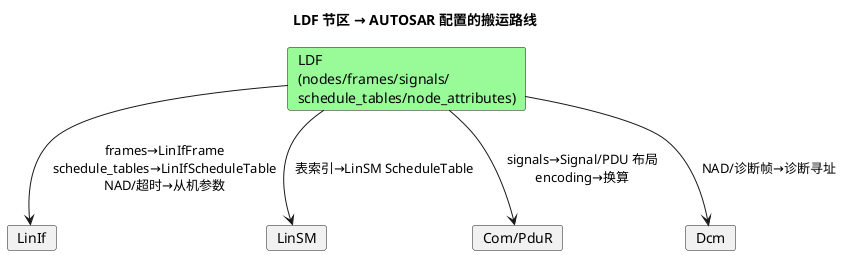

# 01-LDF结构

> 一句话定位：LDF 是 LIN 世界的一纸总账——拓扑、信号、帧、调度表、从机属性全写在一个文件里；把六大节区读顺，AUTOSAR 的 LinIf/LinSM 配置就只是它的搬运。
> 等级：L2 ｜ 前置：[帧结构](../协议原理/02-帧结构.md)

## 原理

一份最小可用 LDF 的骨架（LIN 2.1 口径，节选自车门电机场景）：

```
lin_description_file;
LIN_language_version = "2.1";
protocol_version = "2.1";
speed = 19.2 kbps;                          /* 全网波特率锚点 */

nodes {                                     /* ① 拓扑：一个主，若干从 */
  master: CEM, 0 ms, 0 ms ;
  slaves: LSM, RSM ;
}

signals {                                   /* ② 信号目录：位宽/初值/发布者/订阅者 */
  MotorRequest: 8, 0, CEM, LSM ;
  MotorPos: 16, 0, LSM, CEM ;
  MotorError: 1, 0, LSM, CEM ;
}

frames {                                    /* ③ 帧：ID/发布者/长度 + 信号排布 */
  MotorControl: 0x10, CEM, 2 {              /*   每字节 10 位见帧结构篇 */
    MotorRequest, 0 ;                       /*   offset=从字节0位0起的 bit 序号 */
  }
  MotorStatus: 0x11, LSM, 4 {
    MotorPos, 0 ;
    MotorError, 16 ;
  }
}

node_attributes {                           /* ④ 从机属性：诊断/超时/响应错误 */
  LSM {
    protocol = "2.1";
    configured_NAD = 0x02;
    response_error = MotorError;            /*   从机把响应错误写进这个信号 */
    P2_min = 50 ms; ST_min = 0 ms;
    N_As_timeout = 1000 ms; N_Cr_timeout = 1000 ms;
  }
}

schedule_tables {                           /* ⑤ 调度表：主节点的时间表 */
  MotorSchedule {
    MotorControl delay 10 ms ;
    MotorStatus delay 10 ms ;
  }
  GoToSleep {                               /*   表尾睡眠是行业惯例 */
    MasterReq delay 10 ms ;
    GoToSleepCmd delay 10 ms ;
  }
}

diagnostics { }                             /* ⑥ 诊断：NAD 表/帧 ID 60/61 配置 */
signal_encoding_types { }                   /* ⑦ 物理值换算(可选) */
```

各节区的作用与去处：

| 节区 | 管什么 | 在 AUTOSAR 侧落到哪 |
|---|---|---|
| nodes | 主从角色与拓扑 | LinIf 通道、LinSM 网络 |
| signals | 信号目录（位宽/初值/发布订阅） | Com 的 Signal/ISignal |
| frames | 帧 ID/发布者/长度/信号 offset | LinIfFrame + PDU 位排布 |
| node_attributes | NAD、超时（P2_min 等）、response_error | LinIf 从机参数、Dcm 诊断会话 |
| schedule_tables | 槽序列与槽延时 | LinIfScheduleTable + LinSM 表索引 |
| diagnostics / encoding | 诊断配置 / 物理换算 | LinIf 诊断支持 / Com 换算 |



## 详解

**LDF 与 DBC 的形态差异**（为什么 CAN 用 DBC 而 LIN 必须用 LDF）：

| 维度 | DBC（CAN） | LDF（LIN） |
|---|---|---|
| 核心视角 | 报文/信号平面目录 | 主从拓扑+时序行为的"剧本" |
| 调度语义 | 无——发送时机由各 ECU 自治 | 有——schedule_tables 是灵魂 |
| 节点角色 | 平等节点 | 显式 master/slave 与从机属性 |
| 诊断 | 不涉及 | NAD/诊断帧/超时内置 |
| 信号排布 | Intel/Motorola 字节序可选 | 小端连续 bit 序（offset 跨字节累加） |

两个必懂的语法细节：**offset 是从字节 0 的 bit0 起连续累加的 bit 序号**——`MotorPos, 0` 占 D0.0~D1.7，`MotorError, 16` 落在 D2.0；它与 DBC 的 Motorola 大端模型不可直译。**init_value 支持 scalar 或按字节数组**，多字节信号初值按数组写最不易错。

**版本敏感**：LIN 1.3 / 2.0 / 2.1 / 2.2A 的 LDF 语法互有出入（2.0 起默认增强校验和、新增 node_attributes 大量字段）。混用版本的工具解析会静默丢字段——文件头版本声明要当真。

## 配置层/工程关联

- 工程流：Vector LDF Explorer / OEM 下发 LDF → 工具导出 ARXML → EB tresos 里 LinIf/LinSM/Com 各模块导入比对；主节点侧还要配置主任务与表切换策略（见 [主从与调度表](../协议原理/01-主从与调度表.md)）。
- `speed` 必须与主从两侧 LinDrv 配置一致，容差口径见 [波特率与同步](../协议原理/03-波特率与同步.md)。
- `response_error` 是从机错误上报通道：从机检测帧头/响应错误置位该信号，主节点轮询到 MotorStatus 即可拿到从机健康度——排障时先看它（见 [01-帧超时](../排障/01-帧超时.md)）。
- 表切换与网络管理：GoToSleep 表由 LinSM 的睡眠流程触发，配合 LinNm 的睡眠请求，别在 BswM 里绕开 LinSM 手切。

## 易错点与陷阱

1. **现象**：信号值在 Com 层读出来错位。**原因**：按 DBC 的 Motorola 习惯理解 LDF offset。**对策**：LDF offset 一律按小端连续 bit 序翻译（见 [02-信号映射](02-信号映射.md)）。
2. **现象**：调度表槽延时看着对，运行总超时。**原因**：delay 写成 `10` 漏单位（规范要求 `10 ms`），或把表长按短帧估算。**对策**：按最坏帧长×1.3 校核每槽（口径见 [帧结构](../协议原理/02-帧结构.md)）。
3. **现象**：从机错误无从知晓。**原因**：node_attributes 漏配 response_error。**对策**：每个从机必配，主节点侧加监控逻辑。
4. **现象**：工具导入 LDF 部分字段丢失。**原因**：LDF 版本声明与工具支持版本不符（如 2.2A 文件进 2.1 解析器）。**对策**：锁定版本链，导入后 diff 关键节区。
5. **现象**：多主节点工程表不同步。**原因**：LDF 只允许一个 master；某网段被两份 LDF 各配一个主。**对策**：一个 LIN 网一份 LDF，主节点唯一。

## 面试高频题

1. **问：LDF 有哪几个核心节区？各自作用？**
   答：nodes（主从拓扑）、signals（信号目录）、frames（帧与信号排布）、node_attributes（NAD/超时/response_error）、schedule_tables（槽序列）、diagnostics（诊断配置）——前四者描述"静态结构"，调度表描述"动态行为"。
2. **问：LDF 与 DBC 的本质区别？**
   答：DBC 是平面报文目录，发送时机交给各 ECU；LDF 除帧/信号外还内置主从角色、调度表与从机诊断属性——因为 LIN 的时序行为由主节点集中决定，必须把"剧本"写进数据库。
3. **问：LDF 如何映射到 AUTOSAR 配置？**
   答：frames→LinIfFrame+PDU、schedule_tables→LinIfScheduleTable（LinSM 引用）、signals→Com Signal、node_attributes→LinIf 从机参数与 Dcm 寻址，工具链自动搬运+人工校核。
4. **问：response_error 信号的作用？**
   答：从机把自身检测到的响应错误位（帧头/响应/校验错误）写入该信号上报主节点，是 LIN 网健康度监控的标准通道。

## 延伸

- [02-信号映射](02-信号映射.md)——signals/frames 节区的位级展开
- [01-主从与调度表](../协议原理/01-主从与调度表.md)——schedule_tables 的运行时语义
- [02-帧结构](../协议原理/02-帧结构.md)——帧排布背后的位账单
- [03-排障实录](../排障/03-排障实录.md)——LDF 配错的三个真实现场
