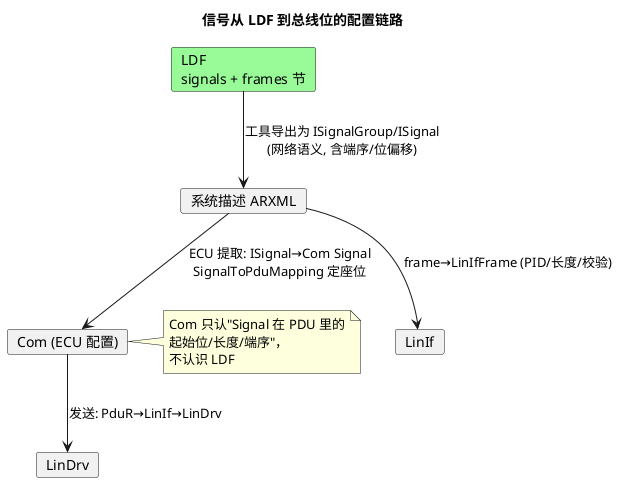

# 02-信号映射

> 一句话定位：把 LDF 的 signals/frames 节区翻译成"哪个信号坐在哪个字节哪一位、谁发谁收、原始值怎么换算物理值"，再接到 AUTOSAR 的 ISignal→Signal→PDU 链路上——Com 层一半的配置错误都堵在这一关。
> 等级：L2 ｜ 前置：[01-LDF结构](01-LDF结构.md)

## 原理

以 MotorStatus 帧（4 字节）为例，信号在数据场里的排布（LDF 的 offset 是**从 D0.0 起连续累加的 bit 序号，小端序**）：

```wavedrom
{ reg: [
  { bits: 8,  name: 'MotorPos 低字节 (bit0~7)',  attr: 'offset=0, 16bit' },
  { bits: 8,  name: 'MotorPos 高字节 (bit8~15)', attr: '跨字节小端' },
  { bits: 1,  name: 'Err',  attr: 'offset=16' },
  { bits: 3,  name: '状态', attr: 'offset=17' },
  { bits: 4,  name: '保留', attr: '0' }
], config: { hspace: 650 }, head: { text: 'MotorStatus 数据场 (D0→D3, LSB first)' } }
```

对应 LDF 写法：`MotorPos, 0 ;`、`MotorError, 16 ;`、`MotorState, 17 ;`。**跨字节信号低字节在前**——这与很多 DBC 工具的 Motorola 序不可直译，翻译脚本必须显式做端序映射。

发布-订阅关系直接写在 signals 节：`信号名: 位宽, 初值, 发布者, 订阅者1, 订阅者2...`。一个信号**只能有一个发布者**，但可多订阅；一帧的发布者=其主信号的发布者。

| 信号 | 位宽 | 发布者 | 订阅者 | 帧内位置 | 含义 |
|---|---|---|---|---|---|
| MotorPos | 16 | LSM(从) | CEM(主) | MotorStatus D0.0~D1.7 | 电机位置 |
| MotorError | 1 | LSM | CEM | D2.0 | 响应错误上报 |
| MotorState | 3 | LSM | CEM | D2.1~D2.3 | 运行状态机 |
| MotorRequest | 8 | CEM | LSM | MotorControl D0 | 主节点命令 |

## 详解

**物理值换算**在 LDF 的 signal_encoding_types 节：

```
signal_encoding_types {
  MotorPos_enc {
    physical_value, 0, 500, 0.1, 0 ;   /* min, max, scale, offset */
    logical_value, 511, "error" ;      /* 特殊逻辑值 */
  }
}
signal_representation { MotorPos_enc : MotorPos ; }
```

换算公式：**物理值 = 原始值 × scale + offset**。上例 raw=3657？不——16 位但 max=500，raw 0~500 对应 0~50.0mm（精度 0.1mm）；raw=511 是错误值。落到 Com 层要注意：**scale 是浮点描述，实现是整数**——应用侧通常放大 10 倍存整数（505 → 50.5mm），换算在 SWC/RTE 完成，Com 只搬运原始值（ComSignalDataType 按 raw 定宽）。

**到 AUTOSAR 的链路**（系统描述 ARXML 视角）：



一句话分工：**LDF 定座位，ISignal 讲网络语义，Com Signal 讲本 ECU 的打包语义**——ISignal 端序按 LIN 小端，ComSignal 端序若配错（例如顺手选了 BIG_ENDIAN），收出来的多字节值就字节颠倒。

## 配置层/工程关联

- **Com**：`SignalToPduMapping` 的起始位（ComBitPosition 沿用小端 bit 序）、`ComSignalEndianness=LITTLE`、传输属性（TRIGGERED/PENDING）；信号超时监控 `ComFirstTimeout/Timeout`（主节点可借此发现从机断流，见 [01-帧超时](../排障/01-帧超时.md)）。
- **PduR**：LIN 的 PDU 路由比 CAN 简单（通常 Com↔LinIf 直连），但 ILinIf 接口与 IPduR 的挂接别漏。
- **排布校验**：导入 LDF 后跑一遍 overlap 检查（两个信号挤同一位区）与长度校验（信号越出数据场）——部分工具静默放过，只能靠比对报表。
- **三方核对清单**（每次 LDF 变更后必跑）：LDF 订阅者列表 ↔ 本 ECU 的 Com 信号收发方向 ↔ SignalToPduMapping 起始位；任一不符即回 LDF 重新生成，禁止手补 Com 侧。
- **端到端视角**：排布问题最后都在 CANoe Graphic 里现形——把物理值曲线和原始字节并排画，错位/颠倒一眼可辨。

## 易错点与陷阱

1. **现象**：16 位位置值低八位正常、高八位全 0（或字节互换）。**原因**：ComSignalEndianness 配成大端，或翻译脚本按 Motorola 处理 offset。**对策**：LIN 信号一律小端；跨字节信号重点 diff。
2. **现象**：两信号互相"串台"。**原因**：起始位 overlap，工具未报错。**对策**：导入后生成位图报表人工复核。
3. **现象**：应用值偶尔比预期大 0.1。**原因**：scale 换算用浮点，边界值进位差一。**对策**：整数放大运算（×10），显示层再除。
4. **现象**：从机收不到命令信号。**原因**：signal 的订阅者漏写从机，帧照发但 Com 未给从机生成接收映射。**对策**：LDF 订阅者列表与两侧 Com 配置三方比对。
5. **现象**：信号初值"不对"。**原因**：LDF init_value 与 ComSignalInitValue 两处配置不一致。**对策**：以 LDF 为源自动生成，禁止手改 Com 侧初值。

## 面试高频题

1. **问：LDF 的信号 offset 是什么语义？**
   答：从数据场 D0 的 bit0 起连续累加的 bit 序号、小端序；跨字节信号低字节在前，与 DBC 的 Motorola 模型不可直译。
2. **问：发布-订阅在 LDF 里怎么表达？**
   答：signals 节每个信号声明唯一发布者与若干订阅者；帧的发布者即该帧数据场的发出者——这决定了主从两侧 Com 的收发方向配置。
3. **问：物理值换算发生在哪一层？**
   答：LDF 的 scale/offset 是描述层；Com 只传原始值，换算在应用/RTE 按整数放大实现，避免浮点误差。
4. **问：ISignal 与 Com Signal 的区别？**
   答：ISignal 是系统描述里的网络语义信号（跨 ECU，含端序/位偏移）；Com Signal 是本 ECU 通讯配置里的打包信号，经 SignalToPduMapping 映射进 PDU——LDF 导出 ISignal，ECU 提取生成 Com Signal。

## 延伸

- [01-LDF结构](01-LDF结构.md)——信号排布所在的文件骨架
- [02-帧结构](../协议原理/02-帧结构.md)——数据场在整帧里的位置与位账单
- [01-帧超时](../排障/01-帧超时.md)——信号断流时 Com 超时监控如何接手
- [从一帧CAN报文说起-车载网络全景](../../../00-入门导读/01-从一帧CAN报文说起-车载网络全景.md)——Com/PduR 打包链路的全程地图
