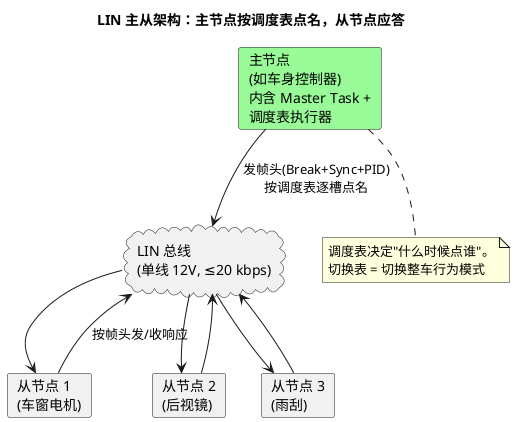

# 01-主从与调度表

> 一句话定位：LIN 没有 CAN 的自由竞争，一切帧由主节点按"调度表"逐槽点名发出帧头、从节点照帧头应答——理解"主任务+调度表"就理解了 LIN 的全部秩序。
> 等级：L1 ｜ 前置：[从一帧CAN报文说起-车载网络全景](../../../00-入门导读/01-从一帧CAN报文说起-车载网络全景.md)

## 原理

LIN 是**单主多从**的网络：全网只有一个主节点（Master）带着主任务（Master Task），其余全是从节点（Slave）。总线上的**每一个帧头都由主节点发出**，从节点只被动响应——没有仲裁、没有冲突、时序完全确定。

**调度表（Schedule Table）** 是主节点的时间表：一串**帧槽（slot）**排成循环，每个槽绑定一个帧头。一帧的传输时间≈(44 + 10×数据字节数) 位 ÷ 波特率，槽长再留缓冲（口径见 [02-帧结构](02-帧结构.md)）。典型一张表这样跑：

| 槽序 | 帧 | PID | 方向 | 槽长(19.2kbps, ms) | 说明 |
|---|---|---|---|---|---|
| 1 | MotorStatus | 0x10 | 从1→主 | 6.0 | 读车窗位置 |
| 2 | MotorCtrl | 0x11 | 主→从1 | 6.0 | 控制命令 |
| 3 | MirrorPos | 0x20 | 从2→主 | 4.0 | 读后视镜 |
| 4 | WiperStat | 0x30 | 从3→主 | 6.0 | 读雨刮状态 |
| … | … | … | … | … | 循环回槽 1 |

**调度表切换**是 LIN 的"换挡"：整车工况变化（如进入睡眠）时，上层用 `LinSM_ScheduleRequest(NetworkHandle, ScheduleIndex)` 请求换表，LinIf 在**当前帧传完后**原子切换——绝不打断进行中的帧。常见表：Normal 表（业务帧轮询）、Diagnostic 表（60/61 诊断帧）、Sleep 表（表尾发 GoToSleep 帧 0x3C 全睡眠）。

## 详解

除常规的**无条件帧（Unconditional Frame）**外，调度表里还有两种"省时间"的特殊帧：

- **事件触发帧（Event-triggered Frame）**：一个帧头让**多个从机抢答**。典型场景：十几个按键开关，平时都不变；只有状态变化的从机才在响应空间里回一个**缩短响应（仅 2~4 字节+校验）**。若多个从机同时变化→响应冲突→主节点转入关联的**冲突解决表**，逐个轮询对应无条件帧。规则：参与抢答的各帧数据场第一个字节须互不相同。
- **偶发帧（Sporadic Frame）**：反过来给主节点省槽：多个低频主发帧共用一个槽，槽到点时主节点挑一个"有数据要发"的帧发出；都没数据则发一帧填充帧头（无响应）。适合报文又多又懒的场景。

LIN vs CAN 的定位分工（为什么车两者都要）：

| 维度 | LIN | CAN |
|---|---|---|
| 速率 | ≤20 kbps（常用 10.4/19.2k） | ≤1 Mbps（FD 更高） |
| 介质 | 单线+电池参考，12V 电平 | 双绞差分，显/隐性 |
| 介质访问 | 主从轮询，无仲裁 | CSMA/CD+NDBA 自由竞争 |
| 时序确定性 | 槽表固定，绝对确定 | 仲裁延迟有抖动 |
| 从节点成本 | 无晶振（靠 Sync 自同步）、UART 即可 | 每节点需晶振/高精度时钟 |
| 错误处理 | 校验和+帧超时，无错误计数器 | TEC/REC 三态、BusOff |
| 典型应用 | 车窗/座椅/雨刮/后视镜等低速执行器 | 动力/底盘/车身主干网 |

一句话：**LIN 是 CAN 的"低成本外挂枝杈"**——主干决策在 CAN 上做完，LIN 把命令分发到末梢执行器。

配一张新表的五步法（把上面节奏落成操作单）：

1. 列出全网帧与各自最坏位长（44+10N 位，N=数据字节数）；
2. 按信号 Deadline 分层：快信号（如 10ms 级）进短周期表，慢信号（诊断/配置）单开一张表；
3. 槽长 = 理论帧长 × 1.4 向上取整到整毫秒；
4. 表周期 = Σ槽长，核对每个信号最坏更新延迟 ≈ 表周期 + 一帧时长 ≤ 通讯矩阵要求；
5. 预留 ≥10% 负载余量给表切换抖动与诊断表插入，超了就拆表或提波特率。

## 配置层/工程关联

- **LinIf**：调度表在 AUTOSAR 里落地为 `LinIfScheduleTable`（槽序列、每槽的 LinIfFrame 引用、槽延时 LinIfSlotTimeOffset 等），LinIf 的 MainFunction 驱动表执行、处理切换请求。
- **LinSM**：`LinSM_ScheduleRequest()` 是上层换表的唯一正门；LinSM 还管网络启停（LinSM_GotoSleep/Wakeup），与 ComM 的模式请求联动。
- **LinDrv**：只管把帧头/响应按位打出去，不认识调度表——层次职责见 [LinDrv接口契约](../../../../04-MCAL与外设驱动/2-L2进阶/CanDrv与LinDrv/02-LinDrv接口契约.md)。
- **工程节奏**：调度表的表长决定全表轮询周期，直接决定信号最坏更新延迟——配表时先算"信号 Deadline ÷ 表周期"余量，槽长按最坏帧长+余量取整。

## 易错点与陷阱

1. **现象**：换调度表后偶尔丢一帧。**原因**：LinIf 切换是"当前帧完成后"才生效，请求恰好落在帧中。**对策**：正常现象（按规范切换点设计），业务上按"下一槽起生效"处理，不要假设换表即时。
2. **现象**：事件触发帧总是冲突。**原因**：参与抢答的从机首字节没有互异设计，或从机数据变化太频繁。**对策**：检查首字节约定；高频变化的信号别用事件触发帧，老老实实进无条件帧。
3. **现象**：槽长按平均帧长配，高峰期响应被下一帧头截断。**原因**：槽长必须按**最坏**（最长数据场+最大字节间隔）留足。**对策**：槽长 = 理论帧时长 × 1.3~1.4 安全系数。
4. **现象**：以为从节点可以主动发帧。**原因**：LIN 全网帧头只能主发（除唤醒脉冲外从机无主动权）。**对策**：从机要"报告"只能等主轮询或用事件触发帧抢答机制。
5. **现象**：Sleep 表配了但整车永不睡。**原因**：主节点没收到全睡眠条件（ComM Nm 未释放），Sleep 表永远排不上。**对策**：排网络管理链路，不是 LIN 配置问题。

## 面试高频题

1. **问：LIN 的介质访问方式与 CAN 的本质区别？**
   答：LIN 是主从轮询——帧头永远由主节点按调度表发出，从节点只在被点名时响应，时序绝对确定；CAN 是所有节点自由竞争+逐位仲裁，优先级高的赢，存在仲裁抖动。
2. **问：调度表是什么？怎么切换？**
   答：主节点的时间表，一串帧槽循环执行，每槽发一个帧头。上层通过 LinSM_ScheduleRequest 请求换表，LinIf 保证当前帧传完后原子切换，对应整车工况/模式变化。
3. **问：事件触发帧解决什么问题？冲突了怎么办？**
   答：让多个低频变化的从机共用一个槽位，只有状态变化的从机回缩短响应，节省带宽；多个从机同变会冲突，主节点转入冲突解决表逐个轮询关联无条件帧。
4. **问：为什么 LIN 从节点可以不用晶振？**
   答：每个帧头带 Sync 字节 0x55，从节点测量其边沿周期自动校准自己的分频（见 [03-波特率与同步](03-波特率与同步.md)），这是 LIN 低成本的关键设计。

## 延伸

- [02-帧结构](02-帧结构.md)——帧头+响应的逐域解剖
- [03-波特率与同步](03-波特率与同步.md)——从机免晶振的秘密
- [LDF结构](../LDF与配置/01-LDF结构.md)——调度表在 LDF 里怎么写
- [从一帧CAN报文说起-车载网络全景](../../../00-入门导读/01-从一帧CAN报文说起-车载网络全景.md)——LIN 在四张网地图上的位置
