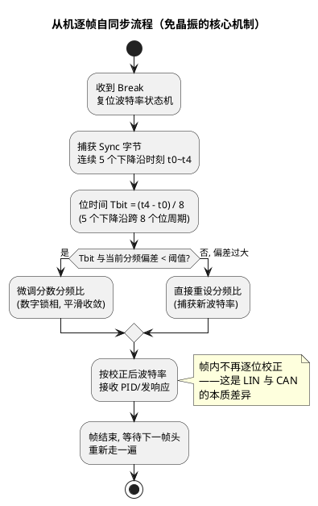

# 03-波特率与同步

> 一句话定位：LIN 从机不用晶振的秘密在每个帧头的 Sync 字节里——主节点每帧发校准音，从机逐帧测频、分数分频自动追频；三层容差（0.5%/2%/14%）就是这套机制的数学边界。
> 等级：L1→L2 ｜ 前置：[02-帧结构](02-帧结构.md)

## 原理

Sync 字节 0x55（LSB first 发送后是 `0 1 0 1 0 1 0 1 0 1` 的规整方波）是主节点发的"校准音"。从机每个帧头都重新测频一次：

所谓**分数分频**：从机的定时器/UART 波特率发生器支持小数分频比（如 NCO、分数 BRG），不必整除主频也能逼近任意位时间，测得的 Tbit 直接换算分频比写入。

三层容差（LIN 2.x 口径）是这套机制的预算表：

| 角色 | 时钟容差 | 含义 |
|---|---|---|
| 主节点 | ±0.5% | 全网基准，必须最准——通常由晶振保证 |
| 从节点（帧头同步后） | ±2% | 同一帧内保持偏差的预算：8 字节帧约 124 位，2% 内累计错位不会越过半个采样点 |
| 从节点（初始/未同步） | ±14% | 粗捕获预算：保证第一次听到 Sync 还能数对边沿个数 |

## 详解

**为什么 LIN 不需要 CAN 那样的位级重同步？** CAN 是多主自由竞争，位值由仲裁当场决定，任何位错都会改写仲裁结果，所以 CAN 用位填充制造边沿、用 SJW 逐位硬/重同步。LIN 是主从点名制：一帧内没有仲裁、没有竞争，从机只需在**帧头处一次校准**，然后靠 2% 的帧内预算"扛"完这一帧；下一帧头又是一次全新校准。**周期性重校准替代了逐位重同步**——用机制换硬件，这正是 LIN 从机敢用 RC 振荡器的底气。

**时钟源决定全局**：全网波特率锚定在主节点时钟上。主节点若准，从机逐帧跟随，主从间的**相对**误差恒小于 2%，通信自洽；但主节点若用了 ±2% 的内部 RC，全网会整体偏离标称波特率——节点间没事，CANoe/VH6501 这类按标称波特率采样的工具却可能错位丢帧。所以**主节点必须晶振、必须配 ±0.5% 档**，这是 LDF Node_attributes 里 protocol/时钟声明盯的第一件事。

主从时钟链算例（一条 LIN 网的偏差预算怎么拼出来）：

| 环节 | 典型时钟源 | 偏差 | 对应预算档 |
|---|---|---|---|
| 主节点 | 晶振 | ±0.02%~0.5% | 全网锚点（规范 ±0.5%） |
| 从机同步后 | RC+分数分频逐帧校 | ≤±2% | 帧内保持预算 |
| 从机初始（未同步/唤醒首帧） | RC 上电原值 | ±14% 内 | Sync 捕获预算 |

工程含义：最坏相对偏差 ≈ 主 0.5% + 从 2% ≈ 2.5% 出现在长帧末尾，因此**长帧（8 字节）是容差链上最脆弱的帧型**——验收测试要专门用 8 字节帧烤机。常用波特率档与应用口味：

| 档位 | 典型应用 | 备注 |
|---|---|---|
| 9600 | 老平台车身、开关类 | 最保守，长线束友好 |
| 10400 | 遗留平台 | 与 9600 相差约 8%，错配症状隐蔽 |
| 19200 | 门域/座椅/雨刮主流 | 当前新平台主力档 |

**波特率不匹配的三种症状**（按偏差量级）：

| 偏差 | 表现 | 机理 |
|---|---|---|
| >±14% | 从机完全装聋，主机每帧超时 | Sync 边沿都数不对，锁不住帧头 |
| ±2%~14% | Sync/PID 能收，数据场尾部开始 checksum 错、偶发超时 | 帧头短没事，长帧累计错位过采样点 |
| ±0.5%~2% | 正常（工程上仍建议 <1%） | 帧内预算未穿 |

典型档位：9600 / 10400 / 19200 bps。注意 9600 与 10400 相差约 8%——落在 14% 内：从机"能锁住 Sync"却收不对数据，属于最会骗人的错配。

## 配置层/工程关联

- **LinDrv/LinIf**：`LinGeneral`/通道配置里的 LinBaudrate 必须与 LDF 声明一致（LDF 头部 `Speed` 与 Node_attributes 的 `LIN_protocol`、时钟参数）。
- **TC377**：ASC/GPTimer 组合或 GPIO 位拆实现，波特率与采样点由定时器分频决定；Break 检测依赖专用 LIN 模式。**S32K**：LPUART 的 LIN 模式自带 break 检测与唤醒，分频含小数位（OSR/分数 BRG），见 [LinDrv接口契约](../../../../04-MCAL与外设驱动/2-L2进阶/CanDrv与LinDrv/02-LinDrv接口契约.md)。
- **LDF 侧**：`Speed 19200 kbps` 写在文件头，主从必须同值；工具链（如 Vector LDF Explorer/EB）会用它生成两侧配置。
- **CANoe**：通道波特率与主节点实际不一致时，先看 Trace 的 Break/Sync 解析是否报错，再用示波器量主节点位宽定标。

## 易错点与陷阱

1. **现象**：节点互发正常，CANoe 偶发解析错。**原因**：主节点用了内部 RC，全网整体偏 2%，工具按标称采样错位。**对策**：主节点换晶振时钟源，示波器定标位宽。
2. **现象**：9600 与 10400 错配，从机"半死不活"。**原因**：8% 偏差在 14% 捕获带内，锁得住 Sync 收不准数据。**对策**：统一从 LDF 读波特率，禁止手抄。
3. **现象**：8 字节长帧偶发 checksum 错，2 字节短帧全好。**原因**：帧内偏差踩在 2% 预算边缘，长帧累计穿限。**对策**：换晶振/修分频，把帧内偏差压到 1% 以下。
4. **现象**：唤醒后首帧必丢。**原因**：从机唤醒+再同步耗时超过主节点首帧间隔（首帧间隔建议 ≥ 唤醒稳定时间）。**对策**：主节点唤醒序列后留够首帧延迟；从机唤醒路径砍中断延迟。
5. **现象**：从机软件测 Sync 数错边沿。**原因**：把起始位沿或停止位沿混进测量窗口。**对策**：严格按"5 个连续下降沿跨 8 位"口径，或直接用硬件 LIN 模式的自动测量。

## 面试高频题

1. **问：LIN 从机为什么可以不用晶振？**
   答：每个帧头的 Sync 字节 0x55 提供规整边沿，从机测量 5 个下降沿跨 8 位的时间得位时间，经分数分频逐帧自校准；帧内靠 2% 预算保持，下一帧头再校。
2. **问：0.5% / 2% / 14% 三个容差分别约束谁？**
   答：主节点 ±0.5%（全网基准）；从机同步后同帧内 ±2%（长帧累计错位预算）；从机未同步初始 ±14%（Sync 粗捕获预算）。
3. **问：CAN 需要位级重同步而 LIN 不需要，为什么？**
   答：CAN 多主仲裁要求逐位电平即时正确，靠位填充+SJW 逐边沿重同步；LIN 主从点名无仲裁，帧头一次校准+帧内小偏差预算即可，用周期性重校准替代逐位同步。
4. **问：波特率偏 5% 会出现什么现象？**
   答：Sync/PID 尚可正确，长数据场累计错位导致 checksum 错与偶发超时——"短帧好、长帧坏"是典型指纹。

## 延伸

- [02-帧结构](02-帧结构.md)——Sync 域在帧里的位置与位账单
- [01-主从与调度表](01-主从与调度表.md)——同步机制背后的主从秩序
- [01-帧超时](../排障/01-帧超时.md)——波特率偏差的下游症状
- [01-LDF结构](../LDF与配置/01-LDF结构.md)——Speed 声明与主从时钟属性
