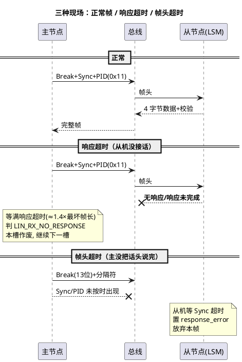

# 01-帧超时

> 一句话定位：LIN 超时分两案——帧头超时是"主节点没把话头说完"（从机视角），响应超时是"从机没接话"（主节点视角）——先分案再排因，是从 LIN 断流到根因的最短路径。
> 等级：L2 ｜ 前置：[帧结构](../协议原理/02-帧结构.md)

## 原理

一帧分两段，责任也分两段。**帧头（Break+Sync+PID）永远由主节点发出**，帧头不完整/间隔超限叫**帧头超时**；**响应（数据+校验）由发布者接话**，接不上或接不完叫**响应超时**：

响应超时的量纲：主节点按 **≈1.4 × 最坏响应位数 ÷ 波特率** 判（19.2kbps、8 字节帧约 10ms 量级）——1.4 的系数就是给响应空间与字节间隔留的余量（见 [帧结构](../协议原理/02-帧结构.md)）。

**从机不响应的原因速查表**（按命中率排序）：

| 原因 | 特征指纹 | 30 秒验证法 |
|---|---|---|
| 从机未上电/未初始化 | 该从机**所有帧**恒超时 | 量从机供电，查 LinDrv_Init 调用 |
| 从机睡眠 | 唤醒前全超时，唤醒后恢复 | CANoe 发唤醒脉冲再观察 |
| PID 不匹配 | **特定帧**恒超时，其余正常 | 抓包 PID 与 LDF 逐位比对 |
| 波特率偏 | Sync 勉强、数据场校验错与超时混合 | 示波器量主节点位宽 |
| 调度表未含该帧 | 总线上**根本没有帧头**（不是超时） | Trace 搜 PID，查当前激活表 |
| 从机卡诊断态 | 仅诊断帧超时 | 读 NAD/会话状态 |

## 详解

**主节点侧的超时账本**：LinIf 的 MainFunction 驱动槽序列，帧头发完后等响应；超时发生时底层 `Lin_GetStatus` 返回 `LIN_RX_NO_RESPONSE`（响应超时）/`LIN_HDR_ERROR`（帧头问题。注：`LIN_HDR_ERROR` 非 AUTOSAR Lin SWS 标准枚举值，属厂商扩展枚举（LinIf/LinDrv 实现相关），具体状态命名以所用驱动手册为准）/`LIN_CHKSUM_ERROR`（校验错，见 [02-checksum类型](02-checksum类型.md)）。LinIf 记账后**本槽作废、按时切下一槽**——所以超时帧在 Trace 上的形态是"帧头孤零零挂着，下一个槽按时出现"，而不是总线停摆。

**两层超时的分工**：LinIf 层管"这一帧收没收齐"；**Com 层的信号超时（deadline monitoring，ComFirstTimeout/ComTimeout）管"这个信号多久没更新了"**。后者才是应用可感知的口径——某信号超时触发替代值/告警，是 OEM 通讯规范的常规条款。排障时两层都要看：LinIf 层证明总线问题，Com 层证明应用影响。

**从机视角的证词**别忘了收：LDF `node_attributes` 里的 response_error 信号（见 [LDF结构](../LDF与配置/01-LDF结构.md)）把从机检测到的帧头/校验错误置位上报——主节点超时统计+从机 response_error 对读，两边证据一拼，责任立现。

**超时数值算例**（19.2 kbps、8 字节从发帧）：最坏响应位数=数据 80+校验 10=90 位；主节点响应超时 ≈ 1.4×90÷19200 ≈ **6.6ms**；该槽建议 9ms（帧长口径见 [帧结构](../协议原理/02-帧结构.md)）。排障时把 Trace 里"帧头结束→下一帧头出现"的实际间隔对回此值：间隔≈理论帧长=正常、间隔≈超时值=等满超时才切槽、间隔忽长忽短=从机响应能力不稳。

到手即可用的排查决策表：

| Trace 观测 | 第一嫌疑 | 下一步 |
|---|---|---|
| 帧头根本不出现 | 调度表/主任务 | 查激活表与 LinSM 切换链 |
| 帧头在 + no response | 从机侧 | 供电/睡眠→PID→波特率（见原因表） |
| 帧头在 + 校验错 | 配置/算法 | 核 checksum 类型（[02-checksum类型](02-checksum类型.md)） |
| 偶发超时 + 高负载相关 | 从机响应能力 | 压中断延迟、放宽槽余量 |
| 唤醒前超时、唤醒后正常 | 睡眠/唤醒链路 | 见 [03-排障实录](03-排障实录.md) 案例三 |

## 配置层/工程关联

- **LinIf**：槽序列按最坏帧长留余量，超时判定参数（如 LinIfTimeout，按槽帧长推导）别配得比理论帧长还紧——从机响应空间 2~4 位是合法开销。
- **Com**：每个接收信号配 ComFirstTimeout/ComTimeout 及超时替代值；超时通知回调里区分"偶发"与"持续"再升级策略。
- **LinSM/LinNm**：睡眠相关超时（从机唤不醒属另一案，见 [03-排障实录](03-排障实录.md) 案例三）。
- **CANoe 排障姿势**：① Trace 加 Response/Error 列——`Header OK + no response` 即响应超时指纹；② Graphic 把该帧信号与帧头事件并排画，断流起止点对齐故障时刻；③ Statistics 按帧统计超时率，区分"偶发毛刺"与"恒定不响应"。
- **统计口径**：超时率指标（如"稳态 <0.1%"）要写进 Release 测试规范并自动采集，别等整车路试才发现回归。

## 易错点与陷阱

1. **现象**：把响应超时当帧头问题查主节点。**原因**：两案责任方相反——帧头超时查主（发帧头的是主），响应超时查从（接话的是发布者）。**对策**：先在 Trace 确认帧头是否完整出现。
2. **现象**：超时帧后总线"看起来停了一下"。**原因**：主节点等满超时才切槽，槽时长被拉满。**对策**：属正常行为；若整体表周期超标，收敛超时参数或修从机响应速度。
3. **现象**：低负载正常、高负载批量超时。**原因**：从机 ISR 被高优先级中断抢占，响应空间超限。**对策**：压从机中断延迟、预装配数据，或放宽该槽。
4. **现象**：CANoe 里某帧恒不出现，被当成"超时"。**原因**：调度表根本不含该帧（表没切换成功）。**对策**：先搜 Trace 有无帧头——无帧头≠超时，查 LinSM_ScheduleRequest 链。
5. **现象**：仅 CANoe 环境超时，实车正常。**原因**：仿真从节点没订阅该帧/没配发布。**对策**：检查仿真工程 LDF 导入与节点角色配置，别拿仿真环境的配置病当硬件病。
6. **现象**：改调度表后部分帧开始超时。**原因**：新表槽长没按帧长重算。**对策**：任何表变更都重跑配表五步法（见 [01-主从与调度表](../协议原理/01-主从与调度表.md)）。

## 面试高频题

1. **问：帧头超时与响应超时如何区分？责任各在谁？**
   答：帧头超时=主节点 Break 后 Sync/PID 未按时完成，责任在主节点（或总线被干扰）；响应超时=帧头完整但响应未在约 1.4×最坏帧长时间内完成，责任在发布者（从机未上电/PID 不匹配/波特率偏等）。
2. **问：从机不响应，你的排查顺序？**
   答：Trace 确认帧头在不在→不在查调度表切换；在则按"供电/睡眠→PID 比对→波特率→从机软件挂接"顺序收敛，同时读从机 response_error 信号取证。
3. **问：LinIf 超时与 Com 信号超时什么关系？**
   答：LinIf 管"帧级收没收齐"（总线视角，Lin_GetStatus 状态码）；Com 管"信号级多久没更新"（应用视角，deadline monitoring 触发替代值）。前者是因，后者是果。
4. **问：CANoe 上响应超时的典型形态？**
   答：Trace 里该帧 Header 正常、Response 列显示 no response，帧头孤帧后下一槽按时出现；Graphic 中该帧信号断流。

## 延伸

- [02-checksum类型](02-checksum类型.md)——超时的孪生兄弟：校验错
- [03-排障实录](03-排障实录.md)——帧超时相关真实案件的完整复盘
- [帧结构](../协议原理/02-帧结构.md)——响应空间与字节间隔如何吃掉超时预算
- [01-LDF结构](../LDF与配置/01-LDF结构.md)——response_error 与调度表的配置源头
