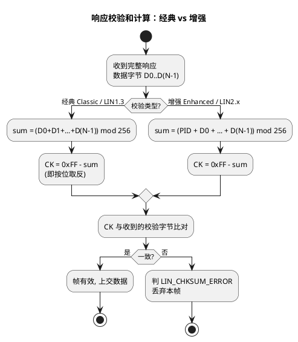

# 02-checksum类型

> 一句话定位：LIN 校验和只有两副面孔——经典型只把数据字节求和取反，增强型连 PID 一起算；一行公式、一个例外规则（诊断帧恒经典），配对成功全网通，配错一帧都过不去。
> 等级：L2 ｜ 前置：[帧结构](../协议原理/02-帧结构.md)

## 原理

两型算法只差"算不算 PID"：

手算一例（PID=0x50，数据 0x01 0x02）：经典型 sum=0x03 → **CK=0xFC**；增强型 sum=0x53 → **CK=0xAC**。同一帧两种答案差一个 PID——这正是类型不匹配时的故障机理。

**类型由谁决定**：LDF 里不逐帧写字段，而是由**协议版本+帧 ID 规则推导**——node_attributes 声明 `protocol="2.1"` 的从机默认增强；帧 ID 60(0x3C)/61(0x3D) 是铁打的例外。AUTOSAR 侧则显式落地：LinIf 每帧的 `LinIfChecksumType`（ENHANCED/CLASSIC），两处必须推导一致。

**例外规则一句话**：无论 LIN 1.3 还是 2.x，诊断帧（ID 60 请求/61 响应，负载里跑 SID 50/62/7F 等诊断服务）**恒用经典校验和**——这是规范写死的，与节点协议版本无关。

诊断通道速查（校验排障时最常碰的帧）：

| 帧 | 帧 ID | 方向 | 校验类型 | 负载常见 SID |
|---|---|---|---|---|
| 诊断请求 | 0x3C (60) | 主→从 | 恒经典 | 50 会话控制、10 复位等 |
| 诊断响应 | 0x3D (61) | 从→主 | 恒经典 | 62 按 DID 读、7F 否定响应 |

CANoe 里验证校验类型的五步（怀疑配反时的标准动作）：

1. Trace 过滤该帧，打开 Checksum 列，抓一组 PID+响应字节；
2. 按经典公式手算：`CK_c = 0xFF - (Σdata & 0xFF)`；
3. 按增强公式手算：`CK_e = 0xFF - ((PID+Σdata) & 0xFF)`；
4. 比对实测校验字节：等于 CK_c 而本侧配 ENHANCED（或相反）→ 类型配反，锅在 LinIfChecksumType 或 LDF protocol 声明；
5. 修配置后复测通过率，并用 Statistics 确认全网无残余校验错。

## 详解

**增强型为什么把 PID 拉进算式？** PID 本身只有 2 位奇偶保护，防不住多位错误；若帧头位错导致 0x11 被误认成 0x10，经典校验照样通过——数据就"张冠李戴"进了别的帧。增强型把 PID 纳入校验后，帧头与响应绑成一体，错认即校验失败。代价是 1.3/2.x 混网时互不兼容——这也是"迁移期全帧校验错"的经典事故（见下）。

**类型不匹配的现象与指纹**：

| 场景 | 现象 | 指纹 |
|---|---|---|
| 从机 1.3(经典) vs 主机按 2.x(增强) | 该从机**每帧** LIN_CHKSUM_ERROR，信号全断 | Trace 校验列恒红、超时与校验错交替出现 |
| 诊断帧误配 ENHANCED | 诊断完全不通 | 仅 ID 60/61 帧（含 SID 50/62/7F）校验错，业务帧全好 |
| 手写实现丢进位 | 偶发校验错 | 累加未 mod 256，长帧/大值数据必错 |

与帧超时的区分：**校验错=响应来了但被判死刑（Trace 有完整字节+校验红）；超时=响应压根没来（Header 孤帧）**。两者常被新人混为一谈，排障方向完全不同（见 [01-帧超时](01-帧超时.md)）。

## 配置层/工程关联

- **LinIf**：`LinIfChecksumType` 逐帧显式配置；从 LDF 导入时核对推导结果（尤其诊断帧例外规则是否被工具正确处理——老版本工具链有过 ID 60/61 例外不生效的坑）。
- **LinDrv**：部分硬件 LIN 外设（S32K LPUART LIN 模式）支持硬件校验，可配校验类型；纯软件校验时注意 mod 256。
- **CANoe**：Trace 的 Checksum 列直接标错；用 LIN Analysis 的校验统计快速定位"是哪一侧的类型配错"——比对主发帧与从发帧的校验通过率即可分锅。
- **Dcm/诊断链**：诊断帧恒经典，Dcm 到 LinIf 的 PDU 链路配置不要顺手抄业务帧的 ENHANCED。

## 易错点与陷阱

1. **现象**：换了个从机供应商后其全部信号丢失。**原因**：新从机是 LIN 1.3（经典），主机侧 LinIf 仍配 ENHANCED。**对策**：核对该从机 LDF 的 protocol 声明，逐帧改 LinIfChecksumType。
2. **现象**：业务帧全通、诊断一个字都进不去。**原因**：ID 60/61 被配成增强校验。**对策**：诊断帧恒经典的例外规则写进检查单。
3. **现象**：自研从机偶发校验错，量产件正常。**原因**：累加没做 mod 256，长帧溢出。**对策**：`sum += data[i]; sum &= 0xFF;`（或用 uint8 自然回绕）。
4. **现象**：CANoe 硬件当主节点时诊断通，实际主节点诊断不通。**原因**：仿真/硬件卡按 LDF 推导（例外规则生效），ECU 侧 LinIf 手配漏例外。**对策**：以 LDF 为唯一真源生成两侧配置。
5. **现象**：校验错被误报成"从机不响应"。**原因**：Trace 未开校验列，只看到信号断流。**对策**：先区分"响应来了判错"与"响应没来"，再走对应排查线。

## 面试高频题

1. **问：经典与增强校验和的算法与区别？**
   答：经典=数据字节和按 256 取模后取反；增强=PID 一并纳入求和再取反。增强把帧头与响应绑定，防帧头位错导致帧错认。
2. **问：为什么诊断帧恒用经典校验？**
   答：LIN 规范规定 ID 60/61 诊断帧不受协议版本影响恒用经典——保证不同代节点在诊断通道上永远互通。
3. **问：类型不匹配的现象与定位方法？**
   答：该节点每帧 LIN_CHKSUM_ERROR、信号全断但帧头完整；比对主从两侧协议版本与 LinIfChecksumType，业务帧与诊断帧分开核。
4. **问：校验错与响应超时怎么区分？**
   答：Trace 里校验错=完整响应字节+校验列红（来了但判错），响应超时=只有帧头孤帧（压根没来）；前者查配置/算法，后者查从机状态。

## 延伸

- [01-帧超时](01-帧超时.md)——校验错的孪生症状：响应超时
- [03-排障实录](03-排障实录.md)——含校验链路的完整案件复盘
- [帧结构](../协议原理/02-帧结构.md)——校验域在响应里的位置
- [01-LDF结构](../LDF与配置/01-LDF结构.md)——protocol 声明与帧定义的源头
