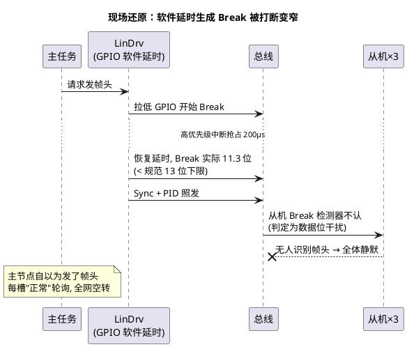

# 03-排障实录

> 一句话定位：三个 LIN 真实故障案——Break 宽度不足全从机失联、调度表槽重叠信号跳变、唤醒脉冲过窄睡死不醒——每个都从 CANoe 现场出发，走完"现象→证据→根因→修复"的完整推理链。
> 等级：L2 ｜ 前置：[01-帧超时](01-帧超时.md)

## 案例一：全从机失联——主节点 Break 宽度不足

**现象**：某车型门域 LIN（车窗+后视镜，1 主 3 从）报"LIN 通讯丢失"故障，三个从机信号同时消失。

**CANoe 抓包特征**：Trace 里 Sync+PID 正常出现（CANoe 自身按门限能解出），但**所有从机帧一律 no response**；LIN Analysis 的 Break 宽度测量值 11.3 位（规范 ≥13 位）。

**排查路径**：① "全部从机同时哑"→ 先疑主侧帧头（单从机病不会全哑）→ ② 示波器单帧抓取：Break 段仅 11 位显性 → ③ 读主节点 LinDrv 实现：Break 用 GPIO+软件延时，中断抖动吃掉宽度。
**根因**：软件延时生成 Break 无最低宽度保证。
**修复**：改用硬件 Break（LPUART LIN 模式/定时器输出比较），宽度锁定 14 位；回归加"Break 宽度"出厂检测。
**复盘**：**Break 是帧头唯一"不可冒充"的锚**，宽度不足=全网失联但主节点毫无察觉；凡是全从机超时，先量 Break。

## 案例二：座椅位置信号周期性跳变——调度表槽重叠

**现象**：座椅位置信号（10ms 周期）偶发跳回旧值，人感体验为"调节卡顿"；无 DTC。

**CANoe 抓包特征**：两相邻帧时间戳分布双峰；跳变时刻 Trace 中 SeatPos 帧显示校验错，且**下一帧的帧头紧贴上一帧最后一个数据字节**（无帧间空闲）；该帧数据首字节疑似"半截"。

| 排查步 | 动作 | 结果 |
|---|---|---|
| 1 | 信号跳变点与 Trace 时间戳对齐 | 跳变=该帧校验错被丢弃，Com 保持旧值 |
| 2 | 量帧间隔 | 长帧响应与下一帧头重叠（slot 溢出） |
| 3 | 核对 LDF 调度表 | 该槽 delay 按旧 2 字节帧估算；需求改为 8 字节后未重算 |
| 4 | 复算槽长 | (44+80)位÷19200≈6.5ms，乘 1.4≈9ms > 配置的 7ms |
| 5 | 另查 LinSM 切表日志 | 状态切换时两表帧间隔也未留余量，偶发叠加 |

**根因**：调度表槽长不足+频繁切表，长帧响应被下一帧头截断，主节点判校验错丢弃——表现为"信号跳回旧值"。
**修复**：全部槽按最坏帧长×1.4 重算（口径见 [帧结构](../协议原理/02-帧结构.md)）；切表请求限频，冲突表错峰。
**复盘**：**信号"周期性跳变/回旧值"第一嫌疑是总线帧被丢，而不是应用 bug**——先对齐 Trace 再看代码。

## 案例三：睡眠后唤不醒——唤醒脉冲宽度不足

**现象**：整车休眠后，开门/钥匙偶尔唤不醒门域 LIN（概率性，冷天更频繁）；一旦唤醒成功后一切正常。

**CANoe 抓包特征**：复现时抓到主节点唤醒序列：显性脉冲实测 **180µs**（规范 250µs~5ms），且隐性分隔符仅 2ms（规范 ≥4ms）；部分从机无反应，主节点重试 3 次后放弃。

**排查路径**：① 唤不醒属唤醒链路而非帧超时 → ② 示波器量主节点唤醒脉冲：宽度不足 → ③ 查驱动：脉冲由定时器比较产生，**定时器时钟在低功耗模式下自动降到半频**，脉宽时间常数按全速时钟算的 → ④ 半频下 250µs 目标只出 180µs；低温 RC 漂移再吃掉余量，冷天恶化。
**根因**：低功耗模式下时钟降频，唤醒脉冲宽度未按降频时钟校准。
**修复**：按低功耗时钟重算比较值，脉宽放宽至 500µs、分隔符 5ms（均在规范窗内）；EOL 增加"休眠-唤醒"循环测试。
**复盘**：**唤醒链路必须在真实低功耗模式下验证**——全速调试时怎么测都对；LIN 唤醒参数（250µs~5ms 显性+≥4ms 隐性分隔）是主从约定的硬窗口。

## 三案共性复盘

1. **先分责任区**：全从机失联→查主侧帧头（案例一）；个别信号病→查该帧时序/配置（案例二）；休眠态专属→查低功耗路径（案例三）。LIN 的主从结构让"分锅"比 CAN 更快。
2. **示波器与 Trace 双证**：CANoe 看协议语义（谁没响应、校验红），示波器看物理事实（Break 宽度、脉宽、重叠）——案例一/三若无波形证据，永远会在软件里绕圈。
3. **配置病多于硬件病**：三案根因都是配置/实现细节（软件 Break、槽长没重算、时钟降频），LDF 与驱动参数的**联动核对**（见 [01-LDF结构](../LDF与配置/01-LDF结构.md)）是 LIN 集成的主战场。

三案速查（回头翻案底用）：

| 案 | 一句话根因 | 快速指纹 | 预防手段 |
|---|---|---|---|
| 一 | Break 宽度不足（软件延时生成） | 全从机 no response + 示波器量得 11 位 | 硬件 Break 机制 + EOL 宽度检测 |
| 二 | 槽长不足响应被下帧头截断 | 校验错 + 帧头紧贴 + 信号回旧值 | 表变更必跑槽长×1.4 重算流程 |
| 三 | 唤醒脉宽不足（低功耗时钟降频） | 休眠后偶发唤不醒 + 脉宽 180µs | 真实低功耗模式下做 EOL 唤醒循环测试 |

## 易错点与陷阱

1. **现象**：全从机超时却逐个换从机试。**原因**：主侧帧头病（Break/波特率）被漏查。**对策**："全体哑"必查主侧，先量 Break 与位宽。
2. **现象**：信号跳变被当应用层竞态修。**原因**：帧被丢后 Com 保持旧值，表象酷似回写竞态。**对策**：Trace 对齐跳变时刻，先证明总线层无罪。
3. **现象**：台架唤醒测试全过，整车偶发失败。**原因**：台架未进真实低功耗模式（调试器供电/时钟全速）。**对策**：唤醒测试在整车或等效功耗台架做，覆盖温度。
4. **现象**：调大超时参数"掩盖"槽重叠。**原因**：槽重叠是时序设计错，超时参数救不了被截断的帧。**对策**：重算槽长，而不是放宽超时。
5. **现象**：切表后首帧必错被当偶发。**原因**：LinSM 切表虽在帧边界切换，但两表槽预算紧邻无间隔。**对策**：表间预留保护槽或错峰设计。

## 面试高频题

1. **问：LIN 网全部从机不响应，你的第一步？**
   答：判定主侧帧头问题（单从机病不会全哑）：示波器量 Break 宽度（≥13 位）与位宽（对波特率），再查主节点 LinDrv 的 Break 生成机制是否软件延时。
2. **问：信号周期性跳回旧值的总线侧原因？**
   答：帧被校验错/超时丢弃后 Com 保持旧值——常见根因是调度表槽长不足导致响应被下一帧头截断；用 Trace 对齐跳变时刻即可证明。
3. **问：LIN 唤醒信号的规范窗口？**
   答：显性脉冲 250µs~5ms，随后 ≥4ms 隐性分隔符；过窄被当噪声、过宽可能被判短路。主从两侧都要按各自时钟（含低功耗降频）校准。

## 延伸

- [01-帧超时](01-帧超时.md)——本文三个案例的判定基础
- [02-checksum类型](02-checksum类型.md)——案例二中校验错的算法层背景
- [01-主从与调度表](../协议原理/01-主从与调度表.md)——调度表槽预算的正确算法
- [03-波特率与同步](../协议原理/03-波特率与同步.md)——案例三涉及的时钟链路
