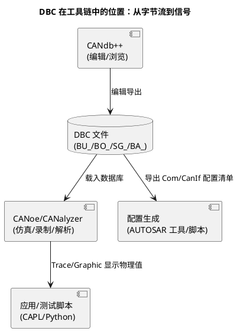

# 01-DBC

> 一句话定位：DBC 是 CAN 网络的"列车时刻表+座位表"——哪个报文（车次）、多快一班（周期）、哪个信号坐哪个位子（起始位/长度），一个纯文本文件说清全车。
> 等级：L1→L2 ｜ 前置：[从一帧CAN报文说起-车载网络全景](../../00-入门导读/01-从一帧CAN报文说起-车载网络全景.md)

## 原理

DBC（Data Base CAN，Vector 格式）描述三件事：**网络上有哪些节点（BU_）、节点收发哪些报文（BO_）、报文里装哪些信号（SG_）**。工具（CANdb++、CANoe、各种解析库）都靠它把"裸字节流"翻译成"人类可读的信号"。



## 详解

### DBC 文件骨架

```text
VERSION "1.0"

NS_ :           // 内部符号表（工具用，一般不动）
    ...

BS_:            // 波特率定义（已废弃，常为空）

BU_: BCM DCU GW ICU TBOX        // 节点列表：全车谁在这张网上

BO_ 100 VehSpdMsg: 8 BCM        // 报文：ID=100(0x64) 名=VehSpdMsg 长度=8 发送者=BCM
 SG_ VehSpd : 0|16@1+ (0.01,0) [0|655.35] "km/h"  DCU,ICU
 SG_ EngRpm : 16|16@1+ (0.125,0) [0|8191.875] "rpm"  ICU
 SG_ GearPos : 32|3@1+ (1,0) [0|7] ""  DCU,ICU,GW

CM_ SG_ 100 VehSpd "整车车速，来自轮速换算";    // 注释
BA_DEF_ BO_ "GenMsgSendType" ENUM "Cyclic","Event","EventPeriodic","IfActive";
BA_ "GenMsgSendType" BO_ 100 0;                 // 属性赋值：周期发送
BA_DEF_ BO_ "GenMsgCycleTime" INT 0 10000;
BA_ "GenMsgCycleTime" BO_ 100 10;               // 周期 10ms
VAL_ 100 GearPos 0 "P" 1 "R" 2 "N" 3 "D";       // 值表：原始值→文本
```

骨架记四行就够：`BU_`（谁在网）、`BO_`（哪个报文谁发）、`SG_`（信号坐哪谁收）、`BA_`（报文属性：周期/发送类型等）。其余都是这四行的注释与修饰。

### 信号定义语法逐段拆

`SG_ VehSpd : 0|16@1+ (0.01,0) [0|655.35] "km/h" DCU,ICU`

| 片段 | 含义 | 备注 |
|---|---|---|
| `0` | 起始位（start bit） | 按**字节内 bit 序号**计数，配合字节序解释 |
| `16` | 长度（bit 数） | 1~64 |
| `@1` | 字节序：1=Intel（小端），0=Motorola（大端） | CAN 里两种都常见，混用是事故高发区 |
| `+` | 符号：+无符号，-有符号 | 有符号按补码 |
| `(0.01,0)` | 因子 factor、偏移 offset | 物理值 = 原始值×factor + offset |
| `[0|655.35]` | 物理值范围 | 文档性质，运行时不强制 |
| `"km/h"` | 单位 | — |
| `DCU,ICU` | 接收节点列表 | 文档性质，接收过滤不靠它 |

**字节序的坑**：Intel 格式信号从起始位向高位生长、跨字节向下一字节延续（LSB 在 start bit）；Motorola 格式按 bit7..0 从高到低、跨字节时从下一字节的 bit7 接续——同一个"起始位 7、长度 16"在两种字节序下是两个完全不同的座位。拿不准就用 CANdb++ 的图形化 layout 窗口看方块图，别硬算。

**物理值换算实例**：VehSpd 定义 `(0.01,0)`，总线上收到数据 Byte0=0xD0、Byte1=0x07 → 原始值 = 0x07D0 = 2000 → 物理值 = 2000×0.01 + 0 = **20.00 km/h**。反向发送同理：想发 33.5 km/h → 原始值 = (33.5-0)/0.01 = 3350 = 0x0D16 → 写入 Byte0=0x16、Byte1=0x0D。

### 报文发送类型

通过 `BA_ "GenMsgSendType"`（Vector 约定属性，各家工具命名略有差异）：

| 类型 | 行为 | 典型用途 |
|---|---|---|
| Cyclic 周期 | 固定周期发送（配 GenMsgCycleTime） | 状态类：车速、档位 |
| Event 事件 | 信号变化/触发时发 | 按键、故障标志 |
| EventPeriodic 事件周期 | 事件触发后按周期发一段时间（或事件触发+周期保活） | 事件后需要被稳定接收的量 |
| IfActive 使能 | 仅当信号非默认值时发，默认值时不发 | 低频故障信息，省总线负载 |

AUTOSAR 侧的对应：Cyclic→Com 的 PERIODIC 模式，Event→DIRECT/ON_CHANGE，EventPeriodic→MIXED——DBC 属性是矩阵到 Com 配置的输入之一（完整链路见 [03-通讯矩阵ARXML](03-通讯矩阵ARXML.md)）。

### CANdb++ 与 CANoe 使用直觉

- **CANdb++**：Vector 的 DBC 编辑器。常用三处：信号 layout 图形化摆位（避免手算 bit）、属性批量改（周期/发送类型）、一致性检查（ID 冲突、信号重叠）；
- **CANoe**：Simulation Setup 里挂 DBC 后，Trace 窗口的裸字节自动翻译成信号名+物理值；Graphic 窗口按物理值画曲线；CAPL 脚本用 `sysGetVariable`/数据库绑定直接读写信号。测试前"先载 DBC 再看 Trace"是肌肉记忆。

## 配置层

DBC 本身就是配置的源头，落地时关注这些属性约定：

| DBC 属性/字段 | 含义 | 典型值 | 易错点 |
|---|---|---|---|
| BO_ 的 ID | CAN ID（扩展帧 ID 最高位标记，工具约定如 0x80000000） | 按矩阵 | 标准/扩展帧标志丢失→滤波全错 |
| DLC | 数据长度 | 8（经典）/64（FD） | FD 报文在老 DBC 里写 8→信号截断 |
| GenMsgCycleTime | 周期 ms | 10/20/100/1000 | 与 ECU 实际 Com 配置不一致→超时误报 |
| GenMsgDelayTime | 同报文最小重发间隔 | 0 | 漏配导致事件风暴无背压 |
| GenMsgSendType | 发送类型 | 见上表 | 矩阵说周期、实现配成事件→对端超时 |
| VAL_ 值表 | 枚举文本 | 档位/状态字 | 缺值表→测试报告里全是裸数字 |
| SG_ receivers | 接收者 | 节点列表 | 文档性质被误当过滤配置使用 |

## 易错点与陷阱

1. **字节序混配**：同一报文里 Intel/Motorola 混用且手写起始位，接收侧解出"鬼值"；对策：layout 图形化确认，新增信号禁止纯手工算位。
2. **DBC 版本不同步**：测试台架用了旧版 DBC（信号挪了位），现象是"偶发跳变/恒错"；对策：DBC 进 Git，测试环境加载前校验版本号/哈希。
3. **把 receivers 当滤波器**：接收节点列表只是文档信息，真实过滤在 CanIf/控制器配置；漏配真实滤波→该收的收不到，与 DBC 无关。
4. **物理值范围当校验用**：`[min|max]` 不被运行时强制，超范围数据照样上总线；需要校验就在 Com/RTE 或应用侧做。
5. **FD 报文沿用 8 字节习惯**：DLC 写 8、信号只摆前 8 字节，FD 带宽浪费且和矩阵不一致；FD 项目要确认工具与 DBC 版本支持 64 字节布局。
6. **周期属性与实现脱节**：DBC 写 10ms、Com 配 100ms，测试按 DBC 断言周期→大面积误报；DBC 属性应以生成的配置回读校验。

## 面试高频题

- **Q：DBC 里一条 SG_ 定义包含哪些信息？**
  A：信号名、起始位、长度、字节序（@1 Intel/@0 Motorola）、符号、因子与偏移、物理范围、单位、接收节点；物理值=原始值×factor+offset。
- **Q：Intel 和 Motorola 字节序在 DBC 里怎么区分？起始位怎么理解？**
  A：@1 是 Intel（小端，起始位为 LSB，跨字节向高字节生长）；@0 是 Motorola（起始位为 MSB 侧，跨字节从下一字节 bit7 接续）；宁可开 layout 图核对，不硬算。
- **Q：报文的周期/事件发送在 DBC 里怎么表达？**
  A：通过 BA_ 属性：GenMsgSendType（Cyclic/Event/EventPeriodic/IfActive）加 GenMsgCycleTime 等参数；这些属性是生成 AUTOSAR Com 发送模式的输入。
- **Q：DBC 的 receivers 列表能当接收过滤吗？**
  A：不能，它只是文档信息；真实接收过滤在 CanIf/驱动滤波配置，两者要对齐但不能互相替代。

## 延伸

- [02-LDF](02-LDF.md)：LIN 的数据库——多了调度表这个"时间维度"；
- [03-通讯矩阵ARXML](03-通讯矩阵ARXML.md)：从 DBC 到全网络 ARXML 矩阵与配置生成链路；
- [CAN](../CAN/README.md)：DBC 描述的对象——CAN 帧格式与仲裁；
- [01-Python处理ARXML](../../../01-编程语言/2-L2进阶/辅助脚本/01-Python处理ARXML.md)：批量校验/导出数据库内容的脚本思路；
- [总线工具](../../../09-调试与测试/2-L2进阶/总线工具/README.md)（待写）：CANoe/CANdb++ 深度用法。

---

维护约定：笔记命名 `序号-主题.md`；真实截图放 `_images/`；流程/时序/状态/架构图用 PlantUML 内嵌正文，规范见 [图表规范与模板](../../../00-总览/图表规范与模板.md)。
