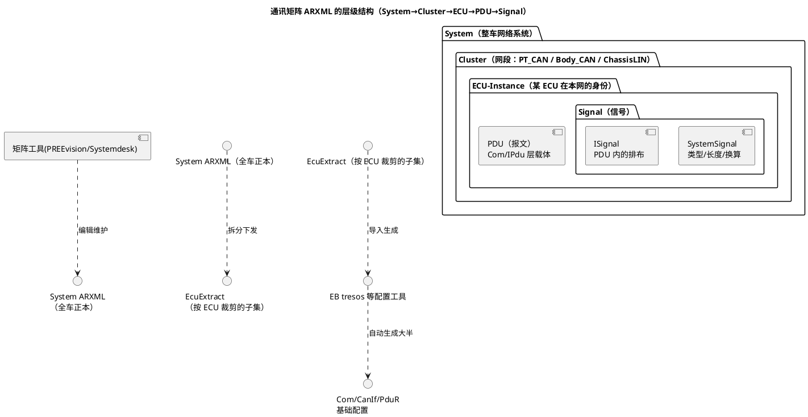

# 03-通讯矩阵ARXML

> 一句话定位：通讯矩阵是全车"谁跟谁说什么话、多久说一次"的总账本——ARXML 是它的电子化形态，也是从 OEM 矩阵一路生成到每颗 ECU AUTOSAR 配置的自动化源头。
> 等级：L2 ｜ 前置：[01-DBC](01-DBC.md)

## 原理

通讯矩阵（Communication Matrix）是一张四维总表：**ECU × 报文 × 信号 × 周期/属性**——哪个 ECU 发布哪个报文、报文里装哪些信号、每个信号什么类型与换算、收方是谁、多久更新一次。DBC/LDF 是它的"单总线条带"，ARXML 是它的"整车正本"。层级结构用 component 图一眼看清：



## 详解

### 从矩阵到 AUTOSAR 配置的生成链路

这是 ARXML 矩阵存在的全部意义——让 5 个 ECU、300 条报文、2000 个信号的配置不靠手敲：

1. **OEM 建模**：网络组在 PREEvision（或 Systemdesk/自研工具）里维护整网 System ARXML：网段、ECU、报文、信号、周期、PNC 归属、诊断路由全在内；
2. **裁剪分发**：按 ECU 拆出 **EcuExtract**（每个 ECU 只看到自己涉及的收发子集），随 RFQ/开发任务下发给 Tier1；
3. **导入生成**：EB tresos/DaVinci 导入 EcuExtract，自动生成 Com（Signal/IPdu/TxMode）、CanIf（TxPdu/RxPdu 映射）、PduR（路由）的大半配置——工程师只做校验与补齐（NvM 关联、超时监控、DEB）；
4. **变更管理**：矩阵改版（信号挪位/新增报文）后重新走 2~3 步，工具 diff 出配置差异——**矩阵是唯一事实源（single source of truth）**，手改生成物是大忌。

### ARXML 关键容器（看懂结构即可，不必背 schema）

```xml
<SYSTEM-SHORT-NAME>VehicleNet</SYSTEM-SHORT-NAME>
<CLUSTERS>                     <!-- 网段：PT_CAN -->
  <CAN-CLUSTER>
    <PHYSICAL-CHANNEL>...</PHYSICAL-CHANNEL>
  </CAN-CLUSTER>
</CLUSTERS>
<ECU-INSTANCES>                <!-- ECU 身份 -->
  <ECU-INSTANCE>
    <CONNECTORS>...</CONNECTORS>
    <PDUS>                      <!-- 本 ECU 的报文 -->
      <ISIGNAL-I-PDU>
        <LENGTH>64</LENGTH>    <!-- bit 或 Byte 按工具约定 -->
        <I-PDU-TIMING-SPECIFICATION>
          <TRANSMISSION-MODE-DECLARATION>
            <CYCLIC-TIMING><TIME-OFFSET>...</TIME-OFFSET>
              <TIME-PERIOD>0.1</TIME-PERIOD>   <!-- 周期 100ms -->
            </CYCLIC-TIMING>
          </TRANSMISSION-DECLARATION>
        </I-PDU-TIMING-SPECIFICATION>
        <I-SIGNAL-TO-PDU-MAPPINGS>   <!-- 信号在 PDU 内的排布 -->
          <I-SIGNAL-TO-I-PDU-MAPPING>
            <PACKING-BYTE-ORDER>MOST-SIGNIFICANT-BYTE-LAST</PACKING-BYTE-ORDER>
          </I-SIGNAL-TO-I-PDU-MAPPING>
        </I-SIGNAL-TO-PDU-MAPPINGS>
      </ISIGNAL-I-PDU>
    </PDUS>
  </ECU-INSTANCE>
</ECU-INSTANCES>
<ISIGNALS>                      <!-- 信号定义：类型/长度/换算 -->
  <I-SIGNAL>
    <SYSTEM-SIGNAL-REF DEST="SYSTEM-SIGNAL">/Signal/VehSpd</SYSTEM-SIGNAL-REF>
  </I-SIGNAL>
</ISIGNALS>
```

结构直觉：**System 管网段拓扑 → Cluster 管"哪张网" → ECU-Instance 管"谁在网" → IPdu 管"哪班车" → ISignal/Mapping 管"哪个座位"**。周期/发送模式长在 PDU 的 Timing 容器上，换算（factor/offset）长在 SystemSignal 的 Compumethod 上。

### 与 DBC/LDF 的互转

| 方向 | 用途 | 姿势 |
|---|---|---|
| ARXML → DBC | 台架测试用 CANoe 只认 DBC（或也支持 ARXML，但 DBC 生态更广） | Systemdesk/PREEvision 导出，或脚本（Python+lxml，见 [01-Python处理ARXML](../../../01-编程语言/2-L2进阶/辅助脚本/01-Python处理ARXML.md)）转换 |
| DBC → ARXML | 没有矩阵工具的中小项目，从 DBC 起步反向建矩阵 | Vector/EB 工具导入或脚本转换，注意发送类型属性映射 |
| LDF ↔ 矩阵 | LIN 网并入整车矩阵 | LDF 由矩阵工具导出/导入（调度表通常仍在 LDF 侧维护） |
| EcuExtract ↔ DBC | 开发期校验 | 用脚本比对"矩阵生成的配置"与"DBC 内容"，防两本账 |

一句话原则：**以矩阵（ARXML）为正本，DBC/LDF 是面向工具的视图**；正本与视图不一致时，先修流程（谁改了没同步），再修数据。

## 配置层

矩阵字段与 AUTOSAR 配置的对应关系（评审生成结果时逐行核对）：

| 矩阵/ARXML 元素 | 生成到的 AUTOSAR 配置 | 典型值/内容 | 易错点 |
|---|---|---|---|
| Signal（SystemSignal） | ComSignal（类型/初始值/换算） | uint16, factor 0.01 | 换算漏映射→物理值错百倍 |
| IPdu（报文） | ComIPdu + CanIf Tx/RxPdu | 长度/方向/ID | ID 或方向错→收发全反 |
| Timing（周期/模式） | ComTxModeTimePeriod / 发送模式 | PERIODIC 100ms | 工具默认值兜底没改→周期错 |
| I-Signal Mapping | ComSignal 的 bit 位置/字节序 | 起始位 0..63 | 字节序属性丢失→信号错位 |
| ECU-Instance | EcucPartition/模块实例归属 | ECU 名/地址 | 拆错归属→别家的报文配进来 |
| PNC 归属 | CanNm/Com 的 IPduGroup 关联 | PNC 编号 | 见 [04-部分网络](../../2-L2进阶/网络管理/04-部分网络.md) |
| 诊断路由（如有） | PduR/Dcm 路由配置 | 请求/响应 ID 对 | 网关两侧 ID 映射错→诊断串台 |

## 易错点与陷阱

1. **两本账**：工程师绕过矩阵直接手改 Com/CanIf 生成物，下轮矩阵更新被覆盖——所有对齐问题都源于此；红线：生成物只读，变更走矩阵。
2. **版本错配**：EcuExtract 是 v2.3、工具模板是 v2.2，导入"成功"但半数字段丢弃；导入前核对矩阵版本与工具 schema 支持范围。
3. **字节序/换算在转换链丢失**：ARXML→DBC→配置的多跳转换中，PackingByteOrder 或 Compumethod 没有等价表达；每一跳后抽样核对关键信号。
4. **周期属性默认值兜底**：矩阵里没填周期的报文被工具按默认 100ms 生成，实际应为事件型——矩阵数据质量检查（空值/越界）要进 CI。
5. **只导不改后不校验**：导入生成后不做"收发清单比对"（脚本对比矩阵与生成配置），映射静默丢失；生成后比对是必做工序。

## 面试高频题

- **Q：什么是通讯矩阵？包含哪些维度？**
  A：全网络信号交互的总表：ECU（谁）× 报文（哪班车）× 信号（什么内容、什么类型换算）× 周期/属性（多久/什么方式）；DBC/LDF 是单网视图，ARXML 是整车正本。
- **Q：从 OEM 矩阵到 ECU 配置的生成链路？**
  A：System ARXML（OEM 矩阵工具维护）→ 按 ECU 裁剪出 EcuExtract → EB tresos/DaVinci 导入自动生成 Com/CanIf/PduR 基础配置 → 工程师校验补齐；矩阵改版后重走流程 diff 同步。
- **Q：ARXML 里报文周期、信号排布分别定义在哪？**
  A：周期在 IPdu 的 I-PDU-TIMING-SPECIFICATION（CyclicTiming/TimePeriod 或事件模式声明）；信号排布在 I-Signal-To-I-Pdu-Mapping（起始位、字节序）；信号类型与换算在 SystemSignal 及其 Compumethod。
- **Q：DBC 和矩阵 ARXML 的关系？**
  A：矩阵是唯一事实源，DBC 是面向测试工具（CANoe 生态）的导出视图；用脚本/工具互转并做一致性比对，避免"两本账"。

## 延伸

- [01-DBC](01-DBC.md)、[02-LDF](02-LDF.md)：矩阵的单网视图两兄弟；
- [01-Python处理ARXML](../../../01-编程语言/2-L2进阶/辅助脚本/01-Python处理ARXML.md)：把 ARXML 当数据库查的脚本化校验；
- [AUTOSAR配置工具](../../../10-工具链与工程化/2-L2进阶/AUTOSAR配置工具/README.md)：EB tresos/DaVinci 导入生成的工程细节；
- [04-部分网络](../../2-L2进阶/网络管理/04-部分网络.md)：矩阵里的 PNC 归属如何落到配置；
- [通讯服务栈](../../../07-AUTOSAR架构/2-L2进阶/通讯服务栈/README.md)：Com/PduR/CanIf 被生成的那几层。

---

维护约定：笔记命名 `序号-主题.md`；真实截图放 `_images/`；流程/时序/状态/架构图用 PlantUML 内嵌正文，规范见 [图表规范与模板](../../../00-总览/图表规范与模板.md)。
