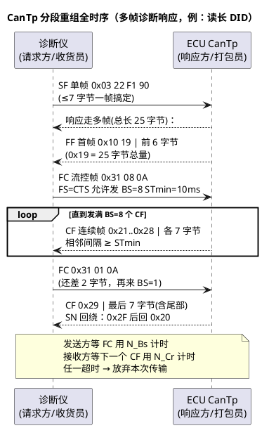

# 01-CanTp分段15765-2

> 一句话定位：CAN 一帧只有 8 字节，而诊断一单要传几 KB——CanTp 就是把大数据切片装箱、按流控节奏搬运的"快递协议"（ISO 15765-2）。
> 等级：L2 ｜ 前置：[从一帧CAN报文说起-车载网络全景](../../00-入门导读/01-从一帧CAN报文说起-车载网络全景.md)

## 原理

发送方是"打包员"，接收方是"收货员"：数据 ≤7 字节走单帧一单送达；数据大就拆箱——先发首帧报总量，接收方回流控帧给"发货节奏"（一次发几箱、箱间隔多久），然后连续帧按编号一箱箱发，最后一箱到齐签收。

## 详解

### 四种帧结构（经典 CAN，8 字节 DLC）

帧类型看数据 Byte0 高 4 位（PCI 类型）：

| 帧型 | PCI | 布局 | 能装多少数据 |
|---|---|---|---|
| 单帧 SF | 0x0L | Byte0=`0x0+长度(≤7)`，Byte1~7 数据 | 最多 7 字节 |
| 首帧 FF | 0x1L | Byte0=`0x1+长度高4位`，Byte1=长度低8位（12bit 总长），Byte2~7 数据 | 首段 6 字节，声明总量（≤4095） |
| 连续帧 CF | 0x2N | Byte0=`0x2+序号SN`，Byte1~7 数据 | 每帧 7 字节，SN 从 1 递增，15 后回绕到 0 |
| 流控帧 FC | 0x3F | Byte0=`0x3+FS`，Byte1=BS，Byte2=STmin | 不装应用数据，只装"节奏" |

FC 的 FS（流控状态）：**0=CTS** 继续发；**1=WT** 收方还没准备好，等下一个 FC（WT 期间发方继续等但不重发）；**2=OVFLW** 缓冲区溢出，本次传输作废。

CAN FD 一句话：ISO 15765-2:2016 版起支持 CAN FD——单帧用"逃逸 PCI"（Byte0=0x00、Byte1=长度）最多装 62 字节数据（64-2 开销），首帧长度域也能逃逸到 32bit，刷写吞吐直接起飞；AUTOSAR 里对应 CanTp 的 FD 支持（TC377 MCAN 与 S32K FlexCAN FD 硬件都具备，见 [01-CanDrv接口契约](../../../04-MCAL与外设驱动/2-L2进阶/CanDrv与LinDrv/01-CanDrv接口契约.md)）。

### STmin 与 BS：接收方的节流阀

- **BS（Block Size）**：允许发送方连发的 CF 数量。BS=8 表示"一口气最多 8 箱，发完停下等我的下一个 FC"；**BS=0 表示不再流控，剩余 CF 连续发完**；
- **STmin（Separation Time min）**：相邻 CF 的最小间隔。编码：0x00~0x7F=0~127ms；0xF1~0xF9=100~900µs；其余值视为不保证，通常按最保守间隔处理。

工程直觉：BS 和 STmin 是接收方**缓冲区大小和上层处理速度**的外化。接收方 CanTp 每收满一个 Block 就把数据上交 Dcm，Dcm 处理不回来就得靠 WT 或大 STmin 拖住发送方。

### 时间参数一览

| 参数 | 谁在等 | 等什么 | 超时后果 | 常见配置 |
|---|---|---|---|---|
| N_As | 发送方 | 请求上链路（CanTp→总线）的时间预算 | 记错误，上层感知发送失败 | 25~70ms（宽松 1000ms） |
| N_Ar | 接收方 | FC 帧上总线的时间预算 | 同上 | 同 N_As |
| N_Bs | 发送方 | 发完 FF/CF 后的下一个 FC | **放弃传输**，诊断中断 | 75~1000ms |
| N_Cr | 接收方 | 下一个 CF 到达 | **放弃重组**，丢弃半包 | 75~1000ms |
| N_Cs/N_Br | 内部 | 内部处理预算（不直接上总线） | 内部容错 | 一般不暴露 |

一句口诀：**A=上线（As/Ar 各管一段上线），B=等流控，C=等数据**。具体数值以 OEM 诊断规范为准，但"N_Bs/N_Cr 超时=传输作废"是铁律。

### 分段重组的软件直觉

发送方状态机：idle→发 FF→等 FC→发 CF（数 BS、掐 STmin）→发完确认；接收方状态机：idle→收 FF→发 FC→收 CF（查 SN 连续性）→收满上交。缓冲区按最大 N-SDU（典型 4095 字节）或诊断最大缓冲申请——这也是 OVFLW 存在的原因：FF 声明的总长超过本地缓冲就直接拒绝，别收一半才崩。

## 配置层

CanTp 配置是日常主业（每条诊断通路的超时四件套都要过目）：

| 配置项 | 含义 | 典型值 | 易错点 |
|---|---|---|---|
| CanTpNas | 发送方 N_As 预算 | 25~70ms | 与实际总线负载不匹配，高负载误报 |
| CanTpNbs | 发送方等 FC 超时 N_Bs | 75~1000ms | 过小→网关转发 FC 延迟就超时断链 |
| CanTpNcr | 接收方等 CF 超时 N_Cr | 75~1000ms | 过小→ECU 处理慢的正常间歇被判死刑 |
| CanTpNar | 接收方发 FC 上线预算 N_Ar | 25~70ms | 与 N_As 同源配错 |
| CanTpBlockSize（FC 中宣告的 BS） | 本 ECU 作为接收方的节流 | 0 或 4~16 | 收方 Dcm 慢却配 BS=0→缓冲被冲爆 |
| CanTpSTmin（FC 中宣告） | 本 ECU 作为接收方的间隔 | 0~10ms | 宣告 0 但收方处理跟不上→丢帧/重传 |
| CanTpAddressingFormat | 寻址格式（普通/扩展/混合） | Normal（功能/物理寻址分路） | 诊断仪用扩展寻址而 ECU 只配普通→全灭 |
| CanTpTxPaddingActivation | 填充激活 | ON（8 字节补 0xCC/0x00） | OEM 要求填充未开→总线报文长度不符规范 |
| CanTpFdSupport（FD 项目） | FD 帧型支持 | 按硬件 | FD 关了还配 62 字节 SF→无法发送 |

## 易错点与陷阱

1. **SN 校验不过就整包丢弃**：CF 序号错一位（0x23 后面来 0x25），接收方按标准放弃整次接收；总线上任何一帧 CF 丢失都会造成这种连锁——排障先看有没有帧丢失而不是 CanTp 配置。
2. **STmin 两侧语义不一致**：FC 里宣告 STmin=0，但发送方栈实现按"至少一个主函数周期"发，实际间隔被量化（如 10ms），吞吐不达标；调优要连发送方实现粒度一起看。
3. **BS=0 遇上慢接收**：接收方声明"不用流控"，4095 字节一口气灌进来，Dcm 还没消费缓冲就溢出——OVFLW/丢帧；接收慢就老实配小 BS 或大 STmin。
4. **功能寻址与物理寻址通路混配**：诊断仪物理请求配到了功能寻址通路（或反之），单帧能通、多帧必死；两套通路（如 0x7E8 响应/0x7DF 功能）的 CanTp 参数要分别核对。
5. **网关两侧 CanTp 参数不配套**：报文经网关路由，本段 N_Bs 75ms 但对网段转发延迟 100ms，间歇性断链；跨网诊断的超时预算要算上网关一跳。
6. **padding 值不符合 OEM 规范**：有的 OEM 规定填充 0x00、有的 0xCC/0xAA，配错虽不影响 CanTp 解析但过不了一致性测试。

## 面试高频题

- **Q：CanTp 四种帧的作用与结构？**
  A：SF 单帧传 ≤7 字节；FF 首帧声明总长并带前 6 字节；CF 连续帧按 SN（1..15 回绕）各带 7 字节；FC 流控帧由接收方回，含 FS（CTS/WT/OVFLW）、BS（下次配额）、STmin（最小间隔）。
- **Q：N_As/N_Ar/N_Bs/N_Cr 分别是什么？**
  A：N_As/N_Ar 是"数据上总线"的链路预算（发送方/接收方视角）；N_Bs 是发送方等流控帧的超时；N_Cr 是接收方等下一个连续帧的超时；B/C 任一超时本次传输作废。
- **Q：BS=0 和 STmin=0 分别意味着什么？**
  A：BS=0=剩余 CF 无需再等流控一次发完；STmin=0=相邻 CF 无最小间隔。两者都把节流交给发送方，前提是接收方缓冲与上层处理足够快。
- **Q：CAN FD 对 CanTp 带来什么变化？**
  A：2016 版起支持 FD：单帧经逃逸 PCI 可装 62 字节、首帧长度域可扩展到 32bit，多数诊断报文退化为单帧/少量 CF，刷写吞吐大幅提升；经典 CAN 的四种帧语义不变。

## 延伸

- [02-LinTp](02-LinTp.md)：同一套思想在 LIN 主从模型下的变奏；
- [03-排障实录](03-排障实录.md)：超时/丢帧/慢刷写三类现场定位；
- [01-CanDrv接口契约](../../../04-MCAL与外设驱动/2-L2进阶/CanDrv与LinDrv/01-CanDrv接口契约.md)：CanTp 发出的帧最终怎么上线；
- [UDS协议](../../../06-诊断与标定/1-L1基础/UDS协议/01-服务总览.md)：CanTp 头顶上的 14229 服务层；
- [02-AUTOSAR-NM状态机](../网络管理/02-AUTOSAR-NM状态机.md)：诊断唤醒与网络管理的衔接。

---

维护约定：笔记命名 `序号-主题.md`；真实截图放 `_images/`；流程/时序/状态/架构图用 PlantUML 内嵌正文，规范见 [图表规范与模板](../../../00-总览/图表规范与模板.md)。
