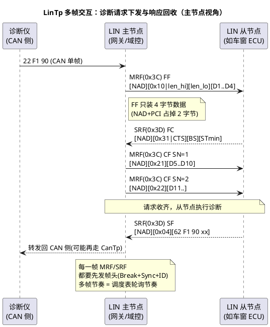

# 02-LinTp

> 一句话定位：把 15765-2 的分段思想搬到 LIN 上——多出 NAD 一字节开销、每帧都要主节点发帧头"点名"，节奏从流控变成了调度表。
> 等级：L2 ｜ 前置：[01-CanTp分段15765-2](01-CanTp分段15765-2.md)

## 原理

LIN 上的诊断走两条专用帧：主节点发 **0x3C（MasterReq，主请求帧）** 承载诊断仪→从节点的请求；从节点在 **0x3D（SlaveResp，从响应帧）** 里回数据。传输层帧型仍是 SF/FF/CF/FC 四件套，但每个 PDU 都要**等主节点发帧头才机会上总线**——这是与 CAN 最大的行为差异：CAN 是"想发就仲裁"，LIN 是"点到名才能说话"。

## 详解

### 帧结构：NAD + PCI 抢走两字节

LIN 诊断 PDU 布局：**[NAD(1B)][PCI(1B)][数据(≤6B)]**，尾部不足 8 字节补 0xFF。NAD（Node Address for Diagnostics）是目标从节点的诊断地址——因为 0x3C/0x3D 是全 LIN 网共享的"广播信箱"，靠 NAD 区分收件人。

| 帧型 | PCI（数据 Byte1） | 有效数据 | 说明 |
|---|---|---|---|
| SF 单帧 | `0x0L`（L=长度 ≤6） | ≤6 字节 | 比 CAN 少 1 字节（NAD 占位） |
| FF 首帧 | `0x10`+长度字节 | 4 字节 | 12bit 总长；比 CAN 少 2 字节 |
| CF 连续帧 | `0x2N`（N=SN，1..15 回绕） | 6 字节 | SN 语义同 CAN |
| FC 流控帧 | `0x3F`（F=FS） | BS+STmin | 仅 3 字节控制信息，其余补 0xFF |

分段阈值随之变化：**≤6 字节走 SF；7~4095 字节走 FF+CF**。方向注意：主→从的 FF/CF 走 0x3C，从节点回的 FC 走 0x3D；从→主（响应）多帧时反过来——主节点的 FC 走 0x3C、从节点 FF/CF 走 0x3D。**FC 永远由"接收方"发，但物理上都必须借 MRF/SRF 的壳**。

### 响应空间限制与节奏

CAN 上 CF 可以背靠背连发（间隔 STmin），LIN 上不行：**从节点每回一帧都要等主节点下一次轮询 0x3D 的帧头**。于是"STmin"在 LIN 上实际由**调度表里 0x3C/0x3D 表项的轮询周期**决定——LinTp 的吞吐天花板不是流控参数，而是调度表设计。主节点软件（LinIf+LinTp）的职责就是：看到 TP 会话未完成，持续在调度表里安排 MRF/SRF 表项，直到收发两清。

### Master/Slave 两视角

- **主节点视角（通常是网关/域控，TC377/S32K 侧的 LinIf）**：LinIf 承载 LinTp 功能，维护两套缓冲（发给从节点的多帧、收从节点的多帧），管理 NAD→从节点的映射，把 CAN 侧诊断请求透传到 LIN、再把响应搬回去（跨总线分段重组的"接力赛"）；
- **从节点视角（小 MCU，常为 LinTp+Dcm 一体的轻量栈）**：守着 0x3D，被点名就回；多帧接收时按 NAD+SN 校验，收到 FF 后在下一个 0x3D 机会回 FC。

睡眠一句话：主节点发 **Go-to-Sleep 帧（0x3C，NAD=0x00，其余 0xFF）**，从节点落睡；诊断中途主节点切调度表去干别的事，从节点的 TP 会话会被 N_Cr 超时清掉——所以 LinTp 会话期间主节点不能随意离开诊断调度。

### 与 CanTp 的参数差异表

| 维度 | CanTp | LinTp |
|---|---|---|
| 承载帧 | 任意 CAN ID（物理/功能寻址分路） | 固定 0x3C（请求）/0x3D（响应） |
| 开销 | PCI 1 字节 | NAD+PCI 2 字节 |
| SF 最大数据 | 7 字节（FD 逃逸后 62） | 6 字节 |
| FF 首段数据 | 6 字节 | 4 字节 |
| CF 数据 | 7 字节 | 6 字节 |
| 发送时机 | 随时（总线仲裁） | 主节点发帧头后（调度表轮询） |
| 节流手段 | BS/STmin（流控） | 调度表轮询周期（流控形同虚设） |
| 寻址 | CAN ID 即地址 | NAD 字段寻址 |
| 模块归属 | CanTp 独立模块 | LinTp 集成在 LinIf 内 |

## 配置层

LinTp 在 EB tresos 等工具里配在 LinIf 的 TP 容器下（LinTpRxNSdu/LinTpTxNSdu 等，命名以所用栈版本为准）：

| 配置项 | 所在 | 含义 | 典型值 | 易错点 |
|---|---|---|---|---|
| NAD | LinTp 收发 NSDU | 诊断目标地址 | 从节点 NAD（如 0x01~0x0F，0x7F 广播） | 与从节点配置不一致→消息石沉大海 |
| STmin/BS（FC 宣告值） | LinTp | 名义流控参数 | 常直接 0（真实节奏由调度表决定） | 以为调它能提速——真阀门在调度表 |
| N_Cr/N_Bs 超时 | LinTp | 等 CF/FC 超时 | 1s 量级（要盖过调度表周期×帧数） | 按_CAN_ 的 75ms 配→正常轮询都超时 |
| 0x3C/0x3D 调度表表项 | LinIf 调度表 | 诊断帧轮询周期 | 10~50ms（会话期间持续保留） | 诊断表项与其他表表项切换时机错→传输腰斩 |
| LinTp 缓冲深度 | LinTp | 最大重组长度 | 按最大诊断响应 | FF 长度>缓冲→溢出丢弃 |
| 从节点 LinIf/LIN 驱动 | 从节点栈 | 帧头检测、校验和类型 | enhanced checksum | LIN 1.3 老件用 classic，混配校验错 |

## 易错点与陷阱

1. **拿 CanTp 超时直接套 LinTp**：LIN 一帧 FF 到下一帧 CF 之间隔着若干调度周期（几十到几百 ms），N_Cr 按 75ms 配必死；正确做法是"调度周期 × 预计帧数 + 余量"。
2. **调度表切走导致半途而废**：诊断多帧进行中主节点切到正常应用调度（或省电调度），0x3D 不再被轮询，从节点 FC/CF 发不出、主节点 N_Cr 超时清会话；会话期间要用专门的诊断调度表。
3. **网关双向分段重组缓冲不足**：CAN 侧 7 字节/CF、LIN 侧 6 字节/CF 的错位使得跨网传输帧数变多，网关缓冲按"一侧帧数"估就翻车。
4. **NAD=0x00 被误当普通报文**：0x00 是 Go-to-Sleep/广播语义，配置里把 0x00 当有效从节点地址→一帧睡眠指令把诊断会话全掐了。
5. **0xFF 填充被误解析**：SRF 里从节点没数据时回 0xFF 全填充帧，主节点 LinTp 必须按 PCI 过滤而不是见帧就收；老固件常见"把填充帧当 CF 乱序"的 bug。

## 面试高频题

- **Q：LinTp 与 CanTp 在帧结构上的核心差异？**
  A：LIN 诊断帧固定走 0x3C/0x3D，PDU 前两字节是 NAD+PCI（CAN 只有 PCI），所以 SF 最多 6 字节、FF 首段 4 字节、CF 6 字节；FF/CF/SN/FS 语义与 15765-2 一致。
- **Q：LIN 上 STmin 还有意义吗？**
  A：名义上 FC 仍带 BS/STmin，但真实节奏由主节点调度表对 0x3C/0x3D 的轮询周期决定——从节点没有帧头发不了数据，流控退化为调度问题。
- **Q：LinTp 会话中主节点要保证什么？**
  A：持续在调度表里轮询 MRF/SRF 直到会话结束，且 N_Cr/N_Bs 超时预算要覆盖"轮询周期 × 剩余帧数"；切调度表等于掐断会话。
- **Q：网关做 CAN↔LIN 诊断路由要注意什么？**
  A：两侧分段参数错位（7 vs 6 字节/帧、超时量级不同），缓冲和超时按最慢一侧预算；并保持 0x3C/0x3D 轮询与会话生命周期绑定。

## 延伸

- [01-CanTp分段15765-2](01-CanTp分段15765-2.md)：分段协议的本体与超时四件套；
- [03-排障实录](03-排障实录.md)：跨网诊断断链、慢刷写的现场分析；
- [02-LinDrv接口契约](../../../04-MCAL与外设驱动/2-L2进阶/CanDrv与LinDrv/02-LinDrv接口契约.md)：帧头/响应两段式的驱动层细节；
- [LDF与配置](../../1-L1基础/LIN/LDF与配置/README.md)：调度表如何定义；
- [UDS协议](../../../06-诊断与标定/1-L1基础/UDS协议/01-服务总览.md)：LinTp 头上的 14229 服务。

---

维护约定：笔记命名 `序号-主题.md`；真实截图放 `_images/`；流程/时序/状态/架构图用 PlantUML 内嵌正文，规范见 [图表规范与模板](../../../00-总览/图表规范与模板.md)。
